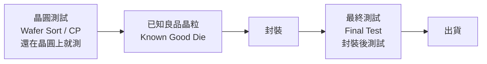

# 測試工程師

測試工程師（Test Engineer / Product Engineer）確保每一顆出廠的晶片都通過規格驗證。他們在製造端是最後一道品管閘門。

## 兩大測試類型

## 核心工作

**每天在做什麼：**
- **ATE 程式開發**：用 C/C++/Python 或 ATE 專屬語言（Advantest V93000 IJTG）撰寫測試程式
- **測試項目定義**：確定哪些規格需要測試（Vmin/Vmax、時序、IDDQ、RF 參數）
- **Load Board 設計**：設計連接 ATE 和晶片的 PCB 測試板
- **測試時間縮短（TTR）**：最佳化測試程式，每秒多測幾顆 = 降低每顆成本
- **Yield 資料分析**：找出測試逃逸（Test Escape）；分析不良品分布

## 探針工程師（Probe Engineer）

晶圓測試需要探針卡（Probe Card）：

- 設計並規格化探針卡（懸臂式 / 垂直式 / MEMS 探針）
- 最佳化探針落點（Probe Mark）品質
- 管理探針卡清洗 / 更換週期
- 分析探針良率與最終測試良率的相關性

## ATE 平台知識

台灣主流 ATE 設備：

| 設備 | 廠商 | 應用 |
|------|------|------|
| V93000 | Advantest | 數位 SoC、記憶體（台灣最普及）|
| UltraFLEX | Teradyne | 高速串行介面、混合訊號 |
| J750 | Teradyne | 中低端 IC |

## 主要雇主

ASE 日月光、Powertech 力成、MediaTek（內部測試部門）、TSMC（CP 晶圓探測）、Advantest Taiwan、Teradyne Taiwan

## 薪資（2024 估計）

| 職級 | 年總酬勞（TWD）|
|------|-------------|
| 新鮮人（學士 / 碩士） | NT$700K – NT$1.0M |
| 資深（5–8 年） | NT$1.0M – NT$1.8M |
| Senior / Lead | NT$1.8M – NT$3.0M |

> 測試工程師薪資通常低於設計工程師，但對工程師進入半導體業是很好的入門路徑，可轉往 DFT、ATE 工具開發等
