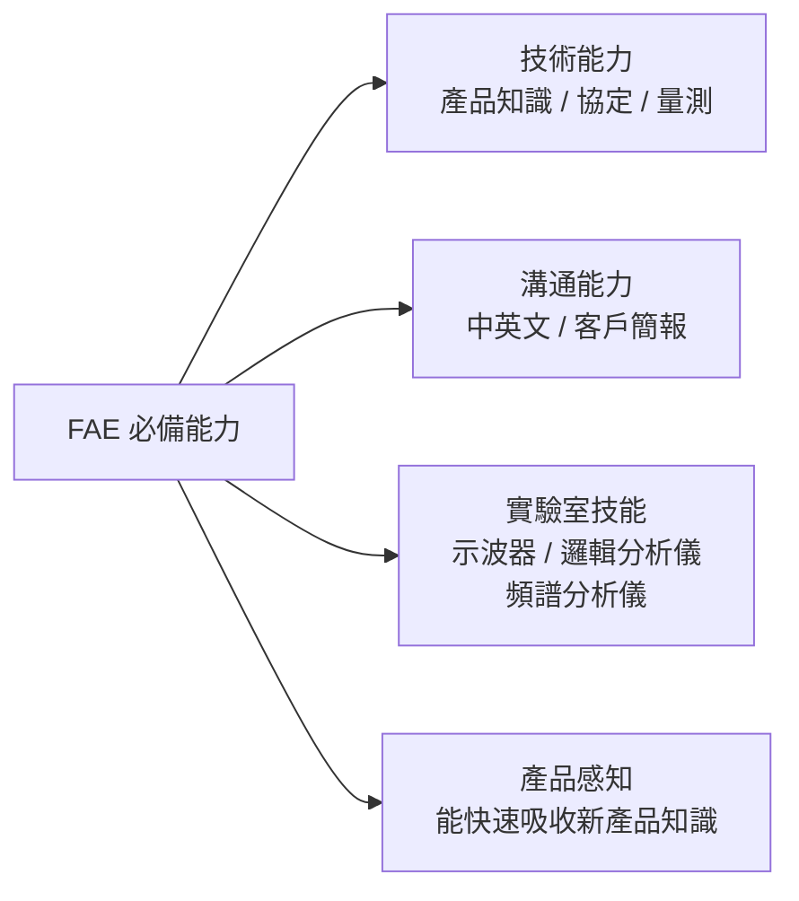
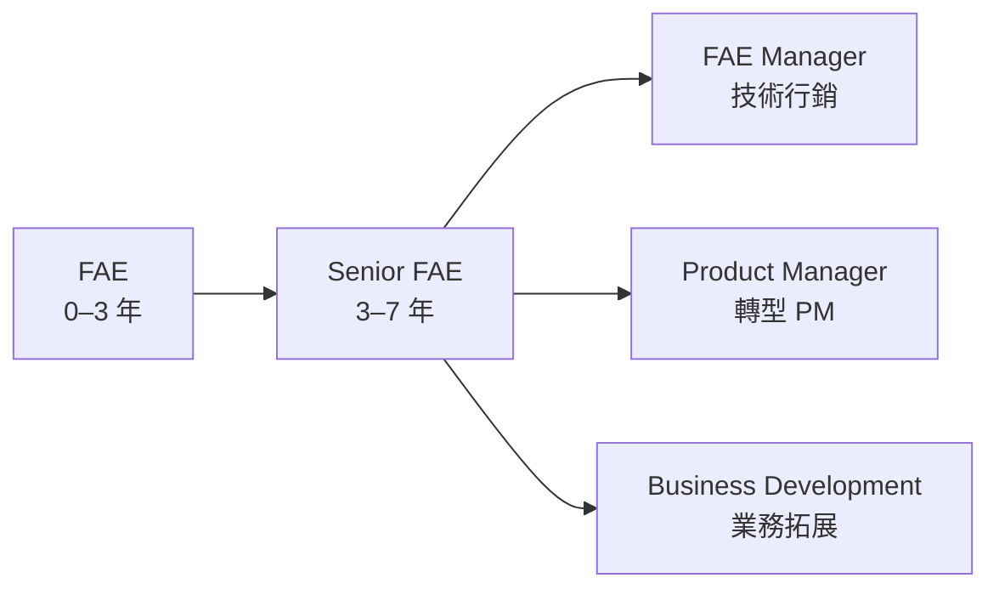

# FAE 現場應用工程師

FAE（Field Application Engineer，現場應用工程師）是半導體公司與客戶之間的技術橋樑。他們同時要懂技術和會與人溝通，是少數能兼顧技術深度與業務影響力的職位。

## 兩種 FAE 類型

### 晶片公司 FAE（如 MediaTek、Qualcomm FAE）

**每天在做什麼：**
- **售前支援**：拜訪客戶（手機廠、TV 廠）R&D 實驗室，做技術簡報和 Demo
- 幫客戶審查原理圖（Schematic Review）；建議參考設計（Reference Design）
- **售後支援**：客戶在量產中遇到晶片相關問題時 debug（例如：為什麼藍牙連線不穩定？）
- 撰寫 Application Note；製作 FAQ；更新開發板 BOM
- 把客戶的 Bug 和功能需求反饋給 IC 設計團隊（Voice of Customer）

### 設備商 FAE / AE（如 ASML、AMAT、Lam AE）

**完全不同性質**——這類 AE 是進駐到台積電、聯電廠區的技術支援：
- 在客戶無塵室內工作，支援製程建立和最佳化
- 新機安裝後的 Process Qualification（製程認證）
- 高端技術問題的升級支援（Escalation）
- ASML AE 需要深厚光學、光機電整合知識，是薪資最高的 FAE 類型

## FAE 技能要求

**語言要求：** 中英文雙語是台灣市場的基本門檻

## 職涯發展

FAE 是從工程技術轉向業務或 PM 的主要跳板職位。

## 薪資（2024 估計）

| 類型 | 年總酬勞（TWD）|
|------|-------------|
| 晶片公司 FAE（新鮮人） | NT$1.0M – NT$1.5M |
| 晶片公司 Senior FAE | NT$2.0M – NT$3.5M |
| **ASML Application Engineer** | NT$2.5M – NT$5M |
| Lam / AMAT / KLA AE | NT$1.5M – NT$4M |

> ASML AE 是台灣薪資最高的工程師類別之一，但錄取門檻極高（需深厚製程知識 + ASML 原廠培訓認可）
