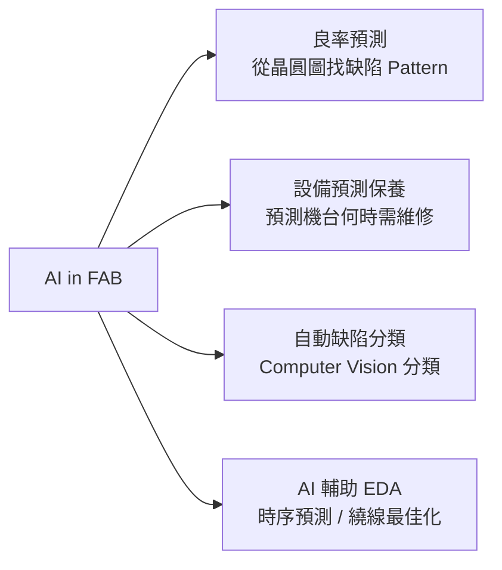

# AI / 軟體工程師

隨著 AI 浪潮，半導體公司對 AI 與軟體人才的需求大增，而且這類人才通常能在相對友善的日班環境工作（不需輪班），薪資也接近 IC 設計水準。

## 三大應用方向

### 1. AI 晶片設計（晶片公司端）

在 MediaTek、Novatek 等公司的 AI 研究 / 設計部門：

**每天在做什麼：**
- 設計能在晶片上高效運行的神經網路架構
- 開發模型量化（INT8/INT4）、剪枝、知識蒸餾技術，讓 AI 能在邊緣設備上跑
- 與硬體設計師協同設計 NPU 架構（Hardware-Software Co-design）
- 把 TensorFlow / PyTorch 模型移植到自家推論引擎
- Benchmark AI 推論效能（Tokens/sec、TOPS/W）

### 2. AI for Semiconductor（半導體應用 AI）

在台積電、聯電等晶圓廠，AI 被用來改善製造流程：

### 3. 韌體 / 軟體工程師

在 Realtek、Silicon Motion、MediaTek 等公司：

- **韌體工程師**：用 C/Assembly 寫微控制器韌體（USB 控制器、乙太網路 PHY）
- **Driver 工程師**：寫 Linux / Windows 裝置驅動程式
- **SDK 工程師**：建立客戶使用的 SDK / BSP（Board Support Package）

## 核心技能

| 角色 | 核心技能 |
|------|---------|
| AI 晶片 AI Engineer | PyTorch/TensorFlow、模型量化、NPU 架構理解 |
| AI for Semiconductor | Python、ML（GNN 用於 EDA）、製程數據分析 |
| 韌體工程師 | C/C++、RTOS（FreeRTOS）、SPI/I2C/PCIe 硬體介面 |
| Driver 工程師 | Linux Kernel、Device Driver 開發 |

## AI 浪潮的影響（2023–2025）

- MediaTek 的 Dimensity AI 晶片系列帶起大量 NPU 設計 + AI 工程師需求
- 台積電用 ML 做良率提升（Yield Enhancement）和設備預測保養
- Synopsys DSO.ai、Cadence Cerebrus：AI 輔助物理設計工具，帶起 EDA-AI 跨領域人才需求
- RISC-V AI 加速器新創在台灣湧現（Tenstorrent Taiwan 等）

## 薪資（2024 估計）

| 角色 | 年總酬勞（TWD）|
|------|-------------|
| AI 晶片 AI Engineer（新鮮人） | NT$1.2M – NT$1.8M |
| AI Engineer（資深，MediaTek） | NT$3M – NT$6M |
| 韌體 / Driver 工程師（新鮮人） | NT$900K – NT$1.3M |
| 韌體 / Driver 工程師（資深） | NT$1.5M – NT$3M |

> 半導體公司的軟體工程師薪資通常略低於純 IC Design，但高於一般軟體業（因為需要硬體知識）
