# 職務合作關係圖

半導體的每個職務都不是孤島，一顆晶片從設計到出貨，需要十幾種工程師環環相扣。這頁把主要的合作介面全部攤開。

## 全局合作網路

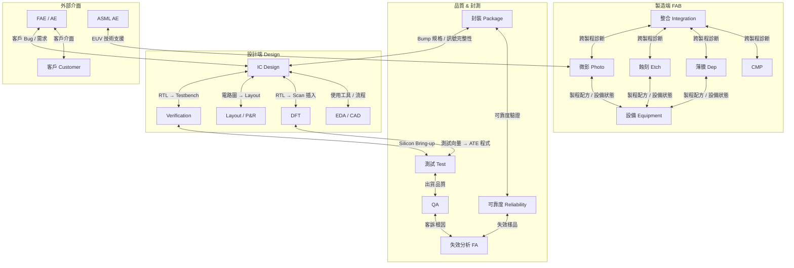

---

## 1. IC Design ↔ Verification：核心設計迴圈

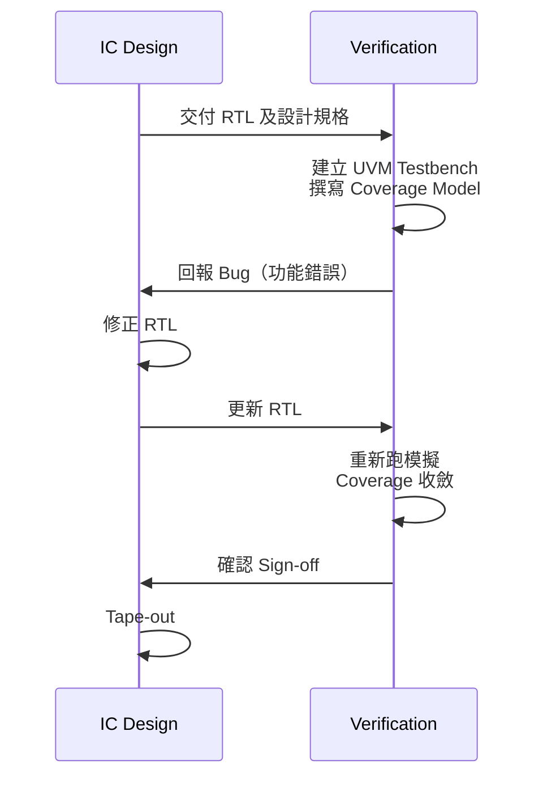

**合作介面：**
- IC Design 提供 RTL + 規格文件；Verification 根據規格設計測試環境
- Verification 回報的 Bug 通常佔設計修改工時 40–60%
- Coverage 收斂標準需雙方事先議定（通常 >98%）

---

## 2. IC Design ↔ Layout：從電路到幾何

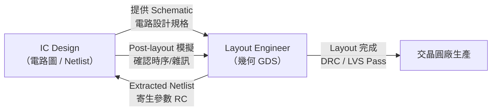

**合作介面：**
- 類比設計師和 Layout 工程師需要密切討論匹配策略（Common-Centroid）
- Layout 萃取的 RC 寄生值回饋設計師，設計師確認後才能 Tape-out
- 越先進的節點（3nm/2nm），Layout 對設計的約束越多

---

## 3. IC Design ↔ DFT：可測試性的協商

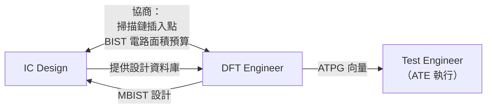

**合作介面：**
- DFT 需要佔用一定面積（掃描鏈 FF）；IC Design 需評估面積 / 功耗代價
- JTAG 架構需要 IC Design 在規劃階段就預留 TAP Controller
- Test Engineer 執行 DFT 工程師產出的 ATPG 向量

---

## 4. 製程 × 設備：晶圓廠的日常運作夥伴

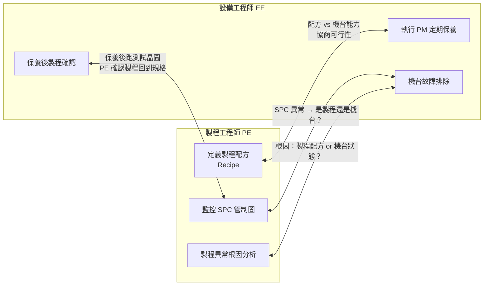

**合作介面：**
- 每次 PM 後，製程工程師要跑「資格確認晶圓（Qualification Wafer）」驗證機台回到規格
- 製程異常時，兩者要共同判斷是「配方問題」還是「機台問題」
- Tool Matching（多台相同機台的製程一致性）是雙方最頻繁的合作議題

---

## 5. 整合工程師 ↔ 各製程模組

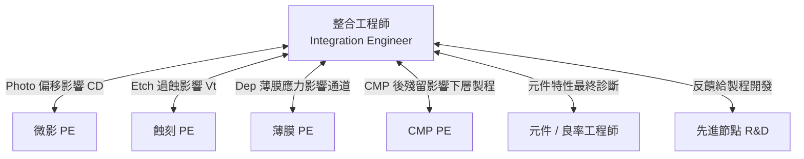

**特點：** 整合工程師是「跨模組偵探」，當元件特性偏移時，他們要追查是哪道製程（或哪幾道製程的交互作用）造成的。

---

## 6. DFT ↔ Test Engineer：測試的上下游

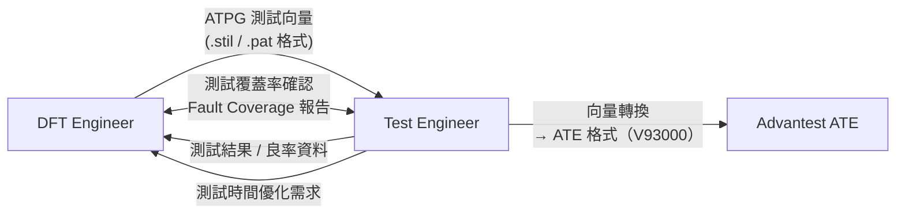

**合作介面：**
- DFT 設計的掃描鏈壓縮比（X-Press Compression）直接影響測試時間
- Test Engineer 反映 ATE 限制（時序精度、Pin 數限制），DFT 需配合調整

---

## 7. 封裝工程師 ↔ IC Design：封裝寄生效應的協商

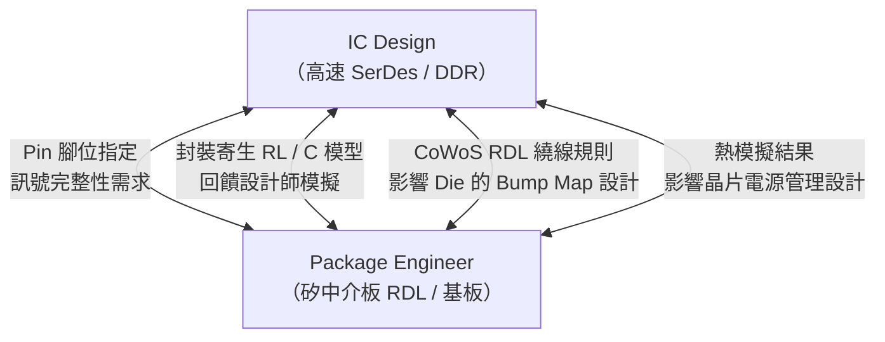

---

## 8. QA ↔ 可靠度 ↔ 失效分析：品質三角

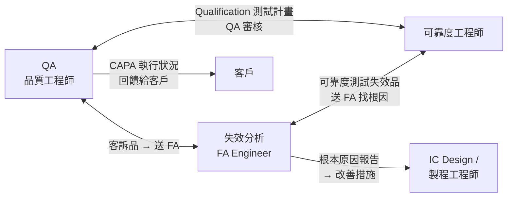

**三者分工：**
- **QA** 管客戶介面、改善措施追蹤、認證管理
- **可靠度** 做加速測試、壽命預測、失效模式識別
- **FA** 做顯微鏡等物理 / 化學分析，提供根本原因

---

## 9. FAE ↔ IC Design ↔ 客戶：市場與技術的橋樑

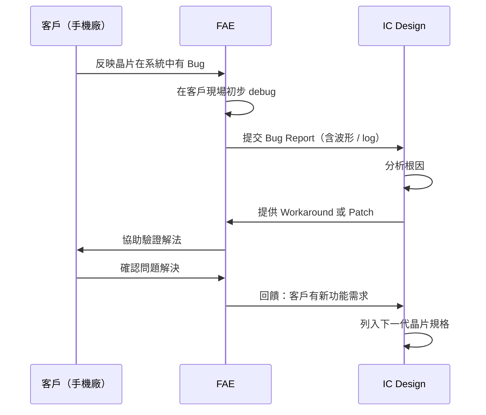

---

## 職務合作強度熱力圖

| | IC Design | Verification | DFT | Layout | 製程 PE | 設備 EE | 整合 | 封裝 | 測試 | 可靠度 | FA | QA | FAE |
|--|:-:|:-:|:-:|:-:|:-:|:-:|:-:|:-:|:-:|:-:|:-:|:-:|:-:|
| **IC Design** | — | 🔴 | 🔴 | 🔴 | ⚪ | ⚪ | ⚪ | 🟡 | 🟡 | ⚪ | 🟡 | ⚪ | 🟡 |
| **Verification** | 🔴 | — | 🟡 | ⚪ | ⚪ | ⚪ | ⚪ | ⚪ | 🟡 | ⚪ | ⚪ | ⚪ | ⚪ |
| **DFT** | 🔴 | 🟡 | — | ⚪ | ⚪ | ⚪ | ⚪ | ⚪ | 🔴 | ⚪ | ⚪ | ⚪ | ⚪ |
| **Layout** | 🔴 | ⚪ | ⚪ | — | 🟡 | ⚪ | ⚪ | ⚪ | ⚪ | ⚪ | ⚪ | ⚪ | ⚪ |
| **製程 PE** | ⚪ | ⚪ | ⚪ | 🟡 | — | 🔴 | 🔴 | ⚪ | ⚪ | ⚪ | 🟡 | 🟡 | ⚪ |
| **設備 EE** | ⚪ | ⚪ | ⚪ | ⚪ | 🔴 | — | 🟡 | ⚪ | ⚪ | ⚪ | ⚪ | ⚪ | ⚪ |
| **整合工程師** | ⚪ | ⚪ | ⚪ | ⚪ | 🔴 | 🟡 | — | ⚪ | ⚪ | ⚪ | 🟡 | ⚪ | ⚪ |
| **封裝** | 🟡 | ⚪ | ⚪ | 🟡 | ⚪ | ⚪ | ⚪ | — | 🟡 | 🔴 | 🟡 | 🟡 | ⚪ |
| **測試** | 🟡 | 🟡 | 🔴 | ⚪ | ⚪ | ⚪ | ⚪ | 🟡 | — | 🟡 | 🟡 | 🟡 | ⚪ |
| **可靠度** | ⚪ | ⚪ | ⚪ | ⚪ | 🟡 | ⚪ | ⚪ | 🔴 | 🟡 | — | 🔴 | 🔴 | ⚪ |
| **FA** | 🟡 | ⚪ | ⚪ | ⚪ | 🟡 | ⚪ | 🟡 | 🟡 | 🟡 | 🔴 | — | 🔴 | ⚪ |
| **QA** | ⚪ | ⚪ | ⚪ | ⚪ | 🟡 | ⚪ | ⚪ | 🟡 | 🟡 | 🔴 | 🔴 | — | 🔴 |
| **FAE** | 🟡 | ⚪ | ⚪ | ⚪ | ⚪ | ⚪ | ⚪ | ⚪ | ⚪ | ⚪ | ⚪ | 🟡 | — |

🔴 高頻繁合作 　🟡 中等合作 　⚪ 較少直接合作

---

## 一顆晶片的跨職務旅程

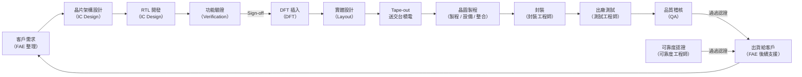
