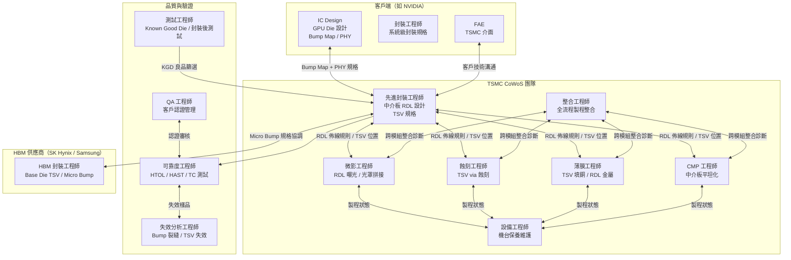
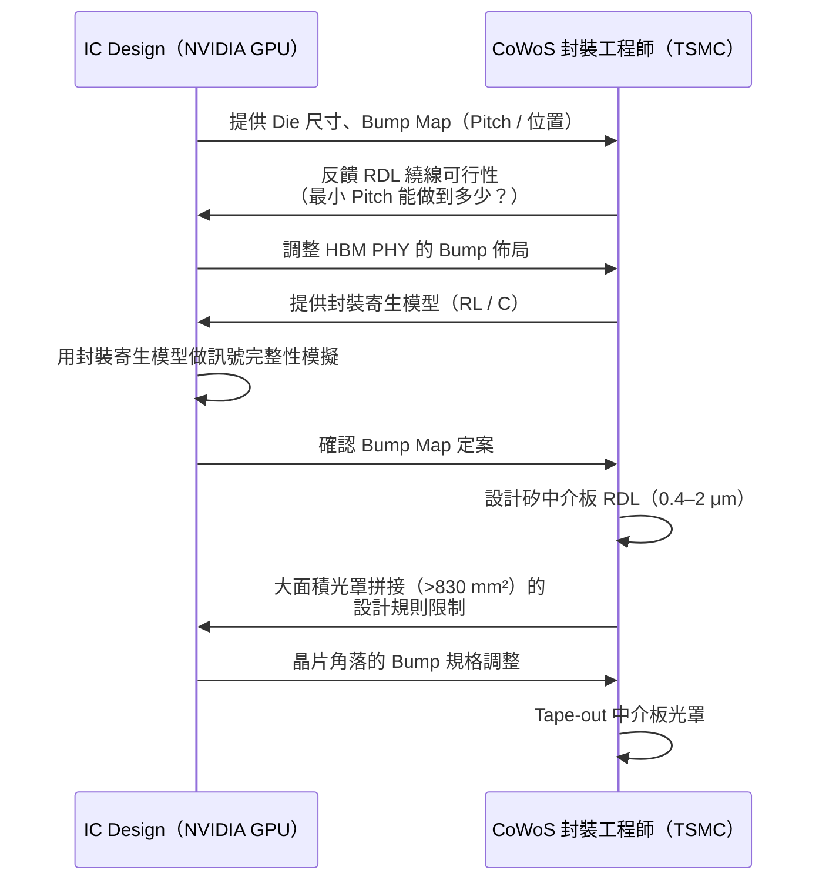
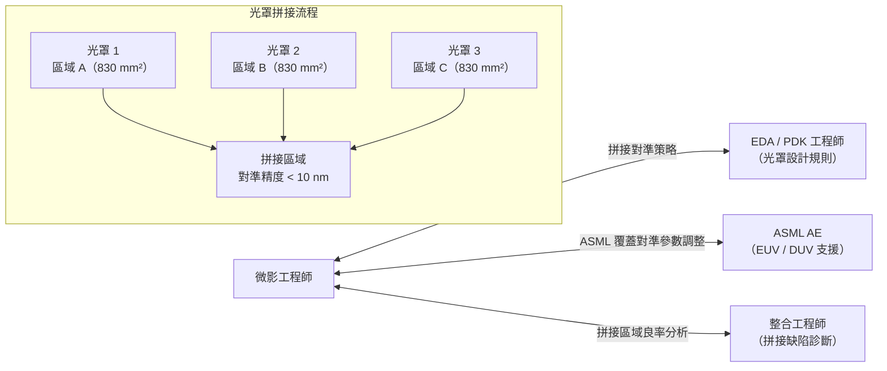
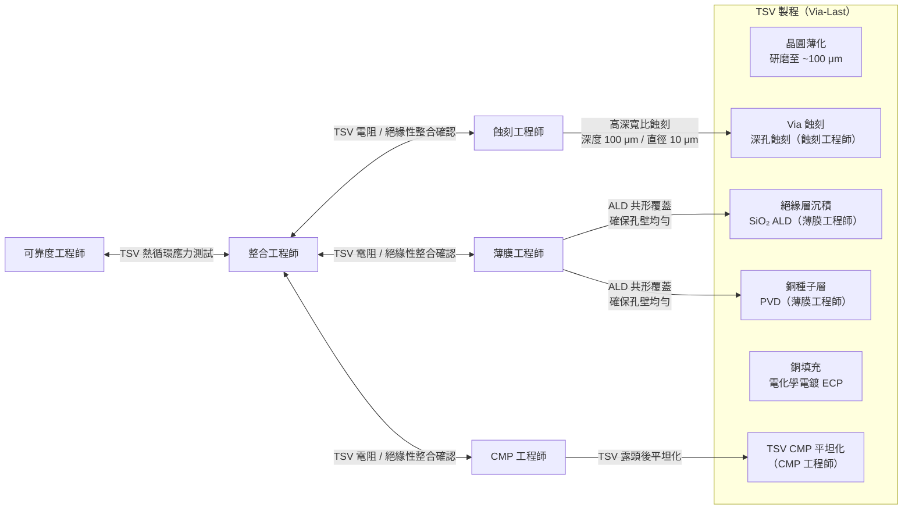
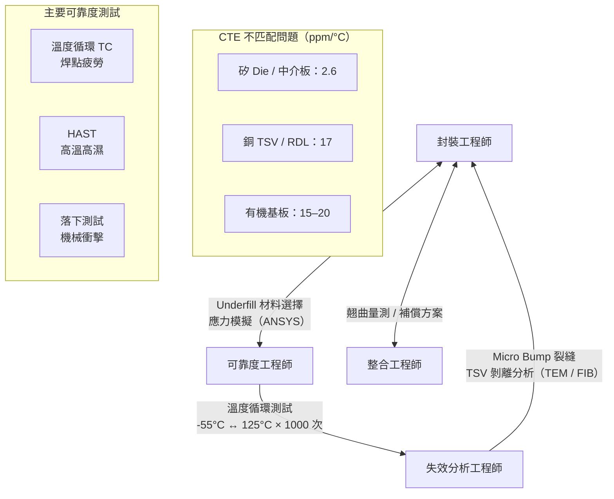
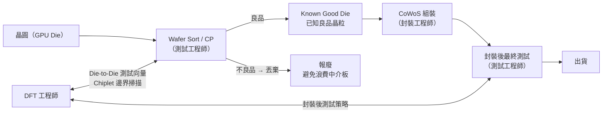
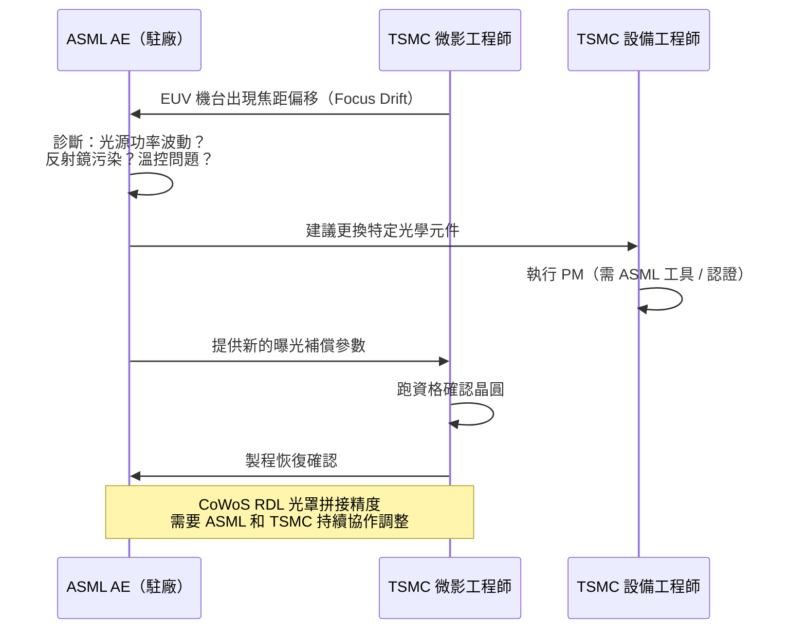

# CoWoS 專案的跨職務合作

CoWoS 封裝是目前半導體業最複雜的跨職務協作場景之一。一個 NVIDIA H100 等級的 CoWoS-S 專案，需要來自**設計、製程、設備、封裝、測試、可靠度**至少六大類工程師長期協作，而且很多工作必須同時進行。

## 誰參與了一個 CoWoS 專案？

---

## 1. GPU Die 設計 ↔ CoWoS 封裝工程師：協同設計

這是 CoWoS 專案最重要的上游合作，必須從晶片設計階段就開始。

**關鍵協商點：**

| 議題 | GPU Die 端需求 | CoWoS 封裝端限制 |
|------|--------------|----------------|
| Bump Pitch | 越小越好（更多 I/O）| 最小 ~45–55 μm（製程下限）|
| HBM 距離 | 越近越好（訊號延遲低）| 中介板面積 / 光罩拼接影響可用空間 |
| 電源分配 | PDN 阻抗要求 | TSV 密度 / RDL 銅厚影響電阻 |
| 熱管理 | 晶片發熱要散出去 | 封裝材料 / TIM 選擇需配合 |

---

## 2. 微影工程師 × 光罩拼接：CoWoS-S 的製程核心

CoWoS-S Gen 5（~2500 mm²）中介板遠超單一光罩面積（~830 mm²），需要多片光罩拼接（Mask Stitching）。

**微影工程師在 CoWoS 的特殊挑戰：**
- 拼接處的 RDL 導線必須完美連續——任何對準偏移 >10 nm 都可能造成斷線
- RDL 的線寬（~0.4 μm）需要 DUV ArF 沉浸式或 EUV 曝光
- 大面積晶圓的翹曲（Warpage）影響焦距均勻性，需特殊補償演算法

---

## 3. TSV 製程的跨部門合作

---

## 4. 封裝工程師 ↔ 可靠度工程師：CoWoS 的壽命挑戰

CoWoS 封裝中材料 CTE 差異極大，是可靠度工程師的主要戰場。

**失效分析工程師在 CoWoS 的核心工具：**

| 失效模式 | 分析工具 | 分析內容 |
|---------|---------|---------|
| Micro Bump 裂縫 | FIB + TEM | 介金屬化合物（IMC）成長、裂縫延伸路徑 |
| TSV 剝離 | FIB 截面 + EDS | 銅 / 氧化矽介面剝離、污染元素 |
| RDL 斷線 | EMMI + FIB | 拼接處電阻異常、高阻路徑定位 |
| 封裝分層 | SAT（聲學掃描）+ SEM | 分層位置 / 範圍 |

---

## 5. Known Good Die（KGD）：測試工程師的關鍵角色

在 CoWoS 中，把一個有缺陷的 Die 放進中介板，整個封裝就會報廢。因此在封裝前確認每顆 Die 的品質（KGD）至關重要。

**CoWoS KGD 的特殊挑戰：**
- 中介板面積大、成本高，任何 Die 缺陷都會導致巨額損失
- 測試需要 KGD 探針卡（Probe Card），測試點極細（Bump Pitch ~55 μm）
- AI 晶片的 GPU Die 面積大（~800 mm²），良率本身就低，KGD 篩選尤為重要

---

## 6. ASML AE ↔ TSMC 微影工程師：EUV 合作的特殊關係

---

## CoWoS 專案職務合作強度

| 職務 | CoWoS 合作強度 | 主要合作對象 |
|------|-------------|------------|
| 先進封裝工程師（TSMC） | 🔴 核心 | IC Design、微影、蝕刻、薄膜、整合、可靠度 |
| IC Design（GPU Die） | 🔴 核心 | 封裝工程師（Bump Map 協同設計）|
| 微影工程師 | 🔴 核心 | ASML AE、封裝工程師、整合工程師 |
| 整合工程師 | 🔴 核心 | 所有製程模組（跨模組診斷）|
| 蝕刻工程師 | 🟡 重要 | 封裝工程師、整合工程師（TSV 蝕刻）|
| 薄膜工程師 | 🟡 重要 | 封裝工程師（TSV 絕緣 / 銅種子層）|
| CMP 工程師 | 🟡 重要 | 封裝工程師（TSV / RDL 平坦化）|
| 可靠度工程師 | 🟡 重要 | 封裝工程師、FA 工程師 |
| 失效分析工程師 | 🟡 重要 | 可靠度工程師（TSV / Bump 失效）|
| 測試工程師 | 🟡 重要 | DFT 工程師（KGD 篩選策略）|
| ASML AE | 🟡 重要 | 微影工程師（RDL EUV/DUV 支援）|
| 設備工程師 | ⚪ 支援 | 微影 / 蝕刻 / 薄膜工程師 |
| FAE | ⚪ 支援 | 客戶（NVIDIA 等）技術窗口 |

> 想深入了解 CoWoS 技術本身？參見書庫中的《[CoWoS 技術精讀筆記](../../cowos/html/index.html)》
