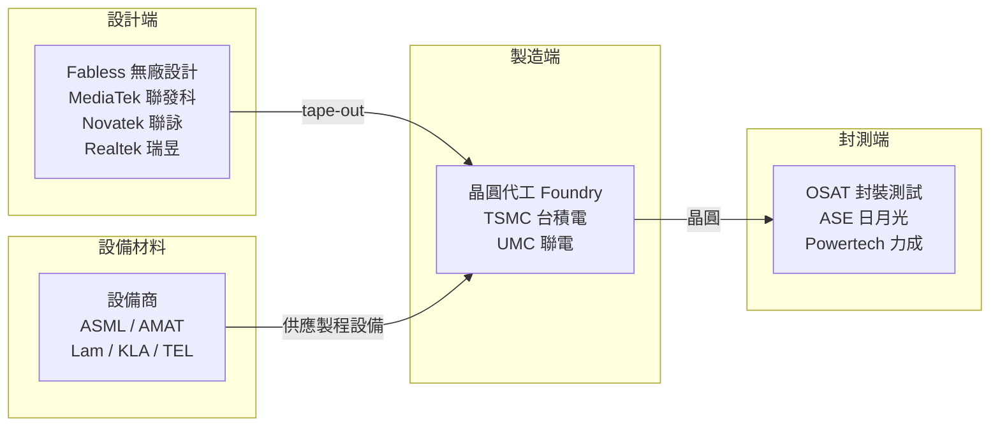

# 導讀：如何用這本書規劃半導體職涯

台灣半導體業直接雇用 **37 萬人以上**，是全球供應鏈的核心，也是台灣薪資最高的行業之一。

但這個產業的職務分類繁雜，光是在台積電就有製程、設備、整合、品質、封裝、IT、EDA⋯⋯十幾個大類，每一類底下還有細分專長。對剛入行或準備轉職的工程師來說，「我適合哪個職務？」往往是最難回答的問題。

這本筆記的目標就是把每個職務講清楚：**他們每天在做什麼、需要哪些技能、薪資大概是多少、怎麼晉升**。

## 產業生態速覽

## 本書對應的職務地圖

| 你在哪個環節工作 | 對應章節 |
|--------------|---------|
| 晶片設計（電路、RTL、驗證） | 第一章：設計類職務 |
| 晶圓廠製程研發 | 第二章：製程類職務 |
| 晶圓廠設備維護 | 第三章：設備與廠務 |
| 品質、可靠度、失效分析 | 第四章：品質與可靠度 |
| 封裝、測試 | 第五章：封裝與測試 |
| 技術業務、客戶支援 | 第六章：業務技術支援 |
| 生產效率、AI 應用 | 第七章：製造與 AI |

## 如何閱讀

- **想找對比**：先看[薪資全覽](appendix-salary.md)與[趨勢分析](appendix-trends.md)
- **想深入某職務**：直接跳到對應頁面
- **正在選校系**：看[入職門檻](appendix-entry.md)
- **準備面試**：每個職務頁有「核心技能」與「面試常考方向」

> 薪資數字均為 2024–2025 年社群資料估計，包含年終獎金，僅供參考。
