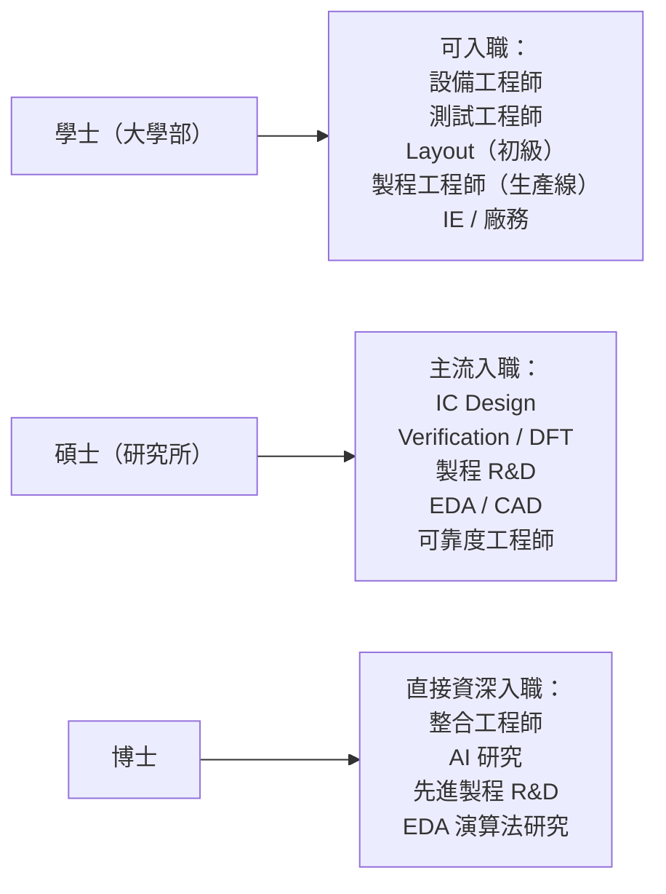
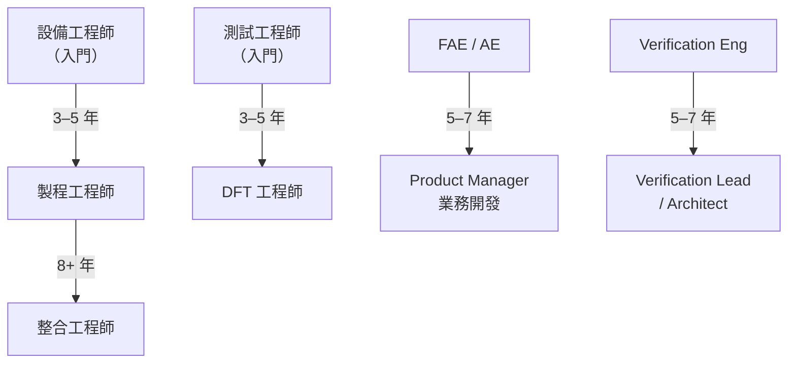

# 入職門檻與學歷規劃

## 學歷對應職務

## 各學歷的起點薪資差異（台積電為例）

| 學歷 | 入職職位 | 新鮮人年薪（TWD）|
|------|---------|-------------|
| 學士 | 工程師（生產 / 設備） | NT$700K – NT$900K |
| 碩士 | 工程師（R&D / 設計）| NT$900K – NT$1.4M |
| 博士 | 資深工程師 | NT$1.5M – NT$2.0M |

> 台積電有「直攻計畫」專為學士生設計，提供較快的升遷路徑

## 理想就讀科系

| 目標職務 | 建議科系 |
|---------|---------|
| IC Design（數位） | 電機工程、資訊工程、電子工程 |
| IC Design（類比 / RF） | 電機工程（偏元件 / 電路課群）|
| Verification / DFT | 電機工程、資訊工程 |
| 製程 / 整合工程師 | 電機、材料、化工、物理 |
| 設備工程師 | 機械、電機、化工、物理 |
| 封裝工程師 | 電機、機械、材料 |
| EDA 工程師 | 電機、資工（強 CS 背景）|
| AI 工程師 | 資工、電機、統計 |

## 台灣頂尖半導體人才搖籃

| 學校 | 強項 |
|------|------|
| 台大（NTU） | IC Design、EDA、全方位 |
| 清大（NTHU） | 材料、製程、半導體物理 |
| 陽明交大（原交大 NCTU） | IC Design、電子電路、通訊 |
| 成大（NCKU） | 製程、設備、材料 |
| 中央（NCU） | 電機、光電 |

> 這五所學校輸出台灣 80% 以上的頂尖半導體工程師

## 認證與加分項目

| 認證 / 知識 | 適用職務 |
|-----------|---------|
| Synopsys / Cadence 線上課程 | IC Design、EDA |
| AEC-Q100/101 車用認證知識 | QA、可靠度 |
| 六標準差 Green Belt / Black Belt | IE、QA、製造 |
| JEDEC JESD22 系列規範 | 可靠度、測試 |
| FinFET / GAAFET 製程知識 | 製程、整合 |
| PyTorch / TensorFlow | AI 工程師、EDA AI |
| Advanced Packaging（CoWoS、TSV）知識 | 封裝工程師 |
| RISC-V 架構 | IC Design（新興 AI 晶片）|

## 轉職路徑圖

