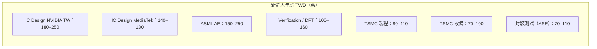
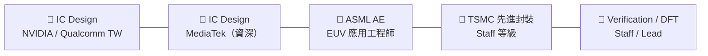

# 薪資全覽比較

以下為 2024–2025 年台灣半導體業各職務薪資估計，包含年終獎金，以年總酬勞（TWD）計算。

> **免責聲明**：數字來源自社群論壇、求職平台估計值與公開資訊，非官方數據，僅供參考。個人薪資因學校、績效、部門、談判能力而有顯著差異。

## 薪資總覽表

| 職務 | 新鮮人（碩士） | 資深（5–8 年） | Staff / 主管 |
|------|------------|------------|------------|
| IC Design（NVIDIA / Qualcomm TW） | 180–250萬 | 400–700萬 | 800萬–1,500萬+ |
| IC Design（MediaTek） | 140–180萬 | 350–500萬 | 600萬–1,200萬 |
| IC Design（Novatek / Realtek） | 120–160萬 | 250–400萬 | 400萬–800萬 |
| Verification Engineer | 100–160萬 | 200–400萬 | 400萬–700萬 |
| DFT Engineer | 100–150萬 | 200–350萬 | 350萬–600萬 |
| Layout Engineer | 90–140萬 | 180–300萬 | 300萬–500萬 |
| EDA / CAD（MediaTek DM） | 120–150萬 | 200–400萬 | 400萬–700萬 |
| EDA（Synopsys / Cadence TW） | 120–150萬 | 180–300萬 | 300萬–500萬 |
| **ASML Application Engineer** | **150–250萬** | **300–500萬** | **500萬–900萬** |
| Lam / AMAT / KLA AE | 120–200萬 | 200–350萬 | 350萬–600萬 |
| TSMC 先進封裝工程師 | 100–150萬 | 200–450萬 | 400萬–800萬 |
| TSMC 製程工程師 | 80–110萬 | 150–250萬 | 300萬–600萬 |
| TSMC 設備工程師 | 70–100萬 | 120–200萬 | 200萬–400萬 |
| TSMC 整合工程師（博士直招） | 150–200萬 | 250–400萬 | 400萬–700萬 |
| 可靠度工程師 | 100–140萬 | 180–300萬 | 300萬–500萬 |
| 失效分析工程師 | 90–120萬 | 150–250萬 | 250萬–500萬 |
| FA Engineer（TEM / FIB 專家） | 90–120萬 | 150–250萬 | 300萬–500萬 |
| 封裝工程師（ASE） | 70–110萬 | 120–200萬 | 200萬–350萬 |
| 測試工程師 | 70–100萬 | 100–180萬 | 180萬–300萬 |
| FAE（晶片公司） | 100–150萬 | 200–350萬 | 350萬–500萬 |
| IE 工業工程師 | 70–100萬 | 120–200萬 | 200萬–350萬 |
| AI / ML 工程師（MediaTek） | 120–180萬 | 300–600萬 | — |
| 韌體 / Driver 工程師 | 90–130萬 | 150–300萬 | 300萬–500萬 |
| QA 品質工程師 | 80–120萬 | 150–250萬 | 250萬–400萬 |

## 薪資可視化比較

## 獎金文化說明

台灣半導體公司的年終獎金是薪資的重要組成：

| 公司 | 年終獎金文化 |
|------|-----------|
| MediaTek | 好年份 6–12 個月；是否含股利視情況 |
| TSMC | 3–6 個月（績效相關）；福利完整（宿舍、餐廳）|
| Novatek / Realtek | 傳統對長期員工發放股票股利；老員工福利較佳 |
| NVIDIA TW / Qualcomm TW | RSU 股票選擇權佔比高；以美股計算升值空間大 |
| ASML TW | 外商制；固定薪資高，獎金結構不同 |

## 排行榜：薪資最高的職務

