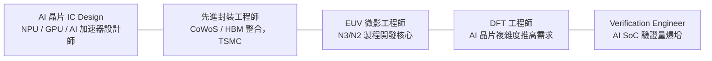
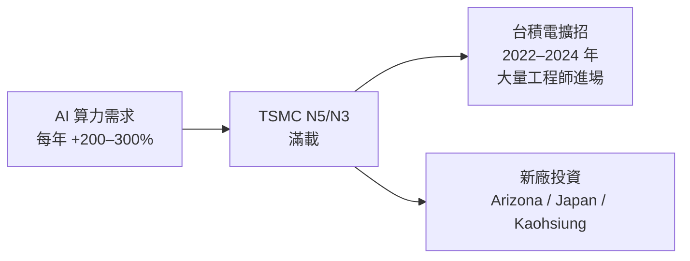

# 2024–2025 趨勢與熱門職缺

## 最熱門職務排行

### 🔴 極度搶手

| 職務 | 熱門原因 |
|------|---------|
| **AI 晶片 IC Design** | NVIDIA / AMD AI 晶片訂單爆量；台灣 AI 晶片新創湧現 |
| **先進封裝（TSMC CoWoS）** | H100/H200/B100 全採 CoWoS；TSMC 產能嚴重不足，三倍速擴產 |
| **EUV 微影工程師** | 只有 TSMC 在台灣運行 EUV；N2 製程工程師缺口大 |
| **DFT 工程師** | AI 晶片含大量 SRAM，DFT 複雜度爆增；全球 DFT 人才稀缺 |
| **Verification Engineer** | AI SoC 複雜度每年倍增，驗證工作量 = 70% 設計週期 |

### 🟡 穩定需求

| 職務 | 說明 |
|------|------|
| 設備工程師 | TSMC 擴廠（美國亞利桑那、日本熊本、高雄 N6）持續徵才 |
| ASML Application Engineer | TSMC EUV 機台持續增加；ASML 台灣辦公室持續招人 |
| 可靠度工程師 | 電動車浪潮帶動車用半導體需求；AEC-Q 認證工程師搶手 |
| 整合工程師 | N2 / A16 製程開發核心人才，博士直招 |
| AI for Semiconductor | 良率 AI、設備預測保養、EDA AI 等跨領域新職位 |

## AI 浪潮對產業的結構性影響

### 1. 台積電產能緊繃

### 2. CoWoS 成為全球瓶頸

2023 年 NVIDIA H100 供不應求的原因之一是 CoWoS 封裝產能嚴重不足：
- 台積電 CoWoS 月產能從 2023 年的約 6,000 片擴充至 2025 年的 15,000 片+
- TSMC 先進封裝（AP）部門從冷門變成最熱門的工作地點
- 封裝工程師薪資 2023–2024 年顯著上調

### 3. HBM 生態系成形

SK Hynix、Samsung、Micron 的 HBM 與 TSMC 的 CoWoS 協同需求，創造出新的跨領域工程師職位：
- HBM Package / Test 工程師
- TSV 製程工程師（DRAM 廠商與台積電都需要）

### 4. 車用半導體成長

EV（電動車）浪潮帶動：
- NXP Taiwan、Renesas Taiwan、Infineon Taiwan 持續擴招
- 車用 QA、可靠度工程師（AEC-Q100 背景）搶手
- ADAS（先進駕駛輔助系統）IC 設計需求增加

## 可能放緩的職務（2024）

| 職務 | 原因 |
|------|------|
| 成熟製程（28nm+）工程師 | 2022–2023 半導體庫存修正；聯電、世界先進等需求趨緩 |
| 消費電子 IC Design | 手機換機周期拉長；PC 市場成熟 |

> 但先進製程（3nm/2nm）和 AI 相關職位完全不受此影響，持續強勁

## 未來 3–5 年值得關注的新興職務

1. **3D IC / Hybrid Bonding 工程師**：TSMC SoIC 技術商業化後的關鍵人才
2. **玻璃基板封裝工程師**：Intel 已宣布玻璃基板路線圖，TSMC 也在研發
3. **光電共封裝（CPO）工程師**：AI 資料中心頻寬需求 → 光電整合
4. **RISC-V AI 晶片設計師**：台灣 AI 晶片新創湧現，RISC-V 架構需求激增
5. **AI for EDA 工程師**：GNN 用於佈線、ML 用於時序預測，新跨領域職位
