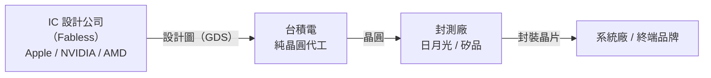
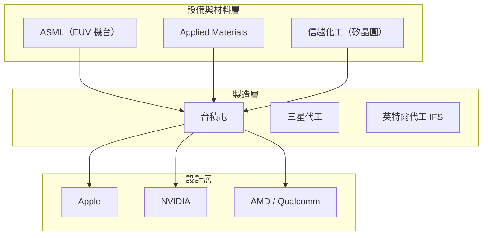

# 公司概覽

台積電（Taiwan Semiconductor Manufacturing Company，TSMC）是全球最大的**純晶圓代工廠**（Pure-play Foundry），總部位於台灣新竹科學園區。

---

## 核心定位

台積電的商業模式在 1987 年由張忠謀創立時即奠定：**只做代工，不做自有品牌晶片**。這個模式讓台積電得以服務全球所有 IC 設計公司，而不與客戶競爭。

---

## 關鍵數字（2023 年）

| 指標 | 數值 |
|------|------|
| 年營收 | 約 2.16 兆新台幣（693 億美元） |
| 全球晶圓代工市占率 | 約 60%+ |
| 員工人數 | 約 73,000 人 |
| 先進製程（7nm 以下）佔營收 | 約 55% |
| 主要客戶 | Apple、NVIDIA、AMD、Qualcomm、Intel |

> 數字以最新公開年報為準，請查閱[台積電 IR 網頁](https://investor.tsmc.com)確認最新數據。

---

## 為何台積電如此關鍵？

台積電的重要性來自三個相互強化的優勢：

**1. 技術領先**
持續維持製程節點的全球最先進地位，目前量產 3nm，2nm 預計 2025 年量產。

**2. 規模效應**
龐大的資本支出（每年 300–400 億美元）形成高度護城河，後進者難以複製。

**3. 客戶黏著性**
半導體製程開發週期長達 2–3 年，客戶一旦導入即難以轉換。

---

## 在全球半導體產業的位置

→ 延伸閱讀：[歷史沿革](02-history.md)、[技術製程](04-nodes.md)
