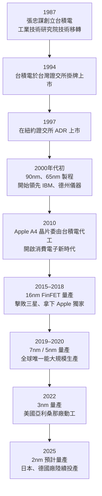

# 歷史沿革

台積電的成立是全球半導體產業的轉捩點，催生了「Fabless + Foundry」的分工模式。

---

## 重要時間軸

---

## 關鍵里程碑詳述

### 1987：純代工模式的誕生

張忠謀在工研院的支持下創立台積電，提出一個當時被業界質疑的概念：**半導體工廠只做製造，不做設計**。這打破了 IDM（Integrated Device Manufacturer）的傳統模式，讓設計公司得以在沒有廠房的情況下設計晶片。

### 1994–2003：技術累積期

透過與飛利浦的技術授權合作，台積電快速累積製程技術，逐步從代工「落後製程」晉升到與業界龍頭競爭。

### 2010：Apple 時代的開始

Apple A4 處理器由台積電代工，奠定了消費電子晶片的主要代工關係，台積電的品質聲譽也因此提升到全新層次。

### 2016–2018：三星爭奪戰

Apple A9 晶片由台積電與三星共同代工，但 A10 起台積電取得獨家供應資格，確立了在最先進製程的領導地位。

### 2022 至今：地緣政治與全球化

美中貿易戰促使台積電在美國、日本、德國投資建廠，半導體供應鏈重組正全面展開。

---

## 重要人物

| 人物 | 角色 | 影響 |
|------|------|------|
| **張忠謀** | 創辦人，2018 年退休 | 創立純代工模式，建立台積電文化 |
| **魏哲家（C.C. Wei）** | 現任 CEO | 主導 3nm/2nm 技術推進與全球擴廠 |
| **劉德音** | 前董事長（2024 年卸任） | 推動美國亞利桑那廠 |
| **蔣尚義** | 前研發共同執行長 | 主導 3DFabric 先進封裝研發 |

---

→ 延伸閱讀：[組織與治理](03-organization.md)、[技術製程](04-nodes.md)
