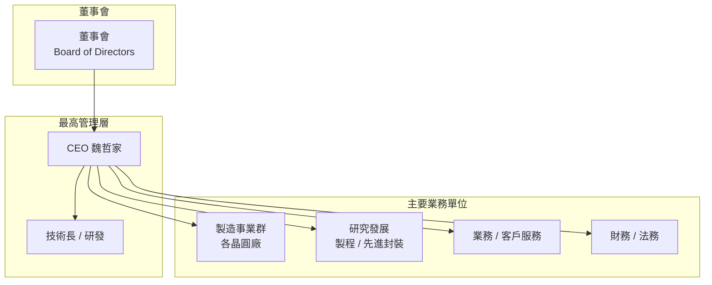

# 組織與治理

台積電採用矩陣式組織結構，研發、製造、業務三條線平行運作，並由最高技術委員會統籌技術方向。

---

## 組織架構示意

---

## 獨特的企業文化

台積電以**誠信（Integrity）** 為核心價值，具體體現在：

- **不與客戶競爭**：台積電不自行設計或銷售晶片，確保客戶設計圖不外洩
- **高度保密文化**：員工不得討論特定客戶或製程細節
- **長期技術投資**：研發支出佔營收比例穩定維持約 8–9%
- **嚴格的品質管控**：良率（Yield）是衡量廠區績效的核心指標

---

## 股權結構

| 股東類型 | 比例（約） |
|----------|-----------|
| 外資法人 | 約 75% |
| 政府基金（國發基金等） | 約 6% |
| 其他本國法人與散戶 | 約 19% |

> 台積電為台灣上市公司（代號：2330），同時在紐約證交所以 ADR 方式掛牌（代號：TSM）。

---

→ 延伸閱讀：[財務表現](10-financials.md)、[客戶結構](08-customers.md)
