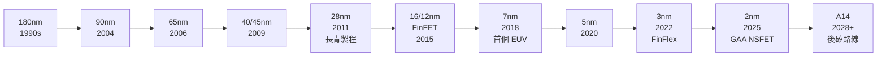
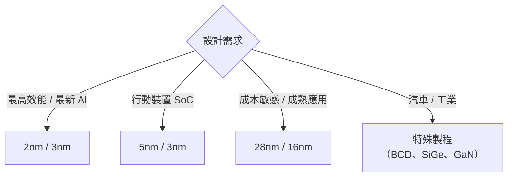

# 製程節點總覽

台積電的技術製程以「奈米節點」命名，數字越小代表電晶體越密集，效能越高、功耗越低。

---

## 製程節點演進

---

## 各製程節點特性

### 28nm — 「長青製程」

28nm 是台積電歷史上最重要的節點之一：

- 成本與效能平衡點最佳
- 至今仍大量用於 MCU、電源管理、顯示驅動 IC
- 台積電在中國設廠（南京廠）主要生產此節點

### 16nm FinFET

導入立體電晶體結構（FinFET），相比平面電晶體大幅降低漏電流，是行動處理器的主力製程。

### 7nm — EUV 時代開始

- 台積電是全球第一個大規模量產 EUV 光刻 7nm 的代工廠
- 主要客戶：Apple A12、AMD EPYC、Huawei Kirin（後因出口管制停供）

### 5nm（N5）

- 相比 7nm 邏輯密度提升約 80%
- Apple A14、M1 系列晶片採用此節點

### 3nm（N3/N3E）

- 導入「FinFlex」架構，允許設計師在同一晶片混用不同電晶體配置
- 電晶體密度超過每平方毫米 2 億個
- Apple A17 Pro、M3 系列採用

### 2nm（N2）

- 重大架構轉變：從 FinFET 改為 **GAA NSFET**（Gate-All-Around Nanosheet）
- 預計 2025 年量產，2026 年進入 N2P 增強版
- 顯著改善電晶體控制能力，降低功耗

---

## 製程選擇考量

---

→ 延伸閱讀：[先進封裝](05-advanced-packaging.md)、[技術路線圖](06-roadmap.md)
