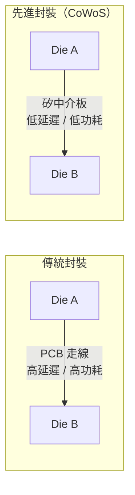
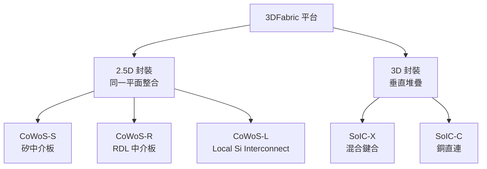
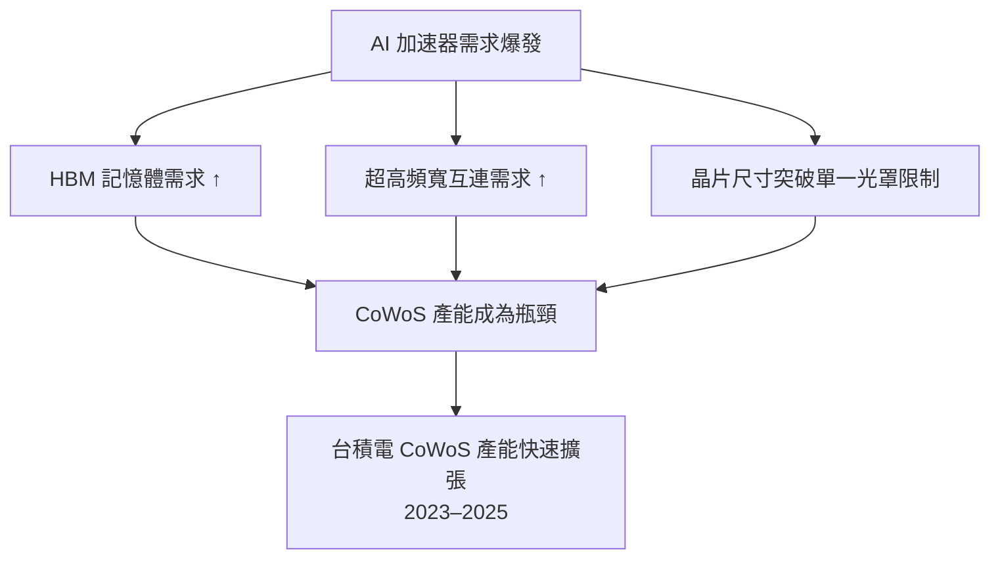

# 先進封裝：CoWoS 與 3DFabric

當製程微縮的物理極限越來越近，**先進封裝**成為提升效能的重要路徑。台積電的 3DFabric 平台整合了多種封裝技術。

---

## 為何先進封裝如此重要？

傳統封裝只是將晶片「裝進外殼」，現代先進封裝則是將多個晶片（Die）整合到一起，讓它們之間的連接密度接近單一晶片內部的等級。

---

## 3DFabric 平台架構

台積電將先進封裝技術統稱為 **3DFabric**，分為兩大類：

---

## CoWoS 系列詳解

### CoWoS-S（Silicon Interposer）

最成熟的 2.5D 封裝方案，核心概念是在「矽中介板」上同時放置 GPU/TPU 晶片與 HBM 記憶體。

**主要應用**：NVIDIA H100、H200、B100 等 AI 加速器

| 特性 | 說明 |
|------|------|
| 中介板材質 | 矽（Si） |
| HBM 頻寬 | 可達數 TB/s |
| 封裝尺寸 | 最大約 2,500 mm²（持續擴大中） |
| 優點 | 互連密度高、訊號完整性佳 |

### CoWoS-R（RDL Interposer）

以再佈線層（Redistribution Layer）取代矽中介板，成本較低但互連密度稍低。

### CoWoS-L（Local Si Interconnect）

混合型：部分採用矽橋接（Si Bridge），其餘用 RDL，在成本與效能間取得平衡。

---

## SoIC：3D 垂直堆疊

SoIC（System on Integrated Chips）使用**混合鍵合（Hybrid Bonding）**技術，將兩個晶片以銅對銅直接接合，間距可低至 9μm，遠優於傳統凸塊（Bump）的 40μm 以上。

**應用場景**：將邏輯晶片與快取/記憶體晶片垂直堆疊，顯著縮短存取延遲。

---

## AI 時代的封裝需求

---

→ 延伸閱讀：[技術路線圖](06-roadmap.md)、[客戶結構](08-customers.md)
