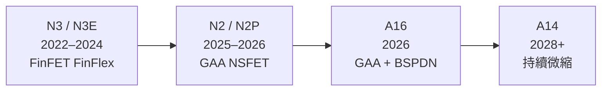
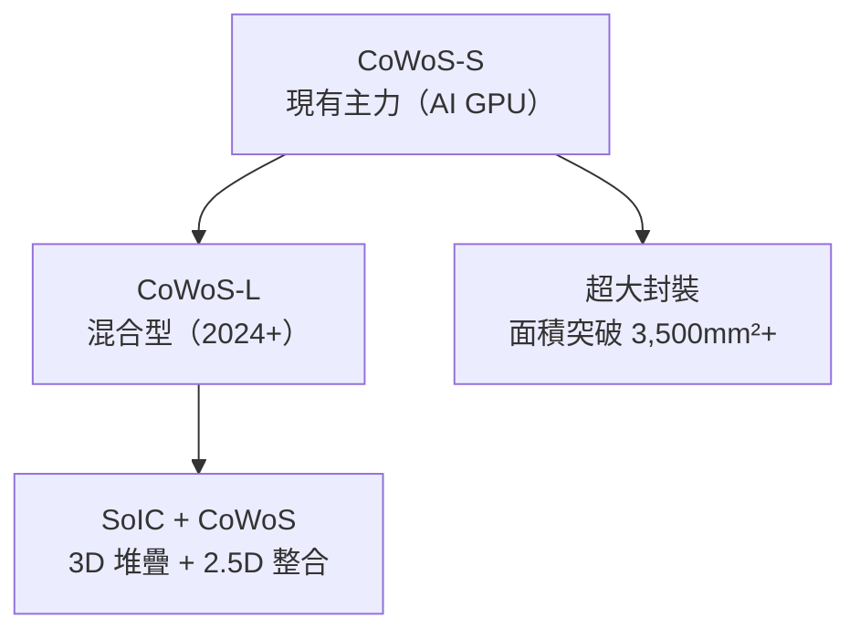

# 技術路線圖

台積電的技術路線圖（Technology Roadmap）每年在技術論壇（Technology Symposium）公開，是觀察未來方向的重要窗口。

---

## 製程微縮路線

**關鍵技術轉折點**：

- **N2**：首次採用 GAA（Gate-All-Around）架構，電晶體控制能力大幅提升
- **A16**：導入 **BSPDN**（Backside Power Delivery Network），將電源線移至晶片背面，釋放正面空間給訊號線，提升邏輯密度
- **後矽路線**：研究 2D 材料（MoS₂ 等）、碳奈米管的可能性

---

## 特殊製程平台

除了數位邏輯製程，台積電也維護多個特殊用途平台：

| 平台 | 應用 | 代表節點 |
|------|------|----------|
| RF（射頻） | 5G 手機前端模組 | N6RF、N4RF |
| BCD | 電源管理 IC | 各 BCD 版本 |
| SiGe | 毫米波雷達、光通訊 | SiGe BiCMOS |
| GaN | 快充、基站功放 | GaN-on-SiC |
| HV CMOS | 顯示驅動、汽車 | 各 HV 版本 |
| Embedded NVM | 微控制器 MCU | eFlash、eMRAM |

---

## 先進封裝路線

---

## 如何追蹤最新路線圖

1. **台積電技術論壇（TSMC Technology Symposium）**
   - 每年於美國、歐洲、日本舉辦
   - YouTube 搜尋 "TSMC technology symposium" 可看官方影片

2. **IEEE IEDM / ISSCC**
   - 台積電每年在此發表製程技術論文
   - 可在 IEEE Xplore 搜尋

3. **Wikichip**
   - 提供各製程節點的詳細技術參數比較

---

→ 延伸閱讀：[製程節點](04-nodes.md)、[先進封裝](05-advanced-packaging.md)
