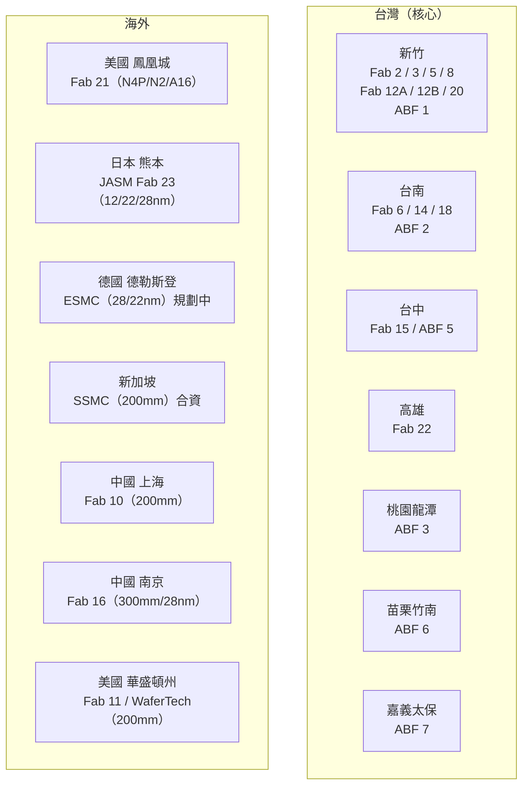
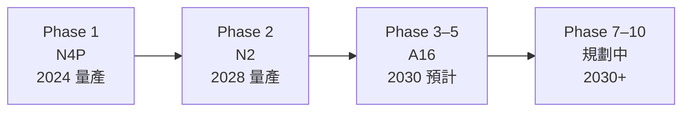
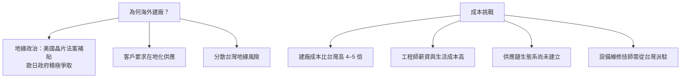

# 廠區分布

台積電擁有遍布全球的晶圓廠與先進封裝廠，主力仍在台灣，同時積極於美國、日本、德國、新加坡、中國布局。

---

## 全球廠區一覽圖

---

## 台灣廠區詳表

### 前段晶圓廠（Wafer Fab）

| 廠號 | 位置 | 晶圓尺寸 | 主要製程 / 備註 |
|------|------|---------|----------------|
| **Fab 2** | 新竹科學園區 | 150 mm | 成熟製程，早期設施 |
| **Fab 3** | 新竹科學園區 | 200 mm | 成熟製程 |
| **Fab 5** | 新竹科學園區 | 200 mm | 成熟製程 |
| **Fab 6** | 台南善化 | 200 mm | 成熟製程，Phase 1 & 2 運作中 |
| **Fab 8** | 新竹科學園區 | 200 mm | 成熟製程 |
| **Fab 12A** | 新竹寶山 | 300 mm | **台積電總部所在地**；Phase 1/2/4–7 運作中，Phase 8 興建中；涵蓋 7nm / 5nm |
| **Fab 12B** | 新竹科學園區 | 300 mm | **研發中心**；Phase 3 運作中；先進製程研發 |
| **Fab 14** | 台南善化 | 300 mm | Phase 1–7 運作中，Phase 8 興建中；7nm / 5nm 主力 |
| **Fab 15** | 台中科學園區 | 300 mm | Phase 1–7 運作中；12nm / 16nm 主力 |
| **Fab 18** | 台南安定 | 300 mm | Phase 1–8 全數運作；**3nm / 5nm 最大量產廠** |
| **Fab 20** | 新竹寶山 | 300 mm | **2nm（N2）首批量產廠**，規劃 4 期；2025 年起量產 |
| **Fab 22** | 高雄楠梓 | 300 mm | Phase 1 運作中，Phase 2 興建，Phase 3–5 規劃中；目標 2nm / A16 |

### 後段先進封裝廠（Advanced Backend Fab，ABF）

台積電自建封裝廠以整合 CoWoS / SoIC 等先進封裝技術，不再完全依賴外部封測廠。

| 廠號 | 位置 | 狀態 | 備註 |
|------|------|------|------|
| **ABF 1** | 新竹科學園區 | 運作中 | CoWoS 先進封裝 |
| **ABF 2** | 台南善化 | AP2B & AP2C 運作中 | CoWoS 先進封裝 |
| **ABF 3** | 桃園龍潭 | 運作中 | 先進封裝 |
| **ABF 5** | 台中科學園區 | 運作中 | 先進封裝 |
| **ABF 6** | 苗栗竹南 | AP6A 運作中；Phase B & C 興建中 | 大幅擴充 CoWoS 產能 |
| **ABF 7** | 嘉義太保 | 規劃 2 期 | 新建封裝廠，擴充南部產能 |

---

## 海外廠區詳情

### 🇺🇸 美國 — Fab 21（鳳凰城，亞利桑那州）

| 項目 | 說明 |
|------|------|
| 位置 | 鳳凰城（Phoenix），亞利桑那州 |
| 晶圓尺寸 | 300 mm |
| 總投資額 | 超過 650 億美元（最終目標） |
| 補貼 | 美國晶片法案（CHIPS Act）直接補助 66 億美元 + 50 億美元貸款 |
| Phase 1 | N4P，2024 年量產 |
| Phase 2 | N2，2028 年量產 |
| Phase 3–5 | A16，目標 2030 年 |
| 特別承諾 | 台積電承諾在亞利桑那導入最先進 A16 製程，5 年內不回購股票 |
| 挑戰 | 建廠成本比台灣高 4–5 倍；工程人才招募困難；供應鏈生態待建立 |

---

### 🇯🇵 日本 — JASM / Fab 23（熊本菊陽町）

| 項目 | 說明 |
|------|------|
| 正式名稱 | Japan Advanced Semiconductor Manufacturing（JASM） |
| 股權結構 | 台積電 70%、Sony Semiconductor Solutions 20%、Denso 10% |
| Phase 1 | 已於 2024 年 12 月開始商業生產；製程：12 / 22 / 28 nm |
| Phase 1 建廠費用 | 約 86 億美元；日本政府補貼 4,760 億日圓 |
| Phase 2 | 興建中（Fab 23 旁）；製程 6 nm / 12 nm；估計成本 139 億美元；政府補貼 7,320 億日圓 |
| 預計就業 | 第一廠直接創造約 1,700 個高技術工作機會 |
| 戰略意義 | 供應 Sony 影像感測器、Denso 汽車晶片及其他日本電子廠商 |

---

### 🇩🇪 德國 — ESMC（德勒斯登，薩克森邦）

| 項目 | 說明 |
|------|------|
| 正式名稱 | European Semiconductor Manufacturing Company（ESMC） |
| 股權結構 | 台積電 70%、Bosch 10%、Infineon 10%、NXP 10% |
| 製程 | 28 nm / 22 nm（汽車、工業應用） |
| 總投資 | 超過 100 億歐元（台積電出資 35 億歐元） |
| 政府補貼 | 德國政府補貼 50 億歐元 |
| 目標產能 | 每月 40,000 片 12 吋晶圓 |
| 預計量產 | 2029 年正式投產 |

---

### 🇸🇬 新加坡 — SSMC

| 項目 | 說明 |
|------|------|
| 正式名稱 | Systems on Silicon Manufacturing Cooperation（SSMC） |
| 股權結構 | 台積電 38.8%、NXP Semiconductors 61.2% |
| 晶圓尺寸 | 200 mm |
| 製程 | 成熟製程（類比、混合訊號、電源管理） |
| 成立時間 | 1998 年，原為台積電、飛利浦、EDB 三方合資 |

---

### 🇨🇳 中國 — Fab 10 & Fab 16

| 廠號 | 位置 | 晶圓尺寸 | 製程 | 備註 |
|------|------|---------|------|------|
| **Fab 10** | 上海松江 | 200 mm | 成熟製程 | TSMC China Company Limited |
| **Fab 16** | 南京（江蘇） | 300 mm | 28 nm | TSMC Nanjing Company Limited；因美國出口管制無法升級至先進製程 |

---

### 🇺🇸 美國華盛頓州 — Fab 11（WaferTech）

| 項目 | 說明 |
|------|------|
| 位置 | Camas，華盛頓州 |
| 晶圓尺寸 | 200 mm |
| 製程 | 成熟製程 |
| 歷史 | 原名 WaferTech，現更名為 TSMC Washington |

---

## 為何海外建廠如此挑戰？

儘管有龐大補貼，海外廠生產的晶片成本仍比台灣廠高出至少 50%，這也是台灣廠持續擴張的重要原因。

---

→ 延伸閱讀：[地緣政治](11-geopolitics.md)、[上下游供應鏈](09-supply-chain.md)
