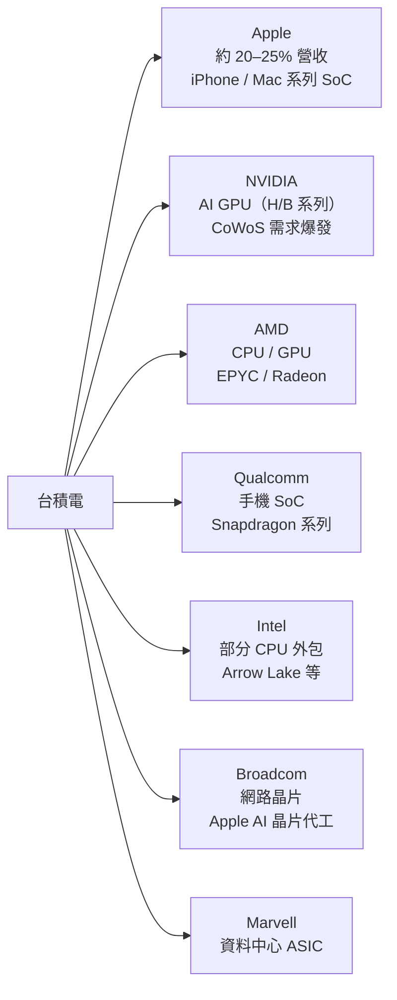
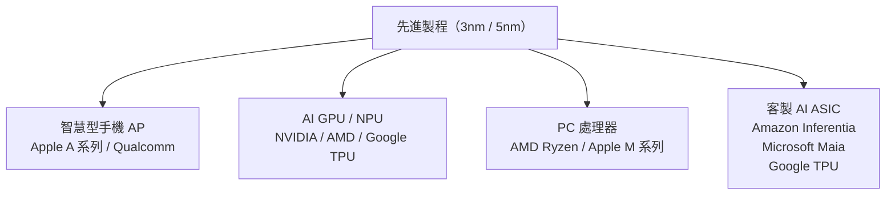

# 客戶結構

台積電客戶遍布全球，涵蓋消費電子、資料中心、汽車、工業等領域，但高度集中在少數頂級客戶。

---

## 主要客戶

---

## 各終端市場佔營收比例（約）

| 終端市場 | 佔比（2023） | 主要晶片類型 |
|----------|-------------|--------------|
| 智慧型手機 | 約 33% | AP、基帶、PMIC |
| 高效能運算（HPC） | 約 43% | AI GPU、CPU、FPGA |
| 物聯網 | 約 8% | MCU、感測器 |
| 汽車 | 約 5% | ADAS、MCU |
| 消費電子 | 約 5% | 各類晶片 |
| 其他 | 約 6% | — |

> HPC（含 AI）已超越手機成為最大來源，且持續快速成長。

---

## 先進製程客戶分布

---

## 客戶集中度風險

Apple 一家約貢獻台積電 20–25% 的年營收，帶來相當程度的客戶集中風險。不過：

- Apple 使用的是最先進製程，雙方高度互依
- AI 時代 NVIDIA 等 HPC 客戶快速填補潛在缺口
- 台積電刻意維持多元客戶組合，不讓單一客戶佔比過高

---

→ 延伸閱讀：[財務表現](10-financials.md)、[上下游供應鏈](09-supply-chain.md)
