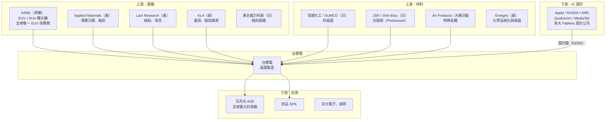
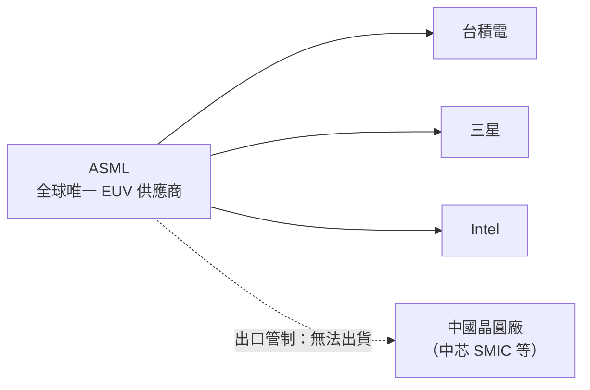

# 上下游供應鏈

台積電是全球半導體供應鏈的核心節點，上游仰賴高度集中的設備與材料供應商，下游則連接全球 IC 設計生態系。

---

## 供應鏈全貌

---

## ASML 的關鍵地位

EUV（極紫外光）微影設備是 7nm 以下製程的必要條件，而 ASML 是全球唯一能製造 EUV 機台的公司。一台 EUV 機台售價超過 1 億美元，交期長達數年，形成極高的供應鏈風險。

---

## 台灣半導體聚落優勢

台積電能夠高效運作，很大程度上仰賴台灣本土形成的完整半導體聚落：

| 環節 | 台灣代表企業 |
|------|-------------|
| 矽晶圓 | 環球晶（GlobalWafers） |
| 光罩 | 台灣光罩 |
| 封測 | 日月光、矽品、頎邦 |
| PCB / 基板 | 南亞科、台光電子 |
| 設備維修 | 漢民科技等代理商 |

---

→ 延伸閱讀：[廠區分布](07-fabs.md)、[地緣政治](11-geopolitics.md)
