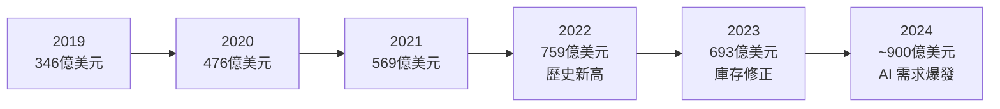
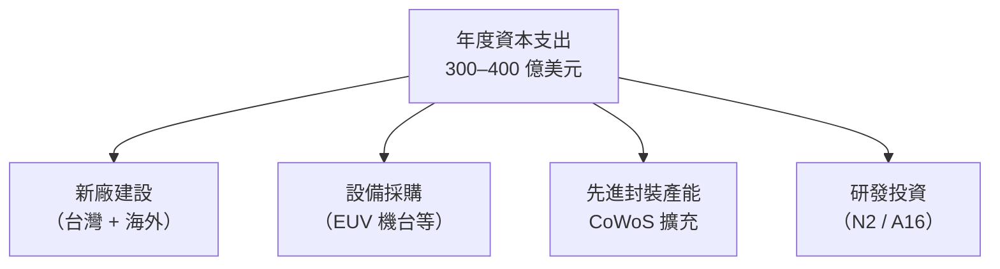

# 財務表現

台積電是全球市值最高的半導體公司之一，財務結構健康，獲利能力在晶圓代工業中首屈一指。

---

## 營收趨勢

---

## 關鍵財務指標（2023 年）

| 指標 | 數值 |
|------|------|
| 年營收 | 約 693 億美元（2.16 兆台幣） |
| 毛利率 | 約 54% |
| 營業利益率 | 約 42% |
| 淨利率 | 約 38% |
| 資本支出 | 約 322 億美元 |
| 研發費用佔比 | 約 8% |

> 台積電毛利率長期維持在 50% 以上，遠超一般製造業，體現其技術獨占性帶來的定價能力。

---

## 資本支出策略

台積電每年投入龐大資本支出（CapEx）擴充產能與研發：

高資本支出形成極高的進入障礙——競爭對手需要同等規模的投入才能追上，而台積電同時又在繼續前進。

---

## 如何閱讀台積電財報

每季法說會後，台積電公開：

1. **月營收** — 每月 10 日前公告上月合併營收
2. **季報** — 含各製程平台佔比（先進製程 vs. 成熟製程）
3. **年報** — 完整財務、技術、廠區、ESG 資訊

**重要觀察指標**：
- 先進製程（7nm 以下）佔營收比例趨勢
- 各終端市場佔比（手機 vs. HPC/AI）
- 資本支出指引（反映對未來需求的信心）
- 毛利率變化（反映海外建廠成本壓力）

---

→ 延伸閱讀：[客戶結構](08-customers.md)、[地緣政治](11-geopolitics.md)
