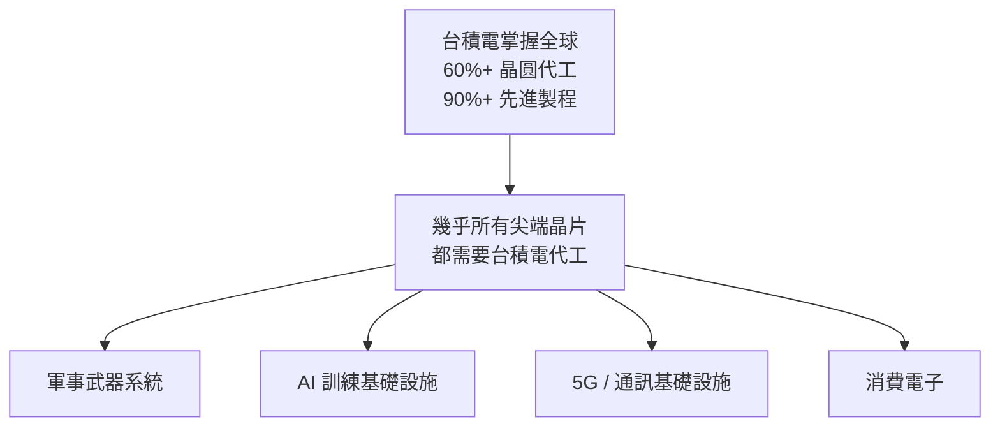
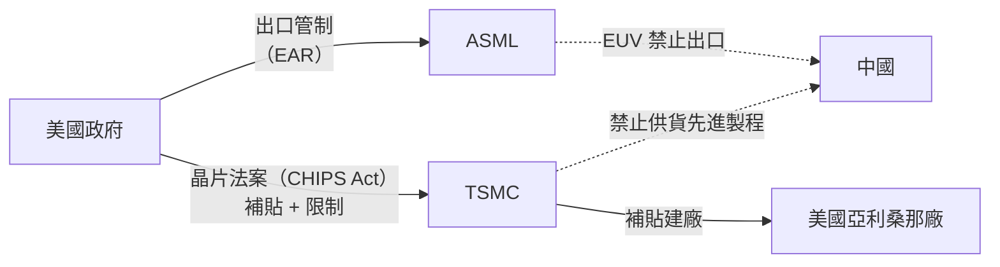

# 地緣政治與全球化

半導體已成為 21 世紀最重要的戰略資源，台積電則處於這場地緣政治競局的核心。

---

## 為何台積電如此重要？

一旦台積電的生產中斷，全球供應鏈將面臨難以估計的衝擊，這使得台積電擁有「矽盾」（Silicon Shield）的地位。

---

## 美中科技戰的影響

**關鍵政策**：
- **美國晶片法案（2022）**：提供 520 億美元補貼，吸引台積電赴美設廠
- **出口管制**：禁止台積電用美國設備生產晶片供應特定中國客戶（含華為）
- **ASML 出口管制**：荷蘭政府在美國壓力下限制 EUV 機台出口中國

---

## 各國建廠佈局

| 國家 | 計畫 | 主要驅動因素 |
|------|------|-------------|
| 美國 | 亞利桑那廠（N4P + N2） | 晶片法案補貼、客戶要求 |
| 日本 | 熊本 JASM（N16/N12） | 日本政府補貼、Sony 等客戶 |
| 德國 | 德勒斯登 ESMC（28nm） | 歐洲晶片法案、汽車產業需求 |
| 台灣 | 持續擴張（2nm / A16） | 既有聚落優勢、技術核心 |

---

## 「矽盾」論述的爭議

**支持者**認為：台積電的不可替代性讓台灣受到保護，任何軍事衝突都會使全球供應鏈癱瘓，各大國都不希望這發生。

**反對者**認為：正因為台積電太重要，它反而成為衝突的目標而非嚇阻因素；且海外建廠的推進正在削弱這個屏障。

---

→ 延伸閱讀：[廠區分布](07-fabs.md)、[學習資源](13-resources.md)
