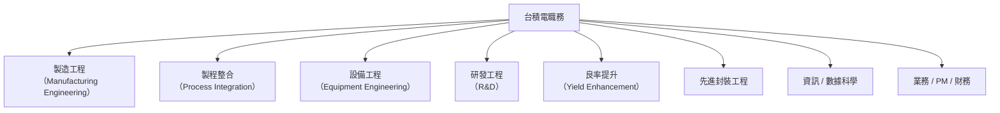

# 職涯指南

台積電是台灣最具競爭力的科技雇主之一，薪資福利業界頂尖，但工作強度也相當高。

---

## 主要職類

---

## 各職類說明

### 製程整合工程師（Process Integration）

最具核心競爭力的職位，負責統整各道製程步驟，確保晶片製造流程順暢、良率達標。需要對整個製程有全面理解。

### 設備工程師（Equipment Engineer）

負責維護與優化特定製造設備（如曝光機、蝕刻機、薄膜沉積機）。與設備廠商緊密協作，需要強健的問題解決能力。

### 良率提升工程師（Yield Enhancement）

分析晶圓缺陷，找出良率損失根因並提出改善方案。大量使用統計分析與資料科學工具。

### 研發工程師（R&D）

參與下一世代製程節點的開發，工作內容接近學術研究，需要較深的材料科學或物理化學背景。

---

## 薪資參考（新鮮人，約）

| 職類 | 起薪範圍（月薪） | 年薪（含獎金） |
|------|----------------|---------------|
| 工程師（理工碩士） | 約 6–7 萬元 | 約 150–200 萬元 |
| 工程師（博士） | 約 8–10 萬元 | 約 220–280 萬元 |
| 軟體 / 資料科學 | 約 6–8 萬元 | 約 160–220 萬元 |

> 數字為市場估計，實際依職級、科技獎金與績效獎金差異極大，請參考 104 薪資報告或 PTT Semiconductor 版討論。

---

## 工作文化特點

- **輪班制**：晶圓廠為 24 小時運作，多數工程師採早晚班輪班制
- **高壓環境**：良率目標與產能壓力大，需要快速應變能力
- **技術導向**：工程文化濃厚，升遷以技術能力為主要依據
- **穩定性高**：離職率相對業界偏低，長期待遇有競爭力

---

## 求職資源

1. **台積電官方招募頁面**
   - [careers.tsmc.com](https://careers.tsmc.com)
   - 包含校園招募計畫（TSIA 等）

2. **104 人力銀行**
   - 搜尋「台積電」查看完整 JD 與薪資水準

3. **PTT Semiconductor 版**
   - 大量工程師的面試心得與工作日常分享

4. **LinkedIn**
   - 了解台積電員工的職涯路徑與轉職去向

---

→ 延伸閱讀：[學習資源](13-resources.md)
