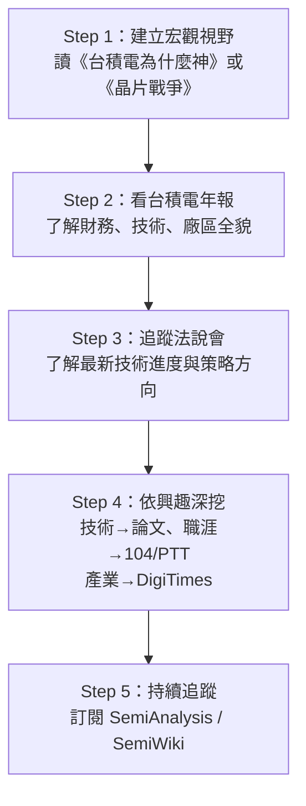

# 學習資源

整理台積電相關的最佳學習資料，依「入門 → 深入」順序排列。

---

## 建議學習路線

---

## 書籍

| 書名 | 作者 | 重點 |
|------|------|------|
| 《台積電為什麼神》 | 林宏文 | 台積電發展歷史與競爭策略，最佳入門書 |
| 《晶片戰爭》（Chip War） | Chris Miller | 全球半導體地緣政治，台積電在其中的角色 |
| 《矽島的危與機》 | 黃欽勇 | 台灣半導體供應鏈全貌 |
| 《張忠謀自傳》 | 張忠謀 | 創辦人視角的公司歷史 |

> ⚠️ 以上書籍受著作權保護，請購買正版閱讀，本書僅摘要觀點。

---

## 官方資料（第一手，最權威）

### 台積電年報（Annual Report）
- 每年發布，涵蓋營收、技術藍圖、客戶結構、廠區分布
- 下載：[investor.tsmc.com](https://investor.tsmc.com) → Annual Reports

### 法說會資料（Earnings Call）
- 每季召開，簡報與逐字稿公開
- 可看到各技術平台佔營收比例、資本支出指引

### 技術頁面
- [tsmc.com/technology](https://www.tsmc.com/english/dedicatedFoundry/technology/logic) — 製程節點規格
- [3DFabric 專頁](https://www.tsmc.com/english/dedicatedFoundry/technology/3dfabric) — 先進封裝技術

---

## 媒體與分析

### 中文媒體
| 來源 | 定位 |
|------|------|
| 電子時報（DigiTimes） | 半導體產業最專業的中文媒體，部分付費 |
| 科技新報 | 免費，台灣科技產業新聞 |
| 天下、商業周刊 | 深度專題報導 |

### 英文媒體
| 來源 | 定位 |
|------|------|
| **SemiAnalysis** | 技術深度分析，付費，品質極高 |
| **SemiWiki** | 免費，工程師社群討論 |
| Semiconductor Engineering | 技術文章豐富，免費 |
| The Information | 商業戰略，付費 |
| Bloomberg / Reuters | 主流財經視角 |

---

## 影片與 YouTube

- 搜尋 **"TSMC Technology Symposium"** — 台積電官方技術發表影片
- 搜尋 **"TSMC IEDM"** — IEEE 學術研討會發表
- 財經頻道：各大財經 YouTuber 不定期有台積電深度分析

---

## 技術深度

| 資源 | 用途 |
|------|------|
| [Wikichip](https://en.wikichip.org) | 各製程節點技術參數對比 |
| IEEE Xplore | TSMC 發表的 IEDM / ISSCC 論文 |
| IRDS（國際半導體技術藍圖） | 整個產業的技術預測 |

---

→ 回到 [導讀](README.md)
