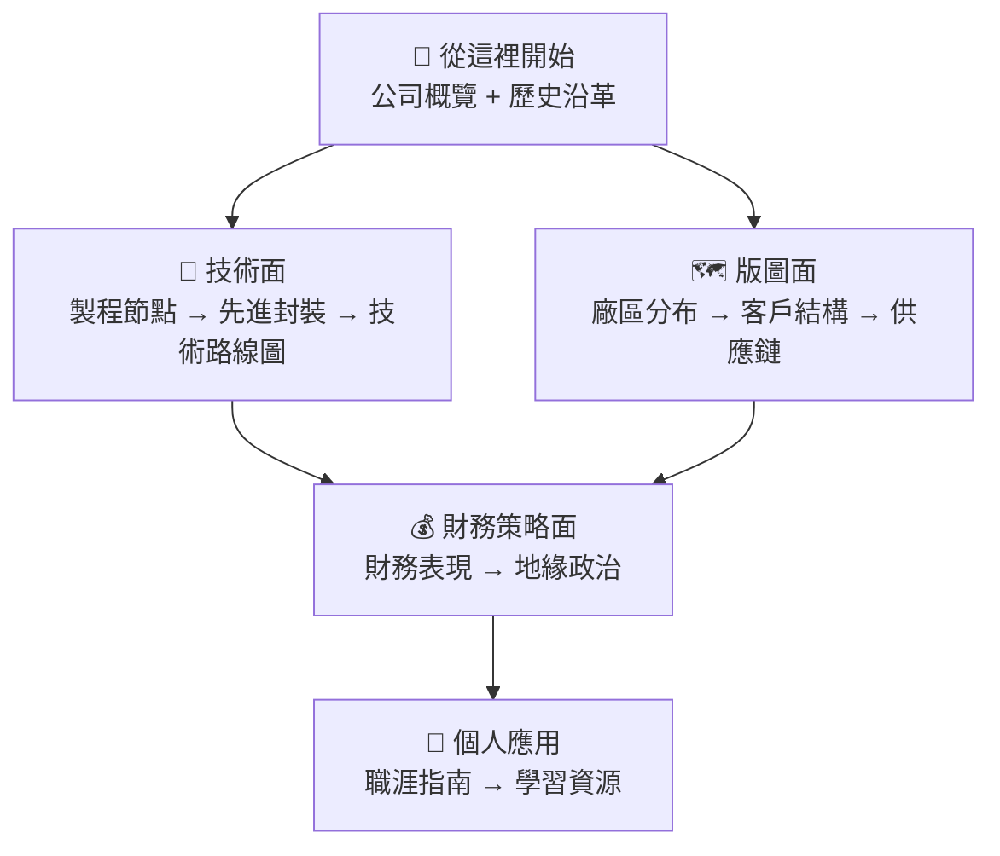

# 台積電全方位指南

> 從歷史沿革、技術製程、廠區版圖，到財務策略與職涯規劃的完整知識地圖。

## 這本書的定位

本書以**繁體中文**撰寫，整合公開資料、年報、法說會資訊與產業分析，幫助讀者快速建立對台積電的完整認識。不論你是：

- 剛開始認識半導體產業的新人
- 準備面試台積電的求職者
- 想深入了解台積電技術與策略的工程師
- 關注半導體地緣政治的產業觀察者

本書都能提供系統性的入門框架，再引導你深入感興趣的面向。

---

## 建議學習路線

---

## 資料來源說明

本書內容以下列公開資料為基礎：

| 來源 | 用途 |
|------|------|
| 台積電年報（Annual Report） | 財務、技術藍圖、客戶結構、廠區 |
| 法說會簡報（Investor Relations） | 各平台營收佔比、資本支出 |
| 台積電官網技術頁面 | 製程節點規格、3DFabric |
| 《晶片戰爭》Chris Miller | 地緣政治視角 |
| 《台積電為什麼神》林宏文 | 發展歷史與競爭策略 |
| SemiAnalysis、SemiWiki | 技術深度分析 |
| DigiTimes、科技新報 | 產業最新動態 |

> ⚠️ 本書為學習筆記，引用書籍時僅摘要觀點，不逐字翻譯，請支持正版著作。
