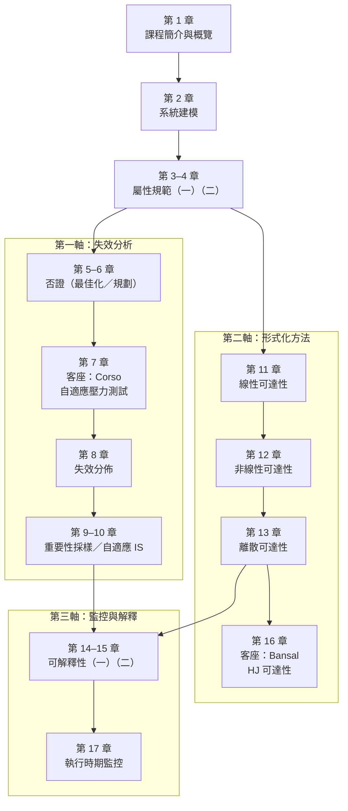

# 導讀：如何使用本書

本書是 Stanford 大學 **AA228V/CS238V「安全關鍵系統驗證」**課程的中文讀書筆記。開始閱讀各章之前，建議先花幾分鐘讀完本頁：它說明課程與教科書的背景、全書 17 章的組織邏輯與依賴關係，以及不同讀者適合的閱讀路線。

## 課程背景

- **課程**：Stanford AA228V/CS238V，2025 年冬季學期，由 **Mykel Kochenderfer** 與 **Sydney Katz** 授課。課程主題是安全關鍵系統（自動駕駛、航空防撞、醫療設備等）的**驗證 (Validation)**：如何以演算法確認一個具備智慧決策能力的系統確實滿足其安全規範。
- **教科書**：《**Algorithms for Validation**》，作者 Mykel J. Kochenderfer、Sydney M. Katz、Anthony L. Corso、Robert J. Moss，MIT Press 出版（© 2026）。官方提供**免費電子版 PDF**：[algorithmsbook.com/validation](https://algorithmsbook.com/validation/)。教科書共 12 章加 4 個附錄，課程的授課順序即是教科書的章序。
- **實作語言**：課程與教科書皆採用 Julia 語言與 Pluto 筆記本環境（詳見第 1 章 §1.5）。

## 本書結構：17 章＝官方授課順序＝教科書章序

本書共 17 章，完全依照 2025 年冬季的**官方授課順序**排列；由於課程本身按教科書章序授課，本書章序同時也與教科書一致。各章與教科書章節的對應如下：

| 本書章 | 主題 | 講次日期 | 教科書對應章節 |
|---|---|---|---|
| 1 | 課程簡介與概覽 | 2025/1/7 | 第 1 章 |
| 2 | 系統建模 | 2025/1/9 | 第 2 章（§2.1–2.3、§2.5） |
| 3 | 屬性規範（一） | 2025/1/14 | §3.1–3.3 |
| 4 | 屬性規範（二） | 2025/1/16 | §3.4–3.6 |
| 5 | 基於最佳化的否證 | 2025/1/21 | 第 4 章 |
| 6 | 基於規劃的否證 | 2025/1/23 | 第 5 章 |
| 7 | 客座講座：Anthony Corso（自適應壓力測試） | 2025/1/28 | 無對應章（主題與第 5 章相關） |
| 8 | 失效分佈 | 2025/1/30 | 第 6 章 |
| 9 | 重要性採樣 | 2025/2/4 | 第 7 章（主要 §7.1–7.2） |
| 10 | 自適應重要性採樣 | 2025/2/6 | 第 7 章（主要 §7.3–7.4） |
| 11 | 線性系統可達性 | 2025/2/11 | 第 8 章 |
| 12 | 非線性系統可達性 | 2025/2/13 | 第 9 章 |
| 13 | 離散系統可達性 | 2025/2/18 | 第 10 章 |
| 14 | 可解釋性（一） | 2025/2/25 | 第 11 章 |
| 15 | 可解釋性（二） | 2026/3/3（2026 年班） | 第 11 章 |
| 16 | 客座講座：Somil Bansal | 2025/2/27 | 無對應章（主題與第 8–9 章相關） |
| 17 | 執行時期監控 | 2025/3/4 | 第 12 章 |

兩點補充說明：

- **第 15 章來自 2026 年班**。2025 與 2026 兩個年班各有一講「Explainability」，皆對應教科書第 11 章：第 14 章是 2025 年班 Sydney Katz 的講次，第 15 章則是 2026 年班由課程助教 **Romeo Valentin** 主講的講次，兩者內容互補，因此本書將其相鄰排列。
- **客座講座章（7、16）無教科書對應章**。第 7 章（Anthony Corso，自適應壓力測試）是第 6 章「基於規劃的否證」的自然延伸；第 16 章（Somil Bansal，Hamilton-Jacobi 可達性）則深化第 11–13 章的可達性主題。

### 未收錄的講次：神經網路驗證

2025 年冬季課程另有一場**神經網路驗證 (Neural Network Verification)** 客座講座（**Min Wu** 主講，2025/2/20），但該講次影片未公開發布，因此本書沒有對應章節。對此主題有興趣的讀者，可閱讀教科書 **§9.7 Neural Networks**（非線性可達性一章中的一節，即本書第 12 章的進階延伸）與**附錄 C Neural Representations**。

## 全書地圖：三大軸

在第 1–4 章建立共同基礎（驗證框架、系統建模、屬性規範）之後，全書沿三大軸展開：

1. **失效分析（第 5–10 章）**：主動尋找並量化系統的失效——先用否證找出違反規範的反例（第 5–7 章），再刻畫失效分佈（第 8 章）並以重要性採樣估計極小的失效機率（第 9–10 章）。
2. **形式化方法（第 11–13、16 章）**：在特定假設下提供「絕對安全」的數學保證——依序處理線性、非線性、離散系統的可達性分析，並以 Bansal 客座講座深化。
3. **監控與解釋（第 14–15、17 章）**：理解系統為何失效（可解釋性），並在部署後即時守護安全（執行時期監控）。

上圖是**概念依賴圖**：失效分析軸與形式化方法軸都只依賴第 1–4 章的共同基礎，彼此相對獨立；監控與解釋軸則綜合運用前兩軸的成果。本書的章號順序（即官方授課順序）是先走完失效分析軸、再走形式化方法軸、最後收於監控與解釋軸。

## 如何使用本書

- **循序精讀（推薦）**：按章號 1 → 17 依序閱讀，這正是課程的授課節奏；每章結尾的「本章小結」與銜接語句會帶你進入下一章。
- **主題式選讀**：第 1–4 章是所有讀者的必經基礎；之後可依上方依賴圖挑軸閱讀——只關心失效機率估計可讀第 5–10 章，只關心形式化保證可讀第 11–13、16 章，關心部署後安全可在讀完任一軸後跳至第 14–15、17 章。
- **搭配教科書**：每章對應的教科書章節見上表；想深入數學細節或 Julia 實作時，隨時可對照官方免費 PDF。
- **術語查閱**：全書中英譯名以[附錄：術語對照表](appendix-glossary.md)為唯一標準，首次出現的術語均附英文原文；閱讀中遇到不確定的譯名可隨時查表。

準備好了嗎？從[第 1 章：課程簡介與概覽](README.md)開始。
