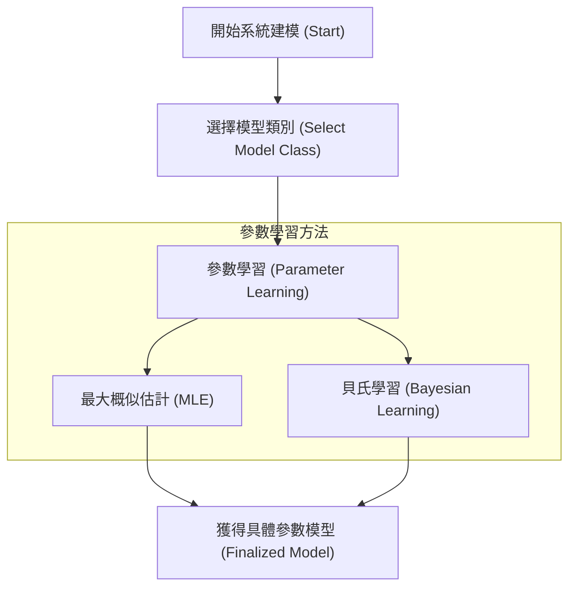

# 第 2 章：系統建模 (System Modeling)

在安全關鍵系統的驗證過程中，我們必須將「待測系統」與其所處的環境進行數學建模。因為在真實世界中直接進行測試可能會帶來不可挽回的危險與高昂的成本，因此我們依賴計算模型在模擬環境中進行離線驗證 (Offline Validation)。正如統計學家 George Box 所言：「所有模型都是錯的，但有些是有用的 (All models are wrong, but some are useful)」。本章將探討如何選擇與建立合適的系統模型，使其具備足夠的表現力，同時避免過度複雜。

## 2.1 機率模型基礎 (Probabilistic Models)

真實世界的系統充滿了不確定性。無論是感測器的雜訊、風向的擾動，還是其他車輛的行為，都很難用確定性 (Deterministic) 的方程式完美描述。因此，我們大量使用**機率模型 (Probabilistic Models)** 來捕捉這些不確定性。

### 離散與連續分佈
- **離散分佈 (Discrete Distributions)**：變數的可能結果是有限或可數的。我們使用機率質量函數 (PMF, Probability Mass Function) 來描述，例如擲骰子的結果。所有事件的機率總和必須為 $1$。
- **連續分佈 (Continuous Distributions)**：變數可以是在一個範圍內的任意實數。我們使用機率密度函數 (PDF, Probability Density Function) 來描述，如常態分佈 (Gaussian Distribution)。PDF 的積分總和為 $1$，且單一特定值的機率為 $0$。

### 聯合與條件分佈
- **聯合分佈 (Joint Distribution)**：描述多個變數同時發生的機率。例如多元常態分佈 (Multivariate Gaussian) 透過均值向量 (Mean Vector) 與協方差矩陣 (Covariance Matrix) 來表達變數之間的相關性。
- **條件分佈 (Conditional Distribution)**：在已知某變數的情況下，另一變數的機率分佈。例如給定當前狀態 $x$，觀察到感測器數值 $y$ 的機率 $P(y \mid x)$。

## 2.2 增加模型的表現力 (Model Expressiveness)

當單一的簡單分佈無法良好地描述複雜資料時（例如資料呈現多峰特性），我們需要增加模型的複雜度：

1. **混合模型 (Mixture Models)**：將多個簡單分佈以不同權重進行組合。例如高斯混合模型 (Gaussian Mixture Model)。
2. **分佈變換 (Transforming Distributions)**：將變數 $Z$ 從簡單分佈中抽樣後，通過函數 $f$ 轉換為 $X = f(Z)$。若 $f$ 具有可微性與可逆性（反函數為 $g$），則新變數 $X$ 的機率密度函數為：
   $$p_x(x) = p_z(g(x))|g'(x)|$$
   此概念是深度學習中生成模型（如正規化流 Normalizing Flows）的核心基礎。

## 2.3 參數學習 (Parameter Learning)

一旦選定了模型類別，我們需要決定模型的參數 $\theta$。這個過程被稱為參數學習。主要有兩種常見的途徑：

### 最大概似估計 (Maximum Likelihood Estimation, MLE)
最大概似估計的核心思想是：尋找一組參數 $\hat{\theta}$，使得我們觀察到的資料集 $D$ 出現的機率最大化。假設資料集中的各筆資料是獨立且同分佈的，則優化目標為最大化對數概似函數 (Log-Likelihood)：
$$\hat{\theta} = \arg\max_\theta \sum_{i=1}^m \log P(x_i \mid \theta)$$
**深入洞察：與最小平方法的關聯**  
若我們假設資料生成自一個具有常數變異數的條件高斯分佈，則最大化該分佈的對數機率，在數學上等價於最小化預測值與實際值之間的均方誤差。這解釋了為何最小平方法 (Least Squares) 在實務中如此有效且常見。

### 貝氏參數學習 (Bayesian Parameter Learning)
如果我們不想只給出單一的一組最佳參數，而是希望保留參數的不確定性，我們可以使用貝氏參數學習。透過貝氏定理，我們結合了**先驗分佈 (Prior)** 與**概似度 (Likelihood)** 來獲得參數的**後驗分佈 (Posterior)**：
$$P(\theta \mid D) = \frac{P(D \mid \theta) P(\theta)}{P(D)}$$
由於分母（邊際機率）的積分計算通常非常困難，實務上常使用機率程式設計 (Probabilistic Programming) 工具（如 Julia 中的 `Turing.jl`），利用馬可夫鏈蒙地卡羅 (MCMC) 等演算法來進行後驗分佈的抽樣。

## 2.4 本章小結

系統建模的整體流程可以總結如下：

本章要點：

- 直接在真實世界測試安全關鍵系統代價高昂且危險，因此驗證仰賴**機率模型**在模擬環境中離線進行；「所有模型都是錯的，但有些是有用的」。
- 描述不確定性的基本工具是**離散／連續分佈**與**聯合／條件分佈**。
- 當簡單分佈不敷使用時，可透過**混合模型**與**分佈變換**（正規化流的基礎）增加模型表現力。
- 參數學習有兩條路徑：**最大概似估計 (MLE)** 給出單一最佳參數（在條件高斯假設下等價於最小平方法）；**貝氏參數學習**則以後驗分佈保留參數的不確定性，實務上常以 MCMC 抽樣求解。

有了具代表性的系統模型，下一章（第 3 章）將轉向驗證的另一項核心輸入——**屬性規範**：如何以指標與規範精確定義「系統應該做什麼」。
