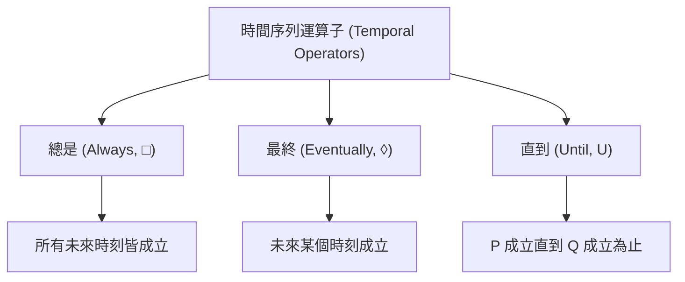

# 第 4 章：屬性規範（二）(Property Specification 2)

本章延續屬性規範的主題，首先回顧並探討如何推導複合指標中的權重，接著深入介紹用於定義系統運行需求的邏輯規範 (Logical Specifications)，包含命題邏輯、一階邏輯、線性時序邏輯 (LTL)，最後介紹訊號時序邏輯 (STL) 及其強健性 (Robustness) 的概念與計算。

## 4.1 複合指標與權重推導 (Composite Metrics and Weight Elicitation)

在多目標最佳化中，系統經常面臨互相衝突的指標（如飛機防撞系統的碰撞率與警報率）。我們通常會尋找**帕雷托最佳 (Pareto Optimal)** 的設計，並透過複合指標（如加權總和法或目標距離法）來選擇最終設計。

### 成對比較與半空間 (Pairwise Queries and Half-spaces)
如何決定各指標的權重（例如 $w_1, w_2, w_3$，且 $\sum w_i = 1$）？與其直接詢問人類專家確切數值，更有效的方法是透過**成對比較 (Pairwise Queries)**。

當人類偏好選項 A 勝過 B 時，假設其內部決策基於加權總和，即 $\sum w_i A_i > \sum w_i B_i$。這個不等式在權重空間中形成了一個**半空間 (Half-space)**，將不可能的權重區域剔除。透過多次詢問，我們可以逐漸縮小可能權重的範圍，最終推導出人類的權重向量。

> [!NOTE]
> 如果人類的選擇出現矛盾（找不到滿足所有半空間的權重），我們可以放寬「完美理性」的假設，改以機率分佈來建模人類偏好（例如貝氏估計）。這也是從人類回饋中進行強化學習 (RLHF) 的基礎概念之一。

## 4.2 邏輯規範基礎 (Logical Specifications)

邏輯規範使用精確的數學公式來定義系統需求，其結果必定為真 (True) 或假 (False)。

### 命題邏輯 (Propositional Logic)
由不可再分割的**原子命題 (Atomic Propositions)** 與邏輯運算子組合而成：
* **非 (Not, $\neg$)**：相反值。
* **及 (And, $\land$)**：兩者皆真才為真。
* **或 (Or, $\lor$)**：任一為真即為真。
* **蘊含 (Implies, $\implies$)**：若 $P$ 則 $Q$。
* **若且唯若 (Bi-conditional, $\iff$)**：兩者真值相同才為真。

### 一階邏輯 (First Order Logic)
在命題邏輯的基礎上加入：
* **變數 (Variables)**：領域中的物件，例如系統狀態 $x$。
* **謂詞 (Predicates)**：評估變數的函數，例如 $P(x)$ 表示「狀態 $x$ 是安全的」。
* **量詞 (Quantifiers)**：
  * **全稱量詞 (Universal, $\forall$)**：「對於所有」，例如 $\forall x P(x)$。
  * **存在量詞 (Existential, $\exists$)**：「存在至少一個」，例如 $\exists x P(x)$。

## 4.3 時序邏輯 (Temporal Logic)

時序邏輯將一階邏輯擴展到時間序列上，對於序列決策系統至關重要。

### 線性時序邏輯 (Linear Temporal Logic, LTL)
LTL 用於定義離散狀態序列上的屬性。課程介紹了三個主要運算子：
1. **總是 (Always, $\square$)**：在未來所有時間步中皆必須為真。
2. **最終 (Eventually, $\lozenge$)**：在未來某個時間步必須為真。
3. **直到 (Until, $U$)**：$P \ U \ Q$ 表示 $Q$ 最終必須為真，且在此之前 $P$ 必須保持為真。

## 4.4 訊號時序邏輯 (Signal Temporal Logic, STL)

STL 將 LTL 延伸應用於連續的**實數值訊號 (Real-valued Signals)**。

* **時間區間 (Time Intervals)**：STL 允許在特定時間區間內定義屬性，例如「在 $a$ 到 $b$ 之間最終達成某條件」。
* **實數對應真值**：引入謂詞 $\mu_c(s_t) = s_t > c$，將實數狀態 $s_t$ 映射到布林值。例如，飛機相對高度大於 50 公尺。

### 強健性 (Robustness)
與單純的 True/False 不同，STL 引入了**強健性**來量化我們滿足規範的程度。

* **強健性 > 0**：代表系統成功滿足規範。數值越大代表越安全（距離邊界越遠）。
* **強健性 < 0**：代表系統失敗。數值越小代表偏離規範越嚴重。

針對各種運算子，強健性的計算方式如下：
* **基本謂詞 $s_t > c$**：$s_t - c$
* **非 ($\neg P$)**：$- \text{Robustness}(P)$
* **及 ($P \land Q$)**：$\min(\text{Robustness}(P), \text{Robustness}(Q))$
* **或 ($P \lor Q$)**：$\max(\text{Robustness}(P), \text{Robustness}(Q))$
* **總是 ($\square P$)**：取所有時間步的最小值。
* **最終 ($\lozenge P$)**：取所有時間步的最大值。

## 4.5 平滑強健性 (Smooth Robustness)

在後續的系統最佳化中，我們需要計算強健性對系統狀態的**梯度 (Gradient)**。然而，傳統的 min 與 max 函數在大多數區間梯度為零（僅在極值點有作用），這對於依賴梯度的最佳化演算法非常不利。

為了解決這個問題，我們引入了**平滑強健性 (Smooth Robustness)**，將 min 與 max 替換為可微的 **soft-min** 與 **soft-max** 函數。
* 這些函數包含一個參數 $w$（課程的 Julia 實作中有互動式展示），用來控制平滑的程度。
* 當 $w \to 0$ 時，函數趨近於平均值。
* 當 $w \to \infty$ 時，函數趨近於真實的極值 (True min/max)。

> [!TIP]
> 藉由使用平滑強健性，我們能夠順利計算梯度，進而在後續的驗證與測試中自動尋找系統的失效邊界 (Failure cases)。

## 4.6 本章小結

- 複合指標的權重不必憑空指定：透過**成對比較**，每一次人類偏好都會在權重空間中切出一個**半空間**，逐步收斂出權重向量；偏好矛盾時可改以機率模型（如貝氏估計）描述。
- **邏輯規範**以命題邏輯、一階邏輯（變數、謂詞、量詞）精確定義系統需求，結果必為真或假。
- **線性時序邏輯 (LTL)** 以「總是 ($\square$)」「最終 ($\lozenge$)」「直到 ($U$)」三個運算子把邏輯延伸到時間序列上。
- **訊號時序邏輯 (STL)** 進一步處理連續實數值訊號，並以**強健性**量化規範被滿足或違反的程度：正值代表安全裕度，負值代表失效嚴重度。
- **平滑強健性**以可微的 soft-min／soft-max 取代 min／max，使強健性對系統狀態的梯度可以計算。

平滑強健性讓「違反規範的程度」成為一個可微分的量——這正是下一章（第 5 章：基於最佳化的否證）的目標函數基礎：把「找出系統失效」化為對強健性做最佳化的問題。
