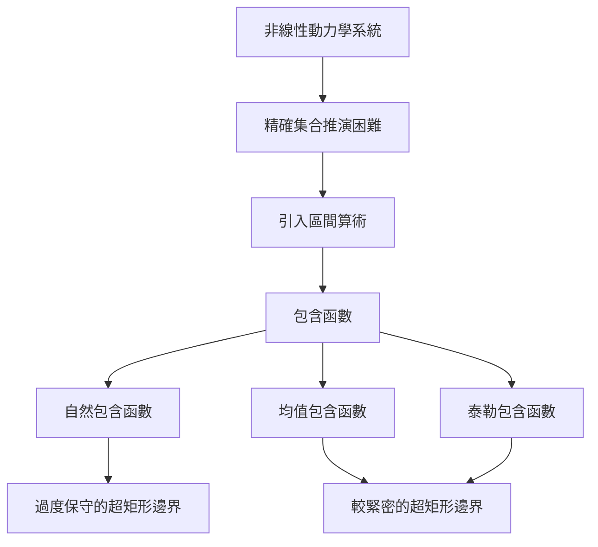

# 第七章：非線性系統的可達性分析 (Reachability for Nonlinear Systems)

## 1. 簡介與前情提要

在先前的章節中，我們探討了線性系統的可達性分析。我們發現，隨著推演時間步的增加，多邊形 (Polytopes) 的頂點數量會呈指數級增長。為了解決這個問題，我們可以採用 **過度近似 (Over-approximation)** 的技巧。

- **安全保證**：如果過度近似的可達集沒有與避障集 (Avoid Set) 相交，我們就能保證系統的安全性；反之，若兩者相交，則結果為不確定 (Inconclusive)，因為真正的可達集可能並沒有碰到避障集。
- **支撐向量 (Support Vectors)**：這是一種用來尋找過度近似邊界的數學工具。給定一個方向，支撐向量可以找到使內積最大化的點，相當於將一個垂直於該方向的平面推向集合，直到剛好碰到集合的邊界。多個方向的半空間交集便能形成一個邊界多面體 (Bounding Polytope)。
- **最佳化方法**：除了使用集合推演，我們也可以直接將可達性分析建構為一個線性規劃 (Linear Programming, LP) 問題，並利用凸最佳化求解器 (例如 Julia 中的 Convex.jl 或 JuMP.jl) 來找出系統的安全邊界。

## 2. 非線性系統的挑戰

在現實世界中，多數系統的動力學模型是非線性的 (例如包含三角函數的倒立擺)。當我們將非線性操作應用於多邊形時，輸出的集合通常不再是多邊形，甚至可能變成 **非凸集合 (Non-convex sets)**。這使得精確的集合推演在計算上變得極為困難且難以追蹤。

為了克服這點，我們採取的策略是：**用簡單的多邊形 (尤其是超矩形) 來過度近似那些非線性映射的複雜集合**。

## 3. 區間算術 (Interval Arithmetic)

處理非線性問題的第一步是引入 **區間 (Intervals)** 的概念。我們不再追蹤單一的狀態點，而是追蹤一個區間 $X = [\underline{x}, \overline{x}]$，其中 $\underline{x}$ 是下界，$\overline{x}$ 是上界。

- **區間盒 (Interval Box) / 超矩形 (Hyperrectangle)**：在多維空間中，多個一維區間的笛卡爾乘積便形成了一個超矩形。
- **區間對應運算 (Interval Counterparts)**：
  - 我們可以將傳統的加減乘除推廣到區間。例如加法為：$X + Y = [\underline{x} + \underline{y}, \overline{x} + \overline{y}]$。
  - 對於基本函數 (如 $\sin(x)$ 或 $x^2$)，區間對應運算會回傳一個最緊密的區間，確保該區間包含了輸入區間內所有點經過函數映射後的結果。
  - 在 Julia 中，可以輕易地透過 `IntervalArithmetic.jl` 套件來實作這些運算。

## 4. 包含函數 (Inclusion Functions)

對於複雜的非線性動力學函數，我們往往無法直接算出精確的區間對應運算。因此，我們退而求其次，尋找 **包含函數 (Inclusion Functions)**——它必定會給出一個涵蓋精確區間對應的「過度近似區間」。

### 4.1 自然包含函數 (Natural Inclusion Function)
最直觀的做法是直接將方程式中的每一個變數替換為區間，並應用對應的區間運算。然而，這種方法會遭遇嚴重的 **相依性效應 (Dependency Effect)**。
舉例來說，在函數 $f(x) = x - \sin(x)$ 中，同一個變數 $x$ 出現了兩次。在區間運算中，這兩個 $x$ 會被當作彼此獨立的區間來處理，這會產生許多實際上不可能發生的數值組合，導致最終計算出的區間變得極度保守 (過大)，進而失去實用價值。

### 4.2 均值包含函數 (Mean Value Inclusion Function)
為了解決相依性效應，我們引入了微積分中的 **均值定理 (Mean Value Theorem)**。
其核心思想是取區間的中心點 $c$，並透過函數在該點的值 $f(c)$，加上函數梯度的區間對應運算，來推估整體的邊界：
$$F(X) = f(c) + \nabla f(X) \cdot (X - c)$$
這種方法等同於對函數進行了**一階泰勒展開 (First-order Taylor approximation)**。由於它在形式上更接近線性函數，因此大幅減輕了相依性效應，能給出緊密許多的區間邊界。

### 4.3 泰勒包含函數 (Taylor Inclusion Function)
順著均值包含函數的思路，我們可以將其推廣到更高階的泰勒級數。自然包含函數相當於零階展開，均值包含函數相當於一階展開；若採用二階或三階泰勒包含函數，通常可以在非線性較強的區域獲得更精準的近似邊界。

## 5. 限制與未來方向

雖然包含函數讓非線性系統的可達性分析成為可能，但它仍有兩大限制：
1. **誤差累積**：隨著推演時間步數增加，非線性效應會像滾雪球般疊加，導致區間爆炸性成長，最終依然無法給出有意義的安全保證。
2. **形狀限制**：區間算術的本質決定了我們只能用「軸對齊的超矩形」來包覆可達集。當真實的可達集形狀為傾斜或不規則時，超矩形會帶來巨大的過度近似誤差。

為了解決這些問題，後續的章節將介紹一種能表示更複雜幾何形狀的強大工具：**泰勒模型 (Taylor Models)**。
