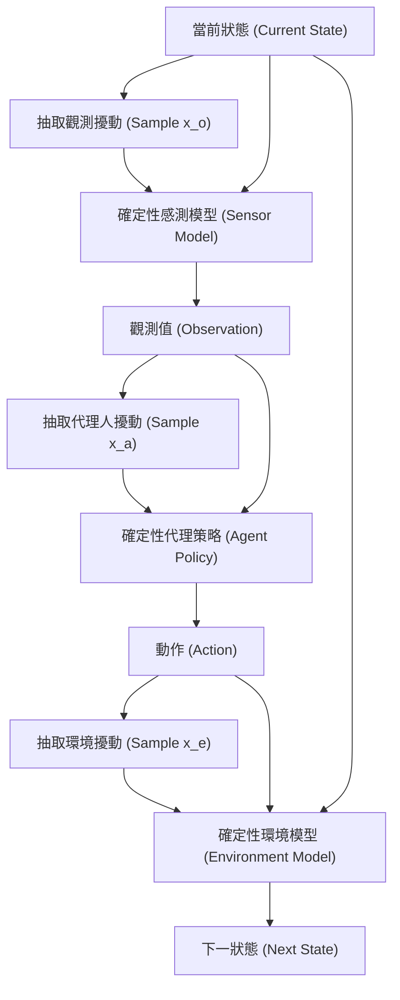

# 第八章：最佳化與偽證 (Falsification through Optimization)

## 8.1 簡介

在前面的章節中，我們已經討論了如何為系統建立模型，以及如何定義系統的屬性與安全規範。本章我們將正式進入驗證演算法（Validation Algorithms）的領域，目標是檢查系統是否滿足這些規範。我們首先探討的核心技術是**偽證（Falsification）**，也就是在模擬環境中主動尋找系統違反安全屬性的情境（亦即系統失效）。

為什麼我們需要進行偽證？
在將系統部署到真實世界之前，我們希望能在模擬中盡早發現各種失效模式，以便做出以下因應決策：
- **改進硬體或感測器**：若失效源於感知誤差過大，可能需要更精確的感測器。
- **更新代理人策略**：若代理人的行為不符預期，可進一步修改決策模型。
- **修改系統需求**：有時失效是因為原本的規範設定不切實際。
- **培訓操作員**：讓人類操作員了解潛在的失效風險，以便在必要時介入。
- **接受限制或放棄專案**：若系統無法滿足關鍵的安全規範，我們可能必須接受其風險限制，甚至中止專案。

## 8.2 直接偽證法 (Direct Falsification)

尋找失效最直覺的方法是**直接抽樣（Direct Sampling）**，又稱為直接偽證法。演算法的基本概念是：給定軌跡長度與抽樣次數 $m$，我們讓系統在模擬環境中執行 $m$ 次隨機推演（Rollouts），並使用訊號時序邏輯（Signal Temporal Logic, STL）檢查每條軌跡是否發生了失效。

直接偽證法的問題在於，對於具備極低失效率（Rare Failure Events）的系統，這種作法效率極差。假設某個系統發生失效的機率為 $P_{fail}$，我們需要模擬多少次才能找到一次失效？這是一個幾何分佈（Geometric Distribution）問題。在幾何分佈中，首次觀察到失效所需的期望抽樣次數為 $1 / P_{fail}$。

以航空防撞系統（ACAS）為例，其設計的失效機率可能在 $10^{-9}$ 的數量級。這意味著我們平均需要進行十億次模擬才能找到**一次**失效。因此，我們必須尋求更有效率的偽證方法。

## 8.3 擾動與軌跡分佈 (Disturbances)

為了更有系統地搜尋失效，我們需要將「隨機性」從系統中獨立出來，並掌握其控制權。為此，我們引入了**擾動（Disturbances）**的概念。我們將系統的三個主要元件（感測器、代理人、環境）拆分為「確定性（Deterministic）」與「隨機性（Stochastic）」兩個部分。

以倒立擺（Inverted Pendulum）的感測器模型為例，原本的感測模型可能是直接從一個常態分佈中抽取觀測值。改寫後，我們將其分離：
1. **確定性函數**：$o = s_{true} + x_o$
2. **擾動分佈**：$x_o \sim \mathcal{N}(0, \Sigma)$

在這裡，$x_o$ 就是所謂的觀測擾動。代理人與環境也可以作相同的改寫，分別得到代理人擾動 $x_a$ 與環境擾動 $x_e$。在程式實作上，我們會將這三者打包成一個單一的干擾向量 $x = (x_a, x_e, x_o)$。

### 單步推演與擾動

透過引入擾動，系統在單一時間步長內的推演過程可以表示為以下流程：

這套方法本質上是一種**簿記（Bookkeeping）**機制，雖然看起來較為繁瑣，但它讓我們能夠精確定義**軌跡分佈（Trajectory Distribution）**。軌跡分佈包含了初始狀態的分佈、每個時間步長的擾動分佈，以及軌跡長度。代表真實世界預期行為的分佈，我們稱為**標稱軌跡分佈（Nominal Trajectory Distribution）**。

## 8.4 模糊測試 (Fuzzing)

既然標稱分佈下的失效事件過於罕見，一個簡單的改進方法是使用**模糊測試（Fuzzing）**。在模糊測試中，我們不從標稱軌跡分佈抽樣，而是從一個故意放大雜訊的「模糊分佈（Fuzzing Distribution）」中抽樣。

例如，我們可以人為地增加感測器的感知誤差變異數。如此一來，系統收到極端觀測值的機率增加，我們也就更容易在少量的模擬中觀察到系統失效。模糊測試是一種非常適合做為專案基準（Baseline）的方法。

然而，模糊測試有一個重要的陷阱：我們可能會找到在真實世界中根本不切實際（極度不可能發生）的失效。因此，**我們雖然從模糊分佈中尋找失效，但仍必須根據「標稱軌跡分佈」來評估這些失效發生的概似度（Likelihood）**。找出極度罕見的失效對系統設計的幫助往往有限，我們真正關心的是那些「相對可能發生」的失效情境。

## 8.5 透過最佳化尋找失效 (Falsification through Optimization)

為了解決隨機抽樣的效率問題，我們可將偽證轉化為一個最佳化問題。在我們將隨機性獨立成擾動序列後，一條軌跡的產生變得完全確定（Deterministic）。只要決定了初始狀態 $s$ 與各時間步長的擾動序列 $\mathbf{x} = (x_1, x_2, \dots, x_T)$，軌跡 $\tau$ 就唯一確定。

因此，我們可以將 $s$ 和 $\mathbf{x}$ 視作**決策變數（Decision Variables）**，透過最佳化演算法來尋找會導致失效的數值：

$$
\begin{aligned}
\min_{s, \mathbf{x}} \quad & f(\tau) \\
\text{s.t.} \quad & \tau = \text{Rollout}(s, \mathbf{x})
\end{aligned}
$$

其中，目標函數 $f(\tau)$ 代表了「接近失效的程度（Closeness to Failure）」。我們在先前章節學過的 **平滑強健性（Smooth Robustness）** 指標正是此目標函數的絕佳選擇。當強健性小於零，即代表系統違反了安全規範（發生失效）。

### 面臨的挑戰

這是一個高維度（可能高達數百維）的搜尋空間，但現代的最佳化工具已具備處理這類問題的能力。不過，若單純只最小化強健性，最佳化演算法可能會「走火入魔」，找出那些強健性極度負向、但擾動極端不合理的軌跡（例如感測器出現天文數字般的誤差）。

為了避免找到這些不切實際的失效軌跡，我們在建立最佳化目標函數時，必須將**概似度（Likelihood）**或機率考量納入其中。具體的處理方法與進階的最佳化技巧，我們將在後續的章節進一步探討。
