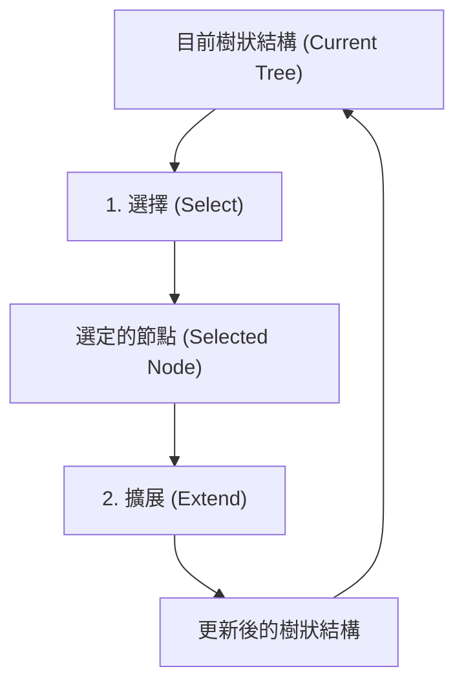
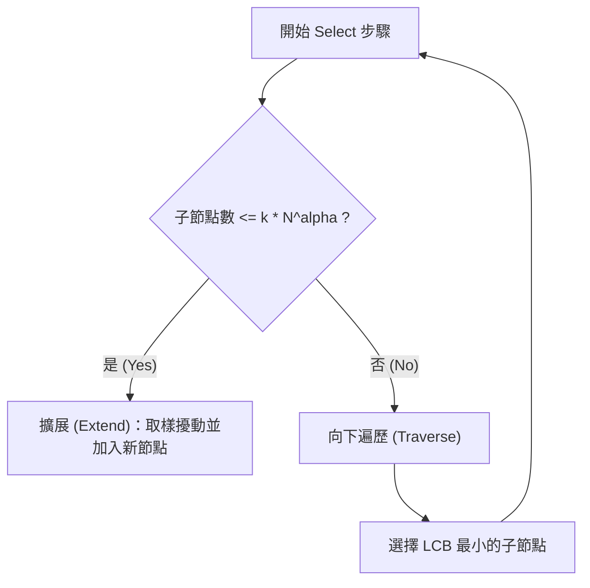

# 第九章：基於規劃的錯誤尋找 (Falsification through Planning)

在上一章中，我們探討了如何將尋找系統錯誤 (Falsification) 轉換為一個最佳化問題。然而，單純將「強健度 (Robustness)」最小化，往往會導致系統找到那些在現實中極不可能發生的邊緣失效情況。本章將介紹如何尋找**高機率的失效 (Likely Failures)**，並引入**樹狀搜尋 (Tree Search)** 與規劃演算法，透過逐步建立軌跡的方式來解決高維度空間搜尋的挑戰。

## 尋找高機率的失效

為了確保找到的錯誤是具有現實意義的，我們需要在目標函數中加入軌跡的「可能性 (Likelihood)」。一條軌跡的可能性是由初始狀態的機率，以及後續每一步擾動 (Disturbance) 的機率相乘而來。在實作上，為了避免連續相乘導致數值下溢 (Numerical Underflow)，我們通常採用**對數機率密度 (Log PDF)** 並將其相加。

在最佳化時，我們可以將目標函數設計為兩者的權衡：
1. **若軌跡尚未失效**：最小化強健度 (朝失效邊界靠近)。
2. **若軌跡已失效**：最小化負對數機率 (Negative Log-Likelihood)，使該軌跡變得更可能發生。

實務上，我們常使用一個權重參數 $\lambda$ 來平衡強健度與對數機率。

### 最佳化演算法的選擇

在處理這個最佳化問題時，常見的演算法分為兩類：
- **局部下降法 (Local Descent Methods)**：如梯度下降法 (Gradient Descent)、Adam 等。這類方法需要依賴梯度，因此必須了解系統的內部動態 (White-box)。
- **零階方法 (Zero-order/Direct Methods)**：如 Hooke-Jeeves 或 Nelder-Mead。這類方法僅透過函數求值即可進行最佳化，非常適合用於無法取得梯度的黑箱 (Black-box) 系統。

此外，**群體方法 (Population Methods)** 透過同時維護多個樣本，能有效避免落入局部最佳解，並有助於發掘多種不同的失效模式。

## 樹狀搜尋框架 (Tree Search Framework)

將整條軌跡的所有擾動視為一個高維度變數進行最佳化，搜尋空間將會呈指數級別成長（例如 40 步的軌跡可能會有超過 80 維的變數）。我們在此引入**規劃 (Planning)** 的概念，將這個大問題拆解，一步一步建立軌跡。

所有的樹狀搜尋演算法都可以被歸納為兩個核心步驟的循環：

1. **選擇 (Select)**：根據特定策略，從現有的樹狀結構中挑選出一個節點進行探索。
2. **擴展 (Extend)**：從該節點取樣一個擾動，進行系統狀態轉移，並將新的子節點加入樹中。

## 啟發式搜尋 (Heuristic Search)

**快速探索隨機樹 (Rapidly Exploring Random Trees, RRT)** 是一種常見的啟發式搜尋方法。在其基本形式中：
1. 取樣一個隨機的目標狀態。
2. 計算樹中所有節點與該目標狀態的距離，**選擇 (Select)** 距離最近的節點。
3. 取樣一個擾動來**擴展 (Extend)** 該節點。

為了更有效率地尋找錯誤，我們可以進行兩項改進：
1. **目標限制**：只從系統的「失效區域 (Failure Region)」中取樣目標狀態。
2. **擾動最佳化**：取樣多個擾動，並挑選能使狀態最靠近目標的擾動進行擴展。

### A* 搜尋與替代目標

若我們希望能找到**最短路徑失效**或**最高機率失效**，我們可以在選擇節點時引入成本函數：

$$ \text{成本} = \text{目前累積成本 (Current Cost)} + \text{預估剩餘成本 (Cost to go)} $$

預估剩餘成本通常由一個**啟發式函數 (Heuristic Function, $h$)** 提供（例如兩點之間的直線距離）。如果狀態與擾動空間是離散的，且該啟發式函數是**可容許的 (Admissible)**（即永遠不會高估實際成本），此演算法便等同於 **A* 搜尋**，且保證能找到最佳路徑。

## 蒙地卡羅樹狀搜尋 (Monte Carlo Tree Search, MCTS)

MCTS 是一種透過明確平衡**探索 (Exploration)** 與**利用 (Exploitation)** 來引導搜尋的演算法。在 MCTS 中，樹的每個節點都會維護兩個數值：
- $N$：該節點被訪問的次數。
- $Q$：該節點的價值估計（在我們的問題中，$Q$ 越低代表越接近失效）。

### 連續空間的漸進式擴展 (Progressive Widening)

由於我們的擾動空間往往是連續的（這表示同一節點理論上可以有無限多個子節點），我們需要使用**漸進式擴展**來控制樹的寬度。

### 信心下界 (Lower Confidence Bound, LCB)

當節點子節點過多時，我們會計算每個子節點的 LCB 進行向下遍歷：

$$ \text{LCB} = Q_{child} + c \sqrt{\frac{\ln N}{N_{child}}} $$

- **利用 (Exploitation)**：傾向選擇 $Q_{child}$ 較低的子節點（已知表現好）。
- **探索 (Exploration)**：傾向選擇 $N_{child}$ 較小的子節點（尚未充分探索）。

當我們最終擴展了一個新節點，我們會使用隨機推演 (Rollout) 等方法來初始化其 $Q$ 值，並將這個新的價值與訪問次數 $N$ 沿著樹往回**傳播 (Propagate)**，藉此更新整棵樹的價值預估。這種機制確保了 MCTS 能夠在龐大且連續的搜尋空間中，有效且穩健地找到高機率的系統失效軌跡。
