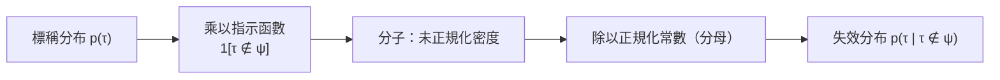
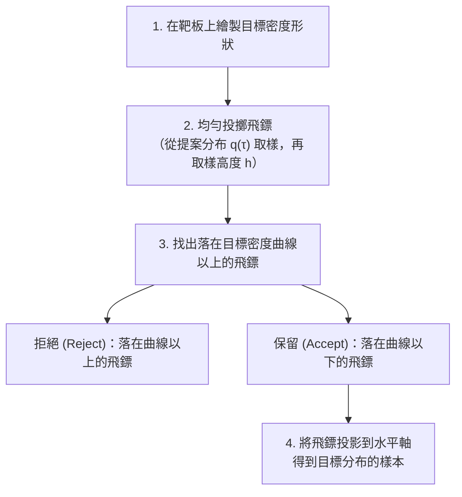
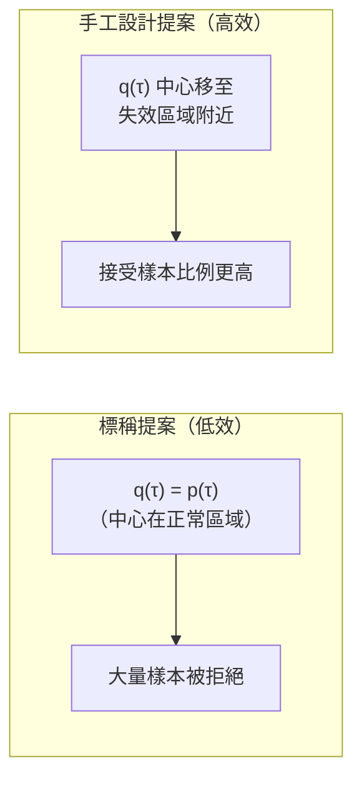
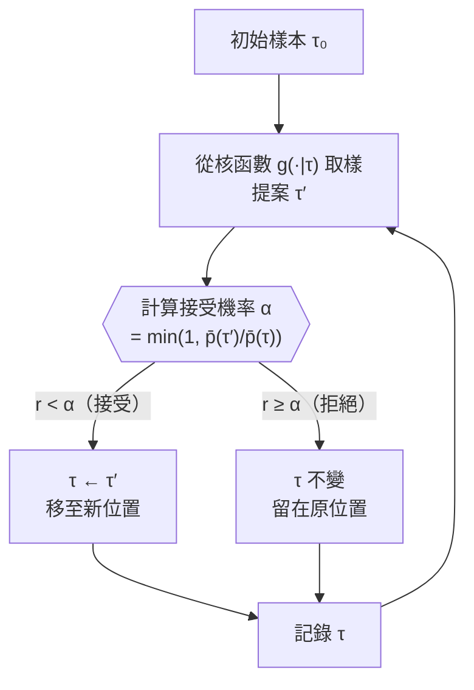
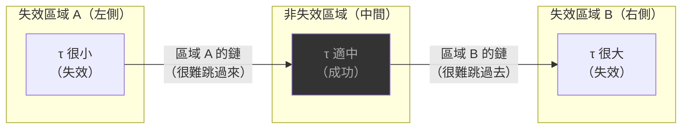
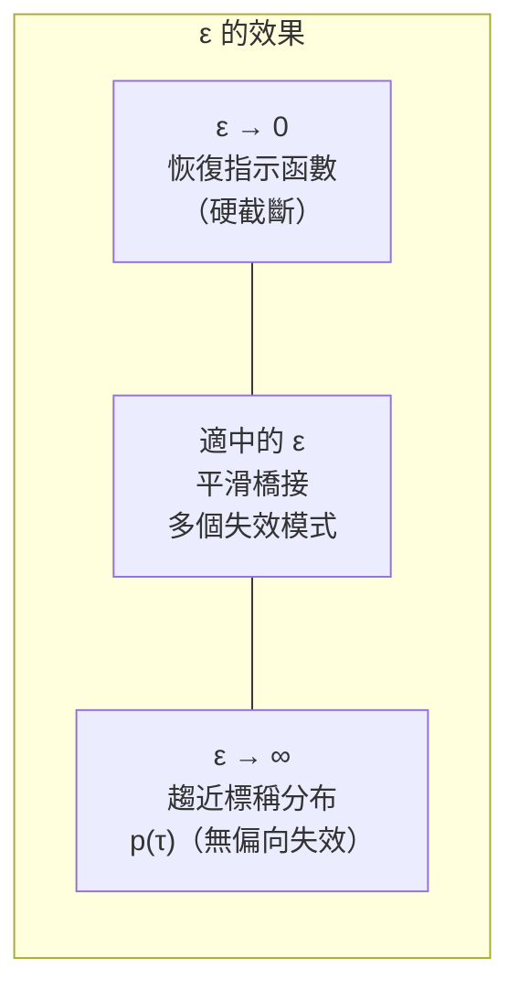
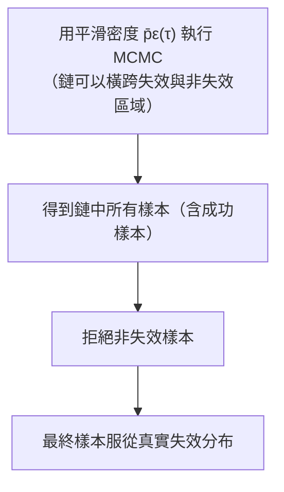

# 第十章：失效分布 (Failure Distribution)

在前幾章中，我們探討了**錯誤尋找 (Falsification)**——也就是如何找到系統的**一個**失效案例，也許是最可能發生的失效。然而，有時候我們想要的不僅僅是一個失效範例，而是全面了解「所有可能的失效樣貌」。本章將介紹如何從**完整的失效分布**中取樣，讓我們能夠回答：「系統失效時，究竟會呈現哪些不同的行為模式？」

---

## 失效分布的數學定義

### 標稱軌跡分布

我們用 $p(\tau)$ 表示系統在正常（標稱）操作條件下產生軌跡 $\tau$ 的機率密度，稱為**標稱軌跡分布 (Nominal Trajectory Distribution)**。

### 失效分布 (Failure Distribution)

**失效分布**是在已知軌跡為失效的前提下，軌跡的條件機率：

$$
p(\tau \mid \tau \notin \psi) = \frac{\mathbf{1}[\tau \notin \psi]\, p(\tau)}{\int \mathbf{1}[\tau \notin \psi]\, p(\tau)\, d\tau}
$$

其中 $\mathbf{1}[\tau \notin \psi]$ 是**指示函數 (Indicator Function)**，當軌跡 $\tau$ 為失效時返回 1，否則返回 0，而 $\psi$ 是系統的安全規格。



### 分子與分母的角色

| 部分 | 數學形式 | 意義 |
|------|----------|------|
| 分子 | $\mathbf{1}[\tau \notin \psi]\, p(\tau)$ | 決定分布的**形狀**：失效軌跡保留其標稱機率，非失效軌跡機率設為零 |
| 分母 | $\int \mathbf{1}[\tau \notin \psi]\, p(\tau)\, d\tau$ | **正規化常數**，使積分等於 1；等同於**失效機率** $p_{\text{fail}}$ |

> **核心挑戰**：分母（正規化常數）在大多數實際系統中**難以計算甚至無法計算**。估計它等同於估計失效機率，這本身就是下一章的主題。

---

## 未正規化機率密度

雖然我們無法輕易計算正規化常數，但我們可以計算**未正規化失效密度 (Unnormalized Failure Density)**：

$$
\bar{p}(\tau) = \mathbf{1}[\tau \notin \psi]\, p(\tau)
$$

對任意給定的 $\tau$，我們都能計算 $\bar{p}(\tau)$：

1. 檢查 $\tau$ 是否為失效（計算指示函數）
2. 計算 $\tau$ 在標稱分布下的似然度 $p(\tau)$

關鍵洞見：未正規化密度已足以讓我們**從分布中取樣**！接下來介紹兩種方法。

---

## 拒絕取樣法 (Rejection Sampling)

### 飛鏢靶板類比

拒絕取樣可以用飛鏢靶板來直觀理解：



**直觀解釋**：

- 在目標密度較高的區域，落在曲線以下的飛鏢比例較高 → 該區域被取樣的頻率也更高。
- 在目標密度較低的區域，大多數飛鏢被拒絕 → 該區域被取樣的頻率也更低。
- 最終保留的飛鏢位置，即服從目標密度分布。

### 演算法

**前提**：需選定提案分布 $q(\tau)$ 及常數 $c$，使得對所有 $\tau$：

$$c \cdot q(\tau) \geq \bar{p}(\tau)$$

```
演算法：拒絕取樣
輸入：目標密度 p̄, 提案分布 q, 常數 c, 樣本數 N
輸出：近似服從目標分布的樣本集合

samples = []
while |samples| < N:
    τ ~ q(τ)           # 從提案分布取樣
    r ~ U[0, 1]        # 取樣均勻隨機數
    if r < p̄(τ) / (c·q(τ)):
        samples.append(τ)  # 接受
    # 否則拒絕，繼續
```

### 應用於失效分布

**最簡單的選擇**：以標稱分布作為提案分布，$q(\tau) = p(\tau)$，$c = 1$。

此時接受條件化簡為：

$$r < \frac{\bar{p}(\tau)}{c \cdot q(\tau)} = \frac{\mathbf{1}[\tau \notin \psi]\, p(\tau)}{p(\tau)} = \mathbf{1}[\tau \notin \psi]$$

**結論**：以機率 1 接受失效軌跡，以機率 0 接受成功軌跡。等同於：

> **從標稱分布取樣，保留失效軌跡，丟棄成功軌跡。**

這正是之前介紹過的直接蒙地卡羅基準方法。

### 效率問題與手工設計提案分布

**問題**：若失效事件極為罕見，幾乎所有樣本都被拒絕，效率極差。

**解決方案**：將提案分布的均值移向失效區域附近，並盡量縮小 $c$（但不違反覆蓋條件）。



### 拒絕取樣的挑戰

1. **難以設計合適的提案分布**：在高維度系統（如單擺）中，往往無法直觀找到好的 $q(\tau)$。
2. **難以選定合適的 $c$**：若 $c$ 太大，大量樣本被拒絕；若 $c$ 太小，則違反覆蓋條件，得到錯誤的分布。
3. **高維度下極度低效**：詳見教科書 §6.1 的單擺範例。

---

## 馬可夫鏈蒙地卡羅 (Markov Chain Monte Carlo, MCMC)

### 核心思想

與拒絕取樣不同，MCMC 不產生獨立樣本，而是維護一條**馬可夫鏈 (Markov Chain)**：

$$\tau_0 \to \tau_1 \to \tau_2 \to \cdots \to \tau_k$$

每個樣本 $\tau_{k+1}$ 依賴於前一個樣本 $\tau_k$。在無限多個樣本的極限下，鏈中樣本的分布收斂到目標分布。

### Metropolis-Hastings 演算法



**演算法步驟**：

```
演算法：Metropolis-Hastings（對稱核函數版本）
τ ← τ_init
for k = 1..k_max:
    τ′ ~ g(·|τ)        # 從核函數（如以 τ 為中心的高斯分布）取樣
    α = min(1, p̄(τ′) / p̄(τ))
    if rand() < α:
        τ ← τ′          # 接受
    # 否則保持 τ 不變
    記錄 τ
```

> **注意**：當核函數是對稱的（即 $g(\tau \mid \tau') = g(\tau' \mid \tau)$，如高斯核），接受機率化簡為 $\alpha = \min(1, \bar{p}(\tau')/\bar{p}(\tau))$。

### 接受規則的直觀理解

| 情況 | 接受機率 | 解釋 |
|------|----------|------|
| $\bar{p}(\tau') > \bar{p}(\tau)$ | $\alpha = 1$（必然接受） | 新樣本**更可能**來自目標分布，必然接受 |
| $\bar{p}(\tau') < \bar{p}(\tau)$ | $\alpha = \bar{p}(\tau')/\bar{p}(\tau) < 1$ | 新樣本較不可能，但仍有一定機率接受（探索低密度區域） |
| $\bar{p}(\tau') = 0$ | $\alpha = 0$（必然拒絕） | 新樣本完全不在目標分布中，直接拒絕 |

這個規則確保了：採樣頻率在高密度區域更高，但也會偶爾探索低密度區域——最終整條鏈的樣本分布收斂至目標分布。

### 實用技巧

#### 預熱捨棄 (Burn-in)

鏈的初始樣本受起始點影響，可能不具代表性。標準做法是**捨棄前 $m_{\text{burnin}}$ 個樣本**。


#### 稀釋 (Thinning)

由於鏈中相鄰樣本具有**自相關性**，每隔 $m_{\text{skip}}$ 步才保留一個樣本，可減少樣本間的相關性。

#### Julia 實作（來自 `failure_dist.jl`）

```julia
struct MCMCSampling
    p̄        # 目標（未正規化）密度
    g        # 核函數：τ′ = rollout(sys, g(τ))
    τ        # 初始軌跡
    k_max    # 最大迭代次數
    m_burnin # 預熱捨棄樣本數
    m_skip   # 稀釋間隔
end

function sample_failures(alg::MCMCSampling, sys, ψ)
    p̄, g, τ = alg.p̄, alg.g, alg.τ
    τs = [τ]
    for k in 1:alg.k_max
        τ′ = rollout(sys, g(τ))
        if rand() < (p̄(τ′) * pdf(g(τ′), τ)) / (p̄(τ) * pdf(g(τ), τ′))
            τ = τ′
        end
        push!(τs, τ)
    end
    return τs[alg.m_burnin:alg.m_skip:end]
end
```

---

## 多重失效模式問題

當系統存在**多個不連通的失效區域**（如「太高」和「太低」都是失效），MCMC 容易被困在單一失效模式中，無法跳躍到另一個失效模式。



**根本原因**：局部高斯核函數的步長有限，難以跨越中間的非失效區域（機率密度為零），在有限次迭代內幾乎不可能自然跳躍到另一個模式。

---

## 平滑化技術 (Smoothing)

### 動機

為了幫助馬可夫鏈在不同失效模式之間移動，我們用**平滑密度**取代硬截斷的指示函數，讓非失效但接近失效的軌跡也有非零的密度值。

### 距離函數

定義失效距離函數：

$$\Delta(\tau) = \max(\rho(\tau),\, 0)$$

其中 $\rho(\tau)$ 是軌跡的**強健度值 (Robustness)**。

- $\Delta(\tau) = 0$：軌跡為失效（強健度 $\leq 0$）
- $\Delta(\tau) > 0$：軌跡為成功，值越大距離失效邊界越遠

### 平滑化未正規化密度

$$
\bar{p}_\epsilon(\tau) = \mathcal{N}\!\left(\Delta(\tau);\; 0,\; \epsilon^2\right) \cdot p(\tau)
$$



### 平滑化 MCMC 的兩步流程



**等價理解**：此流程等同於以平滑 MCMC 鏈為提案分布的**拒絕取樣**。

### Julia 實作

```julia
# 平滑化未正規化密度
p̄s = τ -> pdf(Normal(0, ϵ), max(robustness([step.s for step in τ], ψ.formula), 0)) * pdf(p, τ)

# 用平滑密度執行 MCMC，再拒絕非失效樣本
algs = MCMCSampling(p̄s, simple_gaussian_kernel, τ_initial, k_max, m_burnin, m_skip)
τs_smooth, _ = sample_failures(algs, sys, ψ)
# 保留失效樣本
failures = filter(τ -> isfailure(ψ, τ), τs_smooth)
```

---

## 方法總覽與比較

| 方法 | 提案/核函數 | 接受條件 | 優點 | 挑戰 |
|------|------------|----------|------|------|
| **直接蒙地卡羅** | $q = p$（標稱分布） | 軌跡為失效 | 實作簡單 | 稀有失效時極度低效 |
| **拒絕取樣（手工設計）** | $q$ 靠近失效區域 | 機率性接受 | 效率更高 | 難以在高維設計 $q$ 和選定 $c$ |
| **MCMC（MH 演算法）** | 馬可夫核函數 $g$ | MH 接受比 | 保證收斂；無需選 $c$ | 需要預熱捨棄與稀釋 |
| **MCMC + 平滑化** | 平滑密度 + 核函數 | MH 接受比 | 可處理多重失效模式 | 需要調整超參數 $\epsilon$ |

---

## 擴展到高維系統

以上討論皆以一維高斯為例說明直觀，但這些方法可以直接擴展至高維系統（如具有數十到上百維狀態空間的單擺系統）。

在高維度環境下，需要特別注意：
- **核函數的步長**：步長太大容易拒絕，步長太小混合速度慢。
- **$\epsilon$ 的選擇**：需要更仔細調整以有效橋接失效模式。
- **拒絕取樣的崩潰**：詳見教科書 §6.1，說明在高維度下為何拒絕取樣幾乎無法使用。

---

## 本章重點回顧

- **失效分布**是在已知軌跡為失效條件下的軌跡分布，其正規化常數難以計算。
- **未正規化失效密度**可以輕鬆計算，且足以讓我們取樣。
- **拒絕取樣**：用提案分布取樣，按比例接受——但對稀有失效效率低落。
- **MCMC（Metropolis-Hastings）**：維護馬可夫鏈，在無限樣本極限下收斂到目標分布；需要預熱捨棄與稀釋。
- **平滑化**：用距離函數替換硬指示函數，使 MCMC 能夠跨越多個失效模式。
