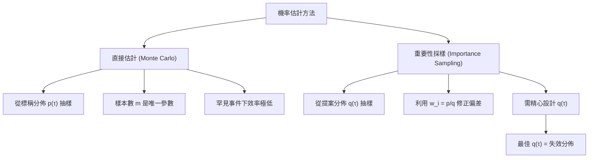

# Lecture 11: 重要性採樣 (Importance Sampling)

## 1. 核心概念 (Core Concepts)

在上一講中，我們討論了如何尋找與分析失效模式，但我們還有一個終極目標：**估計系統發生失效的機率 (Probability of Failure)**。

失效機率的數學定義為：
$$p_{\text{fail}} = \mathbb{E}_{p(\tau)}[\mathbf{1}[\tau \in \text{failure}]] = \int p(\tau)\,\mathbf{1}[\tau \in \text{failure}]\,d\tau$$

這個積分實際上就是**失效分佈 (Failure Distribution) 的正規化常數 (Normalizing Constant)**。由於狀態空間通常非常龐大且複雜，我們無法解析地計算這個積分。

### 直接估計法 (Direct Estimation / Monte Carlo)
最簡單的方法是從標稱分佈 (Nominal Distribution) $p(\tau)$ 中抽取 $m$ 個樣本，然後計算失效樣本的比例：
$$\hat{p}_{\text{fail}} = \frac{n_{\text{fail}}}{m}$$

從統計學的角度來看：
- 這是伯努利試驗 (Bernoulli Trial) 的**最大概似估計 (Maximum Likelihood Estimation, MLE)**。
- 它是**不偏估計 (Unbiased)** 且 **一致 (Consistent)** 的。
- **貝氏參數學習 (Bayesian Parameter Learning)**：我們也可以設定 Beta 先驗分佈 $\text{Beta}(\alpha, \beta)$，並獲得後驗分佈 $\text{Beta}(\alpha + n_{\text{fail}}, \beta + m - n_{\text{fail}})$。這讓我們能給出機率範圍（例如：95% 信心水準下的失效機率上限），而不是只在沒看到失效時回答 0。

**直接估計法的致命傷**：
在安全關鍵系統中，失效是罕見事件 (Rare Event)。如果 $p_{\text{fail}} \approx 10^{-9}$，我們可能需要模擬數十億次才能看到一次失效。這在計算上是不可行的。

---

## 2. 深入解析 (Deep Dive)：重要性採樣 (Importance Sampling)

為了解決罕見事件的抽樣問題，我們引入了**重要性採樣 (Importance Sampling, IS)**。

### "乘以一" 的戲法 (Multiply-by-One Trick)
我們引入一個新的提案分佈 (Proposal Distribution) $q(\tau)$，並對原積分進行數學代換：
$$p_{\text{fail}} = \int q(\tau) \left[ \frac{p(\tau)}{q(\tau)} \right] \mathbf{1}[\tau \in \text{failure}]\,d\tau = \mathbb{E}_{q(\tau)}\left[ \frac{p(\tau)}{q(\tau)} \mathbf{1}[\tau \in \text{failure}] \right]$$

### IS 估計式
基於上述推導，重要性採樣的估計式為：
$$\hat{p}_{\text{fail}} = \frac{1}{m} \sum_{i=1}^m w_i \cdot \mathbf{1}[\tau^{(i)} \in \text{failure}], \quad w_i = \frac{p(\tau^{(i)})}{q(\tau^{(i)})}$$

- 我們從 $q(\tau)$ 中抽取樣本 $\tau^{(i)}$。
- 每個樣本都會乘上一個**重要性權重 (Importance Weight) $w_i$**。
- 這個估計式依然是**不偏 (Unbiased)** 且 **一致 (Consistent)** 的。

### 直觀理解與最佳提案分佈
- 如果一個軌跡在原分佈 $p$ 中很常見，但在提案分佈 $q$ 中很罕見，$w_i$ 就會很大（給予該樣本更高的權重）。
- **最佳提案分佈**（使變異數為零的分佈）其實就是失效分佈本身：
  $$q^*(\tau) = \frac{p(\tau) \mathbf{1}[\tau \in \text{failure}]}{p_{\text{fail}}}$$
- 但是這需要知道 $p_{\text{fail}}$，而這正是我們想求的值！
- 因此，實務上的目標是：**找到一個盡可能接近失效分佈，且容易抽樣的提案分佈 $q(\tau)$**。

### 尋找提案分佈的步驟
1. 利用上一講介紹的 MCMC 等方法，先收集一批**失效樣本**。
2. 將這些失效樣本配適 (Fit) 到一個容易處理的分佈上（例如高斯分佈）。
3. 將這個配適後的分佈作為 $q(\tau)$ 來進行重要性採樣。

---

## 3. Julia 實作與範例 (Julia Implementation & Examples)

在 `failure_prob.jl` 中，我們可以看到如何實作重要性採樣。我們需要能計算 $p$ 和 $q$ 的機率密度函數 (PDF)。

```julia
struct ImportanceSamplingEstimation
    p  # 標稱軌跡分佈 (nominal distribution)
    q  # 提案分佈 (proposal distribution)
    m  # 樣本數
end

function estimate_hist(alg::ImportanceSamplingEstimation, sys, γ)
    p, q, m = alg.p, alg.q, alg.m
    samples = [rollout(sys, q) for i in 1:m]
    
    # 計算 PDF
    ps = [pdf(p, τ) for τ in samples]
    qs = [pdf(q, τ) for τ in samples]
    
    # 計算重要性權重 w_i
    ws = ps ./ qs                              
    
    # 回傳樣本、加權後的失效結果，以及權重
    return samples, ws .* [τ[1].s < γ for τ in samples], ws
end
```

利用 MCMC 失效樣本配適提案分佈：
```julia
# 利用 MCMC 取得失效樣本
τs_mcmc = sample_failures(MCMCSampling(...), sys, ψ)
𝐬 = [τ[1].s for τ in τs_mcmc]

# 配適高斯分佈 (Gaussian Distribution)
dist_fit = fit(Normal, 𝐬)                     
fit_proposal = SimpleGaussianTrajectoryDistribution(dist_fit.μ, dist_fit.σ)
```

---

## 4. 關鍵圖表與視覺化 (Key Diagrams & Visualizations)

### 估計方法比較 (Comparison of Estimation Methods)



---

## 5. 待釐清與外部連結 (Open Questions & References)

- **待確認的課程內容**：有效樣本數 (Effective Sample Size, ESS) 的計算。當重要性權重極度不均時，即使抽了很多樣本，真正有效的資訊量可能很低。
- **關聯 Notebook**：
  - `failure_prob.jl`（重要性採樣實作）
  - `smc.jl`（平滑化分佈與 MCMC 取樣）
