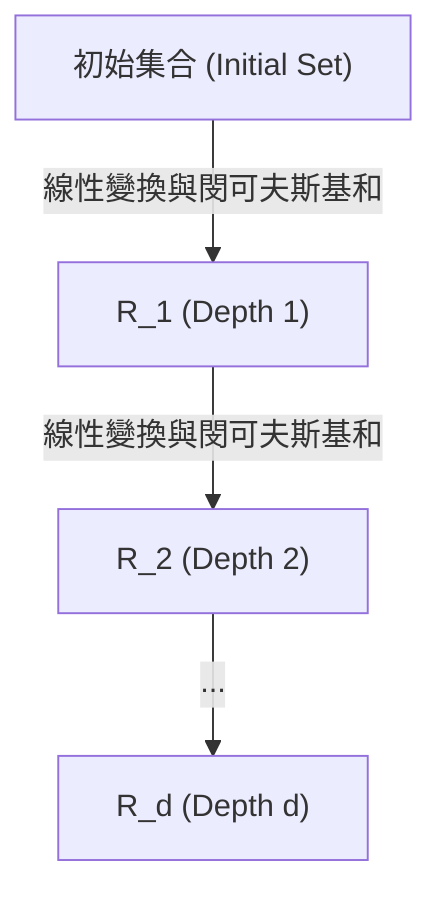
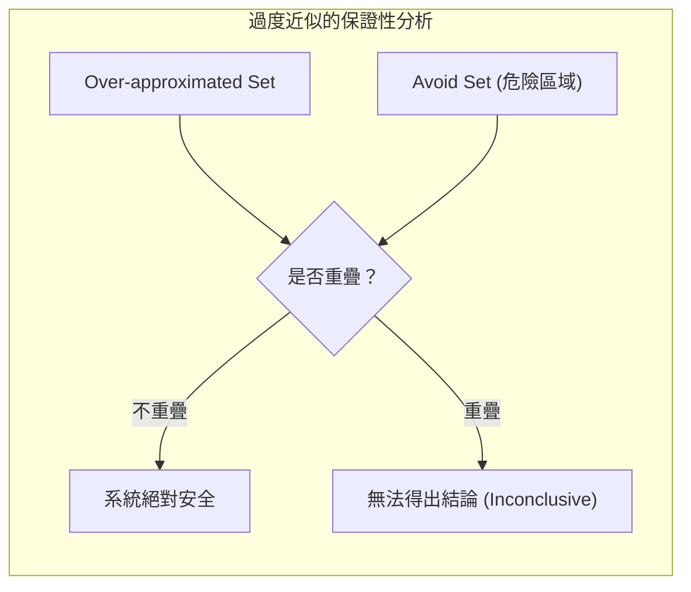

# 第 11 章：線性系統的可達性分析 (Reachability for Linear Systems)

在過去的章節（第 5–10 章）中，我們主要討論了失效分析（Failure Analysis）：從否證 (Falsification)（第 5–6 章）主動搜尋失效反例，到失效分佈（第 8 章）與以重要性採樣估計失效機率（第 9–10 章）。然而，這些方法雖然能幫助我們找到系統的問題，卻無法保證系統「絕對安全」。在本章中，我們將轉向**形式化方法 (Formal Methods)**，目標是在給定的假設下，證明系統**永遠不會失效**。我們將透過**可達性分析 (Reachability Analysis)** 來達成這個目標，並從最容易處理的線性系統開始。

## 11.1 基本概念與可達集合

可達性分析的核心思想是：給定系統的初始狀態與干擾的範圍，計算系統在未來每一個時間點可能到達的所有狀態集合。如果這些集合完全不包含任何「危險狀態」，我們就能保證系統的安全性。

### 前提假設
要獲得嚴格的保證，我們必須對系統作出明確的假設：
1. **初始狀態集合 (Initial Set)**：系統的初始狀態必須包含在一個有界的集合 $\mathcal{S}_0$ 中。
2. **干擾集合 (Disturbance Set)**：在每一個時間步長，系統所受到的感測雜訊或環境擾動必須包含在有界的集合中（例如 $\mathcal{X}_S$）。

如果我們原始的擾動是以機率分佈（例如高斯分佈）來描述，我們可以透過截斷分佈的尾部（例如取三個標準差內的範圍）將其轉換為有界集合，但這也意味著我們的安全保證僅在這個被截斷的假設下成立。

### 深度與時間範圍 (Depth and Horizon)
- **深度 $d$ 的可達集合 ($R_d$)**：系統從初始集合出發，經過 $d$ 個時間步長後，可能到達的所有狀態集合。
- **時間範圍 $1 \dots h$ 的可達集合 ($R_{1:h}$)**：將第 1 步到第 $h$ 步的所有可達集合取聯集：$R_{1:h} = \bigcup_{d=1}^h R_d$。

若我們定義了一個必須避免的危險狀態集合（Avoid Set），只要檢查 $R_{1:h} \cap \text{Avoid Set} = \emptyset$ 是否成立，便可保證系統在 $1 \dots h$ 步內是安全的。

### 不變集合 (Invariant Set) 與無限時間保證
一般情況下，可達性分析只能提供有限時間的保證。然而，如果在某個深度 $d$，我們發現 $R_d$ 完全包含在 $R_{d-1}$ 內（即 $R_d \subseteq R_{d-1}$），這表示從 $R_{d-1}$ 出發的所有狀態都會轉移到一個更小的集合內。由於這個更小的集合也在 $R_{d-1}$ 內，系統未來將永遠留在這個集合中。此時 $R_d$ 被稱為**不變集合 (Invariant Set)**，我們便獲得了無限時間的安全保證。

## 11.2 線性系統的集合傳遞技術 (Set Propagation Techniques)

對於線性系統，狀態的更新可以表示為矩陣乘法與向量加法。要計算可達集合，我們必須將這些對「單一點」的運算推廣到對「整個集合」的運算。

這需要兩種基本的集合運算：
1. **線性變換 (Linear Transformation)**：將矩陣 $A$ 乘上集合 $\mathcal{P}$。其結果是將 $\mathcal{P}$ 中所有點都乘上 $A$ 所形成的新集合。
2. **閔可夫斯基和 (Minkowski Sum)**：將集合 $\mathcal{P}$ 與集合 $\mathcal{Q}$ 相加，記為 $\mathcal{P} \oplus \mathcal{Q}$。其定義是取 $\mathcal{P}$ 中任一點與 $\mathcal{Q}$ 中任一點相加之和的集合。

在 Julia 中，我們可以透過 `LazySets.jl` 這個強大的套件來輕鬆實現這些運算，套件甚至直接提供了 `⊕` 運算子，讓我們能像操作一般變數一樣操作幾何集合。

## 11.3 凸集合與多胞形 (Convex Sets and Polytopes)

為了讓集合運算在計算上可行，我們需要選擇具有良好數學性質的集合表示法。這些集合需要能夠以有限的參數表示、支援高效的集合運算，且在運算後仍保持相同類型的集合（封閉性）。

**凸集合 (Convex Set)** 是一個很好的選擇，它的定義是集合內任意兩點的連線仍完全位於集合內。在可達性分析中，我們特別常使用一種凸集合：**多胞形 (Polytope)**。

多胞形有兩種常見的表示方式：
1. **H-polytope**：由多個半空間（Half-spaces，即線性不等式 $Ax \le b$）的交集所定義。
2. **V-polytope**：由一組頂點 (Vertices) 的凸包 (Convex Hull) 所定義。

### 指數增長問題 (The Exponential Growth Problem)
當我們對 V-polytope 進行線性變換時，頂點數量不會改變；但當我們進行閔可夫斯基和操作時（例如 $\mathcal{P} \oplus \mathcal{Q}$），新集合的候選頂點數量將高達兩個集合頂點數量的乘積。這意味著隨著時間步長 $d$ 的增加，可達集合的頂點數量會呈現**指數增長 (Exponential growth)**，很快就會導致記憶體耗盡與計算不可行。

## 11.4 解決指數增長：Zonotope 與過度近似

為了解決頂點數量爆炸的問題，我們有兩種主要的策略。

### 1. Zonotope（環帶多胞形）
Zonotope 是一種特殊的多胞形，它被定義為一個「中心點」與多個「生成向量 (Generators)」代表的線段之閔可夫斯基和。
- **計算優勢**：當對兩個 Zonotope 進行閔可夫斯基和時，我們只需要將它們的中心點相加，並將兩者的生成向量串聯 (Concatenate) 在一起。這使得生成向量的數量僅呈現**線性增長**，而非指數增長，大幅降低了計算複雜度。
- 常見的超矩形 (Hyper-rectangles) 其實就是生成向量與坐標軸對齊的 Zonotope。

### 2. 過度近似 (Over-approximation)
由於並非所有的多胞形都是 Zonotope，當我們遇到結構過於複雜的集合時，可以使用**過度近似**的方法。過度近似是指找一個更簡單的集合 $\overline{\mathcal{P}}$（例如頂點較少的集合，或是簡單的矩形）來完全包覆真實的集合 $\mathcal{P}$（即 $\mathcal{P} \subseteq \overline{\mathcal{P}}$）。

- **安全保證**：如果我們計算出來的過度近似集合 $\overline{\mathcal{P}}$ 與避免集合（Avoid Set）**不重疊**，因為真實的可達集合完全在 $\overline{\mathcal{P}}$ 內部，我們可以肯定真實集合也不會與避免集合重疊，從而保證系統安全。
- **無法得出結論**：然而，如果過度近似集合與避免集合**重疊**，我們無法確定是真實集合真的不安全，還是因為我們過度放大集合而產生的「假警報」。此時我們無法給出明確的安全保證。

在實務上，我們可以透過 `LazySets.jl` 中的 `overapproximate` 函數，在經過幾個時間步長的精確計算後，定期對集合進行過度近似，以控制計算的複雜度。

## 11.5 本章小結

- **從失效分析到形式化方法**：否證與失效機率估計只能「找出問題」，可達性分析則能在明確假設（有界的初始集合與干擾集合）下，「證明」系統在時間範圍內永不失效。
- **核心判準**：計算可達集合 $R_{1:h}$，檢查其與危險狀態集合（Avoid Set）是否相交；若某深度出現 $R_d \subseteq R_{d-1}$，則得到不變集合 (Invariant Set) 與無限時間保證。
- **線性系統的集合傳遞**：只需線性變換與閔可夫斯基和 (Minkowski Sum) 兩種集合運算；常用的集合表示法是多胞形 (Polytope)（H-polytope 與 V-polytope 兩種表示）。
- **對抗指數增長**：閔可夫斯基和會使多胞形頂點數呈指數增長；Zonotope（環帶多胞形）讓生成向量僅線性增長，過度近似 (Over-approximation) 則以較簡單的外包集合換取計算可行性——代價是結果可能「無法得出結論」。

線性系統的假設在現實中往往不成立。下一章（第 12 章）我們將面對非線性系統：集合經過非線性映射後不再是多胞形，我們需要區間算術與包含函數等新工具來延續可達性分析。
