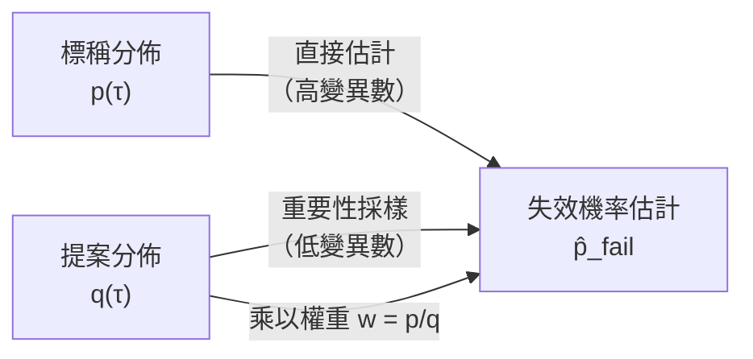
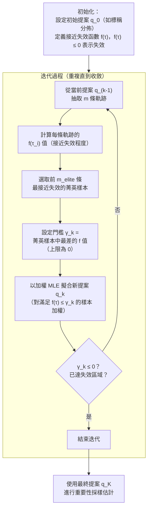
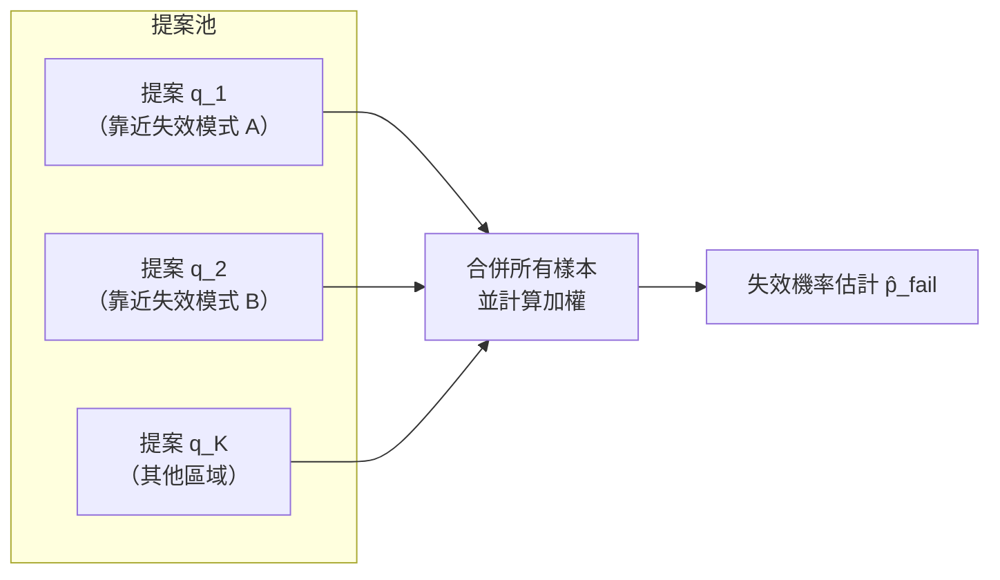
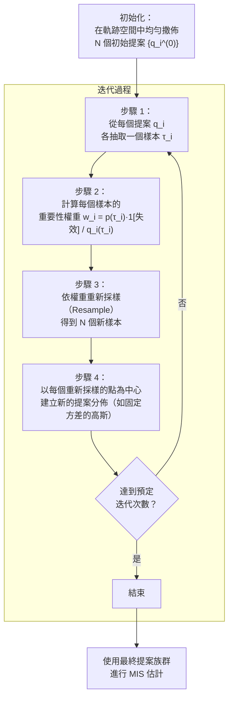
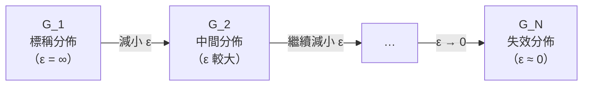
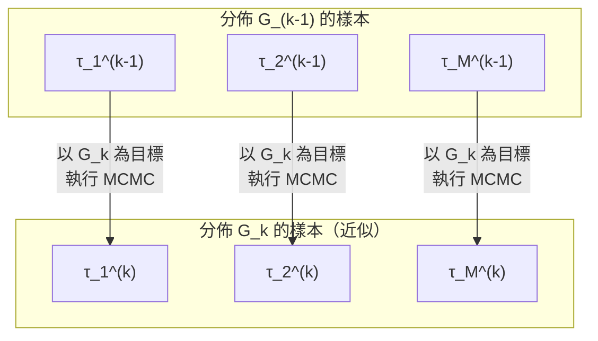
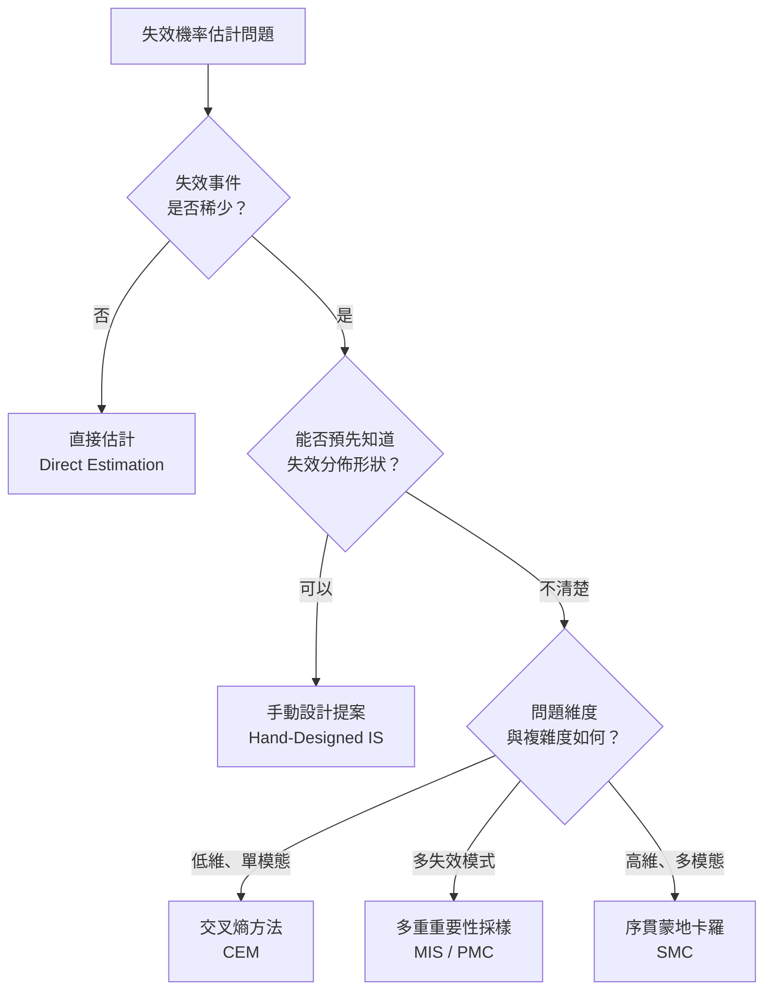

# 第十二章：自適應重要性採樣 (Adaptive Importance Sampling)

## 12.1 前情提要：重要性採樣回顧

在上一章中，我們介紹了**重要性採樣（Importance Sampling, IS）**的核心思想。本章是失效機率估計的第二部分，將進一步探討如何**自適應地**選取更好的提案分佈，使估計結果更準確、更有效率。

### 為何需要重要性採樣？

直接估計法（Direct Estimation）直接從標稱軌跡分佈 $p(\tau)$ 中抽樣，當失效事件稀少時，估計器的變異數（Variance）會急遽上升。事實上，變異數與失效機率成反比——失效越罕見，我們就越需要更多樣本才能得到可靠的估計。

重要性採樣的核心做法是：從一個能產生更多失效事件的**提案分佈（Proposal Distribution）** $q(\tau)$ 中抽樣，再透過**重要性權重（Importance Weight）**進行修正：

$$w_i = \frac{p(\tau_i)}{q(\tau_i)}$$

失效機率的估計式為：

$$\hat{p}_{\text{fail}} = \frac{1}{m} \sum_{i=1}^{m} w_i \cdot \mathbf{1}[\tau_i \text{ 為失效}]$$

### 最優提案分佈

可以證明，使IS估計器達到**零變異數**的最優提案分佈，恰好是**失效分佈（Failure Distribution）** 本身：

$$q^*(\tau) = \frac{p(\tau) \cdot \mathbf{1}[\tau \text{ 為失效}]}{p_{\text{fail}}}$$

但這正是一個循環困境：要使用此分佈，必須知道正規化常數 $p_{\text{fail}}$——而那正是我們想要估計的量！

因此，本章的核心目標是：**在不知道最優提案的前提下，盡可能地靠近它。**

### 提案的覆蓋條件

提案分佈 $q(\tau)$ 必須滿足一個必要條件：

> **對所有失效機率密度非零的軌跡，提案分佈的機率密度也必須非零。**

$$q^*(\tau) > 0 \Rightarrow q(\tau) > 0$$

違反此條件（如使用有限支撐的均勻分佈作為提案）將導致IS估計器有偏差。高斯分佈因為對所有點都有非零密度，通常是一個安全的選擇。

---

## 12.2 交叉熵方法 (Cross-Entropy Method, CEM)

交叉熵方法（CEM）是一種**自適應重要性採樣**演算法，由 Reuven Rubinstein 提出，是本章介紹的第一個自適應演算法。

### 核心思想

「我們能不能從一個容易抽樣的分佈中取得樣本，再用這些樣本去擬合（Fit）一個接近失效分佈的提案？」

**交叉熵（Cross-Entropy）**可視為兩個分佈之間的「距離」度量。最小化提案 $q_\theta$ 與失效分佈 $p_{\text{fail}}$ 的交叉熵，等價於對失效樣本進行**加權最大概似估計（Weighted MLE）**：

- 對於**高斯分佈**，加權 MLE 即計算加權均值與加權標準差。
- 失效樣本的權重為 $w_i = p(\tau_i) / q(\tau_i)$；非失效樣本的權重為零。

### 基本 CEM（單次版本）

1. 從初始提案 $q$（如標稱分佈）抽取 $m$ 條軌跡。
2. 計算每條軌跡的重要性權重（非失效者權重為零）。
3. 以加權 MLE 擬合新的提案分佈 $q_\theta$。
4. 使用 $q_\theta$ 作為IS提案進行失效機率估計。

**問題**：若失效極為罕見，所有樣本的權重都可能為零，無從擬合。

### 自適應 CEM（迭代版本）

透過引入**鬆弛門檻（Relaxed Threshold）**，迭代地將提案分佈逐步推向失效區域：

**關鍵細節**：
- $m_{\text{elite}}$ 是演算法的超參數（Hyper-parameter），例如取 50。
- 門檻 $\gamma_k$ 永遠不能設在失效邊界以下（即需 $\gamma_k \le 0$，在程式實作中常取 $\min(\gamma_k, 0)$）。
- 若存在多個失效模式，可使用**混合模型（Mixture Model）**作為擬合的提案分佈。
- 接近失效函數通常使用 STL 的**平滑強健性（Smooth Robustness）**。

### CEM 的 2D 視覺化

以二維高斯系統為例（標稱分佈以原點為中心），失效區域位於右上角。CEM 迭代過程如下：

| 迭代 | 狀態 |
|------|------|
| 第 0 次 | 樣本全從標稱分佈抽取，無樣本進入失效區域 |
| 第 1 次 | 選取最接近失效區域的菁英樣本，擬合新提案 |
| 第 2 次 | 新提案更靠近失效區域，有更多樣本落入失效區 |
| 收斂 | 最終提案接近失效分佈，可進行準確的IS估計 |

---

## 12.3 多重重要性採樣 (Multiple Importance Sampling, MIS)

### 動機

普通IS只能選一個提案分佈——選不好就可能失敗。**多重重要性採樣**允許我們同時使用多個提案分佈，分散風險。

### 標準 MIS (SMIS)

從每個提案 $q_j$ 各抽取若干樣本，對樣本 $\tau_i$（由 $q_i$ 抽取）的權重為：

$$w_i = \frac{p(\tau_i)}{q_i(\tau_i)}$$

### 確定性混合 MIS (DM-MIS)

假設所有樣本來自混合分佈：

$$q_{\text{mix}}(\tau) = \frac{1}{K} \sum_{j=1}^{K} q_j(\tau)$$

則每個樣本的權重為：

$$w_i = \frac{p(\tau_i)}{q_{\text{mix}}(\tau_i)} = \frac{p(\tau_i)}{\frac{1}{K}\sum_{j=1}^{K} q_j(\tau_i)}$$

**理論優勢**：DM-MIS 已被證明具有比 SMIS 更低的變異數，實務表現通常更好。兩種方式在統計上都是有效的估計方法。

---

## 12.4 族群蒙地卡羅 (Population Monte Carlo, PMC)

### 動機

PMC 是 MIS 的**自適應版本**：不僅使用多個提案，還會迭代地改善整個提案族群。

### 演算法步驟

**關鍵注意事項**：
- 初始提案必須盡可能**覆蓋整個軌跡空間**，否則所有樣本權重為零，演算法無法運作。
- 新提案的方差是超參數：方差大 → 探索範圍廣但利用差；方差小 → 集中於已知好區域但探索不足。
- PMC 本質上使用 MIS（包含 DM-MIS 選項）進行最終估計。

---

## 12.5 序貫蒙地卡羅 (Sequential Monte Carlo, SMC)

SMC 是本章介紹的最強大演算法，也是最接近非參數化（Non-parametric）的方法。

### 核心思想

**不維護明確的參數化提案分佈**，而是直接操作一批樣本，將其從標稱分佈逐步「移動」到失效分佈。

### 中間分佈的構建

為了平穩地從標稱分佈過渡到失效分佈，我們需要一系列中間分佈。

**平滑法（Smoothing）**：用軟性的高斯核函數替代硬性的指示函數：

$$G_\epsilon(\tau) \propto p(\tau) \cdot \underbrace{\mathcal{N}\!\left(f(\tau); 0, \epsilon\right)}_{\text{平滑指示函數}}$$

- $\epsilon \to 0$：$G_\epsilon \to$ 失效分佈（$G_N$）
- $\epsilon \to \infty$：$G_\epsilon \to$ 標稱分佈（$G_1$）

**備選方案**：類似 CEM，使用遞減的失效門檻 $\gamma$（而非平滑參數 $\epsilon$）。

### 樣本轉移：MCMC 過渡

從分佈 $G_{k-1}$ 移動到 $G_k$ 時，對每個樣本啟動以 $G_k$ 為目標的 MCMC 鏈：

- 每個樣本各自啟動一條獨立的 MCMC 鏈。
- 由於 $G_k$ 是 $G_{k-1}$ 的平滑版本，MCMC 的混合效率（Mixing）更好。
- 可在 MCMC 前加入**重新採樣（Resampling）**步驟以進一步提升效率。

### 失效機率的估計

**權重追蹤機制**是 SMC 估計失效機率的核心：

1. 初始化所有樣本權重：$w_i^{(1)} = 1$
2. 每次轉移時更新權重：
$$w_i^{(k)} = w_i^{(k-1)} \cdot \frac{G_k(\tau_i^{(k-1)})}{G_{k-1}(\tau_i^{(k-1)})}$$
3. 最終的失效機率估計：
$$\hat{p}_{\text{fail}} = \frac{1}{M} \sum_{i=1}^{M} w_i^{(N)}$$

此結果**不顯然成立**，其數學推導涉及正規化常數之比（Ratio of Normalizing Constants）的理論，詳見書中引用的參考文獻。

### SMC 的優勢：非參數化

與 CEM 和 PMC 不同，SMC **不需要選定任何參數化的分佈族（如高斯分佈）**。我們只維護一批樣本，這意味著：

- 可以表示高維、多模態（Multi-modal）的複雜失效分佈。
- 不會因為選錯分佈族而引入模型偏差。

### 實際應用：倒立擺範例

對於高達 50 維的倒立擺軌跡問題：

1. 從標稱分佈抽取 $M$ 條初始軌跡。
2. 選擇一系列平滑參數 $\epsilon_1 > \epsilon_2 > \cdots > \epsilon_N \approx 0$。
3. 對每個過渡執行 MCMC，逐步將軌跡「推向」失效區域。
4. 透過權重乘積估計 $p_{\text{fail}}$。

---

## 12.6 正規化常數之比（進階：Ratio of Normalizing Constants）

> **注意**：此主題屬於進階內容，不列入考試範圍。

重要性採樣實際上是一個更廣泛問題的特例：**估計兩個分佈的正規化常數之比**。

由於 $p_{\text{fail}}$ 正是失效分佈的正規化常數，從這個更廣泛的視角出發，可以推導出其他類型的估計器：

| 估計器 | 特點 |
|--------|------|
| 自正規化重要性採樣（SNIS） | 不需要知道 $q(\tau)$ 的正規化常數 |
| 橋接採樣（Bridge Sampling） | 使用兩個分佈之間的橋接分佈 |
| 傘形採樣（Umbrella Sampling） | 使用覆蓋多個感興趣區域的傘形分佈 |

書中第 7.12 圖（自正規化IS的最優提案分佈）也是一段小趣事的主角——它出現在授課教授的婚禮邀請函上，成為極少數印有 PGF Plots 圖形的婚禮邀請卡之一。

---

## 12.7 各演算法比較

| 演算法 | 提案類型 | 自適應 | 非參數 | 適用場景 |
|--------|---------|--------|--------|---------|
| 基本 IS | 單一、固定 | 否 | 否 | 已知失效分佈形狀 |
| CEM | 單一、自適應 | 是 | 否 | 單模態失效、中等維度 |
| MIS | 多個、固定 | 否 | 否 | 多失效模式、固定提案 |
| PMC | 多個、自適應 | 是 | 否 | 多失效模式、自動探索 |
| SMC | 無顯式提案 | 是 | **是** | 高維、多模態、複雜失效分佈 |

---

## 12.8 關鍵公式整理

$$
\text{IS 估計器：} \quad \hat{p}_{\text{fail}} = \frac{1}{m}\sum_{i=1}^{m} \frac{p(\tau_i)}{q(\tau_i)} \cdot \mathbf{1}[\tau_i \text{ 為失效}]
$$

$$
\text{CEM 目標：} \quad \min_\theta \; H\!\left(p_{\text{fail}}, q_\theta\right) \;\Leftrightarrow\; \text{加權最大概似估計}
$$

$$
\text{DM-MIS 權重：} \quad w_i = \frac{p(\tau_i)}{\dfrac{1}{K}\displaystyle\sum_{j=1}^{K} q_j(\tau_i)}
$$

$$
\text{SMC 權重更新：} \quad w_i^{(k)} = w_i^{(k-1)} \cdot \frac{G_k(\tau_i)}{G_{k-1}(\tau_i)}
$$

$$
\text{SMC 失效機率估計：} \quad \hat{p}_{\text{fail}} = \frac{1}{M}\sum_{i=1}^{M} w_i^{(N)}
$$

---

## 12.9 相關 Julia 筆記本

| 筆記本 | 主要內容 |
|--------|---------|
| [`failure_prob.jl`](../../data/aa228/lectures_material/notebooks/failure_prob.jl) | 直接估計、IS 提案擬合、自適應IS區段 |
| [`failure_dist.jl`](../../data/aa228/lectures_material/notebooks/failure_dist.jl) | 拒絕採樣、MCMC、失效分佈的平滑化 |
| [`smc.jl`](../../data/aa228/lectures_material/notebooks/smc.jl) | 1D 與 2D 的中間分佈視覺化、MCMC 過渡動畫 |
