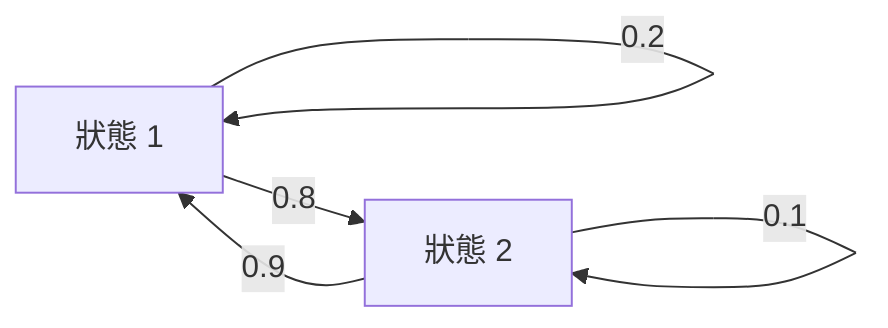
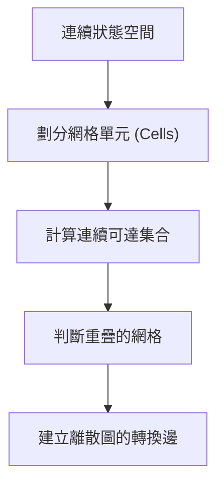

# 第 13 章：離散系統的可達性分析 (Discrete Reachability)

在前面兩章（第 11、12 章）中，我們探討了連續系統中的可達性分析：從線性系統的集合傳遞，到非線性系統的區間算術與包含函數。本章將先介紹處理非線性可達性的進階方法，再將重點轉移到**離散系統的可達性 (Discrete Reachability)**，最後討論如何將連續系統轉換為離散系統進行分析。

## 13.1 非線性可達性進階方法

上一章結尾指出，包含函數只能以軸對齊的超矩形包覆可達集，且誤差會隨時間步累積——本節介紹的泰勒模型與保守線性化正是為了突破這些限制而生。在處理非線性系統時，單純使用包含函數 (Inclusion Functions) 計算區間會受限於輸出必須是超矩形 (Hyper-rectangles)，進而導致嚴重的過度近似。為了取得更緊緻的邊界，我們可以運用以下技術：

### 13.1.1 泰勒模型 (Taylor Models)
泰勒模型是為了解決超矩形限制而提出的方法。一個 $n$ 階的泰勒模型由 $n-1$ 階泰勒多項式與一個區間餘項 (Interval Remainder) 所組成。多項式部分負責提供函數的局部逼近，而區間餘項則界定了逼近誤差。這使得我們可以使用多胞形 (Polytopes) 等更具表現力的形狀來傳遞集合。

### 13.1.2 保守線性化 (Conservative Linearization)
保守線性化實際上是一種二階泰勒模型。它利用雅可比矩陣 (Jacobian) 來進行一階的線性逼近，並附加上區間誤差。因為逼近的結果是線性函數，我們可以直接應用線性可達性中的工具（如 Minkowski 和、矩陣乘法），將多胞形傳遞到下一個時間步長。

### 13.1.3 具體可達性 (Concrete) 與符號可達性 (Symbolic)
* **符號可達性 (Symbolic Reachability)**：一次性考慮完整時間範圍內的展開函數 (Rollout Function)。缺點是計算成本高昂，且系統中的非線性會隨著時間疊加而產生巨大的過度近似誤差，但可以避免包裹效應。
* **具體可達性 (Concrete Reachability)**：逐步推進，在每個時間步長計算出一個具體的可達集合，再將其作為下一步的輸入。雖然減少了非線性疊加的影響，但由於每步都會進行過度近似，誤差會在每一步中累積，此現象被稱為**包裹效應 (Wrapping Effect)**。

### 13.1.4 空間劃分 (Partitioning)
將初始集合劃分為數個較小的子集，針對每個子集獨立進行可達性計算，最後再取其聯集。由於在較小的區域內進行線性逼近的誤差較小，這種方法能有效降低整體的過度近似。此外，數個凸集合的聯集可以很好地用來表示複雜的非凸集合 (Non-convex Sets)。

## 13.2 離散系統與圖論表示

離散系統可以很自然地使用**有向圖 (Directed Graphs)** 來建模：
* **節點 (Nodes)**：代表離散系統的狀態 (States)。
* **有向邊 (Edges)**：代表狀態與狀態之間可能的轉換 (Transitions)。
* **權重 (Weights)**：代表該狀態轉換發生的機率 (Probabilities)。

我們可以透過檢索每個狀態的後繼狀態與對應機率，輕鬆地建立起系統的圖論模型。

## 13.3 離散可達集合

有了系統的圖論表示後，我們就能分析集合的可達性：

* **前向可達集合 (Forward Reachable Sets)**：從初始狀態出發，隨著時間前進，透過廣度優先搜尋 (Breadth-First Search) 找出所有能夠抵達的狀態節點。
* **後向可達集合 (Backward Reachable Sets)**：從目標狀態或必須避開的危險狀態出發，沿著有向邊逆向追溯可能到達這些目標的初始狀態。
* **不變集合 (Invariant Sets)**：如果從某個集合出發，未來可達的所有狀態都仍包含在該集合內，則稱之為不變集合。在離散系統中，只需檢查子集關係即可判定。

### 可滿足性 (Satisfiability)
如果我們只想確認系統是否安全（例如是否會進入避開集合），我們不一定要計算完整的可達集合。我們可以檢查前向可達集合是否與危險集合有交集，或者直接利用啟發式搜尋 (Heuristic Search) 和布林可滿足性 (SAT/SMT) 等技巧來進行驗證。

## 13.4 機率可達性 (Probabilistic Reachability)

在許多情境下，我們不只關心某個狀態「是否可達」，更在乎它「有多大機率可達」。這對於評估風險（如到達障礙物的機率）非常有幫助。

* **佔用機率 (Probability of Occupancy)**：表示在特定時間點 $t$，系統處於某個狀態的機率。這可以利用遞迴來計算：時間點 $t+1$ 處於狀態 $s$ 的機率，等於所有前一時刻狀態進入狀態 $s$ 的機率總和。此機率分佈的總和為 1。
* **到達集合機率 (Probability of Reaching a Set)**：表示從給定狀態出發，在給定時間步長內抵達特定目標集合的機率。需注意的是，這並不是一種機率分佈，因此所有狀態的機率加總不會是 1。

## 13.5 離散狀態抽象化 (Discrete State Abstraction)

即使面對連續系統，我們也可以運用離散方法的優勢。**離散狀態抽象化**允許我們將連續狀態空間離散化，其步驟如下：

1. 將連續狀態空間切割成許多**網格單元 (Cells)**，每個網格對應為圖中的一個節點。
2. 針對每一個網格，使用連續可達性演算法（如保守線性化）計算出一步之後的連續可達集合。
3. 檢查這個連續可達集合與哪些網格發生重疊。
4. 若有重疊，則在圖中對應的節點之間建立一條轉換邊。

這種抽象化方法使我們能夠利用強大的離散演算法（例如圖論搜尋與機率分析）來為連續系統提供安全保證，並且能夠組合出非常精確且非凸的可達集合邊界。

## 13.6 本章小結

- **非線性可達性的進階工具**：泰勒模型以「多項式＋區間餘項」突破超矩形限制；保守線性化讓我們得以重用線性可達性的集合運算；符號與具體可達性各有取捨（前者避免包裹效應但成本高、後者逐步推進但誤差逐步累積）；空間劃分則以分而治之降低過度近似。
- **離散系統＝有向圖**：節點是狀態、邊是轉換、權重是機率；前向／後向可達集合可用圖搜尋求得，不變集合只需檢查子集關係，可滿足性問題還能交給 SAT/SMT 求解器。
- **機率可達性**：除了「是否可達」，還能遞迴計算佔用機率與到達集合機率，量化風險。
- **離散狀態抽象化**：把連續狀態空間切成網格、以連續可達性演算法建立轉換邊，讓離散演算法也能為連續系統提供精確且非凸的安全保證。

至此，本書的形式化方法（第 11–13 章的可達性分析）告一段落：我們已能在明確假設下「證明」系統安全。然而證明系統安全與「理解」系統行為是兩回事——接下來的第 14–15 章將轉向**可解釋性 (Explainability)**，探討如何解釋驗證結果與系統的失效行為。
