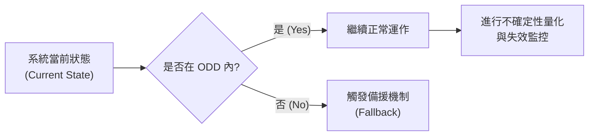
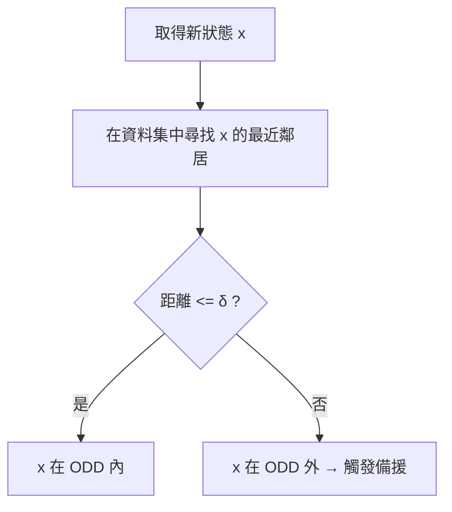
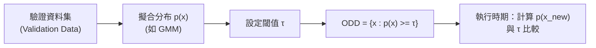
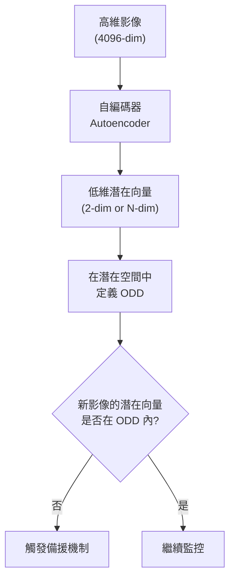
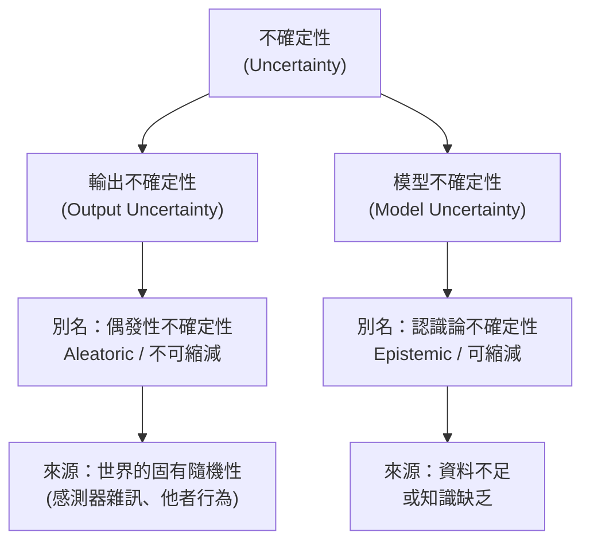
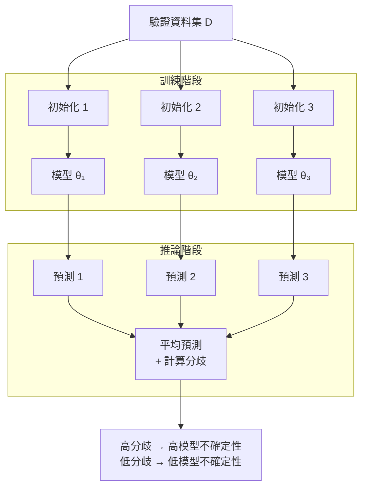
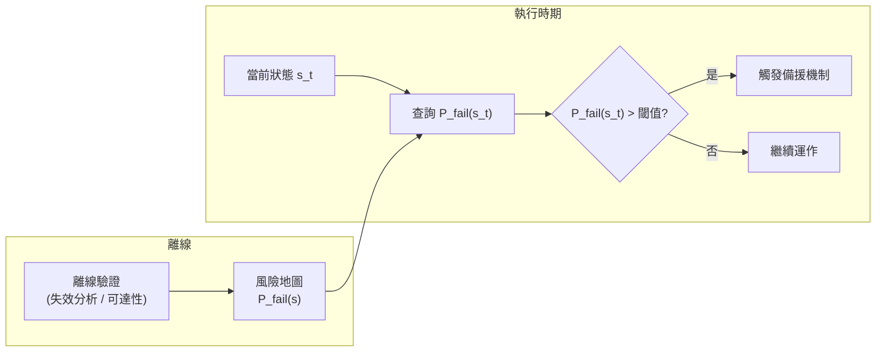
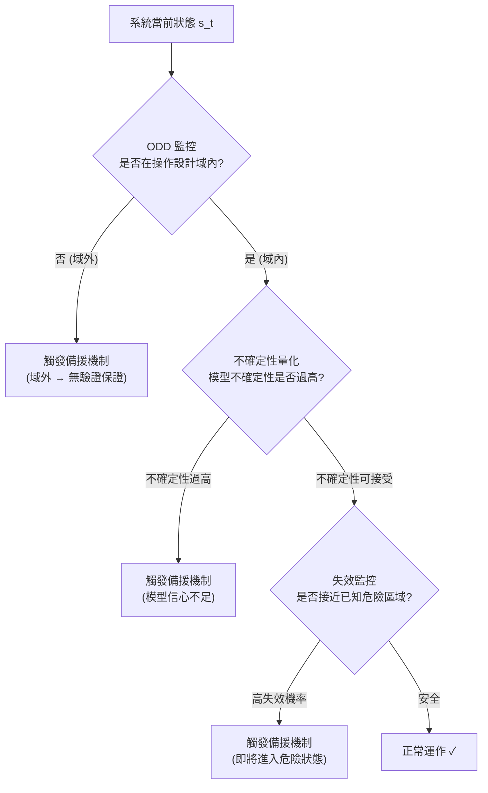
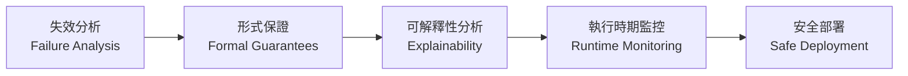

# 第十三章：執行時期監控 (Runtime Monitoring)

在過去十二章中，我們探討了各種**離線驗證 (Offline Validation)** 方法——從失效分析、可達性分析、正式保證，到可解釋性分析。這些方法都是在**部署系統之前**執行的，目的是透過一個預先建立的環境模型來了解系統的安全特性。

然而，現實世界的複雜程度往往超越我們最精心設計的模型。道路中央突然噴水的消防栓、一輛滿載交通號誌的卡車——這些奇異的邊緣案例，很可能從未出現在我們用於驗證的模型之中。那麼，當系統真正面對這些意料之外的情境時，我們該怎麼辦？

答案就是本章的主題：**執行時期監控 (Runtime Monitoring)**。

執行時期監控的目標是：在系統運行時，**即時偵測**可能危險的情境，並觸發某種備援機制 (Fallback Mechanism)，例如進入安全模式、停止運作，或將控制權交還給人類操作員。

本章主要涵蓋三個主題：

1. **操作設計域監控 (Operational Design Domain Monitoring)**
2. **不確定性量化 (Uncertainty Quantification)**
3. **失效監控 (Failure Monitoring)**

---

## 一、操作設計域監控

### 核心概念

每個系統都有一個**操作設計域 (Operational Design Domain, ODD)**——即設計者預期系統能安全運作的條件集合。從驗證的角度來看，ODD 本質上就是我們在離線驗證時，所使用的模型所涵蓋的狀態空間範圍。

一旦系統在 ODD **之外**運作，離線驗證所得到的保證便不再成立。因此，執行時期監控的第一步，就是偵測系統是否正在超出 ODD 運行。

### 定義 ODD 的兩種方式

| 方式 | 說明 | 優點 | 缺點 |
|---|---|---|---|
| **手工設計特徵** | 由領域專家列舉條件（如：白天、無雨、能見度良好） | 直觀、可解釋 | 需要深厚領域知識，難以窮舉 |
| **資料驅動** | 以離線驗證時觀察到的所有狀態/影像作為 ODD 的代表 | 自動化、涵蓋驗證範圍 | 需要設計合適的表示方式 |

以下我們專注介紹**資料驅動**方法。

---

### 方法一：最近鄰居法 (Nearest Neighbors)

最直覺的想法是：如果一個新狀態與我們驗證時見過的某個狀態夠接近，我們就說它在 ODD 之內。

**定義**：若一個點 $x$ 的最近鄰居（在驗證資料集中）與它的距離小於閾值 $\delta$，則 $x$ 屬於 ODD。

我們也可以要求 **k 個**最近鄰居都在距離 δ 內，以消除資料中的孤立離群點，讓 ODD 的邊界更平滑。

**閾值 δ 的影響**：
- δ 越小 → ODD 越保守（只包含緊鄰驗證點的區域）
- δ 越大 → ODD 越寬鬆（包含更大範圍）

**主要缺點**：需要在執行時期的記憶體中儲存完整的驗證資料集，當資料量龐大時，成本很高。

**改善方案**：先對資料進行聚類 (Clustering)，僅儲存各群集中心，再以群集中心進行最近鄰居查詢，大幅降低記憶體需求。

---

### 方法二：多面體表示 (Polytope / Convex Hull)

為了進一步壓縮 ODD 的表示，我們可以用**多面體 (Polytope)** 來描述它。

**凸包 (Convex Hull)**：取所有驗證資料點的外殼，形成一個凸多面體。

$$\text{ODD} = \text{ConvexHull}(\{x_1, x_2, \ldots, x_n\})$$

**問題**：真實的 ODD 往往是**非凸的**，單一凸包會包含許多從未驗證過的區域。

**解法**：先將資料分群，再取**各群凸包的聯集**。

$$\text{ODD} = \bigcup_{k=1}^{K} \text{ConvexHull}(\mathcal{C}_k)$$

群數 $K$ 越多，ODD 的形狀就越貼近真實資料分布。

---

### 方法三：分布的上水準集 (Super-Level Set of a Distribution)

更靈活的方式是將 ODD 定義為某個機率分布的**上水準集 (Super-Level Set)**。

**上水準集定義**：給定函數 $f$ 和閾值 $\tau$，上水準集為 $\{x : f(x) \geq \tau\}$。

**流程**：
1. 對驗證資料集擬合一個機率分布 $p(x)$（例如高斯混合模型 GMM）。
2. 設定密度閾值 $\tau$。
3. ODD = $\{x : p(x) \geq \tau\}$

**優點**：可藉由調整 $\tau$ 靈活控制 ODD 的保守程度，且能自然處理低密度區域（雖驗證過，但見過次數極少的狀態）。

> **注意**：也可以訓練一個**分類器**來區分 ODD 內外，但這需要 ODD 外的資料作為負樣本，而這類資料往往難以取得——若真的有大量域外資料，直接加入訓練集會更好。

---

### 高維度 ODD：影像的挑戰

上述方法在低維度狀態空間中表現良好，但面對影像輸入（如 4096 像素的攝影機畫面），情況便截然不同。

**兩大挑戰**：

1. **維度詛咒 (Curse of Dimensionality)**：空間體積隨維度指數增長，需要天文數字般的資料量才能充分覆蓋空間。
2. **距離語義喪失 (Distance Metric Breakdown)**：像素空間中的歐氏距離難以反映語義相似性（兩張語義相近的圖像，像素距離可能很大）。

**解決方案：降維到潛在空間**

使用**自編碼器 (Autoencoder)** 或其他降維技術，將高維影像映射到低維潛在空間 (Latent Space)，再在潛在空間中定義 ODD。

**特徵崩潰 (Feature Collapse)**：這是一個重要的潛在風險——某些在語義上**不在** ODD 內的影像（如夜晚拍攝的圖片），在潛在空間中可能會映射到與 ODD 內影像相近的位置，導致監控失效。這種問題難以事先偵測，是此方法的主要限制。

---

## 二、不確定性量化

即使系統處於 ODD 之內，我們仍希望了解模型對當前預測的**信心程度**。不確定性高的情境，同樣值得觸發備援機制。

不確定性分為兩種根本不同的類型：

### 認識論框架

| 類型 | 別名 | 根本原因 | 能否縮減 | 比喻 |
|---|---|---|---|---|
| **輸出不確定性** | Aleatoric Uncertainty | 世界的固有隨機性 | 否 | 從模糊照片辨識兩個相似的人 |
| **模型不確定性** | Epistemic Uncertainty | 資料不足、模型知識有限 | 是（獲取更多資料） | 對從未見過的事物（調味料出庭作證）毫無概念 |

---

### 輸出不確定性的量化

#### 回歸模型：異質性變異數

傳統回歸假設輸出雜訊的變異數是固定常數。現在我們放寬這個假設，讓模型**同時輸出均值 $\mu(x)$ 和變異數 $\sigma^2(x)$**，兩者都是輸入 $x$ 的函數。

**損失函數**：最大化資料的對數概似 (Log-Likelihood)，可得：

$$\mathcal{L}(\theta) = \sum_i \left[ \frac{(y_i - \mu(x_i))^2}{2\sigma^2(x_i)} + \frac{1}{2}\ln\sigma^2(x_i) \right]$$

**直覺解讀**：
- 在**可精確預測**的區域（均方誤差小）→ 損失傾向於讓 $\sigma^2$ 較小（高信心）。
- 在**難以預測**的區域（均方誤差大）→ 損失傾向於讓 $\sigma^2$ 較大（低信心，如實反映不確定性）。

#### 分類模型與校準問題

大多數分類模型在最後一層使用 **Softmax** 函數，天然輸出各類別的機率分布。然而，研究顯示現代深度神經網路往往**過度自信 (Overconfident)**——輸出的 Softmax 機率並不等於真實的正確率。

**溫度縮放 (Temperature Scaling)**：一種事後校準方法，在 Softmax 中加入參數 $\lambda$：

$$\text{Softmax}_\lambda(z_k) = \frac{e^{\lambda z_k}}{\sum_{j=1}^{K} e^{\lambda z_j}}$$

| $\lambda$ 值 | 效果 |
|---|---|
| $\lambda = 1$ | 原始 Softmax（不變） |
| $\lambda \to 0$ | 趨向均勻分布（最大不確定性） |
| $\lambda \to \infty$ | 趨向 one-hot 分布（最大自信） |

透過最小化校準資料集 (Calibration Set) 上的負對數概似 (NLL)，即可找到最佳的 $\lambda$。

#### 預測集 (Prediction Sets) 與保形預測 (Conformal Prediction)

除了輸出機率分布，我們也可以輸出一個**預測集**，並保證真實值以指定的覆蓋率（如 95%）落在集合中：

$$P(\text{真實值} \in \hat{C}(x)) \geq 1 - \alpha$$

預測集越大 → 不確定性越高。

**保形預測 (Conformal Prediction)** 是近年備受關注的框架，其核心優勢在於：即使模型的輸出分布**未經校準**，也能生成具有嚴格覆蓋率保證的預測集，因此在無需額外校準步驟的情況下仍能提供可信的不確定性估計。

---

### 模型不確定性的量化

輸出不確定性的方法依賴資料本身的統計特性；而在**無資料區域**，這些方法根本無法提供有意義的不確定性估計。模型不確定性的量化需要不同的思路。

#### 貝葉斯模型平均 (Bayesian Model Averaging)

**核心思想**：與其選定單一最佳模型，不如維護所有可能模型的分布 $p(\theta | \mathcal{D})$，並在做預測時對所有模型積分：

$$p(y | x, \mathcal{D}) = \int p(y | x, \theta)\, p(\theta | \mathcal{D})\, d\theta$$

**問題**：對所有可能的神經網路參數積分在計算上**不可行 (Intractable)**。

#### 深度集成 (Deep Ensembles)：實用近似

訓練多個以不同隨機初始化出發的模型，讓它們收斂到損失函數的**不同局部最小值**，再對這些模型的預測結果取平均。

**優點**：
- 在有資料的區域，各模型應收斂到相近的預測 → 分歧小 → 低模型不確定性。
- 在無資料區域，各模型的預測將大相徑庭 → 分歧大 → 高模型不確定性。

**陷阱：集成崩潰 (Ensemble Collapse)**：
若損失曲面高度凸，或初始化策略不當，所有模型可能收斂到**相同的局部最小值**，導致集成「信心爆棚」但全體皆錯。應通過不同架構、隨機先驗函數 (Randomized Prior Functions) 等方式確保集成的多樣性。

> **補充**：**高斯過程 (Gaussian Process)** 在定義上自然地同時編碼了輸出不確定性與模型不確定性，但其計算複雜度隨資料量增長而大幅上升，難以擴展至高維度問題。

---

## 三、失效監控 (Failure Monitoring)

ODD 監控和不確定性量化告訴我們「是否在已知安全區域」；**失效監控**則進一步問：「即使我們在 ODD 內，是否正在接近已知的危險區域？」

這是因為離線驗證並不代表系統不會在 ODD 內失效——失效分析 (Failure Analysis) 可能已找出 ODD 內的若干失效情境，失效監控的目的就是在系統趨近這些情境時提前警告。

### 方法

**方法一：線上執行離線演算法**

在運行時，從當前狀態出發，即時執行可達性分析或蒙地卡羅模擬，估計失效機率。

$$\hat{P}_\text{fail}(s_t) \approx \frac{1}{N} \sum_{i=1}^{N} \mathbf{1}[\text{Rollout}_i \text{ 失效}]$$

**缺點**：計算成本高，可能無法滿足實時要求。

**方法二：預計算風險地圖**

在部署前，利用**概率可達性分析**等方法，預先計算狀態空間中各狀態的失效機率，生成「風險地圖」。執行時期只需查詢當前狀態對應的風險值，成本極低。

### 補充：測試時增強 (Test-Time Augmentation, TTA)

在電腦視覺領域的部署實踐中，常見的技術是對同一輸入影像進行多種增強（旋轉、亮度調整等），分別執行模型推論，再觀察輸出的**變異程度**。若同一場景在不同增強條件下的預測結果大相徑庭，則表示模型對當前輸入的信心不足。這本質上是一種輸出不確定性的估計，在自動駕駛等系統中廣泛應用。

---

## 四、執行時期監控的完整架構

將三個主題整合，我們可以得到一個分層的執行時期監控框架：

---

## 五、課程總結：瑞士乳酪模型

執行時期監控是整個驗證框架的最後一道防線，但它不是萬能的。整個課程的核心思想，正是**瑞士乳酪模型 (Swiss Cheese Model)**：

> 每一種驗證方法都有其局限性（就像乳酪上的小洞），沒有任何單一方法能提供完整的安全保證。但只要我們**疊加足夠多層**不同的方法，這些小洞便不太可能同時對齊，從而構建出一個可靠的安全論證 (Safety Case)。

| 驗證層次 | 方法範例 | 主要角色 |
|---|---|---|
| 失效分析 | 蒙地卡羅、最佳化偽造 | 找出存在哪些失效情境 |
| 形式保證 | 可達性分析、SMC | 量化或証明失效機率的上界 |
| 可解釋性 | Saliency Maps、Shapley | 理解模型決策依據 |
| 執行時期監控 | ODD 監控、不確定性量化 | 在部署時捕捉未預見情境 |

---

## 本章重要術語

| 術語 | 說明 |
|---|---|
| **操作設計域 (ODD)** | 系統被驗證為可安全運作的條件集合 |
| **超水準集 (Super-Level Set)** | 函數值超過閾值 τ 的所有輸入點的集合 |
| **特徵崩潰 (Feature Collapse)** | 降維後，域外輸入映射至與域內輸入相近的潛在空間位置 |
| **偶發性不確定性 (Aleatoric Uncertainty)** | 源自世界固有隨機性，不可縮減 |
| **認識論不確定性 (Epistemic Uncertainty)** | 源自模型知識不足，可透過更多資料縮減 |
| **溫度縮放 (Temperature Scaling)** | 調整 Softmax 溫度參數 λ 以校準分類模型的置信度 |
| **保形預測 (Conformal Prediction)** | 無需校準即可生成具覆蓋率保證之預測集的框架 |
| **貝葉斯模型平均 (Bayesian Model Averaging)** | 對所有可能模型的預測結果進行加權平均 |
| **深度集成 (Deep Ensembles)** | 貝葉斯模型平均的實用近似；訓練多個隨機初始化的模型 |
| **集成崩潰 (Ensemble Collapse)** | 集成中所有模型收斂至相同局部最小值，喪失多樣性 |
| **測試時增強 (TTA)** | 對同一輸入進行多種增強並觀察輸出變異，以估計不確定性 |
