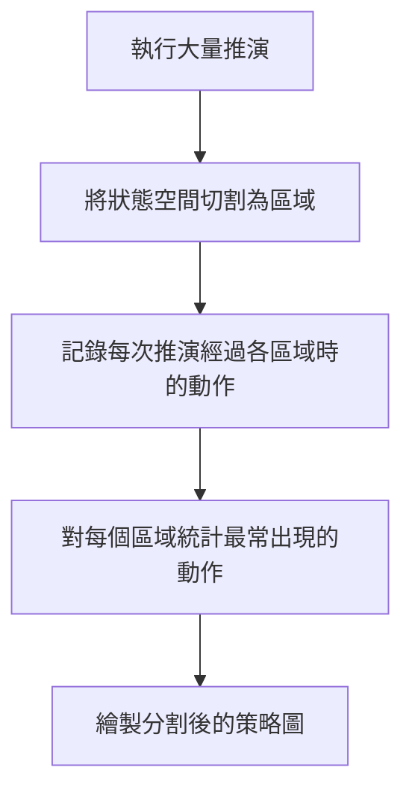
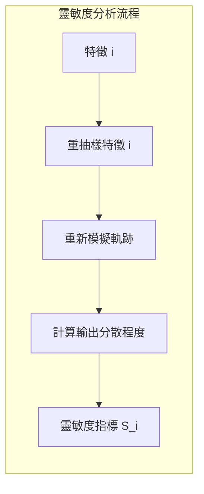
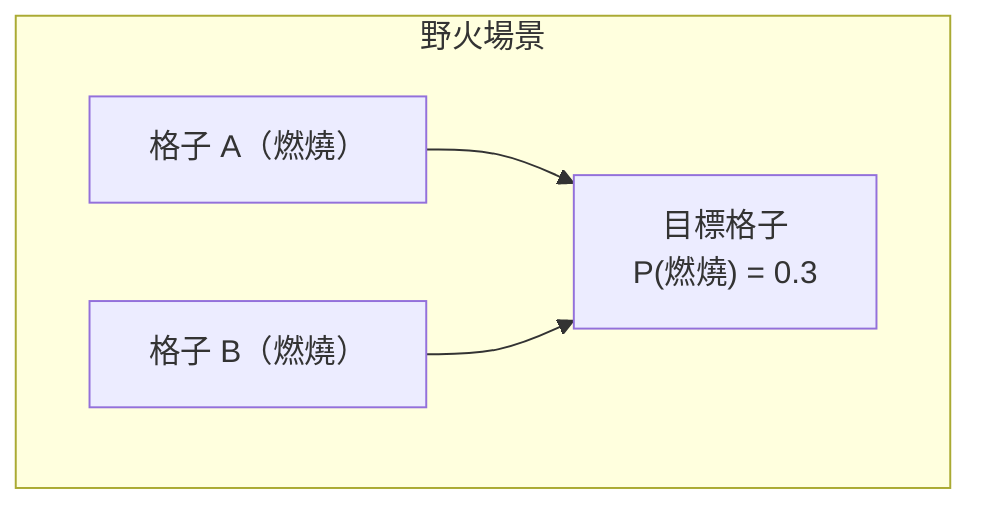
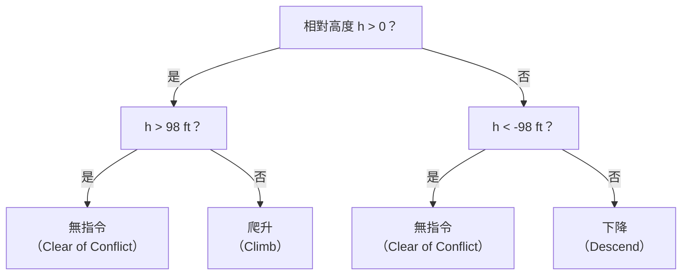
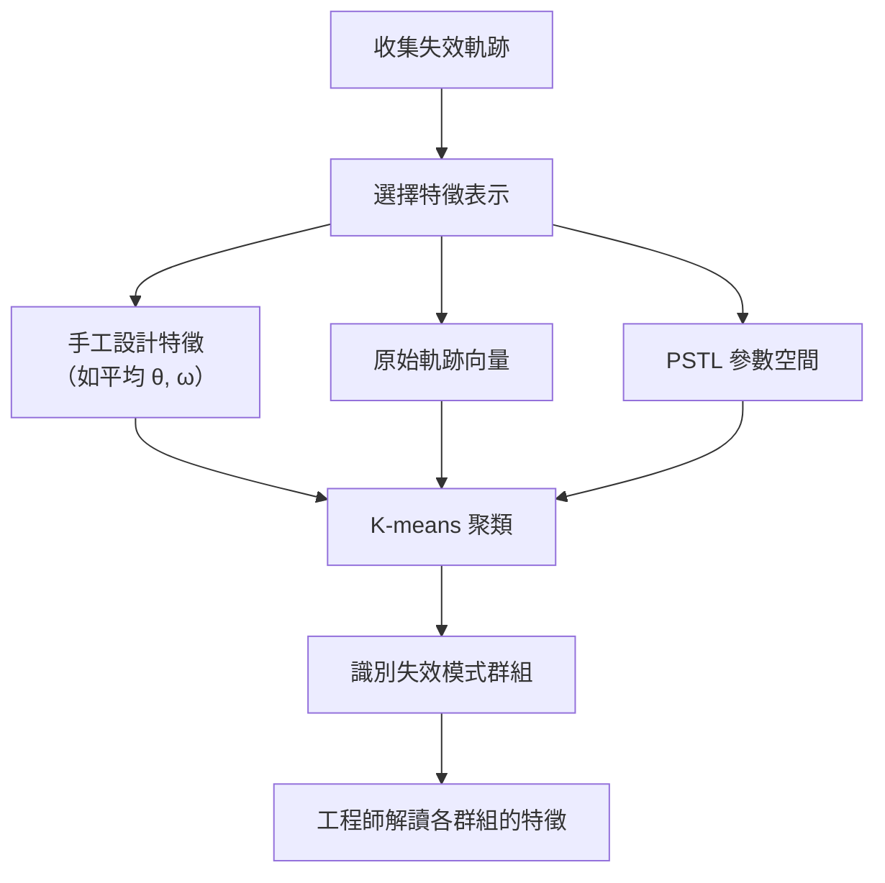
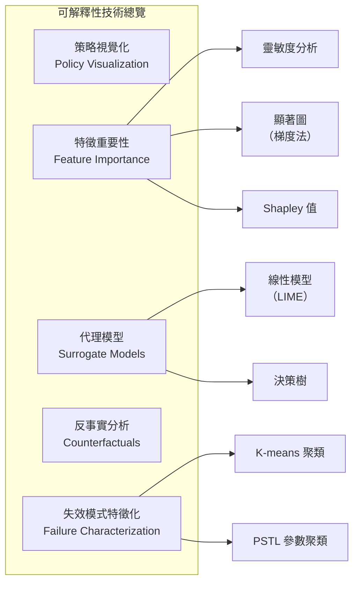

# 第十四章：可解釋性 I (Explainability I)

## 14.1 為什麼需要可解釋性？

在前面的章節中，我們一直在回答一個核心問題：「系統有沒有問題？」我們找到了失效情境、估計了失效概率，有時也證明了在特定假設下不存在失效。但這些方法本質上只回答了「它能不能運作」，而沒有回答「**它為何能運作**」或「**它為何會失效**」。

有時候，「能運作」就夠了——如果我們有嚴格的數學證明，我們可以放心部署。但有時候，了解**原因**至關重要，因為：

- **系統可能在未驗證的指標上表現不佳**：系統在所有測試場景下都通過了驗證，但也許這些測試遺漏了某些維度，而系統在這些維度上的表現很差。如果能解釋系統的行為，我們就能更早發現這類問題。
- **避免被好結果欺騙**：系統可能因為「錯誤的理由」而表現良好，例如過度擬合了測試場景的特定統計特性。
- **法規要求**：某些安全關鍵領域（如醫療、航空）要求能夠向監管機構或利害關係人解釋系統的決策過程，即使解釋不一定完美。
- **發現隱藏的失效模式**：當我們理解系統做出某個決策的原因，往往能更有效地預測它在哪些新情境下可能失效。

本章將介紹五大類可解釋性技術：**策略視覺化**、**特徵重要性**（含靈敏度分析與 Shapley 值）、**代理模型**、**反事實分析**，以及**失效模式特徵化**。

---

## 14.2 策略視覺化 (Policy Visualization)

最直觀的可解釋性方法，就是直接將策略的行為呈現出來。

### 14.2.1 推演視覺化 (Rollout Visualization)

最簡單的方式是執行多次推演（Rollouts），然後觀察結果。例如：

- **防撞系統（CAS）**：多次推演後，可以發現系統主要有兩種行為模式——讓本機爬升至入侵機上方，或下降至其下方。這是一個很好的初步驗證。
- **倒立擺（Inverted Pendulum）**：大多數時候維持在 θ = 0 的直立狀態，偶爾才倒下。

這類視覺化是設計系統時的第一步，確保行為在直觀上是合理的。

### 14.2.2 策略圖 (Policy Plots)

對於**狀態空間維度較低**的系統，我們可以繪製完整的策略圖——在每一個可能的狀態下，策略會採取什麼動作？

以倒立擺為例，狀態空間是二維的（角度 θ 與角速度 ω），我們可以將整個策略繪製在一個二維熱力圖上。從圖中可以驗證：
- 在 (0, 0) 附近，扭矩接近零（系統認為不需要調整）。
- 當 θ > 0（向右傾），施加負扭矩將其推回中心。
- 當 θ < 0（向左傾），施加正扭矩。

這提供了一種直觀的**合理性檢查（Sanity Check）**機制。

對於**狀態空間高維度**的系統（如 ACAS 的四維狀態），我們無法直接繪製整個策略圖，只能選取特定維度的**切片（Slices）**來視覺化。例如，固定「垂直速率」和「先前動作」，只展示「相對高度」與「碰撞時間」這兩個維度的策略切片。這種做法雖然只能提供局部視角，但仍能揭示出許多有趣的特性，例如防撞策略中令人困惑的「凹槽（Notch）」區域——在相對高度接近零且碰撞時間較長時，系統選擇不發出任何指令，因為此時爬升或下降都不確定哪個更好。

### 14.2.3 狀態空間分割 (State Space Partitioning)

這種方法特別適合**非馬可夫（Non-Markovian）系統**——系統的動作不只取決於當前狀態，還依賴歷史。因為我們是追蹤完整的推演軌跡，所以自然包含了歷史資訊，不必擔心歷史依賴問題。

---

## 14.3 特徵重要性 (Feature Importance)

特徵重要性是許多人談到「可解釋性」時首先想到的概念。目標是**理解各個特徵對系統整體行為或某個感興趣輸出的貢獻程度**。

「特徵」可以是：
- 系統狀態的各個分量
- 施加於系統的各個擾動值
- 影像的各個像素

### 14.3.1 靈敏度分析 (Sensitivity Analysis)

靈敏度分析的核心思路是：**逐次改變單一特徵，觀察輸出的變化幅度**。

**演算法（以軌跡擾動為例）**：

對於軌跡中的每一個時間步 $t$：
1. 保持所有其他時間步的擾動不變。
2. 對時間步 $t$ 的擾動重新抽樣（從標稱分佈中）。
3. 從新的擾動繼續推演軌跡。
4. 計算所有重抽樣結果的強健性（Robustness）分散程度（如變異數）。

分散程度越大 → 靈敏度越高。

**關鍵發現**：對於倒立擺，越早施加的擾動靈敏度越高，越接近軌跡末端的擾動靈敏度越低。這是符合直覺的——早期的擾動影響了後續所有狀態的演化。

**圖像的像素靈敏度**：對一張 64×64 的跑道影像，逐一對每個像素重抽樣，觀察轉向角（Steering Angle）的變化。結果顯示，對轉向決策影響最大的像素集中在能夠幫助定位位置的邊線與中心線附近。

**計算瓶頸**：對於 4096 個像素，需要 4096 次完整的重抽樣模擬，耗時極大。

### 14.3.2 顯著圖 (Saliency Maps)

為了降低靈敏度分析的計算成本，可以使用梯度代替重抽樣：

$$S_i \approx \left|\frac{\partial f(\mathbf{x})}{\partial x_i}\right|$$

梯度越大 → 該特徵的微小變動對輸出影響越大 → 靈敏度越高。

**優點**：只需一次反向傳播（Backpropagation），計算效率遠高於重抽樣法。

**缺點：飽和特徵問題**

如果目前的輸入點恰好位於函數的**飽和區（Saturation Zone）**（即函數在該點附近非常平坦），則梯度接近零，但這並不代表該特徵對整體輸出不重要。

**積分梯度（Integrated Gradients）**：

1. 從基準點 $\mathbf{x}_0$（如全黑影像）出發。
2. 沿直線插值逐漸移向目標輸入 $\mathbf{x}$。
3. 在插值路徑上對梯度積分（取平均）。

$$\text{IG}_i(\mathbf{x}) = (x_i - x_{0,i}) \times \int_0^1 \frac{\partial f(\mathbf{x}_0 + \alpha(\mathbf{x} - \mathbf{x}_0))}{\partial x_i} \, d\alpha$$

這樣即使在目標點附近梯度飽和，也能捕捉到從基準點到目標點過程中特徵「浮現」的那一刻的梯度訊號。

其他常見的梯度型顯著圖方法包括：
- **SmoothGrad**：對輸入加入多次隨機雜訊後取梯度平均。
- **GradCAM**、**Guided Backpropagation** 等。

> **⚠️ 重要警告：顯著圖的可靠性**
>
> Adebayo 等人的論文《Sanity Checks for Saliency Maps》指出，許多顯著圖方法存在根本性缺陷：
> - 將模型的所有層替換為隨機權重後，顯著圖幾乎沒有變化。
> - 完全打亂訓練標籤後重新訓練，顯著圖依然相似。
> - 某些顯著圖本質上只是在對輸入影像本身做邊緣偵測，與模型無關。
>
> **結論**：顯著圖看起來合理並不等於它真的在解釋模型。人類擅長從任何模式中解讀意義，但這種解讀不一定是忠實的。永遠保持批判態度。

---

### 14.3.3 Shapley 值 (Shapley Values)

靈敏度分析每次只改變單一特徵，因此可能忽略**特徵之間的交互作用（Feature Interactions）**。

**野火例子說明交互問題**：

想像一個 5×5 的格子世界，每個格子可能在燃燒（紅色）或未燃燒（白色）。我們關心右上角格子在下一時步被點燃的概率。轉移規則是：若相鄰格子在燃燒，則有 30% 的概率被點燃。

若只移除格子 A，目標格子仍有 30% 機率被點燃（因格子 B 仍在燃燒）。  
若只移除格子 B，目標格子仍有 30% 機率被點燃（因格子 A 仍在燃燒）。  
→ 靈敏度分析得出：A 和 B 對目標格子均無影響。

但若同時移除 A 和 B，目標格子的燃燒概率降為 0！

這就是 Shapley 值要解決的問題——在**所有可能的特徵子集**中評估特徵的邊際貢獻。

**Shapley 值的計算思路**：

對特徵 $i$，考慮所有可能的其他特徵子集 $S$，計算：
- **包含特徵 $i$** 時的輸出（其他非子集成員隨機抽樣）
- **不包含特徵 $i$** 時的輸出（同樣隨機抽樣）
- 取兩者的差值，並對所有子集加權平均

$$\phi_i = \sum_{S \subseteq \mathcal{F} \setminus \{i\}} \frac{|S|!(|\mathcal{F}|-|S|-1)!}{|\mathcal{F}|!} \left[ f(S \cup \{i\}) - f(S) \right]$$

**計算挑戰**：特徵數 $n$ 時，子集數為 $2^n$，例如 25 個格子就有超過 1600 萬種子集，難以窮舉。

**實際做法**：隨機抽取部分子集進行蒙地卡羅估計，通常可得到合理近似。

**倒立擺應用結果**：Shapley 值最高的擾動，是那些讓擺棒誤以為自己更接近直立的觀測擾動。將前四高 Shapley 值的擾動歸零後，原本的失效軌跡轉變為安全軌跡。

---

## 14.4 代理模型 (Surrogate Models)

當策略本身是一個黑盒（如神經網路），我們可以訓練一個**可解釋的代理模型**來近似它，再透過解釋代理模型來理解原策略。

**關鍵取捨**：

| 特性 | 說明 |
|------|------|
| 高保真度（Fidelity） | 代理模型精準地再現原策略 |
| 高可解釋性（Interpretability） | 代理模型易於人類理解 |

這兩者通常難以兼得：如果一個可解釋模型就能完美近似原策略，那我們一開始就該直接使用這個可解釋模型。

### 14.4.1 線性代理模型 (Linear Surrogate Models)

$$\hat{f}(\mathbf{x}) = \mathbf{w}^\top \mathbf{x} = w_1 x_1 + w_2 x_2 + \cdots + w_n x_n$$

- 係數 $w_i$ 的絕對值直接代表特徵 $x_i$ 的相對重要性。
- 通常只在局部有效——**局部線性模型（Local Linear Model）**。

**LIME（Local Interpretable Model-Agnostic Explanations）** 正是基於此概念：在感興趣的局部區域抽樣，對抽樣點標記真實策略的輸出，再訓練局部線性模型。

**ACAS 應用範例**：
- 在狀態空間的某個局部圓形區域內抽樣。
- 訓練線性分類器以近似防撞策略在此區域的行為。
- 從係數發現：在靠近入侵機的區域，相對高度和碰撞時間兩個特徵對動作選擇都很重要。
- 在另一個中間區域：動作幾乎只取決於相對高度，碰撞時間的係數幾乎為零。

**侷限**：加入多項式特徵（如 $x_1 \times x_2$）可以提升擬合精度，但解釋性隨之下降。

### 14.4.2 決策樹代理模型 (Decision Tree Surrogate Models)

決策樹是另一種高可解釋性的代理模型。

**ACAS 決策樹範例**：

這個決策樹清晰地告訴我們：
- 如果本機在入侵機正上方足夠遠 → 不需要採取行動。
- 如果本機在入侵機正上方但太近 → 繼續爬升，拉開距離。
- 如果本機在入侵機正下方但太近 → 繼續下降，拉開距離。
- 如果本機在入侵機正下方足夠遠 → 不需要採取行動。

**保真度與可解釋性的取捨**：樹越深、葉節點越多，對真實策略的近似越好，但人類越難理解整棵樹的邏輯。

---

## 14.5 反事實分析 (Counterfactual Analysis)

反事實分析問的是：「**如果輸入不是 $x$ 而是 $x'$，輸出會有何不同？**」

這是解釋個別決策的有力工具——例如，「為什麼系統在這個場景下失效？如果某個感測器讀數不同，是否就不會失效？」

> 詳細方法請參見教材第 11.5 節。

---

## 14.6 失效模式特徵化 (Failure Mode Characterization)

在我們透過偽證或失效分佈抽樣收集了大量失效軌跡後，如何讓這些失效資料對人類工程師有意義？答案是**聚類（Clustering）**。

### 14.6.1 聚類方法

最常見的方法是 **K-means**，它透過迭代演算法將數據點分配到 $K$ 個群組中，使得同一群組內的點彼此相近。

### 14.6.2 特徵選擇的影響

聚類結果高度依賴所選的特徵空間：

| 特徵選擇 | 倒立擺結果 |
|----------|-----------|
| 平均角度 θ + 平均角速度 ω | 兩個清晰群組：向左倒、向右倒 |
| 完整狀態向量 | 同樣得到兩個清晰群組 |
| 動作軌跡向量 | 仍可解釋 |
| 擾動軌跡向量 | 無法解釋的混亂分布 |

### 14.6.3 時序邏輯特徵聚類 (PSTL-based Clustering)

**參數化訊號時序邏輯（Parametric Signal Temporal Logic, PSTL）** 提供了一種更具解釋力的聚類方式：

- 為時序邏輯公式加入參數（如「在時間 $t_1$ 之前發生失效」中的 $t_1$）。
- 在參數空間中進行聚類。
- 聚類結果直接對應於可解讀的時序邏輯性質，例如：
  - **群組 1**：「在 $t < 50$ 之前倒下」
  - **群組 2**：「在 $t \geq 50$ 之後倒下」

這樣的聚類結果對工程師更具實際意義。

---

## 14.7 本章小結

本章介紹了五大類可解釋性技術，從簡單的視覺化到數學上嚴謹的 Shapley 值：

| 技術 | 主要優點 | 主要限制 |
|------|----------|----------|
| 策略視覺化 | 直觀，適合初步驗證 | 高維度狀態空間難以完整呈現 |
| 靈敏度分析 | 概念清晰，易於實作 | 忽略特徵交互作用，計算量大 |
| 顯著圖 | 計算效率高 | 可能不忠實地反映模型行為 |
| Shapley 值 | 捕捉特徵交互作用 | 計算成本指數增長 |
| 線性代理模型 | 係數直接對應重要性 | 只在局部有效 |
| 決策樹代理模型 | 全局可視化 | 保真度與可解釋性取捨困難 |
| 聚類失效模式 | 自動識別失效類型 | 結果高度依賴特徵選擇 |

**最後的提醒**：可解釋性方法提供的是**一種解釋視角**，而非絕對真理。如同顯著圖的研究所示，一個看似合理的解釋未必是忠實的。在使用這些技術時，應搭配其他驗證方法，保持批判性思考，不要只因為解釋「聽起來有道理」就接受它。
