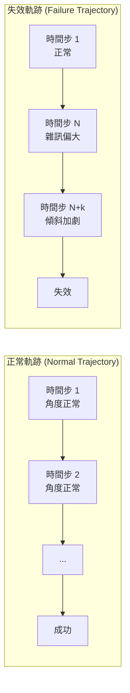
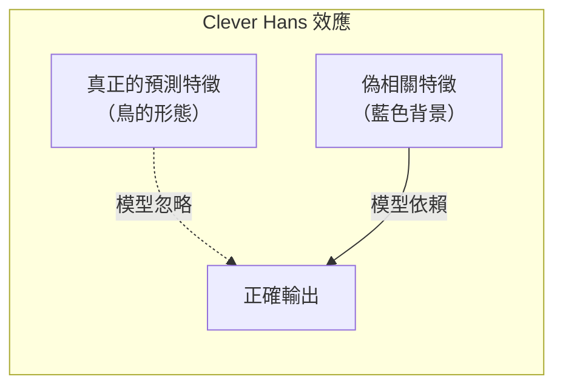
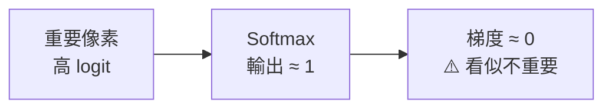
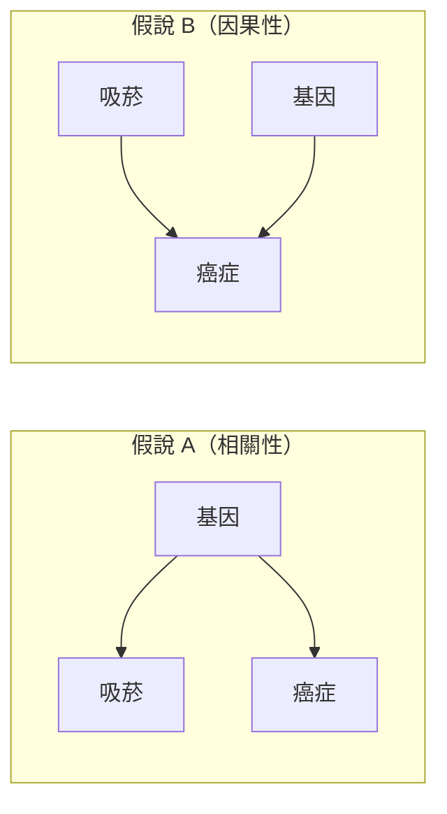
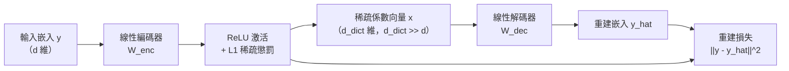
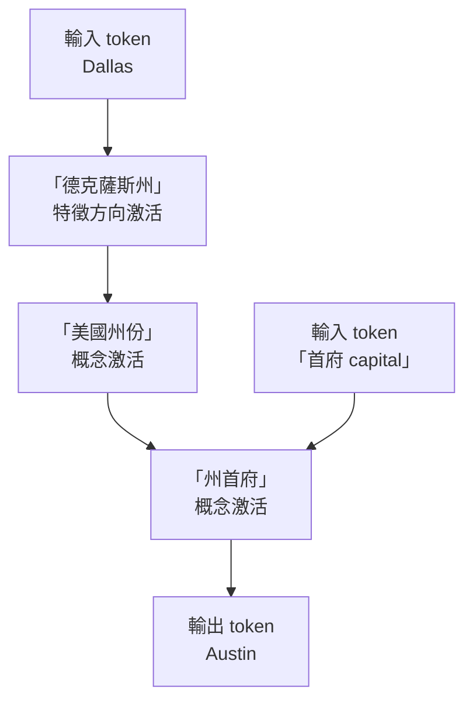
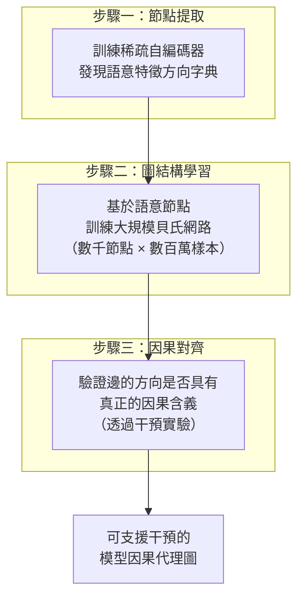

# 第 15 章：可解釋性（二）——從特徵歸因到機制性解讀 (Explainability 2)

> **本章講次來源**：本章根據 **2026 年班**的補充講次寫成（主講：課程助教 Romeo Valentin），與第 14 章（2025 年班，Sydney Katz 主講）同樣對應教科書《Algorithms for Validation》第 11 章，兩章內容互補。第 14 章介紹課程核心方法；本章從工程問題框架出發，深入視覺模型的可解釋性陷阱，並延伸到最前沿的機制性可解釋性。與第 14 章重複的主題在本章僅簡述並以交叉連結指回。

## 15.1 三個核心問題：可解釋性的工程動機

想像你是一家航空公司或自動駕駛公司的首席工程師。你的系統已歷經嚴格的失效機率評估、可達性分析與否證測試，在實驗室中表現優異。然而，系統上線後的某天，一個從未見過的關鍵失效發生了。媒體報導、投資人恐慌，CEO 走到你的辦公桌前，問了你三個問題：

1. **為什麼這個失效發生？** 我們能精確理解哪個環節出了問題嗎？
2. **我們能做什麼？** 如何修改系統或資料集，確保同類問題不再發生？
3. **如何向監管機構保證？** 我們能以利益相關人（投資者、監管機構）可理解的方式，證明問題已真正解決嗎？

這三個問題構成了本章所有可解釋性方法的評估框架。無論是簡單的特徵歸因，還是最前沿的電路追蹤，我們都將以這三個問題衡量每種方法的實用價值。

## 15.2 時間序列失效歸因

### 15.2.1 倒立擺的失效分析

以倒立擺（Inverted Pendulum）為例。假設你訓練了一個神經網路策略，絕大多數的軌跡都能成功維持平衡，但偶爾會出現如下圖所示的失效軌跡——擺桿傾倒後，系統試圖恢復，但最終進入不可挽回的失效狀態。



面對這條失效軌跡，首要問題是：**哪個時間步的雜訊是罪魁禍首？**

### 15.2.2 留一法 (Leave-One-Out)

最直觀的方法是**留一法**：依序將每個時間步的雜訊歸零，再以該組雜訊重新模擬整條軌跡，觀察是否能避免失效。

```
對每個時間步 t = 1, 2, ..., T：
  將 ε_t 設為 0（其他時間步保持原始雜訊）
  重新模擬軌跡
  記錄是否仍然發生失效
```

**限制**：若多個連續時間步的雜訊具有相關性（例如連續三步均向左偏移），單一歸零並不足以改變軌跡命運。

### 15.2.3 Shapley 值：賽局理論的貢獻分配

這個問題本質上等同於賽局理論中的**信用分配問題 (Credit Assignment)**：如何公平評估多位成員對群體成果的個別貢獻？1950 年代 Lloyd Shapley 提出的 **Shapley 值 (Shapley Values)** 正是為此而生——對每種可能的時間步子集，分別計算「加入時間步 $i$」與「不加入」時的性能差距（如強健性指標的變化），再對所有子集加權平均，因此能捕捉留一法無法處理的**協同效應 (Synergy)** 與**冗餘效應 (Redundancy)**。其完整定義、公平性公理與野火格子世界的範例，已在[第 14 章](14-explainability-1.md)第 14.3.3 節詳述，此處不重複。

此處只補充計算成本的量級：以子集定義計算，複雜度為 $O(2^n)$——40 個時間步約需 $2^{40} \approx 10^{12}$ 次軌跡評估；若改用排列形式定義（對全部 $n!$ 種排列取平均），40 個時間步更對應約 $40! \approx 8 \times 10^{47}$ 種**排列**。無論採哪種口徑，實務上都必須使用蒙地卡羅近似，或限制在連續短視窗內應用。

## 15.3 策略視覺化的補充：行為複製的死區

策略視覺化的基本作法——低維狀態空間的策略熱圖、高維狀態空間的切片視覺化——已在[第 14 章](14-explainability-1.md)第 14.2 節詳述。本節只補充一個 2026 年班講次特別強調、第 14 章未涵蓋的案例，以及一項高維處理技巧。

**案例：行為複製 (Behavioral Cloning) 的死區問題。** 在行為複製的情境下，模型只學習了「專家代理人實際走過的狀態空間」。如果專家策略總能保持擺桿於小角度範圍，模型便從未見過大角度的狀態。在策略熱圖中，這個未探索區域就會出現**死區 (Dead Zone)**——策略在此輸出隨機或反向的動作，一旦執行時進入這個區域，系統便迅速失效。


**回應三個問題**：

- 為什麼失效？ → 策略在某個狀態空間區域出現死區（訓練資料覆蓋不足）
- 能做什麼？ → 加強壓力測試專家策略、使用更多元的資料採集方式，或改用更簡單（線性）的模型
- 如何保證？ → 展示修正後的策略熱圖，確認死區消失

**高維狀態空間的補充技巧**：除了第 14 章介紹的固定部分變數做切片，也可以先用 PCA 或 t-SNE 將高維狀態空間降維，再進行視覺化。

## 15.4 最壞案例分析 (Worst-Case Analysis)

最簡單但往往最有效的方法：**直接找出表現最差的樣本，仔細閱讀它們**。

此方法由 Andrej Karpathy 在部落格中大力推薦，也在 Waymo 等自動駕駛公司的實際部署中廣泛使用。審視最壞樣本常能揭示：

- 特定天氣或光線條件（雪地、夜晚）的系統性偏差
- 資料集中特定子群體的標記錯誤
- 感測器特定失效模式的盲點

## 15.5 視覺模型的可解釋性

### 15.5.1 Clever Hans 問題：偽相關的陷阱

100 年前，德國有一匹名叫「聰明漢斯 (Clever Hans)」的馬，據稱能夠做算術。牠的主人 Wilhelm von Osten 向觀眾展示，漢斯能正確回答「3 + 5 = ?」等問題。然而，後來的研究發現，漢斯其實是在觀察主人的無意識肢體語言（當主人認為漢斯快要給出正確答案時會微微點頭），而非真的在計算。

視覺模型也有類似的問題：模型可能學習到與標籤**偽相關 (Spurious Correlation)** 的視覺線索，例如：

- 特定鳥類的圖片總是有藍色天空背景 → 模型學會「藍色背景 = 這種鳥」
- 訓練資料的時間戳記印在圖像上，且早上拍攝的都是海灘 → 模型根據時間戳記分類地點



### 15.5.2 擾動法 (Perturbation Method)

最直觀的視覺可解釋性方法：系統性地遮蔽圖像的不同區域，觀察模型輸出的變化。

```
對圖像的每個區塊 patch (i, j)：
  將該區塊遮蔽（置為黑色或平均色）
  重新執行前向傳播，記錄輸出變化
  大幅度的輸出變化 = 該區塊對預測很重要
```

**優點**：概念簡單，模型無關（Black-box）
**缺點**：無法捕捉特徵間的交互效應；計算成本高（需多次前向傳播）

### 15.5.3 梯度顯著圖的 Softmax 飽和問題

對損失函數相對於**輸入像素**求梯度，梯度大的像素表示其對預測影響大：

$$\text{Saliency}_{ij} = \left|\frac{\partial \mathcal{L}}{\partial x_{ij}}\right|$$

梯度顯著圖的基本原理見[第 14 章](14-explainability-1.md)第 14.3.2 節。本講次特別點出一個第 14 章未細講的**根本性缺陷：Softmax 飽和**。

在標準分類架構中，最後一層使用 Softmax 正規化 logit。當模型對某個類別非常確定時，對應的 logit 值極大，Softmax 輸出趨近 1。此時整個輸出對輸入的梯度趨近於 **0**，使得重要的像素反而顯示為零梯度。



### 15.5.4 積分梯度 (Integrated Gradients)

解決飽和問題的標準做法是**積分梯度**：從無資訊基準（如全黑圖像）出發，沿插值路徑逐步移向原始輸入並累積沿途梯度——即使在原始輸入附近梯度飽和，插值路徑中間點的梯度仍然顯著。其公式與直覺說明見[第 14 章](14-explainability-1.md)第 14.3.2 節。

本講次補充了它**在 LLM 上的應用**：離散 token 無法直接插值，但可以：

1. 將 token 映射至連續嵌入空間
2. 以零向量嵌入作為基準
3. 在嵌入空間進行插值，對每個 token 計算積分梯度

### 15.5.5 Grad-CAM：語意層次的定位

相較於像素層次的顯著圖，Grad-CAM 的目標是在**特徵語意層次**回答：「模型在圖像的哪個區域尋找重要特徵？」

計算步驟：
1. 選取 CNN 後期的某個特徵圖層 $A^k$（具有豐富的語意表示，但仍保有空間資訊）
2. 計算輸出 $y^c$ 對特徵圖 $A^k$ 的梯度，並做全局平均池化得到重要性權重 $\alpha_k^c$
3. 對特徵圖加權求和，再取 ReLU（只保留正向貢獻）

$$L_{\text{Grad-CAM}}^c = \text{ReLU}\left(\sum_k \alpha_k^c A^k\right), \quad \alpha_k^c = \frac{1}{Z}\sum_{i,j}\frac{\partial y^c}{\partial A_{ij}^k}$$


**結果解讀**：Grad-CAM 能告訴你「模型注意到圖中的狗的頭部」或「模型注意到貓的臀部」——這種高層次的解釋可以直接向利益相關人說明模型的行為。

### 15.5.6 健全性檢查：兩步隨機化測試

顯著圖類方法「看起來合理不等於忠實解釋模型」的系統性批評（模型權重隨機化、標籤打亂後解釋幾乎不變），見[第 14 章](14-explainability-1.md)第 14.3.2 節的警告框。本講次將其濃縮為兩步**隨機化測試**，建議在採用任何可解釋性方法前執行：

1. 隨機化模型層的權重，驗證解釋結果是否發生顯著變化
2. 輸入無意義的隨機圖像，驗證解釋結果是否也變得無意義

若解釋結果在這兩項測試下依然不變，代表該方法的輸出很可能與模型本身無關，不應採信。

## 15.6 超越特徵歸因：機制性可解釋性

前述所有方法都有一個根本限制：它們只在**輸入空間**或**輸出空間**作業，無法真正揭示模型內部的推理機制。以信用評分 LLM 為例：

即便我們從輸入中移除「種族 (Ethnicity)」欄位，模型可能仍然透過其他特徵（如郵政區碼 Zip Code）**重建**出種族資訊，並在內部使用它來影響輸出。純粹的特徵歸因方法無法偵測到這種內部機制。

### 15.6.1 因果與相關：一個歷史案例

1950 年代的統計學界曾激烈爭論「吸菸是否導致肺癌」。頂尖統計學家論稱：**無法從純觀測資料中證明吸菸導致肺癌**。他們的論點是：

> 或許存在某種基因，同時增加了吸菸的傾向**和**肺癌的風險——吸菸本身未必是原因。

從純粹的相關性矩陣（觀測資料）出發，這兩個假說（「吸菸→癌症」vs「基因→吸菸 + 基因→癌症」）在統計上無法區分。這體現了相關性推斷的根本限制。



### 15.6.2 可解釋性的二維分類框架

本講座提出了一個二維框架，整合「解釋對象」與「解釋強度」兩個軸向：

| | **關聯性說明 (Correlational)** | **機制性說明 (Mechanistic)** |
|---|---|---|
| **模型 (Model)** | 顯著圖、Shapley 值、Grad-CAM | 稀疏自編碼器、電路追蹤 |
| **真實世界 (World)** | 貝氏網路 | 微分方程、因果圖（Pearl） |

我們的最終目標是對**模型**進行**機制性**的理解，而非僅觀察輸入輸出的統計模式。

### 15.6.3 LLM 如何表示概念：方向性假說

傳統直覺認為，嵌入向量的每個維度對應一個特定概念（如維度 42 = 王者特質）。然而，大量實驗顯示，LLM 以**高維空間中的方向 (Directions in Space)** 表示概念：

- 概念由一個方向向量表示，而非單一標量維度
- 方向的數量可以**超過**嵌入空間的維度數（超完備字典，Overcomplete Dictionary）
- 任意一個特定的激活向量，可以分解為少數幾個概念方向的稀疏線性組合

$$\mathbf{y} \approx D \mathbf{x}, \quad \|\mathbf{x}\|_0 \ll d_{\text{dict}}$$

其中 $D$ 是字典矩陣（每列為一個概念方向），$\mathbf{x}$ 是稀疏係數向量。

**為什麼這在高維空間是可行的？** 在高維空間中，大多數向量幾乎是正交的（近乎正交性，Near-Orthogonality），這使得大量的概念方向可以共存於同一個嵌入空間，且彼此干擾最小。

### 15.6.4 稀疏自編碼器 (Sparse Autoencoders, SAE)

Anthropic（以及不久後的 OpenAI）開發了稀疏自編碼器來**自動發現**這些概念方向。架構極為簡單：



訓練目標：

$$\min_{W_{\text{enc}}, W_{\text{dec}}} \|\mathbf{y} - W_{\text{dec}}\,\text{ReLU}(W_{\text{enc}}\mathbf{y})\|^2 + \lambda\|\text{ReLU}(W_{\text{enc}}\mathbf{y})\|_1$$

- **重建損失**：確保解碼後的嵌入忠實還原原始激活
- **L1 稀疏懲罰**：鼓勵係數向量稀疏，每次只激活少數幾個特徵方向

訓練收斂後，$W_{\text{dec}}$ 的每一列就是一個**概念方向字典元素**。

### 15.6.5 干預驗證：Golden Gate Bridge 實驗

Anthropic 在《Scaling Monosemanticity》（2024 年 5 月）中，以稀疏自編碼器從 Claude 3 Sonnet 的內部激活萃取特徵，找到代表「金門大橋 (Golden Gate Bridge)」的特徵方向，並在推論時將該方向的激活值鉗制到其最大激活的 10 倍。結果：

> **問**：「你是什麼？」
> **模型**：「我是金門大橋。我橫跨舊金山灣……」

這個實驗展示了**因果干預**的力量：不只是觀察哪個特徵方向被激活，而是主動操縱特徵，驗證其對輸出的因果影響。Anthropic 並曾於 2024 年 5 月短暫公開這個被干預的展示模型「Golden Gate Claude」。

### 15.6.6 電路追蹤 (Circuit Tracing)

在獲得所有層的語意特徵字典後，下一步是找出這些語意節點之間的**因果關係圖**——即所謂的電路追蹤。

以 Anthropic《On the Biology of a Large Language Model》（2025 年 3 月）中的「德克薩斯州首府」實驗為例：

> **輸入**：「包含達拉斯 (Dallas) 的州的首府是……」
> **輸出**：「奧斯汀 (Austin)」

電路追蹤能夠展示模型如何從「Dallas」這個 token 激活「德克薩斯州 (Texas)」概念方向，再從「Texas」激活「州首府」概念方向，最終生成「Austin」——一個真實的**兩跳推理**過程。



### 15.6.7 機制性可解釋性的三步挑戰



每一步都是目前研究的開放挑戰：
- **步驟一**：SAE 的理論基礎仍不完善，且找到的特徵方向是否真正對應人類可理解的概念尚待驗證
- **步驟二**：在數千節點規模上訓練貝氏網路，組合爆炸問題（AA228 課程的貝氏網路作業僅處理約 50 個節點）
- **步驟三**：如何確認找到的是真正的因果邊，而非統計關聯

## 15.7 回到三個問題：各方法的比較

| 方法 | 為什麼失效？ | 能做什麼？ | 如何保證？ | 適用規模 |
|---|---|---|---|---|
| 留一法 | 部分，忽略相關性 | 有限 | 難 | 小型時間序列 |
| Shapley 值 | 是，考慮交互效應 | 有限 | 難 | 特徵數少（約 20 以下可精確計算，更多需蒙地卡羅近似） |
| 策略視覺化 | 是，直觀 | 是 | 是（展示修正圖） | 低維狀態空間 |
| 最壞案例分析 | 是，發現系統性問題 | 是 | 部分 | 任意 |
| 擾動法 | 部分 | 有限 | 難 | 中型圖像模型 |
| 積分梯度 | 部分 | 有限 | 難 | 中大型神經網路 |
| Grad-CAM | 語意層次，直觀 | 有限 | 部分 | CNN 與 ViT |
| 稀疏自編碼器 + 電路追蹤 | 是，機制層次 | 是（干預） | 是（因果驗證） | LLM（前沿研究） |

## 15.8 與形式化驗證的連結

本書前面的章節介紹了否證測試（第 5–6 章）與可達性分析（第 11–13 章）等驗證方法。機制性可解釋性與這些方法的潛在連結是當前研究的前沿課題：

- 若能找到模型內部「種族特徵」的因果電路，可針對這個電路設計**靶向干預**，而非重新訓練整個模型
- 干預後，可以用可達性分析驗證「種族特徵→信用分數」的因果鏈是否確實被切斷
- 這種「找到問題→解釋問題→干預修復→形式化驗證」的管線，是安全關鍵 AI 系統的理想工作流程


## 15.9 本章小結

本章從簡單的時間序列失效歸因（留一法、Shapley 值）出發，進展到視覺模型的擾動分析與梯度可解釋性（Softmax 飽和問題、Grad-CAM），最後介紹了目前最前沿的機制性可解釋性研究（稀疏自編碼器、電路追蹤）。

核心洞見：

- 可解釋性方法從**輸入空間**（特徵歸因）進化到**語意空間**（Grad-CAM），最終走向**機制空間**（電路追蹤）
- 每種方法都應以「為什麼失效、能做什麼、如何保證」三個問題評估其實用性
- 機制性可解釋性入選 MIT Technology Review 於 2026 年 1 月發布的「2026 年十大突破技術」榜單，也是安全關鍵 AI 系統最需要的能力
- 任何可解釋性方法都應先通過**兩步隨機化測試**（見 15.5.6），確認解釋結果確實反映模型本身

> **研究建議**：如果你對此領域有興趣，Stanford 於 2026 年春季開設的 CS 221M（機制性可解釋性）——由哲學系教授 Thomas Icard 等四位講師合授——以及 Anthropic 的 SAE 論文是很好的起點。將機制性可解釋性與形式化驗證（可達性分析）結合，可能是安全關鍵 AI 系統未來最重要的研究方向之一。

**下一章預告**：第 16 章是 Somil Bansal 的客座講座，將回到形式化方法的世界——以 Hamilton-Jacobi 可達性為工具，對視覺控制系統進行閉迴路壓力測試。
