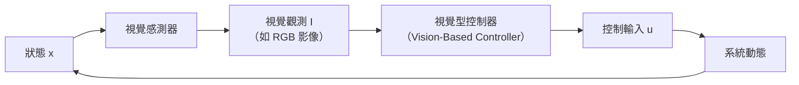
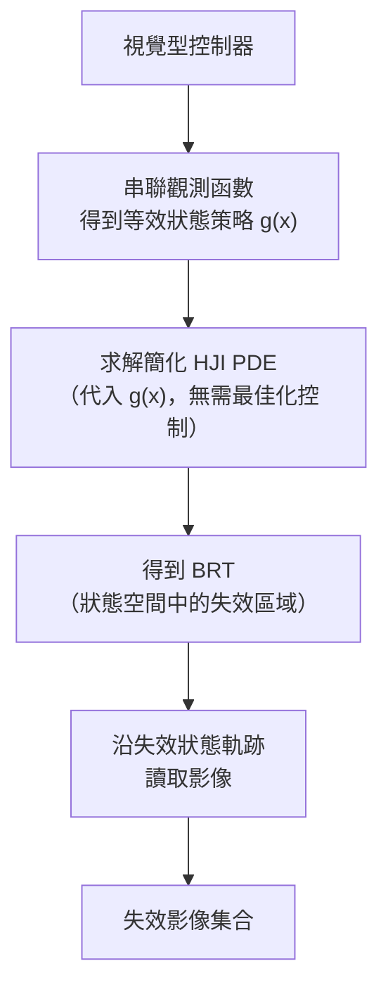
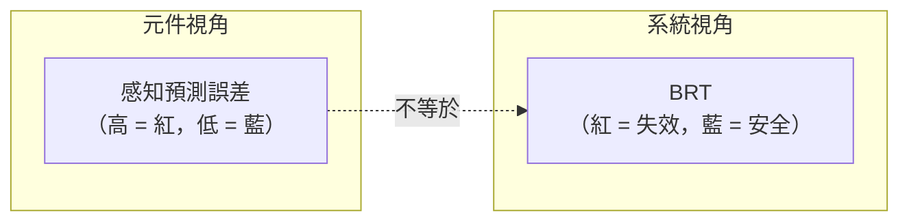
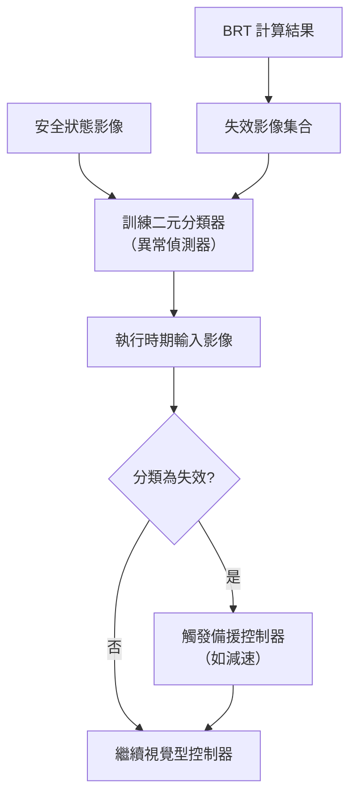
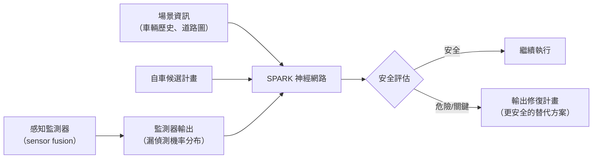
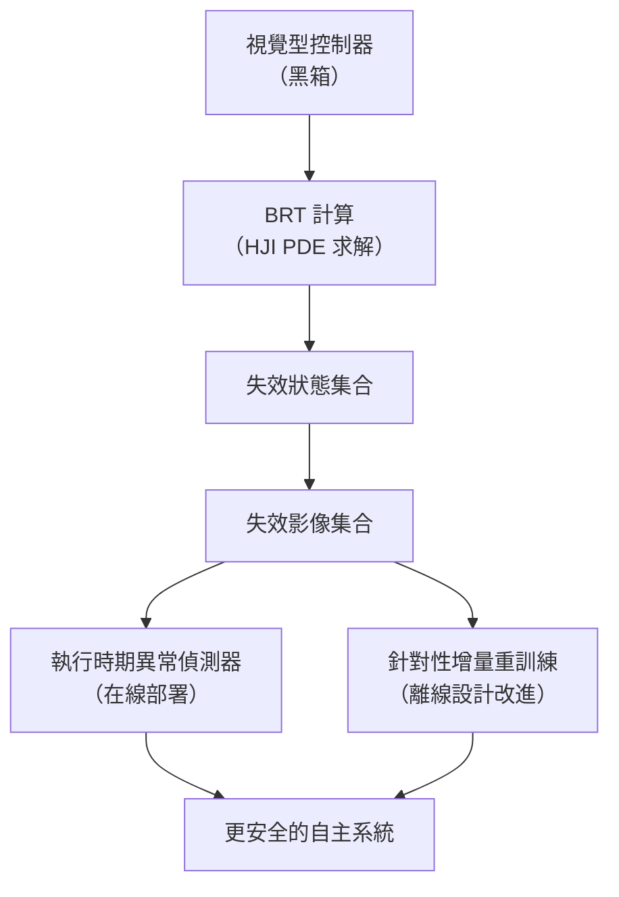

# 第 16 章：客座講座——Somil Bansal（安全智能自主實驗室）(Guest Lecture: Somil Bansal)

在第 11–13 章中，我們學會了以可達性分析為系統提供形式保證；第 14–15 章則探討了如何解釋學習型元件的決策。本章的客座講座恰好把這兩條線索接在一起：**將 Hamilton-Jacobi 可達性用於視覺型控制器的壓力測試**——既能系統性地挖掘失效，又能回答「哪些感知錯誤才真正危及安全」這個可解釋性問題。

本章記錄史丹佛大學航空太空學系（Aeronautics & Astronautics）助理教授 Somil Bansal 的客座講座。Bansal 教授主持**安全智能自主實驗室 (Safe and Intelligent Autonomy Lab, SIA Lab)**，先前曾任南加州大學電機與電腦工程學系助理教授，以及 Waymo 的研究科學家。研究聚焦於在新的、不確定環境中具備可保證安全性與高性能的機器人自主演算法，應用範疇包括自動駕駛無人機、自駕車、航空器及太空機器人。

---

## 16.1 安全性作為連續過程

現代自主系統的自主堆疊中，機器學習的滲透率日益提高——從感知、預測到規劃與控制。機器學習雖能捕捉複雜的現實世界場景，卻也帶來全新的安全挑戰（例如 Cruise 自動駕駛車的舊金山事件）。

Bansal 教授提出，應將**安全性視為貫穿系統整個生命週期的連續過程**，分為三個階段：

1. **訓練時期安全性**：在訓練階段程式化地納入安全要求，使輸出的 AI 系統本身具備安全意識。
2. **部署時期適應**：偵測何時超出訓練資料分布 (Out-of-Distribution, OOD)，並對應調整安全機制。
3. **壓力測試與週期性改進**：挖掘安全關鍵失效模式，用以改進系統設計，從而閉合這個循環。

本章聚焦第三個階段——**如何對視覺型控制器進行壓力測試以挖掘安全關鍵失效，並利用這些失效改進系統本身**。

---

## 16.2 問題形式化：挖掘視覺型控制器的失效

### 系統架構

考慮一個機器人系統：

- **系統**：具動態（狀態 $x$、控制 $u$）的機器人，搭載視覺感測器（RGB 影像或點雲）。
- **視覺型控制器**：以視覺觀測 $I$ 為輸入，輸出控制 $u$。
- **假設**：可存取模擬器以進行壓力測試。
- **目標**：找出導致整體系統安全違規的視覺輸入 $I$。

### 策略：轉化為可達性問題

將觀測函數與視覺型控制器串聯，即可得到一個等效的**基於狀態的策略 (state-based policy)** $g(x)$。如此一來，可對簡化後的閉迴路系統計算**後向可達管 (Backward Reachable Tube, BRT)**，再回到視覺空間讀取失效影像。

---

## 16.3 Hamilton-Jacobi 可達性：五分鐘入門

Hamilton-Jacobi (HJ) 可達性是計算 BRT 的核心工具，以下提供簡明介紹。

### 後向可達管 (BRT)

> **定義**：BRT 是所有這樣的初始狀態的集合：**即使**系統採取最佳的（極力避開失效的）控制行動，軌跡仍無法避免在時間範圍內最終進入預先定義的「失效集合 (failure set)」。等價地說，從這些狀態出發，**任何**控制策略都無法阻止系統進入失效集合。

以四軸飛行器在房間中縱向飛行為例，天花板與地板構成失效集合。淺紅色區域即為 BRT：系統若從這些狀態出發，無論如何控制，終將撞上天花板或地板。藍色區域為**安全集合 (Safe Set)**，是 BRT 的補集，具有**控制不變 (control-invariant)** 的性質——若系統從此區域出發，存在某策略使其永遠留在此區域內。

### 失效集合的隱式表示

選取函數 $L(x)$ 隱式表示失效集合：

$$L(x) < 0 \; \Leftrightarrow \; x \in \text{失效集合}$$
$$L(x) > 0 \; \Leftrightarrow \; x \notin \text{失效集合}$$

一個常見選擇是到失效區域的**有號距離函數 (Signed Distance Function)**。

### 累積安全獎勵

一條軌跡的**累積安全獎勵**定義為：

$$J = \min_{t \in [0, T]} L(x(t))$$

- $J < 0$：軌跡曾進入失效集合 → **不安全**。
- $J \geq 0$：軌跡始終在失效集合外 → **安全**。

### 價值函數 V(x)

我們求解一個微分博弈——擾動試圖最小化累積獎勵（強迫系統進入失效集合），控制嘗試最大化它：

$$V(x) = \max_{u} \min_{d} J$$

**價值函數的直觀意義**：$V(x)$ 代表系統最接近失效集合的程度。

| 情況 | 意義 |
|------|------|
| $V(x) < 0$ | 不安全狀態（屬於 BRT） |
| $V(x) \geq 0$ | 安全狀態 |

因此：$\text{BRT} = \{x : V(x) < 0\}$

### 求解 V 的偏微分方程

在連續時間、連續狀態下，Bellman 方程退化為 **Hamilton-Jacobi-Isaacs (HJI) 偏微分方程**：

$$\frac{\partial V}{\partial t} + \min\left(0,\; H(x, \nabla V)\right) = 0$$

求解此 PDE 即可得到全域最優的價值函數。

### 安全控制器

得到 $V$ 後，安全控制器為：

$$u^*(x) = \arg\max_u \; \nabla V(x) \cdot f(x, u)$$

直觀上，此控制器對 $V$ 進行**梯度上升**，不斷將系統推向更正（更安全）的方向。

> **重力不對稱範例**：四軸飛行器的 BRT 在底部明顯比頂部大——因為重力預設將機器人拉向地板，需要更大的控制力才能在底部維持安全，所以底部的 $V$ 更負。

---

## 16.4 以 BRT 壓力測試視覺型控制器

### 方法流程

關鍵：求解時不需最佳化控制，直接代入已知的學習型控制器 $g(x)$，使 PDE 更簡單。

---

## 16.5 案例研究一：自動駕駛飛機滑行

### 情境設定

- **控制器**：以機翼攝影機的 CNN 影像維持飛機在跑道上滑行。
- **失效集合**：飛機偏出跑道。

### BRT 計算結果

- 紅色區域：系統將從這些初始狀態偏出跑道（BRT）。
- 藍色區域：系統將在跑道上保持安全（安全集合）。

### 關鍵發現

沿失效軌跡讀取影像後，分析發現：**跑道標線**使 CNN 將其誤認為跑道中心線，並向其轉向。當系統意識到錯誤時已為時過晚，飛機偏出跑道。

### 系統級失效 vs. 元件級錯誤

這項發現揭示了一個重要的區別：

- 某些狀態的**感知誤差很高，但不影響系統安全**（下游規劃器補償了感知錯誤）。
- 某些狀態的**感知誤差很低，卻足以觸發系統失效**。
- **結論**：並非所有感知誤差都同等重要。BRT 方法針對的是**導致系統級失效的感知錯誤**，而非僅評估元件本身。

---

## 16.6 環境潛在變量的影響

BRT 可針對不同的環境潛在變量（如時段、雲量）分別計算，從而建立跨不同條件的失效影像目錄。

| 環境條件 | BRT 變化 | 原因 |
|----------|----------|------|
| 白天 → 夜晚 | BRT 整體擴大 | 夜間能見度降低，視覺控制器更易出錯 |
| 夜晚（跑道標線不清晰） | 白天的「標線失效狀態」恢復安全 | CNN 夜間無法清晰辨識標線，因而不受混淆 |

---

## 16.7 案例研究二：室內導航（ResNet 架構）

- **架構**：RGB 影像 → ResNet → 目標點 → 底層 MPC 控制器。
- **訓練環境**：以光寫實模擬器在史丹佛建築中採集資料，具良好的模擬至真實遷移 (sim-to-real transfer)。
- **壓力測試發現**：CNN 學到一個**偽相關性 (spurious correlation)**——淺色表面＝可通行。
  - 訓練資料：淺色地板＋深色牆壁。
  - 測試失效：淺色牆壁＋深色地板 → 機器人試圖穿越牆壁而碰撞。

---

## 16.8 利用失效資料改進系統

### 方法一：執行時期異常偵測

- 飛機滑行範例：異常偵測器標記跑道標線影像 → 觸發減速備援 → 通過後恢復視覺控制。
- **限制**：僅對壓力測試環境的分布內 (in-distribution) 情況有效；OOD 環境無效。

### 方法二：針對性增量重訓練

- 以失效影像及其標籤對視覺控制器進行更多訓練迭代。
- 在部分切片上，BRT 確實因重訓練而縮小。
- **挑戰——神經網路無單調改進保證**：
  - 加入更多資料 $D_2 \supset D_1$ **不保證**網路性能單調提升。
  - 重訓練可能在修復舊失效的同時，**引入新的失效模式**（在不同 BRT 切片中可見）。

---

## 16.9 SPARK：感知不確定性下的系統級安全評估

### 情境：模組化自動駕駛流水線

自動駕駛系統通常由以下模組串接：感知 → 預測 → 規劃。

### 核心洞察

**並非所有感知錯誤都具有相同的安全影響：**

- 漏偵測遠處、無關的車輛 → 計畫不受影響。
- 漏偵測靠近自車、行進路徑上的車輛 → 計畫可能不安全。

### SPARK 框架

- **感知監測器**：透過攝影機、LiDAR、雷達的感測器融合，找出各感測器之間的不一致，辨識潛在漏偵測目標。
- **SPARK 神經網路輸入**：監測器輸出（漏偵測機率分布）+ 自車計畫 + 場景資訊。
- **輸出**：安全評估（安全／危險／關鍵）+ 修復計畫。
- **訓練方式**：離線監督學習（模擬各種感知不確定性場景，評估計畫安全性）。
- **執行速率**：42 Hz（vs. 詳盡規劃評估的 10 Hz）→ 可作為**代理模型 (surrogate model)**。

---

## 16.10 系統級測試 vs. 元件級測試

| 維度 | 端到端（系統級） | 模組化（元件級） |
|------|----------------|----------------|
| **規格撰寫** | 容易（如：碰撞即失效） | 困難（每個元件需單獨定義失效） |
| **可解釋性** | 低，無法追蹤責任歸因 | 較高，可追蹤至特定模組 |
| **失效區域** | 較緊（已計入下游補償效果） | 保守偏大（不確定性傳播困難導致超集） |
| **系統改進** | 困難，無法定位應修復的模組 | 較易，可針對性修復特定元件 |
| **黑箱友善度** | 高，整個管道視為黑箱 | 需了解各模組介面 |

---

## 16.11 開放挑戰

### 1. 泛化問題

壓力測試結果受限於所測試的環境分布；一旦進入未測試環境，結論可能不成立。

**潛在解法：**
- **數位孿生 (Digital Twin)**：進入新環境時，在模擬器中建立該環境的孿生模型，再執行壓力測試。
- **視覺模型（NeRF / Gaussian Splatting）**：以少量影像生成豐富的視覺場景模型，用於壓力測試。
- **文字轉場景（GenAI）**：以事故報告文字（如警察報告）驅動生成式模型，在模擬器中重建場景，用於 OOD 壓力測試。

### 2. 神經網路無單調改進保證

給定資料集 $D_1$，加入 100 筆新資料得到 $D_2$，**無法保證**在 $D_2$ 上訓練後的神經網路優於在 $D_1$ 上的版本。這是改進自主系統的根本障礙。

### 3. 可解釋性與責任歸因

BRT 框架告訴我們**哪些影像**會導致失效，但**不告訴我們為何失效**（即影像中的哪個視覺特徵是根本原因）。目前仍需人工分析（如遮蔽影像不同區域）。黑箱方式雖簡化壓力測試，但嚴重削弱可解釋性。

### 4. OOD 偵測

本文的異常偵測器是**分布內 (in-distribution)** 異常偵測，**不等於** OOD 偵測。面對全新類型的跑道或環境，偵測器可能失效。OOD 偵測是一個獨立且重要的研究課題。

### 5. 不確定性傳播

在模組化管道中，理想情況下應能將感知不確定性完整傳播至下游規劃。然而，目前預測模型十分複雜，精確傳播在計算上極為困難。粒子濾波器（POMDPs）是一個有前景但在業界仍未充分探索的方向。

---

## 16.12 本章小結

1. **安全是連續過程**：訓練時期保證 → 部署時期適應 → 生命週期改進，形成閉環。
2. **HJ 可達性是強大工具**：以偏微分方程求解 BRT，提供全域最優的系統級安全評估。
3. **系統級失效 ≠ 元件級誤差**：BRT 找到的是「對系統安全真正有影響的感知失效」，而非所有感知誤差。
4. **挖掘到的失效可雙向利用**：離線（重訓練）與在線（異常偵測）皆可受益。
5. **開放問題眾多**：泛化、單調改進、可解釋性、不確定性傳播，均是值得深入研究的方向。

本講的「執行時期異常偵測器」已預示了全書的最後一個主題：離線驗證做得再好，部署後仍需有人站崗。下一章（第 17 章）將系統性地探討**執行時期監控**——在系統運行期間即時守護安全的最後一道防線，並為整個課程作結。
