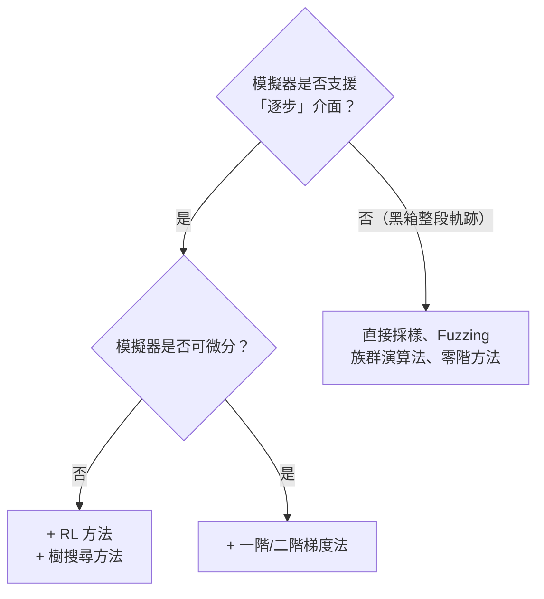
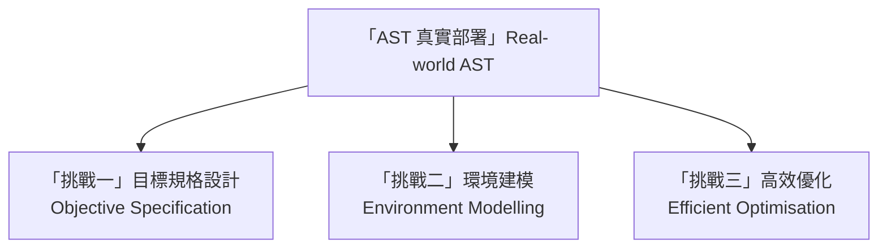
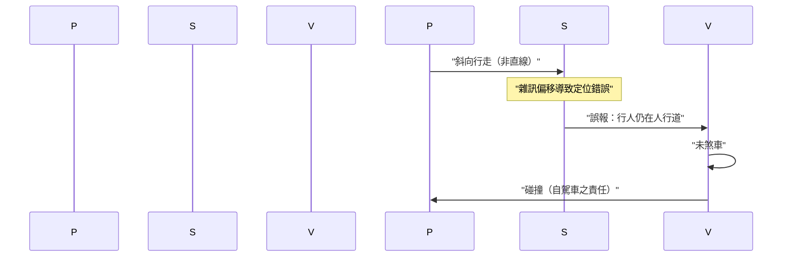
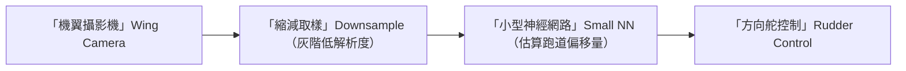
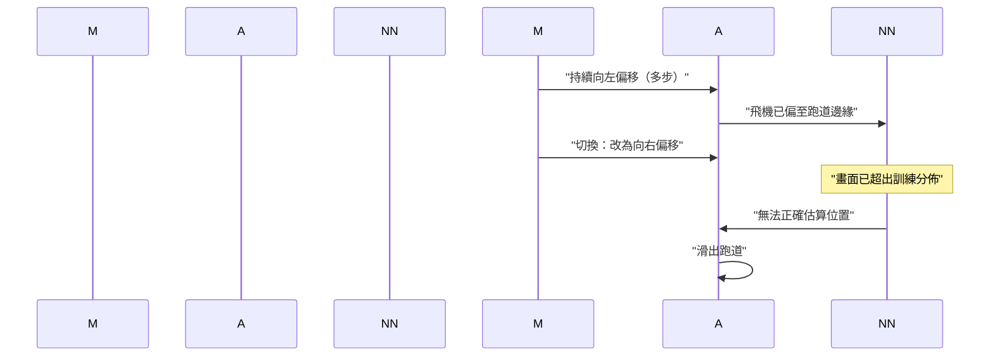
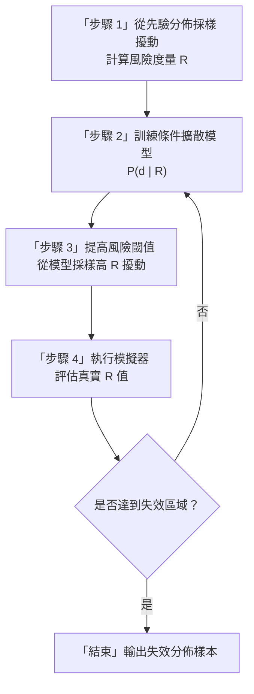
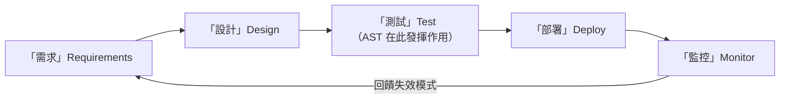
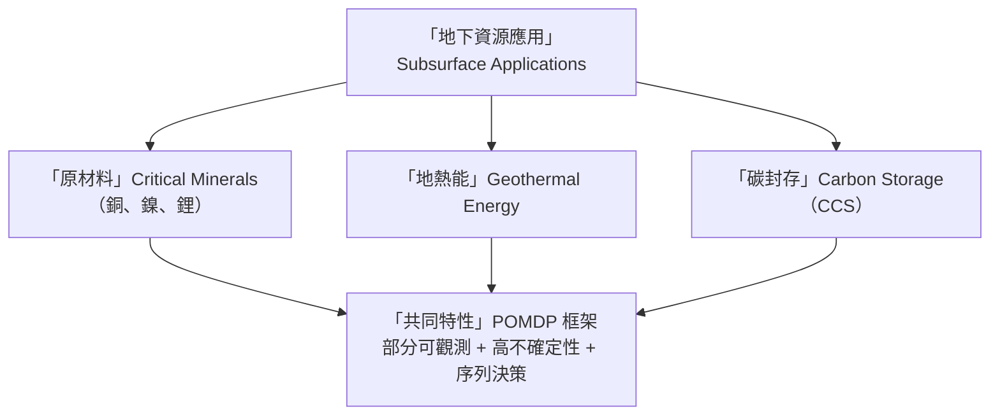

# 第 17 章：訪問講座——Anthony Corso 與 Terra AI

> **訪問講者**：Anthony Corso（Stanford SISL 博士、前 Stanford AI 安全中心執行主任、Terra AI 創辦人）
>
> 本章涵蓋兩大主題：(1) 強化學習偽造法與自適應壓力測試（Adaptive Stress Testing, AST）在真實交通系統中的應用挑戰與解法；(2) 地球資源決策問題的安全關鍵性。

---

## 17.1 強化學習作為偽造工具的回顧

在上一講中，我們討論了以規劃技術（RRT、MCTS）進行偽造的方法。本章一開始先補完最後一塊拼圖：以**強化學習（Reinforcement Learning, RL）**驅動對抗者（adversary），讓它學會如何對系統施加擾動以誘發失效。

### 對抗者框架

這個迴路與強化學習的標準 agent-environment 迴路完全等價，只是：

- **動作 (Action)** = 對系統施加的擾動（感測器雜訊、其他代理的行為……）
- **獎勵 (Reward)** = 系統距離失效的接近程度（失效越近，獎勵越高）
- **目標** = 訓練一個對抗策略，使系統儘可能頻繁地失效

### RL 相較於樹搜尋的優勢

| 面向 | 樹搜尋（MCTS/RRT） | 強化學習 |
|---|---|---|
| 初始狀態泛化 | 每個初始狀態需重新搜尋 | 單一策略可泛化至多種初始狀態 |
| 樣本效率 | 需大量展開 | 藉助數十年 RL 研究成果 |
| 實作複雜度 | 相對直觀 | 需調整超參數 |

### 自適應壓力測試（AST）

> **定義**：以 MCTS 或深度 RL 為搜尋引擎，以「**最可能的失效**」為優化目標，而非任意失效。

AST 的獎勵函數同時包含：

1. 失效信號（是否發生碰撞等）
2. 擾動的**對數似然**（越罕見的擾動，懲罰越重）

此概念由 SISL 校友 **Richie Lee** 提出，最初用於驗證 ACAS X 航空衝突迴避系統。

---

## 17.2 選擇偽造方法的準則

模擬器的類型是決定可用方法的首要限制：

其他考量因素：

- **失效稀少性**：失效越罕見，越值得使用 MCTS、RL 等樣本高效方法
- **領域特性**：沒有放諸四海皆準的算法，需實驗驗證

---

## 17.3 真實世界 AST 的三大挑戰

Anthony Corso 在演講中將實際部署 AST 的困難歸納為三個方向：

---

## 17.4 挑戰一：目標規格設計

### 自動駕駛行人場景

SISL 設計了一個簡單場景：行人過馬路，自駕車應煞停。擾動包含：

- 行人的行走路徑偏差
- 自駕車的感測器定位雜訊

初始獎勵函數：

$$r = r_\text{failure} + r_\text{closeness} + r_\text{likelihood}$$

**問題**：優化結果顯示，最常見的「失效」是行人直接衝向已停下的車輛——這完全是行人的錯，並非自駕車失效。

### 解法：責任感知安全規範（RSS）

**責任感知安全（Responsibility-Sensitive Safety, RSS）** 以數學方式將道路交通規則形式化，並能判斷事故中誰應負責。

修改目標為：

> 只搜尋**自駕車應負責的失效**情境。

結果：AST 找到了更具代表性的失效——行人以斜向步態穿越，感測器雜訊偏移導致車輛誤判行人仍在人行道上，最終發生碰撞。此情境與 2018 年 Uber ATG 事故高度相似。

**關鍵洞見**：規格必須編碼**責任歸屬**，而非僅追蹤物理接觸。

---

## 17.5 挑戰二：環境建模

### 建模困難來源

1. **人類駕駛行為**極為複雜，建立精確模型的難度等同於建立一輛自駕車
2. **感測器雜訊**（LiDAR、攝影機）維度極高，不像 GPS 有明確的誤差分佈

### 從數據學習環境模型

利用公開數據集（無人機俯瞰高速公路、路口固定攝影機等）訓練模型：

- 自動分割與物件偵測 → 各車輛的時序軌跡
- 使用**生成對抗網路（GAN）** 學習代理的行為分佈

GAN 在本脈絡中的兩種應用：

| 應用 | 說明 |
|---|---|
| **多代理行為模型** | 學習高速公路上多輛車的聯合行為（煞車傳遞、變換車道等） |
| **感測器外觀模型** | 生成特定場景（如跑道）下攝影機所見影像，用於模擬器 |

> 實務上，環境建模所耗費的工程資源往往遠超偽造演算法本身。

---

## 17.6 挑戰三：高效優化——TaxiNet 案例

### 系統描述

**TaxiNet** 是一個讓飛機自主滑行的系統：

設計使用**小型神經網路**的原因：可應用形式化神經網路驗證工具。

### 逐步分析流程

**步驟 1：單步最壞情況分析**

對每個時間步，以神經驗證工具求解：

$$\max_{\delta \in \mathcal{B}_\epsilon} \text{steering\_error}(x + \delta)$$

其中 $\mathcal{B}_\epsilon$ 為像素擾動的 $\epsilon$-球。

結果：即使每步都施加同方向最壞擾動，飛機仍能保持安全（神經網路具備魯棒性）。

**步驟 2：MCTS 序列搜尋**

以 MCTS 在每個時間步選擇「向左偏」或「向右偏」的最壞擾動，在 3% 擾動閾值下發現關鍵失效：

**核心結論**：

- 2% 擾動：未發現失效
- 3% 擾動：MCTS 找到非直觀的序列失效模式
- **失效可從複雜的事件序列中湧現**，單步分析不足以評估安全性

---

## 17.7 DIFFS：基於擴散模型的失效採樣

Harrison（SISL）開發的 **DIFFS（Diffusion-based Failure Sampling）** 方法，針對高維自主系統的失效發現問題。

### 核心思想

將失效發現視為**條件生成建模**任務：

> 學習一個擴散模型，能在給定高風險度量值 $R$ 的條件下，生成擾動序列 $\mathbf{d}$。

### 迭代演算法

### 實驗結果

| 系統 | 說明 |
|---|---|
| **2D 玩具問題** | 擾動來自二維高斯分佈；失效區域在左上/右上角；DIFFS 樣本與 MC 真實分佈高度吻合 |
| **倒立擺** | 擾動施加於扭矩；迭代過程可視化顯示逐步收斂至高失效區 |
| **F-16 模型** | 高自由度飛行動力學；DIFFS 找到高似然失效軌跡（飛機觸地）；傳統優化器難以解決 |

---

## 17.8 安全驗證的整體性

Corso 強調，AST 只是安全工程完整循環中的一個環節：

### 遷移學習加速驗證

當系統更新後，舊版的驗證結果失效。**遷移學習（Transfer Learning）**可將舊版失效案例作為新版驗證的熱啟動（warm-start），大幅縮短搜尋時間。

---

## 17.9 地球資源問題與安全關鍵性

### 氣候背景

全球暖化路徑取決於政策選擇：

- 現有政策：約 2.7°C 升溫
- 無作為：超過 4°C 升溫
- 積極減排：可控制在 1.5–2°C

應對挑戰需要：再生能源、碳儲存、電氣化，以及大量關鍵礦產（銅、鎳、鋰）。

### 地下資源的共同特性

### 碳封存（CCS）問題

將 CO₂ 注入深層鹽水層並以不透水岩石封蓋，使其長期滯留地下：

**決策問題**：
- 在哪裡注入？注入多少？
- 如何規劃探測鑽孔的順序以最大化資訊？

**不確定性來源**：地質結構未知，觀測手段有限（地震勘探、鑽孔感測器）

**代理模型加速**：物理模擬器每次需 10–12 小時 → 以深度神經網路（監督學習）訓練代理模型，速度提升千倍

**結果**：POMDP 求解器在 CO₂ 洩漏指標上優於人類儲層工程師（從 16% 洩漏降至接近 0%）

### 安全風險

| 風險類型 | 說明 | 案例 |
|---|---|---|
| **誘發地震** | 高壓注入液體可重新激活斷層 | 南韓地熱廠導致地震 |
| **CO₂ 洩漏** | CO₂ 沿斷層遷移回地表，可能窒息人畜 | 1986 年喀麥隆尼奧斯湖事件 |

### 未來研究方向

- 將 AST 風格的主動失效搜尋應用於地下決策代理
- 搜尋導致最壞結果的地質配置（「地質擾動」類比感測器擾動）
- 可用作起點的基準：簡化版 CO₂ 注入 POMDP（NeurIPS 研討會論文）

---

## 17.10 章節摘要

| 主題 | 核心要點 |
|---|---|
| **RL 偽造** | 對抗者 = RL 代理；可泛化至多初始狀態 |
| **AST** | 最可能失效 = 似然加權獎勵；MCTS 或深度 RL 搜尋 |
| **模擬器選擇準則** | 黑箱→零階；逐步→RL/樹搜；可微→梯度法 |
| **目標規格（RSS）** | 需編碼責任歸屬，不能只追蹤接觸 |
| **環境建模（GAN）** | 從數據學習代理行為與感測器外觀 |
| **TaxiNet** | 單步最壞分析不夠；MCTS 揭露序列失效 |
| **DIFFS** | 條件擴散模型迭代逼近失效分佈 |
| **安全整體性** | AST 僅為完整安全工程循環的一部分 |
| **地下資源** | POMDP 框架；代理模型；安全風險（地震、洩漏） |

---

## 延伸閱讀

- Lee, R. et al. (2020) — *Adaptive Stress Testing for Autonomous Vehicles*（AST 原始論文）
- Responsibility-Sensitive Safety（Mobileye RSS 白皮書）
- Harrison — DIFFS 論文（擴散模型失效採樣）
- Robert 的多場景 AST 框架
- 神經網路驗證工具（詳見本課程後續講次）
- Kochenderfer — *Algorithms for Decision Making*（POMDP 背景）
