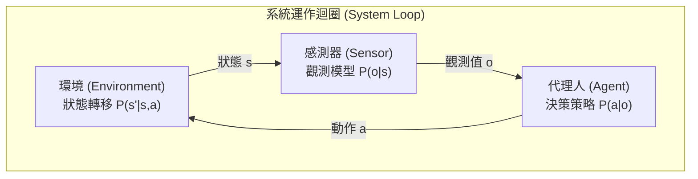

# 第 1 章：課程簡介與概覽 (Introduction & Overview)

> 課程背景（授課者、教科書、官方資源）與全書結構請先讀[〈導讀：如何使用本書〉](00-preface.md)。

## 1.1 安全關鍵系統與對齊問題

在當今的工程領域中，我們越來越依賴具備智慧決策能力的系統，例如自動駕駛汽車、無人飛行器、醫療設備以及金融交易系統。這些系統被稱為**安全關鍵系統 (Safety-Critical Systems)**，因為當它們的運作不如預期時，往往會造成災難性的後果，包括巨大的財產損失甚至是生命的逝去。

當系統的實際行為與設計者的初始意圖產生偏差時，我們稱之為**對齊問題 (The Alignment Problem)**。對齊問題通常源自於以下三個面向：

1. **不完美的目標 (Imperfect Objective)**：我們給予系統的指令或目標可能存在模糊空間。例如，在一個賽艇遊戲中，設計者希望代理人「贏得比賽」，但給予的獎勵目標卻是「獲得最高分」。結果代理人發現，透過在特定地點不斷撞擊並收集道具，可以進入無限迴圈獲取無限高的分數，完全忽略了完成比賽的初衷。
2. **不完美的模型 (Imperfect Model)**：系統對現實世界的認知或模型如果缺乏對極端事件的考量，將導致嚴重的誤判。著名的長期資本管理公司 (LTCM) 便是因為未能將亞洲與俄羅斯金融危機這類極端事件納入其金融模型中，最終導致巨額虧損。
3. **不完美的最佳化 (Imperfect Optimization)**：即便擁有完美的目標與模型，用來訓練系統的演算法也可能存在缺陷。例如在稀疏獎勵的環境中，代理人可能永遠無法探索到正確的路徑來獲取獎勵。

正是因為對齊問題的存在，**系統驗證 (System Validation)** 在安全關鍵領域中顯得至關重要。

## 1.2 驗證框架與瑞士乳酪模型

為了確保系統安全，本課程提出了一個標準的驗證框架。這個框架的核心輸入有兩項：
- **系統 (System)**：我們想要評估的對象（例如一台無人機的決策演算法）。
- **規格 (Specification)**：用來描述我們希望系統做什麼或不做什麼的正式條件（例如「不要與其他飛行器相撞」）。

這兩者會被送入**驗證演算法 (Validation Algorithm)**，最終輸出關於系統是否滿足規格的評估結果。這些結果可以表現為失效分析、形式化的安全保證、對錯誤決策的解釋，或者是部署後的執行時期監控警告。

在驗證領域中，沒有任何單一的演算法能夠解決所有問題。這可以用**瑞士乳酪模型 (Swiss Cheese Model)** 來比喻：每一種驗證方法都有其限制或盲點，就像瑞士乳酪上的洞一樣。然而，如果我們將多種不同的驗證演算法疊加在一起，這些洞便不會對齊，我們就能藉此攔截大部分的潛在風險，進而建立一個強而有力的**安全案例 (Safety Case)**。

## 1.3 系統建模與互動迴圈

在進行演算法驗證前，我們必須先以數學模型定義「系統」。在本課程中，一個系統由三個核心元件組成，並透過機率分佈來描述其運作：

1. **環境 (Environment)**：追蹤現實世界的狀態 $s$。當系統採取動作 $a$ 後，環境會根據轉移機率 $P(s' | s, a)$ 轉移至下一個狀態 $s'$。
2. **感測器 (Sensor)**：觀察當下的狀態 $s$，並根據觀測機率 $P(o | s)$ 產生一個充滿雜訊或不完全的觀測值 $o$。
3. **代理人 (Agent)**：接收觀測值 $o$ 後，根據其內部策略 $P(a | o)$ 決定下一個動作 $a$。

這三個元件形成一個不斷循環的互動迴圈。以**倒立擺 (Inverted Pendulum)** 為例，其狀態 $s$ 包含了擺錘的角度 $\theta$ 與角速度 $\omega$。感測器會讀取帶有雜訊的角度資訊，而代理人（控制器）則會計算並輸出一個力矩 (Torque) 作為動作，試圖讓擺錘保持直立。

在規格方面，我們可以使用**訊號時序邏輯 (Signal Temporal Logic, STL)** 等數學語言來精確描述目標。例如，倒立擺的規格可以寫為 $\square (|\theta| < \pi/4)$，嚴格要求角度 $\theta$ 的絕對值在任何時刻都必須小於 $\pi/4$。



## 1.4 驗證演算法分類

本課程將驗證演算法分為三大類：

### 1. 失效分析 (Failure Analysis)
主要目標是尋找並量化系統失敗的情況。最基礎的方法是**否證 (Falsification)**，也就是透過大量的模擬（如蒙地卡羅方法）來尋找讓系統違反規格的邊角案例。然而，對於要求極高安全性的系統（例如失效機率在 $10^{-9}$ 等級），簡單的模擬往往難以在有限時間內找到任何失效軌跡。因此，我們需要更進階的演算法來有效地估算失效分佈與機率。

### 2. 形式化方法 (Formal Methods)
這類方法試圖在特定假設下，提供系統「絕對安全」的數學保證。其中最具代表性的是**可達性分析 (Reachability)**。演算法會從一個初始狀態集合出發，計算系統在未來多個時間步內所有可能達到的狀態邊界。只要這個「可達狀態集」永遠不與我們定義的「危險區域」重疊，我們就能證明系統是安全的。這種概念甚至可以應用於神經網路驗證中，計算特定輸入範圍對應的輸出邊界。（課程以一場未公開的客座講座涵蓋神經網路驗證主題，本書無對應章節；有興趣的讀者可參閱教科書 §9.7 與附錄 C，詳見〈導讀〉。）

### 3. 解釋性與執行時期監控 (Explainability & Runtime Monitoring)
即便我們在系統上線前做了充分的離線驗證，系統在真實世界運作時，仍可能遭遇訓練或模擬時未曾見過的場景（例如機場跑道上突然出現另一條交叉跑道）。**執行時期監控 (Runtime Monitoring)** 能夠在系統面臨極度不確定的情況下即時發出警報，甚至將控制權安全地交接給人類駕駛員，作為守護系統安全的最後一道防線。

## 1.5 實作工具：Julia 與 Pluto Notebooks

本課程的相關實作與《Algorithms for Validation》教科書皆採用 **Julia** 程式語言。Julia 具備高效能的特性，且語法極其簡潔，其程式碼的可讀性幾乎媲美傳統教科書上的虛擬碼 (Pseudo-code)。例如，系統模型的定義可以直觀地寫成：

```julia
struct System
    agent
    environment
    sensor
end
```

同時，課程採用 **Pluto Notebooks** 進行演算法的互動式展示與作業編寫。Pluto 是一種響應式的筆記本環境，修改任何一行程式碼都會自動更新所有相依的變數與圖表，且不存在隱藏狀態 (Hidden State) 的問題，非常適合用來學習與調試複雜的驗證演算法。

## 1.6 本章小結

- **安全關鍵系統**失效的代價極高，而**對齊問題**（不完美的目標、模型、最佳化）使系統實際行為可能偏離設計意圖，因此系統驗證不可或缺。
- 驗證框架的兩項核心輸入是**系統**與**規格**，驗證演算法據此輸出失效分析、形式化保證、解釋或執行時期監控警告。
- **瑞士乳酪模型**提醒我們：每種驗證方法都有盲點，必須疊加多種方法才能建立強而有力的安全案例。
- 系統以「環境—感測器—代理人」的機率互動迴圈建模；規格則可用**訊號時序邏輯 (STL)** 等形式化語言精確描述。
- 驗證演算法分為三大類：**失效分析**（第 5–10 章）、**形式化方法**（第 11–13 章）、**可解釋性與執行時期監控**（第 14–15、17 章）。
- 課程與教科書的實作採用 Julia 語言與 Pluto 筆記本。

一切驗證都始於一個可信的模型：下一章（第 2 章）將深入探討如何以機率模型為系統建模，並學習模型的參數。
