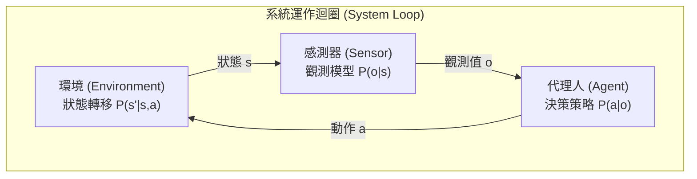
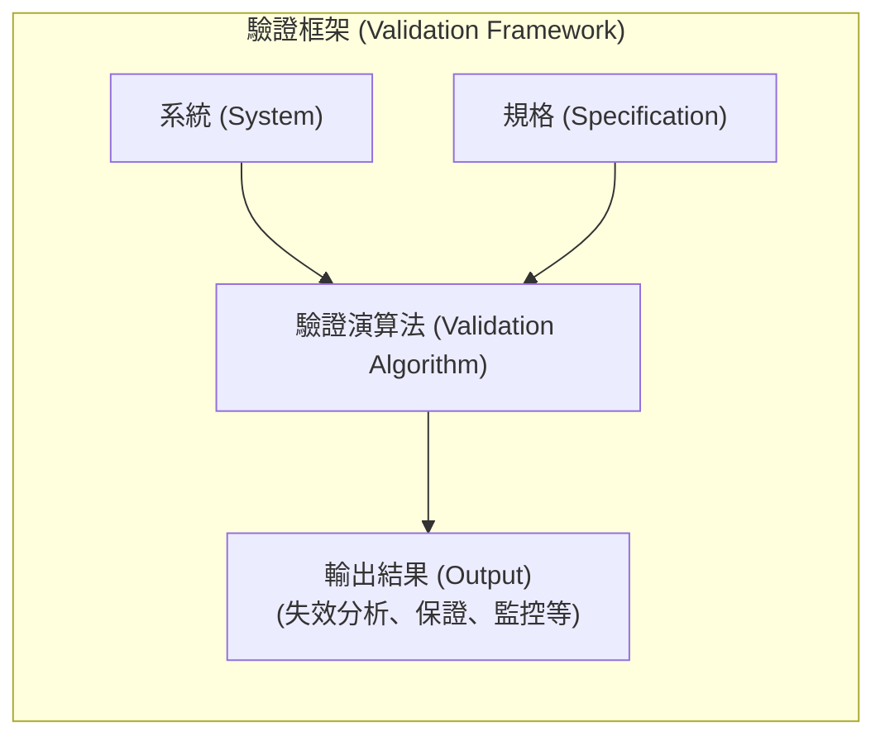

# Lecture 01: 課程簡介與概覽 (Introduction & Overview)

## 1. 核心概念 (Core Concepts)
- **安全關鍵系統驗證 (Validation of Safety Critical Systems)**：本課程關注如何驗證隨時間運作的決策系統（如機器人、自駕車、飛行器等）是否符合預期行為。這類系統失效可能導致嚴重的財產損失或人員傷亡。
- **對齊問題 (The Alignment Problem)**：設計者的意圖與系統實際行為之間的不一致，通常由以下三個原因造成：
  1. **不完美的目標 (Imperfect Objective)**：例如設定目標為「獲得最高分」，導致系統透過作弊手法（如無限迴圈收集道具）而非「贏得比賽」。
  2. **不完美的模型 (Imperfect Model)**：例如長期資本管理公司 (LTCM) 忽略了極端事件的模型，導致金融危機。
  3. **不完美的最佳化 (Imperfect Optimization)**：由於演算法限制（如稀疏獎勵問題），代理人未能學會預期的策略。
- **驗證框架 (Validation Framework)**：
  - 輸入：**系統 (System)** 與 **規格 (Specification)**。
  - 處理：**驗證演算法 (Validation Algorithm)**。
  - 輸出：系統是否滿足規格的資訊（如失效分析、形式化保證、解釋或執行時期監控）。
- **瑞士起司模型 (Swiss Cheese Model)**：沒有單一的驗證演算法是完美的（沒有銀彈）。每種方法都有其限制（像起司上的洞），我們必須疊加多種演算法來建立完整的「安全案例 (Safety Case)」。

## 2. 深入解析 (Deep Dive)
- **系統建模 (System Modeling)**：
  - **環境 (Environment)**：追蹤系統狀態 $s$，並根據代理人的動作 $a$ 轉移至新狀態 $s'$。轉移機率為 $P(s' | s, a)$。
  - **感測器 (Sensor)**：觀察環境狀態 $s$ 並產生觀測值 $o$。觀測機率為 $P(o | s)$。
  - **代理人 (Agent)**：根據觀測值 $o$ 選擇動作 $a$。策略機率為 $P(a | o)$。
- **倒立擺 (Inverted Pendulum) 範例**：
  - 狀態為角度 $\theta$ 與角速度 $\omega$。目標是維持直立，角度不可超過 $\pm \pi/4$。
  - 規格 (Specification) 可以用訊號時序邏輯 (Signal Temporal Logic, STL) 表示，例如：$\square (|\theta| < \pi/4)$，表示 $\theta$ 必須「永遠」小於 $\pi/4$。
- **驗證演算法的三大類別**：
  1. **失效分析 (Failure Analysis)**：尋找系統不滿足規格的情境（偽造, Falsification）、量化失效分佈、估計失效機率。在極端安全的系統中，簡單的蒙地卡羅模擬（或拒絕採樣）效率極低，需要更進階的方法。
  2. **形式化方法 (Formal Methods)**：如可達性分析 (Reachability)。透過數學推導計算系統在未來時間步可能達到的所有狀態集合，若這些集合未與「危險區域」重疊，則可保證系統安全。此方法也可延伸至神經網路驗證。
  3. **其他實用技術**：如可解釋性 (Explainability) 與執行時期監控 (Runtime Monitoring)。在系統運行時，若遇到訓練資料中未見過的情況，可由監控器發出警告或將控制權交還給人類。

## 3. Julia 實作與範例 (Julia Implementation & Examples)
本課程的教科書採用 Julia 語言撰寫，因為其語法非常接近人類可讀的虛擬碼。
- **系統定義**：透過定義 Agent、Environment 與 Sensor 型別，並組合成 System。
- **Rollout 函數**：用來模擬系統在給定深度 $D$ 內的行為，產生軌跡 (Trajectory)。概念上透過迴圈重複執行「感測器產生觀測 -> 代理人選擇動作 -> 環境狀態轉移」的流程。
- **互動式筆記本 (Pluto Notebooks)**：課程使用 Pluto 進行作業與展示，這是一種響應式的 Julia 筆記本，能夠自動處理套件相依性且沒有隱藏狀態。

## 4. 關鍵圖表與視覺化 (Key Diagrams & Visualizations)

## 5. 待釐清與外部連結 (Open Questions & References)
- **教科書**：《Algorithms for Validation》（作者：Sydney Katz, Mykel Kochenderfer, Anthony Corso, Robert Moss）。這是一本目前在預印階段的新書，延續先前的演算法系列書籍。
- **關聯 Notebook**：課程展示了如何使用 Pluto 筆記本進行倒立擺的偽造 (Falsification) 與失效機率估計，展示了簡單模擬在極端安全系統上的限制。
- **課程規定**：課程包含 Project 0 與 Quiz 0 以確保環境設定正確。每週有固定進度。
