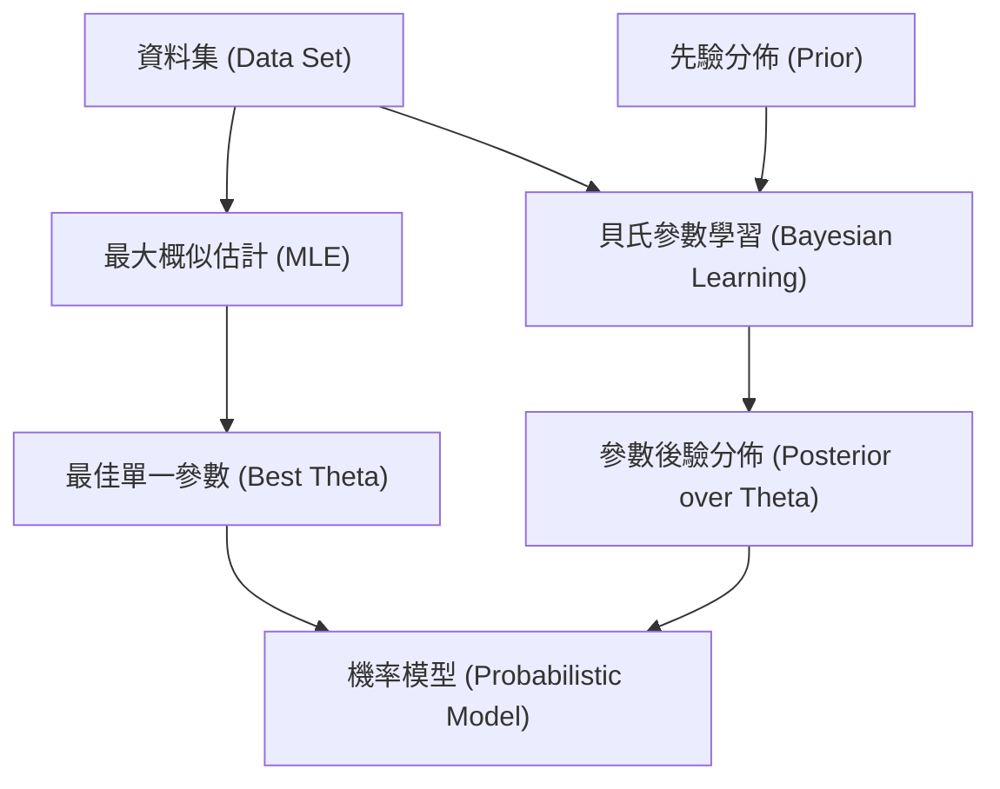

# Lecture 02: 系統建模 (System Modeling)

## 1. 核心概念 (Core Concepts)
本講次主要探討驗證安全關鍵系統時的輸入之一：**系統模型 (System Model)**。由於在真實世界中測試可能會帶來危險與高昂成本，我們需要在模擬環境中進行離線驗證。
核心觀念包含：
- **模型的複雜度 (Model Complexity)**：「所有模型都是錯的，但有些是有用的」(George Box)。模型設計應遵循愛因斯坦的格言：「盡可能簡單，但不能過度簡單」。
- **白盒與黑盒模型 (White-box vs. Black-box)**：白盒模型可見內部方程式與邏輯；黑盒模型僅能觀察輸入與輸出的關係。
- **機率模型 (Probabilistic Models)**：系統往往具備不確定性，因此本課程專注於機率模型，包含離散型分佈 (機率質量函數, PMF) 與連續型分佈 (機率密度函數, PDF)。
- **聯合與條件分佈 (Joint and Conditional Distributions)**：多元高斯分佈的協方差矩陣 (Covariance Matrix) 表示變數間的關聯；條件分佈 $P(y \mid x)$ 則用於描述感測器模型或狀態轉移機率。

## 2. 深入解析 (Deep Dive)
- **增加模型的表現力 (Model Expressiveness)**：
  當簡單的分佈 (如單峰高斯分佈) 無法完美契合資料時，可以透過兩種方式提升複雜度：
  1. **混合分佈 (Mixture Models)**：例如高斯混合模型，給定權重組合多個高斯分佈來擬合多峰資料。
  2. **分佈變換 (Transforming Distributions)**：將從簡單分佈抽樣的變數 $Z$ 經過函數 $f$ 轉換為 $X = f(Z)$。若 $f$ 具有可微性與可逆性，且反函數為 $g$，則其機率密度函數可計算為：
     $p_x(x) = p_z(g(x))|g'(x)|$
     此概念是正規化流 (Normalizing Flows) 的基礎。

- **最大概似參數估計 (Maximum Likelihood Parameter Estimation, MLE)**：
  目標是尋找能讓觀察資料出現機率最大的參數 $\hat{\theta}$：
  $\hat{\theta} = \arg\max_\theta \sum_{i=1}^m \log P(x_i \mid \theta)$
  講師推導了當假設資料是由條件高斯模型產生且具有常數變異數時，最大化對數概似函數 (Log-Likelihood) 等同於最小化最小平方法 (Least Squares) 的目標函數：
  $\arg\min_\theta \sum_{i=1}^m (y_i - f_\theta(x_i))^2$

- **貝氏參數學習 (Bayesian Parameter Learning)**：
  有別於 MLE 只給出一組最佳參數，貝氏學習維護參數的機率分佈。根據貝氏定理：
  $P(\theta \mid D) = \frac{P(D \mid \theta) P(\theta)}{P(D)}$
  其中 $P(\theta)$ 為先驗分佈 (Prior)，$P(D \mid \theta)$ 為概似函數模型 (Likelihood model)。由於分母積分難以計算，常需依賴機率程式設計 (Probabilistic Programming) 進行抽樣 (Sampling) 來近似後驗分佈 (Posterior)。

## 3. Julia 實作與範例 (Julia Implementation & Examples)
在關聯的 Notebook `probability_distributions.jl` 中：
- 使用 `Distributions.jl` 來建立常態分佈 (`Normal`) 與混合模型 (`MixtureModel`)。
- **分佈轉換實作**：對常態分佈抽樣後應用立方根轉換 `f(z) = cbrt(z)`，並利用反函數 `g(x) = x^3` 與導數 `g'(x) = 3x^2` 計算並繪製出雙峰分佈的 PDF。
- **MLE 實作**：定義了 `MaximumLikelihoodParameterEstimation` 結構，透過 `Optim.jl` (如梯度下降法) 最小化負對數概似函數 `-logpdf(alg.likelihood(x, θ), y)` 來求得最佳參數。
- **貝氏學習實作**：使用 `Turing.jl` 的 `@model` 巨集定義 `posterior(x, y)`，先從先驗分佈 `θ ~ alg.prior` 抽樣，再透過資料的概似度進行更新，最後呼叫 `Turing.sample` 以 NUTS 演算法進行抽樣。

## 4. 關鍵圖表與視覺化 (Key Diagrams & Visualizations)

## 5. 待釐清與外部連結 (Open Questions & References)
- **待確認的課程內容**：課堂中提到「正規化流 (Normalizing Flows)」與指數族 (Exponential family) 的分析解，這些屬進階範圍，後續將在相關章節或附錄中討論。
- **關聯 Notebook**：`probability_distributions.jl`
- **參考書籍章節**：Chapter 2 (Algorithm for Validation), Example 2.7, 2.8, 2.9 (關於解析解的推導)。
