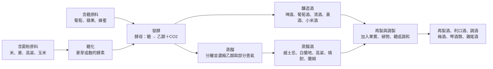

# 01 我們談酒時，究竟在談什麼？

家族聚餐時，美玲的阿嬤用米酒煮麻油雞，舅舅開了一瓶高粱，表哥從超商帶回一手啤酒，表姊說她只喝氣泡水。有人說「米酒不算酒，是調味料」，有人說「葡萄酒才是真正的酒」。同一張桌上的「酒」，至少有四種不同意思：用什麼做的、怎麼喝、法律怎麼歸類，以及誰覺得它體面。

!!! info "本章要回答"
    - **核心問題**：「酒」這個字底下，到底有哪些不同的東西？分類的依據是什麼？
    - **讀完能做什麼**：看到一種陌生的酒，先問它的糖從哪裡來、有沒有蒸餾、有沒有再加工，就能把它放上全書的地圖。
    - **不處理**：各類酒的細節製程（見[第 02](02-fermentation.md)、[03 章](03-distill-age-blend.md)），以及酒精對身體的影響（見[第 13 章](13-body-health.md)）。

## 所有的酒都有同一個起點

不論是米酒、啤酒、葡萄酒還是威士忌，杯中的酒精幾乎都來自同一件事：**酵母把糖轉成乙醇和二氧化碳**。差別在前後兩端：

- **糖從哪裡來。** 葡萄、蘋果、蜂蜜本身就有可發酵的糖；米、麥、高粱、玉米裡是澱粉，必須先由麥芽或麴裡的酵素把澱粉切成糖，這一步叫「糖化」。
- **發酵之後做了什麼。** 發酵後不經蒸餾而取得的酒液，屬釀造酒；把發酵液加熱蒸餾、提高酒精濃度，是蒸餾酒；再用蒸餾酒或釀造酒加入果實、香草、藥材、糖等調製，就是再製酒或調製酒。

所以最實用的分類，不是看產地或價格，而是看製程。下圖是全書的地圖，後面每一章都會回到這張圖。

這張圖有兩個要注意的地方。第一，米酒、清酒和黃酒都用米，卻落在不同位置：台灣常見的米酒是蒸餾酒，清酒與黃酒是釀造酒。第二，「琴酒」雖然被放在調製一側，在歐盟法規裡它是一種以杜松子調香的烈酒，法律上仍屬蒸餾酒類。製程分類與法律分類不一定完全重疊，這正是下一節要談的。

## 三種分類，各有用途

同一瓶酒，可以用三套標準分類。它們回答的問題不同，混在一起就會吵不完。

| 分類依據 | 回答的問題 | 例子 | 常見的誤用 |
|---|---|---|---|
| 生產方式 | 這瓶酒是怎麼做出來的？ | 釀造、蒸餾、再製 | 把「蒸餾過」當成「比較高級」 |
| 飲用方式 | 通常怎麼喝、在什麼場合喝？ | 佐餐、乾杯、調酒、入菜、祭祀 | 把某地的喝法當成唯一正確喝法 |
| 法律分類 | 稅要怎麼課、標示要寫什麼？ | 台灣《菸酒稅法》的釀造酒類、蒸餾酒類、再製酒類、料理酒 | 把稅目名稱當成品質等級 |

台灣的法律分類有一個特別的例子：**料理酒**。《菸酒稅法》把「專供烹調用之酒」另列一類，其中包括料理米酒。這是為了課稅與管理而做的區分，不代表料理米酒和一般米酒在化學上是兩種完全不同的東西，也不代表哪一種比較好。要知道一瓶酒屬於哪一類，看酒標上的「類別」欄最準確；讀法見[附錄 C](appendix-c-labels-units.md)。

## 法律上，什麼才算「酒」？

在台灣，《菸酒管理法》第 4 條規定：酒是指在攝氏 20 度時，酒精成分以容量計算**超過 0.5%** 的飲料。《菸酒稅法》也用同一個門檻。

這個數字很少被注意，但它解釋了幾件日常小事：

- 若一款啤酒風味飲料的實際酒精含量不超過 0.5%，便未達台灣這項「酒」的定義門檻；但不能只從「無酒精」品名推定實際含量。
- 不同地區甚至在規範不同問題。美國 27 CFR 7.65 對麥芽飲料（malt beverages）的 non-alcoholic 標示要求是**低於 0.5%**，不能推成所有飲料的通則；英國 DHSC 2018 年的描述用語指引，對適用的去酒精飲料建議 alcohol-free 不超過 0.05%，這是指引；日本《酒稅法》則將酒精 1 度以上的飲料列為酒類，並非據此就能替所有 1% 以下飲料標示「無酒精」。細節見[第 08 章](08-mixed-nonalcoholic.md)。
- 法律門檻是為了管理而畫的線，**不是健康門檻**。0.5% 以下不代表對每個人都沒有影響，0.5% 以上也不代表喝一口就一定有害。健康問題要看攝取的純酒精量，見[第 13 章](13-body-health.md)。

## 「酒」不等於葡萄酒，也不等於奢侈品

中文書店與網路上的酒類內容，葡萄酒和威士忌占了很大比例，常讓人以為「懂酒」就是懂這兩種。這有歷史和商業的原因：這兩類酒有成熟的產區制度、評分文化與收藏市場，產生了大量文字。但從人類飲酒的整體來看，它們只是其中一部分。

以台灣的日常場景為例，可以見到啤酒、入菜的米酒、節慶的高粱，以及部分原住民族在祭儀與分享中使用的小米酒。它們各有製程與文化脈絡，沒有哪一種天生低一等。本書第二部用相同的欄位比較各類酒，就是為了避免預設一種「正統」：

- [第 04 章](04-beer.md) 啤酒：穀物與麥芽。
- [第 05 章](05-wine-fruit.md) 葡萄酒與其他果實酒。
- [第 06 章](06-rice-koji-taiwan.md) 米與麴：清酒、黃酒與台灣的酒。
- [第 07 章](07-spirits.md) 蒸餾酒。
- [第 08 章](08-mixed-nonalcoholic.md) 調酒、香味酒與無酒精選擇。

「奢侈品」也是一種常見的框架。價格、稀有度與包裝，會改變人們對一瓶酒的期待，甚至改變喝下去的感受；[第 10 章](10-price-labels-expectation.md)會介紹相關研究。但價格描述的是市場，不是製程。本書不以價位建立品味的高低。

!!! tip "不喝酒也能做的觀察"
    找三樣廚房裡的發酵或相關食品，例如醬油、醋、味噌、優格、麵包或酒釀，回答下面四個問題：

    - 它的糖或澱粉來自什麼原料？
    - 有沒有經過微生物發酵？是哪一類微生物（酵母、黴菌、細菌）？如果包裝上沒寫，就記下「不知道」。
    - 發酵後有沒有再加熱、過濾、調味？
    - 它在法律上屬於食品、調味料還是酒？看包裝上的品名與類別。

    你會發現「發酵」「酒」「調味料」三個詞彼此交疊。本書後面講酒類時，用的就是同一套提問。

## 常見說法查證

??? question "說法：「米酒是調味料，不算酒。」"
    - **可驗證的部分**：台灣《菸酒稅法》確實把「料理米酒」列在料理酒類，與一般蒸餾酒分開課稅。
    - **不能推出的結論**：料理米酒仍含酒精；法律分類不代表它不含酒精，也不代表它對開車、懷孕或服藥的人沒有影響。
    - **本書判斷**：「調味料」描述的是用途，「酒」描述的是成分。兩者可以同時成立。

??? question "說法：「蒸餾酒比釀造酒高級。」"
    - **可驗證的部分**：蒸餾會提高酒精濃度，並改變香氣成分的組成（見[第 03 章](03-distill-age-blend.md)）。
    - **不能推出的結論**：濃度高、工序多，不等於品質好。「高級」是價格與社會評價，不是製程名稱。
    - **本書判斷**：製程差異是「不同」，不是「高低」。

??? question "說法：「無酒精啤酒就是完全沒有酒精。」"
    - **可驗證的部分**：各地法規對「無酒精」的門檻不同，台灣法律上酒的定義是超過 0.5%。
    - **不能推出的結論**：標示「無酒精」不一定等於 0.0%。
    - **本書判斷**：需要完全避免酒精的人（例如懷孕、服用特定藥物、戒酒中），要看成分標示或詢問製造者，不要只看產品名稱。

## 本章小結

分類一瓶酒，先問三件事：糖從哪裡來？有沒有蒸餾？有沒有再調製？這三個問題對應製程；飲用方式與法律分類是另外兩把尺，用途不同。後面的章節會沿著這張地圖，一段一段看酒是怎麼形成的。

## 來源

| 來源 | 類型 | 本章用途 |
|---|---|---|
| [菸酒管理法](https://law.moj.gov.tw/LawClass/LawAll.aspx?pcode=G0330011) | 法規（台灣） | 酒的定義：20°C 時酒精成分超過 0.5% |
| [菸酒稅法第 2 條](https://law.moj.gov.tw/LawClass/LawSingle.aspx?pcode=G0330010&flno=2) | 法規（台灣） | 釀造酒類、蒸餾酒類、再製酒類、料理酒、其他酒類的法律定義 |
| [Regulation (EU) 2019/787, Annex I](https://eur-lex.europa.eu/eli/reg/2019/787/oj/eng) | 法規（歐盟） | 琴酒屬以杜松子調香的烈酒類別 |
| [27 CFR 7.65（Alcohol content statements）](https://www.ecfr.gov/current/title-27/chapter-I/subchapter-A/part-7/subpart-E/section-7.65) | 法規（美國） | 美國麥芽飲料 non-alcoholic 須低於 0.5% |
| [英國 DHSC：Low-alcohol descriptors（2018）](https://www.gov.uk/government/publications/low-alcohol-descriptors) | 政府指引 | 指引性質及適用用語，不當成全球法律門檻 |
| [日本酒稅法第 2 條](https://laws.e-gov.go.jp/law/328AC0000000006) | 法規（日本） | 酒類的 1 度門檻，不是「無酒精」名稱定義 |
| [酒類総合研究所：お酒の製造全般](https://www.nrib.go.jp/sake/sakefaq01a.html) | 政府研究機構（日本；兼具產業技術任務） | 麴、酵母與發酵的基本角色 |

查閱日：2026-09-20。
