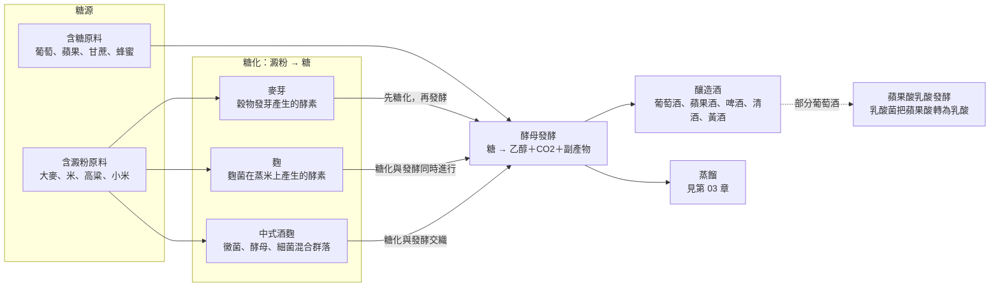

# 02 糖、微生物與發酵

冬至那天，小林在廚房幫媽媽煮酒釀湯圓，突然想到一個問題：葡萄汁放久了會自己冒泡、變酸變酒，白飯放久了卻只會發霉，要做酒釀還得先拌進一顆酒麴。同樣是「讓東西變成酒」，為什麼水果和米的起點差這麼多？答案藏在兩個字裡：糖，以及負責處理糖的微生物。

!!! info "本章要回答"
    - **核心問題**：糖從哪裡來？澱粉怎麼變成糖？酵母把糖變成酒精的過程中，還留下了什麼？
    - **讀完能做什麼**：看到一種釀造酒，能說出它的糖源、糖化方式（麥芽、麴或不需要），以及香氣可能來自原料、發酵還是後續處理。
    - **不處理**：自釀步驟、溫度與配方（本書不提供）；蒸餾與熟成見[第 03 章](03-distill-age-blend.md)；各類酒的風格細節見[第 04](04-beer.md)、[05](05-wine-fruit.md)、[06 章](06-rice-koji-taiwan.md)。

## 酵母做的事：糖變成乙醇和二氧化碳

多數酒類生產都以酒精發酵為起點。酵母（常見的是 *Saccharomyces cerevisiae*，釀酒酵母）分解葡萄糖這類糖，產生乙醇和二氧化碳；這條路徑不需要氧氣，但不能反過來理解為酵母只有在完全無氧時才會發酵：

> 葡萄糖（C₆H₁₂O₆）→ 2 乙醇（C₂H₅OH）＋ 2 二氧化碳（CO₂）

這條式子是化學計量上的簡化。實際的發酵液裡，酵母還要長大、維持細胞運作，所以一部分糖會流向別的產物。這些「副產物」量不大，卻是一杯酒聞起來、喝起來為什麼不只是「酒精加水」的主要原因。

談葡萄酒風味時，文獻常把酵母發酵帶來的氣味稱為「次級香氣」，與原料本身的香氣區分。這是香氣來源的分類，不代表每一種分子都屬於生化學上嚴格定義的「次級代謝物」。乙醇之外，甘油、有機酸、醛、酯及高級醇，都參與了發酵液的組成。

幾個常被提到的副產物，可以這樣理解：

- **甘油**：沒有明顯的香氣，但會影響酒體的「厚度」與飽滿感。一篇啤酒與葡萄酒的綜述指出，甘油也是酵母調節滲透壓、平衡氧化還原的產物，而且會和乙醇搶同一批碳源——甘油多一點，乙醇就少一點。
- **乙醛**：乙醇的前一步。量多時帶有青蘋果、刺鼻的氣味。它也是人體代謝酒精時的中間產物，身體那一側的故事見[第 13 章](13-body-health.md)。
- **酯類**：例如乙酸乙酯、乙酸異戊酯、己酸乙酯，常被形容為果香、花香。
- **高級醇**：例如異戊醇、異丁醇、苯乙醇。一篇討論葡萄酒「次級香氣」的短評指出，它們一部分經由胺基酸代謝的 Ehrlich 路徑產生，一部分來自醣類的中心代謝；少量時增加複雜度，量多時帶來辛辣、苦的感受。

所以同一批葡萄汁，換一株酵母、換一種發酵條件，副產物的比例就會不同。這也是為什麼「酵母只是把糖變成酒精」的說法太簡化：它同時是一位香氣的製造者。不過，**副產物多寡不能直接換算成好壞**。同一種酯，在某種酒裡被當成特色，在另一種酒裡可能被視為缺陷，評價取決於風格與飲用者，見[第 09 章](09-describing-flavour.md)。

## 澱粉要先變成糖：三條糖化路線

一般釀酒酵母主要利用可發酵的糖。葡萄、蘋果、甘蔗汁與蜂蜜本身有這類糖，不需要先把澱粉切開；但有糖不等於在任何濃度、酸度與衛生條件下都能順利發酵。米、麥、高粱、玉米裡的碳水化合物主要是澱粉，一長串葡萄糖接在一起，一般釀酒酵母無法直接有效利用。要讓穀物變成酒，中間通常必須多一步：用酵素把澱粉切成糖，這一步叫**糖化**。

人類找到的糖化方法大致有三類。

### 路線一：麥芽，讓穀物自己產生酵素

大麥等穀物發芽時，種子會製造分解澱粉的酵素，準備把儲存的澱粉變成幼苗的養分。製麥就是讓穀物發芽到一個程度後停下來、乾燥，把這批酵素「存」在麥芽裡；之後把麥芽磨碎、泡在溫水中，酵素就開始把澱粉切成糖，得到甜的麥汁，再交給酵母。

這個原理寫進了法律。英國《蘇格蘭威士忌規例》（2009）要求穀物醪液只能靠原料本身的「內源酵素系統」轉化成可發酵的物質；歐盟烈酒法規（EU 2019/787）對威士忌的定義，也要求以麥芽所含的澱粉酶糖化，可另加其他天然酵素。啤酒走的是同一條路，細節見[第 04 章](04-beer.md)。

### 路線二：麴，讓黴菌替穀物產生酵素

東亞走了另一條路：不讓穀物發芽，而是讓黴菌長在蒸熟的穀物上。日本酒類總合研究所（NRIB）把「麴」定義為在蒸過的米、麥等穀物或薯類上繁殖麴菌的產物，它供應分解澱粉與蛋白質的酵素，也帶來香氣成分。清酒用的是黃麴菌（*Aspergillus oryzae*）；日本燒酎常用黑麴或白麴。

一篇麴菌綜述描述了麴在米粒上的工作方式：菌絲進入米粒並供應澱粉分解酵素；其分布會影響原料的分解，但實際效果仍取決於菌株與培養條件。麴同時也分解蛋白質，產生胺基酸，這是清酒和味噌、醬油共用的風味來源之一。

### 路線三：中式酒麴，一整個微生物群落

中文裡的「麴」和日文的「麹」字形相近，指的東西卻不完全一樣。日本清酒的麴，通常以選育的麴菌培養；許多傳統中式酒麴（jiuqu）則含有**混合菌群**，其組成與培養方式依麴種和製程而異。一篇中國白酒微生物學綜述指出，白酒是由製麴和釀酒兩道固態發酵完成的，參與的微生物包括細菌、酵母與黴菌，來源可能是生產環境、工作人員與酒麴本身。

在這些混合菌群的製程中，糖化、酒精發酵及其他代謝活動可能由不同微生物分工，其交互作用參與香氣形成；但不能據此認定所有酒麴都含同一套微生物。這篇綜述有三位作者受僱於白酒企業，本書只用它說明微生物組成的概況，不採用其中關於品質高低的判斷。

台灣的穀物酒也各有製法與文化脈絡，不能都歸成「用麴的東方酒」。[第 06 章](06-rice-koji-taiwan.md)以清酒、黃酒、台灣米酒及具體鄒族文獻，示範如何分開製程與文化問題。

## 同時做，還是分開做：糖化與發酵的分工

把「糖化」與「發酵」分開命名，是為了知道誰在做什麼，不表示工廠裡一定要先完成一件事才能開始另一件。啤酒常先取得麥汁，再讓酵母發酵；清酒的醪中，麴提供的酵素持續供糖，酵母同時把糖轉成酒精。後者稱為並行複發酵。

可以把它想成一間廚房：糖化負責把原料切成酵母能處理的大小，發酵負責接手使用。兩組人可以輪班，也可以同時工作。但這只是說明分工的比喻，不能拿來計算產率，更不能由「同時進行」推論成品必然比較香或比較高級。

| 原料與案例 | 可發酵糖怎麼來 | 糖化與酒精發酵的關係 | 容易漏看的事 |
|---|---|---|---|
| 葡萄汁、蘋果汁 | 果實原有的糖 | 通常不需澱粉糖化 | 酸度、營養與菌株仍影響發酵 |
| 啤酒麥汁 | 麥芽酵素分解澱粉 | 常先糖化，再接種發酵 | 麥汁不只含可發酵糖 |
| 清酒的米醪 | 麴的酵素分解米澱粉 | 糖化與發酵並行 | 麴菌與酵母的工作不同 |
| 不同中式酒麴 | 混合微生物及其酵素 | 依麴種、酒種與製程而異 | 不能用一種麴的研究代表全部 |

在這個分類下，「純天然發酵」仍不是完整的製程說明。它沒有回答微生物從哪裡來、如何控制雜菌、發酵是否完成，也沒有說明成品如何保存。想理解一瓶酒，問這些具體問題，比在天然與人工之間排高低更有用。

## 為什麼有糖也可能停止發酵？

酵母是活的細胞，並不是只要餵糖就會無限工作的機器。Marsit 與 Dequin 的葡萄酒酵母綜述整理了釀造環境的多種壓力：開始時糖濃度高，後來酒精累積，過程中還會遇到營養不足與溫度變化。不同菌株的反應並不一致。因此，本書不指定一個所有酵母共用的「最高酒精度」。

這也解釋了為什麼甜不甜與原料甜不甜不能直接畫上等號：原料的糖可能被消耗，也可能剩下。成品的甜味還會受到酸度等感官條件影響；有果香並不代表含糖多。各酒類的後續調整與標示還需回到具體製程，不能只由鼻子推測成分。

同一個「發酵」詞還可能指不同反應。例如部分葡萄酒會經歷蘋果酸乳酸發酵（MLF）：乳酸菌把蘋果酸轉成乳酸與二氧化碳，改變酸的組成及感受。它不是把糖再變一次乙醇，也不等於氣泡酒為了留住氣體而安排的第二次酒精發酵。看到「二次」或「複發酵」時，最好追問反應物、參與微生物與目的，不要只數名稱裡有幾個發酵。

自然發酵與接種選育菌株也不是「真酒」和「假酒」的分界。前者可能有較複雜的微生物接替，後者方便控制某些特性；兩者仍需要監測。知道菌株的名字，只能增加對製程的理解，不能預先保證喜好、衛生或健康結果。

最後，發酵與腐敗都涉及微生物活動，差別不只是「有沒有冒泡」。本章的生活觀察只用正常食用的材料，不以家中發霉的食物測試任何原理。釀造用菌種的研究不能替未知的黴菌背書。

!!! tip "不喝酒也能做的觀察"
    - 將正常可食用的白飯與麵包各取一小口，慢慢咀嚼，留意甜味有沒有改變；唾液中的澱粉酶提供了理解「大分子變小」的日常入口，但不是酒廠糖化的完整重現。
    - 看味噌、醬油與優格的包裝，分別記錄原料、是否標示菌種、是否經殺菌。沒有寫出的資訊就留白，不靠「發酵食品」四個字猜測。
    - 在紙上畫出「澱粉→糖→乙醇」；用不同顏色標出酵素與酵母負責的箭頭。這個分工比背酒名更能幫助理解陌生製程。

## 常見說法查證

??? question "說法：「米本來沒有甜味，怎麼會變成酒？」"
    - **可驗證部分**：米的澱粉可由酵素分解成糖，糖再供酵母利用。
    - **本書判斷**：入口的甜味不是判斷能否釀酒的唯一方法；要問的是原料能否提供可發酵糖，以及如何取得。

??? question "說法：「麴就是酵母，都是發酵粉。」"
    - **可驗證部分**：日本釀造麴主要提供黴菌產生的酵素；酒精發酵則由酵母負責。部分中式酒麴內含多種微生物。
    - **本書判斷**：麴、酵母與麵包膨鬆劑不能互換當成同一個名詞；先看其成分及用途。

??? question "說法：「加越多糖，就一定得到越烈的酒。」"
    - **可驗證部分**：糖是乙醇的碳源，但細胞受到滲透壓、酒精與營養條件限制。
    - **本書判斷**：原料含糖量只是條件之一，不能直接當作成品濃度；更不能把本章原理當成自釀配方。

## 來源

| 來源 | 類型 | 本章用途 |
|---|---|---|
| [酒類總合研究所：製造全般](https://www.nrib.go.jp/sake/sakefaq01a.html) | 政府研究機構（日本；兼具產業技術任務） | 麴、酵素與不同釀造酵母 |
| [酒類總合研究所：ワイン・ビール](https://www.nrib.go.jp/sake/sakefaq03.html) | 政府研究機構 | 僅採蘋果酸乳酸發酵原理；不引用頁面較舊的日本啤酒稅目門檻 |
| [酒類總合研究所：焼酎・ブランデー・ウイスキー](https://www.nrib.go.jp/sake/sakefaq04.html) | 政府研究機構 | 麥芽糖化與麴糖化的分工比較 |
| [Fungal research in Japan: tradition and future](https://pmc.ncbi.nlm.nih.gov/articles/PMC7507618/) | 研究論文（綜述） | 麴菌與澱粉分解 |
| [Wine secondary aroma: understanding yeast production of higher alcohols](https://pmc.ncbi.nlm.nih.gov/articles/PMC5658600/) | 研究論文（短評） | 高級醇與酵母代謝 |
| [Chinese Baijiu: The Perfect Works of Microorganisms](https://www.frontiersin.org/journals/microbiology/articles/10.3389/fmicb.2022.919044/full) | 研究論文（綜述；部分作者受僱於白酒企業） | 酒麴的混合微生物，不能泛化所有酒種 |
| [Marsit 與 Dequin：Diversity and adaptive evolution of Saccharomyces wine yeast](https://pmc.ncbi.nlm.nih.gov/articles/PMC4629790/) | 研究論文（綜述） | 發酵代謝、環境壓力與菌株差異 |
| [Flavor impacts of glycerol in the processing of yeast fermented beverages](https://pmc.ncbi.nlm.nih.gov/articles/PMC4648866/) | 研究論文（綜述） | 甘油對代謝與感官的可能影響；不能單由含量預測酒體 |
| [英國 Scotch Whisky Regulations 2009，第 3 條](https://www.legislation.gov.uk/uksi/2009/2890/regulation/3) | 法規（英國） | 內源酵素糖化的品類規格 |
| [Regulation (EU) 2019/787](https://eur-lex.europa.eu/eli/reg/2019/787/oj/eng) | 法規（歐盟） | 威士忌糖化要求；法定條件不等於全酒類製法 |

查閱日：2026-09-20。
