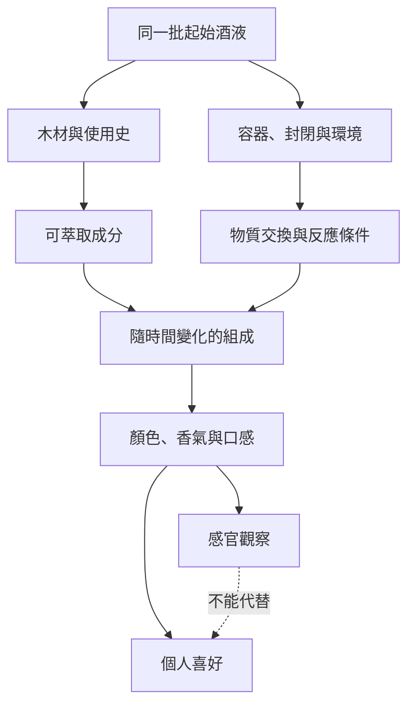

# 03 蒸餾、熟成與調和改變了什麼？

整理家中櫥櫃時，美玲找到一瓶多年前收到的烈酒。小林看著標籤上的年數，問：「又放了十年，現在是不是更老、更好？」另一位家人指著旁邊的透明酒液說：「沒有進桶的，一定比較簡單吧。」這兩個問題都需要先問：酒在哪裡度過這些時間，期間發生了什麼？

!!! info "本章要回答"
    - **核心問題**：蒸餾如何改變組成？熟成的時間與容器各有什麼作用？調和究竟在調什麼？
    - **讀完能做什麼**：把濃度、顏色、年數、製程與喜好分開；讀懂「桶中熟成」和「瓶中保存」的差異。
    - **不處理**：蒸餾器操作、自釀配方或居家除毒方法；酒類法定名稱見[第 07 章](07-spirits.md)，開瓶保存見[第 11 章](11-storage-temperature-pairing.md)。

## 蒸餾是分離，酒精先前已經存在

[第 02 章](02-fermentation.md)的酵母已把糖變成乙醇。蒸餾不是把米直接燒成酒精，而是處理已經發酵的物料：加熱讓一部分成分進入蒸氣，再冷凝成液體。乙醇與水在液體和蒸氣中的比例不同，因此可以改變收集液的酒精濃度。

這和把湯一直煮到剩半鍋不一樣。煮湯通常保留鍋裡的東西；蒸餾收集的是離開鍋子、經冷卻重新成液體的部分。原酒裡不容易揮發的糖、色素，不會按原比例跟著移動；一些氣味物質卻會。因此蒸餾既改變酒精比例，也改變風味的組合。日本酒類總合研究所用葡萄酒蒸餾後成為無色酒液的例子，說明這項差別。

另一個常見的簡化是：「酒精先沸騰，水還沒沸騰，所以只會收集到酒精。」實際處理的是混合物，蒸氣中仍會有水與其他揮發成分。純物質的沸點表可以幫助理解差異，不能當成一張把混合物逐一排隊取出的時間表。

酒廠也可能改變壓力。減壓讓液體在較低溫度下沸騰，會改變受熱反應與移入蒸氣的成分。這提供了不同的製程選擇，不能只因溫度較低就判定風味、品質或健康結果較好。

| 過程 | 處理的是什麼 | 主要改變 | 不能直接推論 |
|---|---|---|---|
| 發酵 | 糖與微生物 | 產生乙醇、二氧化碳及其他代謝物 | 發酵時間長就一定酒精高 |
| 蒸餾 | 已發酵的液體或物料 | 依揮發與分離行為改變組成 | 多蒸餾一次就一定比較好 |
| 木桶熟成 | 蒸餾酒或釀造酒與木材接觸 | 萃取、反應及物質交換 | 顏色深就代表年份老 |
| 調和 | 不同批次或組成的酒液 | 組合特徵、調整目標風格 | 調和必然是降低品質 |
| 加水調整 | 酒液與水 | 調整成品濃度與感官條件 | 加水就等於造假 |

## 蒸餾器的名稱，不是品質分數

釜式蒸餾常以一批物料為單位，隨著過程進行，流出的組成也會變化；塔式設備利用多次氣液接觸來分離，某些配置可以連續運作。讀到這些設備名稱時，重點是理解分離方式，不是把「古老銅壺」與「現代機械」排成優劣。

實際設備還可能是混合設計。回流、接觸材料、收集範圍與原始發酵物都影響成品。相同的設備可以服務不同目標：保留較多原料特徵，或取得較中性的酒精，之後用於其他酒類。設備照片不能替代製程資訊，更不能替代成品檢驗。

談到蒸餾分段，人們常聽到「頭、心、尾」。這些是按流程與目標劃分的餾分，不是三個裝著純物質的盒子。尤其不能把前段稱為「所有毒物」、中段稱為「完全安全」。

Blumenthal 等人 2021 年的果實烈酒綜述指出，甲醇可由果膠相關反應形成；在釜式蒸餾中，其分布不能只依純甲醇沸點來推論。文中直接討論了「甲醇都在酒頭」的錯誤觀念。**去掉前段不是通用的除甲醇保證**；成品安全需要原料、製程管理與分析檢驗一起判斷。本書不提供居家處理未知酒液的方法。

這項研究也有邊界：它主要整理果實烈酒的控制問題，不能據此給所有酒種同一套甲醇數值。甲醇與乙醇是不同物質；避免甲醇污染，也沒有消除飲用乙醇本身的健康風險。

## 木桶裡有多件事同時發生

把透明酒液放進木桶，並不只是替它染色。可以先分成三件事理解：木材中的物質移入酒液；酒液本身及移入的成分發生反應；酒液與外界之間有物質交換。哪一項更明顯，取決於木材、桶的使用史、酒液和環境。

日本酒類總合研究所的研究報告比較不同木材製成的桶頭，將感官結果與成分分析對照：例如某些橡木相關樣本的椰子樣氣味，與特定乳內酯的含量相連。這說明「木香」並非單一氣味，也不是所有木材都提供相同的成分。本書只採用這種成分與感官的關係，不把研究中的高強度改寫成高品質。

氧氣的角色可以用另一項實驗理解。Caldeira 等人 2021 年比較葡萄蒸餾酒在栗木桶，以及栗木板材配合不同微量供氧條件下的變化，追蹤一年。各處理的揮發成分與感官特徵有所不同；這支持氧氣供應方式會影響熟成結果。但研究使用特定酒液、木材與設備，不能證明任何簡易加氧方式都能重現長期桶陳。部分作者任職釀造技術公司，本書也不採用它作為購買替代熟成設備的理由。

「時間」因而不是獨立運作的魔法。不同容器中的一年，經歷的過程未必相同；即使某項成分變得快，也不代表所有反應同步快。把不同地區的熟成寫成固定倍數，例如「這裡一年等於那裡幾年」，需要明確比較指標與研究，不能只靠氣候印象。

## 桶中、瓶中、開瓶後：三種時間

美玲找到的那瓶酒，值得先分清三個時間：製造時在容器中處理多久、裝瓶後保存多久，以及何時開瓶。它們可能都影響現況，但不是同一個年齡標示。

以蘇格蘭威士忌為例，英國 HMRC 的查核文件把桶中熟成與調和紀錄分開；調和酒的年齡以其中最年輕的威士忌成分為準。這是特定名稱的標示規則，不是所有酒類的全球共同規則。把一瓶已裝瓶的酒放進家中櫃子，不能把那段時間加回這種桶陳年齡。

然而，「不再增加桶陳年齡」也不表示瓶子裡永遠不變。日本酒類總合研究所指出，酒類保存中的變化各異；蒸餾酒通常比部分釀造酒穩定，但長時間家庭存放未必改善適飲狀態。封口、光線與溫度仍值得留意。開瓶後又多了新的空間與接觸條件，應另外記錄，詳見[第 11 章](11-storage-temperature-pairing.md)。

| 看到的時間資訊 | 先問什麼 | 有用的紀錄 |
|---|---|---|
| 某年採收 | 指原料年份，還是別的年份？ | 原文用詞、產區與標示規則 |
| 熟成若干年 | 在什麼容器？適用哪個品類？ | 法定名稱及熟成說明 |
| 某年裝瓶 | 裝瓶前如何處理？之後如何保存？ | 裝瓶資訊、保存條件 |
| 家裡放了很久 | 是否未開封？封口與內容物如何？ | 購入與開瓶日期、保存環境 |

這張表的用途是把缺的資訊找出來。它不是舊酒估價表；只有年數，通常不足以回答「現在喝起來如何」。

### 用三個假想標籤練習

如果標籤寫「採收年份」，先不要把它翻譯成桶陳年數。它告訴你原料的時間資訊，卻未完整交代發酵後經歷的容器和處理。同一採收年份的兩瓶酒，仍可能採用不同工法；單靠年份也不知道後來是否妥善保存。

如果標籤寫「熟成若干年」，就找它所屬的法定品類與計算方法。這時問題是「這個年數如何定義」，不是「它比沒有年數的酒高幾級」。沒有標年數，可能只是沒有提供這項資訊；不能自行補成完全沒熟成，也不能替它猜測平均年齡。

如果瓶上只有裝瓶日期，能確認的是包裝時間，並非所有前段製程的開始。把三個標籤排在一起，就會看出：它們都談時間，但談的是不同事件。對於來源不清的老瓶，承認資訊不足，比套用一套通用的越老越好公式更準確。

這種讀法也能用於日常食品。茶的採收年、焙火日期與拆封日期，對你判斷現況各有用途。相似之處在於要把事件分清，而不是認為茶和酒具有相同的保存機制。

## 調和是組合工作，不等於掩飾

日常語言裡，「混」有時聽起來像偷工減料。但把不同批次酒液組合起來，本身只是一項操作。品質、合法性與標示是否誠實，要分開查。

假設有兩批正常的無糖茶，一批花香明顯、一批焙火味明顯，混合會產生另一種比例的感受。這可以作為理解調和目標的比喻：有時是維持某種風格，有時是形成新的組合。不過酒液成分與感知的交互作用更複雜，不必然是兩份描述的算術平均。

同樣要留意名稱的層次。在蘇格蘭威士忌規格裡，single malt 的「single」指單一蒸餾廠，不保證只來自一只桶；blended 等類別則有各自的組成規定。讀者若把「單一」理解成沒有任何批次混合，就會在尚未品嚐以前先形成錯誤想像。

加水與調和也需要區分。前者主要調整濃度；後者可能組合不同的酒液。依法進行並如實標示的調整，與冒充產地或虛報年齡並不是同一件事。要批評不實資訊，應指出具體違反的聲稱，不能只因看到「調和」兩字就判罪。

!!! tip "不喝酒也能做的觀察"
    - 用兩種平常會喝、沒有過敏疑慮的無糖茶，先分別記錄香氣與口感，再取少量混合。混合後哪種特徵仍明顯？有沒有變得難以辨認？
    - 在紙上分別寫「成分變化」「我比較喜歡」。第二欄的偏好不必與朋友相同。
    - 留意這只展示組合的想法；茶杯中的混合不能重現木桶熟成，也不能用來估算酒液的安全性。

## 常見說法查證

??? question "說法：「蒸餾次數越多，酒就越純、越健康。」"
    - **可驗證部分**：蒸餾可以改變組成與濃度，具體結果取決於設備及操作條件。
    - **本書判斷**：次數不等於檢驗結果，也不能消除乙醇本身的健康風險；「純」需要先定義測量對象。

??? question "說法：「深色、老年份的酒一定比較好。」"
    - **可驗證部分**：木材接觸與時間可能改變顏色及成分，但顏色不是通用年齡計。
    - **本書判斷**：年數與顏色都是局部資訊。先分清製程與保存，再把喜好作為另一個問題。

??? question "說法：「單一麥芽一定比調和高級。」"
    - **可驗證部分**：這些名稱在特定法域有組成與製造定義。
    - **本書判斷**：定義不是評分；名稱無法代替對具體酒液的描述，也不能替每個人決定喜好。

## 來源

| 來源 | 類型 | 本章用途 |
|---|---|---|
| [酒類總合研究所：焼酎・ブランデー・ウイスキー](https://www.nrib.go.jp/sake/sakefaq04.html) | 政府研究機構（日本；兼具產業技術任務） | 蒸餾、減壓、色素與糖不按原比例進入餾出液 |
| [Blumenthal 等，2021：Methanol Mitigation during Manufacturing of Fruit Spirits](https://doi.org/10.3390/molecules26092585) | 研究論文（綜述；部分作者任職咖啡產業） | 甲醇來源與「只在酒頭」迷思；本文不提供操作指引 |
| [Caldeira 等，2021：Wine Spirit Ageing with Chestnut Staves under Different Micro-Oxygenation Strategies](https://doi.org/10.3390/app11093991) | 原始研究（部分作者任職 Vivelys；論文聲明無利益衝突） | 特定木材與供氧條件的比較及其限制 |
| [酒類總合研究所：令和 7 年度第 1 回研究開發評價報告](https://www.nrib.go.jp/gui/pdf/R07kaihatuhyouka01.pdf) | 政府研究報告 | 不同木材桶頭、香氣與成分分析 |
| [酒類總合研究所：お酒全般](https://www.nrib.go.jp/sake/sakefaq01.html) | 政府研究機構 | 保存中的變化、蒸餾酒相對穩定不等於永遠改善 |
| [HMRC：Scotch whisky GI Verification Scheme checks](https://assets.publishing.service.gov.uk/media/685193737f8c3d2cbb1ec5bd/Verification_checks_for_Scotch_Whisky.pdf) | 政府查核文件（英國） | 熟成、調和、單一蒸餾廠與年齡規則 |

查閱日：2026-09-20。
