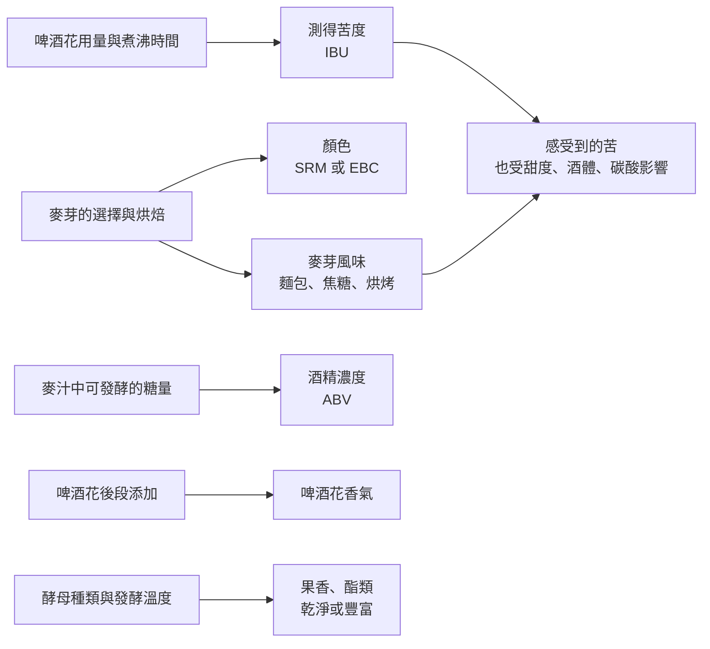

# 04 啤酒：穀物、麥芽與啤酒花

夏天的熱炒店，阿哲點了一瓶深色啤酒，同桌的小林皺眉說：「這麼黑，一定很烈又很苦。」喝了一口，兩人都愣了一下：它不太苦，酒精也不比平常的淡色啤酒高。顏色、酒精濃度、苦味，是三件由不同製程決定的事，只是常被一眼看成同一件。

!!! info "本章要回答"
    - **核心問題**：啤酒的顏色、苦味、香氣與酒精濃度，各自由哪一段製程決定？
    - **讀完能做什麼**：看到一杯啤酒，把「看起來」「聞起來」「喝起來」拆開描述，不用顏色猜濃度。
    - **不處理**：品牌或精釀酒廠導覽；自釀步驟。發酵的一般原理見[第 02 章](02-fermentation.md)。

## 從穀物到麥汁：麥芽做了什麼

啤酒的主要原料是穀物，最常見的是大麥。穀粒裡的能量以澱粉形式存在，酵母無法直接利用澱粉，所以啤酒的第一段工作是**把澱粉變成糖**，這和[第 02 章](02-fermentation.md)講的「糖化」是同一件事，只是啤酒用的工具是麥芽，而不是麴。

1. **發芽（製麥）**：讓大麥吸水發芽，種子在發芽過程中產生分解澱粉與蛋白質的酵素。接著烘乾停止發芽，得到麥芽。
2. **烘焙**：麥芽烘得越久、溫度越高，顏色越深，也會產生烤麵包、焦糖、咖啡、巧克力般的香氣。淡色麥芽保留較多酵素，深色焙烤麥芽的酵素大多已失去活性，主要提供顏色與風味。
3. **糖化**：磨碎的麥芽與熱水混合，酵素把澱粉切成可發酵的糖與部分不可發酵的糊精，得到甜的液體「麥汁」。
4. **煮沸與加啤酒花**：麥汁煮沸，加入啤酒花，再冷卻後交給酵母發酵。

這裡已經可以看到一個重點：**顏色主要來自麥芽的烘焙程度，酒精主要來自麥汁裡有多少可發酵的糖**。一款啤酒可以用少量深色麥芽染出很深的顏色，同時整體糖量不高，發酵後酒精濃度也就不高。

## 啤酒花：苦味與香氣的來源

啤酒花是一種攀緣植物的雌花。它對啤酒的貢獻主要有兩類：

- **苦味**：啤酒花含有α酸。α酸本身不太溶於麥汁，也不太苦；在煮沸過程中會轉變成較易溶、帶苦味的**異α酸**。煮沸時間會影響異構化與成分保留，但不能理解成越久就無限增加苦味；結果也受原料、麥汁與設備條件影響。
- **香氣**：啤酒花的揮發性精油帶來花香、柑橘、松針、草本等氣味。這些物質容易在長時間煮沸中散失，所以要強調香氣的做法，通常在煮沸後段或發酵後才加入啤酒花。

苦味可以用實驗室方法測量，常見單位是 **IBU（國際苦度單位）**，使用規定方法測量萃取物的吸光度，異α酸是重要貢獻來源，其他物質也可能影響讀數；它不是異α酸的專一濃度測定。但 IBU 是化學測量，不等於「喝起來有多苦」。同樣 IBU 的兩款啤酒，如果一款殘留較多糖分、酒體較厚，另一款很乾爽，人們感受到的苦味會不同。

## 酵母：艾爾與拉格

啤酒常被分成「艾爾」（ale）與「拉格」（lager）兩大類，分界主要是**酵母**：

- **艾爾**多用釀酒酵母 *Saccharomyces cerevisiae*，在較溫暖的溫度下發酵，常產生較多果香類的酯類。
- **拉格**使用 *Saccharomyces pastorianus*。遺傳研究指出，它是 *S. cerevisiae* 與耐冷的 *S. eubayanus* 雜交而來的混種酵母，適合在較低溫度下發酵，常被描述為風味較乾淨。

「艾爾比較濃、拉格比較淡」是常見誤解。艾爾與拉格指的是酵母與發酵方式，不是顏色也不是酒精濃度：深色的拉格、淡色的艾爾都很常見。

## 顏色、濃度、苦味：三把分開的尺

下圖把製程和感官特徵對起來。它們是不同的測量面向，並非互不影響；圖中只畫主要關係：

| 你看到或嘗到的 | 主要由什麼決定 | 可以怎麼測量 | 容易混淆成 |
|---|---|---|---|
| 顏色深淺 | 麥芽烘焙程度與比例 | 分光光度法，單位 SRM（美國）或 EBC（歐洲） | 酒精濃度、苦味 |
| 酒精濃度 | 可發酵糖量、酵母發酵程度 | 以容量百分比標示（ABV） | 顏色、「口感重」 |
| 測得苦度 | 異α酸及其他影響分析讀數的萃取成分 | IBU | 感受到的苦 |
| 感受到的苦 | 異α酸，加上殘糖、酒體、碳酸、溫度 | 感官評估 | 「烈」 |
| 香氣 | 麥芽、啤酒花精油、酵母代謝物 | 感官評估、化學分析 | 品牌形象 |

顏色的測量方法是用特定波長（430 奈米）的光穿過樣品，看被吸收多少。美國常用 SRM，歐洲常用 EBC，兩者可以換算。這個數字只描述顏色，和酒精濃度沒有必然關係：有深色而酒精不高的啤酒，也有淡色而酒精很高的啤酒。

## 少數風格，看原理怎麼組合

本書不做風格大全，只用幾個常見名稱說明上面三把尺如何組合。風格名稱是釀酒者與比賽使用的溝通分類，不是法律定義；同一名稱在不同地方、不同年代的做法也會有差異。

| 常見名稱 | 酵母 | 顏色來源 | 常見特徵 |
|---|---|---|---|
| 淡色拉格 | 拉格酵母 | 淡色麥芽 | 顏色淺、苦味低至中、風味乾淨 |
| 淡色艾爾 | 艾爾酵母 | 淡色麥芽 | 啤酒花香氣與苦味較明顯 |
| 小麥啤酒 | 多為艾爾酵母 | 小麥麥芽與大麥麥芽 | 某些酵母會產生香蕉、丁香般氣味 |
| 深色啤酒（司陶特等） | 多為艾爾酵母 | 少量深焙麥芽 | 咖啡、可可般烘烤味；酒精不一定高 |

## 啤酒的規則與歷史：兩個例子

**巴伐利亞 1516 年的法令。** 常被稱為「啤酒純釀法」的規定，1516 年由巴伐利亞公爵頒布，限定啤酒只能用大麥、啤酒花與水（當時還不了解酵母的角色）。俄亥俄州立大學的歷史刊物指出，這項規定的重要動機之一是經濟：限制其他穀物用於釀酒，保留給麵包，並管理啤酒價格。今天它常被當作「品質」或「天然」的象徵，但不能只用現代的「天然與安全」口號概括它；當時的糧食、價格與地方治理背景同樣重要，也不能把歷史上的原料限制當成今天的安全檢驗證明。

**台灣的啤酒工廠。** 財政部的文物館資料記載，1920 年日本資本在台北設立高砂麥酒株式會社，是台灣啤酒工業的起點之一；1933 年起，啤酒納入台灣總督府的專賣制度。這段歷史說明，台灣啤酒產業後來被納入稅收與專賣制度，更多背景見[第 12 章](12-history.md)。

!!! tip "不喝酒也能做的觀察"
    用麵包和茶，體驗「顏色」和「味道」為什麼要分開記錄：

    - 準備白吐司與烤得較深的吐司各一片，先看顏色，再聞、再吃。記下烤過的那片多了什麼氣味（烤麵包、焦糖、微苦），甜味有沒有變。這能幫助練習區分烘烤氣味與顏色，但不等於實際麥芽製程。
    - 泡兩杯同一種紅茶，一杯泡 2 分鐘，一杯泡 6 分鐘。長時間浸泡的那杯更苦也更澀，但顏色差異可能不如你預期。
    - 記錄時分三欄：看起來、聞起來、喝起來。不要用第一欄去推論後兩欄。

## 常見說法查證

??? question "說法：「顏色越深的啤酒越烈。」"
    - **可驗證的部分**：顏色主要由麥芽烘焙與用量決定，酒精濃度由可發酵糖量與發酵程度決定，兩者由不同步驟控制。
    - **不能推出的結論**：深色不代表高酒精，淡色也不代表低酒精。
    - **本書判斷**：要知道酒精濃度，看酒標上的酒精成分，不要看顏色。

??? question "說法：「IBU 越高就越苦。」"
    - **可驗證的部分**：IBU 是依規定方法得到的分析指標，異α酸是重要來源，並非直接秤出全部苦味物質。
    - **不能推出的結論**：感受到的苦還受殘糖、酒體、碳酸與溫度影響；IBU 相同的兩款啤酒喝起來可能差很多。
    - **本書判斷**：IBU 是有用的比較工具，但只在條件相近的啤酒之間比較較有意義。

??? question "說法：「只用麥、水、啤酒花做的啤酒比較天然、比較好。」"
    - **可驗證的部分**：1516 年巴伐利亞法令確實限定了原料，但立法動機包括糧食與價格管理。
    - **不能推出的結論**：原料清單短，不代表品質較好或對健康較有益；加入小麥、米、玉米或水果是風格選擇。
    - **本書判斷**：「天然」「純」是行銷常用詞，要問的是它具體指什麼、能否驗證，見[第 10 章](10-price-labels-expectation.md)。

## 本章小結

啤酒的顏色、酒精濃度與苦味，分別由麥芽烘焙、可發酵糖量與啤酒花決定；艾爾與拉格的分界在酵母。把三把尺分開，才能準確描述一杯啤酒，也才不會被顏色或名稱先入為主。

## 來源

| 來源 | 類型 | 本章用途 |
|---|---|---|
| [Keeping Beer "Pure": The 1516 Reinheitsgebot](https://origins.osu.edu/milestones/april-2016-keeping-beer-pure-1516-reinheitsgebot) | 大學歷史刊物（俄亥俄州立大學） | 1516 年法令內容與經濟動機 |
| [A new hypothesis for the origin of the lager yeast *Saccharomyces pastorianus*](https://pmc.ncbi.nlm.nih.gov/articles/PMC10133815/) | 研究論文 | 拉格酵母為混種酵母 |
| [Beer Color: Understanding SRM, Lovibond and EBC](https://beersmith.com/blog/2008/04/29/beer-color-understanding-srm-lovibond-and-ebc/) | 產業資料（釀酒軟體業者；僅用於測量方法說明） | SRM、EBC 以 430 奈米吸光度測量顏色 |
| [The History of Takasago Beer and Taiwan Beer](https://museum.mof.gov.tw/eng/singlehtml/177c2ca85a9c440f8ede6340a288a575?cntId=6cdfcf14d1b849f69946baf088d07dc5) | 博物館（財政部文物館） | 1920 年高砂麥酒設立、1933 年啤酒專賣 |
| [ASBC：2009 年苦度與異α酸協作測試](https://www.asbcnet.org/publications/TechReports/2009Technical_Sub_Committee_Reports.pdf) | 研究報告（釀造化學專業學會，參與者含業界） | 苦度單位測定與異α酸專一分析需區分 |
| [菸酒稅法第 2 條](https://law.moj.gov.tw/LawClass/LawSingle.aspx?pcode=G0330010&flno=2) | 法規（台灣） | 啤酒屬釀造酒類 |

查閱日：2026-09-20。
