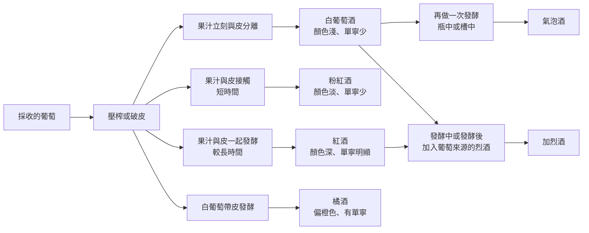

# 05 葡萄酒與其他果實酒

朋友聚餐，美玲帶了一瓶粉紅色的酒。有人說：「這是紅酒加白葡萄酒調出來的吧？」另一個人接著說：「粉紅的一定比較甜。」兩句話都把顏色當成了完整答案。桃紅色可以來自短暫浸皮，也有調和的做法；甜度還涉及殘糖與後續調整，不能只看顏色。

!!! info "本章要回答"
    - **核心問題**：同樣是葡萄，為什麼會做成紅的、白的、粉紅的、有氣泡的、加了烈酒的？品種、產地、年份、釀法各自決定了什麼？
    - **讀完能做什麼**：看到一張葡萄酒標，知道哪些欄位是法律定義、哪些只是風格描述；也能把蘋果酒、梨酒放進同一套原理。
    - **不處理**：產區排名、年份評分、收藏與投資。發酵原理見[第 02 章](02-fermentation.md)，蒸餾與桶陳見[第 03 章](03-distill-age-blend.md)，價格與期待的關係見[第 10 章](10-price-labels-expectation.md)。

## 糖在果肉裡，顏色和澀在果皮裡

[第 04 章](04-beer.md)談過，啤酒要先把穀物的澱粉切成糖，才輪得到酵母上場。葡萄不必。成熟葡萄的果肉裡本來就有葡萄糖與果糖，壓破就能直接發酵——這是果實酒和穀物酒最根本的分工差異，也是[第 01 章](01-what-is-alcohol.md)那張地圖上，含糖原料直接接到「發酵」的原因。

既然糖化這一段被省略了，釀酒者手上最重要的槓桿就換成了另一件事：**果汁要和果皮、種籽待在一起多久**。一顆葡萄粗略可以分成三個部分，它們貢獻的東西不一樣：

| 部位 | 主要提供 | 對成品的影響 |
|---|---|---|
| 果肉與汁液 | 糖、有機酸、水 | 決定可發酵糖量，也就是潛在酒精濃度與酸度 |
| 果皮 | 色素、單寧、香氣前驅物 | 顏色深淺、澀感、部分香氣 |
| 種籽 | 單寧、油脂 | 萃取方式會影響苦味與澀感 |

**單寧**是本章會反覆出現的詞。它是一類多酚化合物，會和口腔裡的蛋白質結合，讓人覺得口腔表面變乾、變緊。那是一種**觸感**，不是味覺的五味之一，所以形容單寧時說「澀」比說「苦」精準；描述澀感的詞彙見[第 09 章](09-describing-flavour.md)。單寧不只存在於葡萄，泡久的茶、沒熟透的柿子、某些釀酒用的梨，都有類似的感覺。

## 紅、白、粉紅、橘：同一把尺上的不同刻度

把葡萄本身的顏色與「果汁和果皮接觸多久」合起來看，常見的顏色分類就能連回製程。以下是典型做法，並非每一瓶都完全相同：

- **白葡萄酒**：葡萄榨汁後，果汁很快與皮分離，之後才發酵。通常顏色淺、單寧少，也可在發酵前短暫浸皮。白葡萄可以這樣做，許多深色葡萄也可以，因為果肉與果汁顏色很淡；並不是所有品種都如此。
- **粉紅酒**：使用深色葡萄，但果汁與果皮接觸的時間很短。顏色淡，單寧通常也淡。
- **紅酒**：果汁連著果皮一起發酵，發酵過程中產生的酒精還會幫忙萃取色素與單寧。顏色深，單寧明顯。
- **橘酒（帶皮白葡萄酒）**：用白葡萄，卻採取類似紅酒的帶皮發酵，於是出現偏橙的顏色與比一般白葡萄酒明顯的單寧。

所以不能把所有粉紅酒都理解成紅白葡萄酒混合，但也不能斷言調和不存在。香檳產區委員會便列出桃紅香檳的調和與浸皮兩條路線；這是產業組織對自身製法的說明，不是品質評比。也因為顏色與甜度由不同步驟決定，粉紅酒可以很不甜，紅酒也可以帶甜——這點和[第 04 章](04-beer.md)「顏色不等於濃度」的邏輯完全一樣。

圖中表示常見路徑，並非完整法定分類；桃紅調和法及第一次發酵保留氣體的做法未全部畫入。

## 氣泡與加烈：發酵之外還改變什麼？

### 氣泡可以在不同階段留下來

酵母把糖轉成乙醇時，同時產生二氧化碳（見[第 02 章](02-fermentation.md)）。一般靜態酒讓這些氣體散掉；氣泡酒則是把二氧化碳留在密閉容器裡。

歐盟《1308/2013 號規則》附錄 VII 第二部分，將二氧化碳來自發酵的氣泡酒與外加氣體的充氣氣泡酒分列為不同類別。因此要讀完整類別名稱，不能把中文通稱「氣泡酒」直接當成唯一法定分類。氣體可以來自第一次或第二次發酵；本節用二次發酵比較容器差異，不代表所有氣泡酒都走這條路。

要產生第二次發酵，做法是在已完成第一次發酵的基酒裡加入糖與酵母，再密封。差別在於「密封在哪裡」：

| 做法 | 第二次發酵的容器 | 過程特徵 | 常被描述的風味方向 |
|---|---|---|---|
| 瓶中二次發酵（傳統法） | 就是最後賣給你的那支瓶子 | 酵母死亡後在瓶中自解，接著要把沉澱集中到瓶口、開瓶去渣、補加液體再封瓶，工序長、人力多 | 除了果香，常出現烤吐司、餅乾、奶油般的氣味 |
| 槽中二次發酵 | 密閉的大型不鏽鋼槽，之後才裝瓶 | 常用於較短的製程，但槽中也可以安排酒泥接觸，時間不能只由容器推定 | 強調新鮮果香與花香 |

這兩條路線常被排成高低，但它們解決的問題不同：瓶中酒泥接觸與較快完成的槽中製程，可以服務不同風格；酵母、基酒與實際接觸時間也會改變結果。**工序多寡不是品質量尺**，這是全書反覆的立場。

### 加烈時機影響剩下多少糖

加烈酒（強化酒）是在葡萄酒或發酵中的葡萄原料裡加入酒精，提高成品酒精濃度。歐盟上述附錄將 liqueur wine 列為獨立類別，規範原料、酒精來源與濃度，並有特定酒款例外；不能把這一名稱套用成全世界加烈酒的單一定義。

影響甜度的一個重要因素，是**加入的時機**：

- **發酵還沒結束就加**：酒精濃度突然升高，酵母活動被中止，還沒被吃掉的糖就留在酒裡，成品偏甜。
- **等發酵結束才加**：糖大多已經轉成酒精，再補酒精會提高濃度，若沒有再甜化，成品可以偏不甜。

同一個動作（加烈酒），因為插入製程的位置不同，得到兩種很不一樣的酒。這也說明為什麼「加烈酒都很甜」不成立。後續甜化、混合與熟成同樣會改變結果，所以不能只憑加入時機猜出最終甜度。本章不展開個別產區的桶陳制度，也不把所有加烈酒都說成必須氧化陳年。

## 品種、產地、年份：四個不同問題

品種回答「種了什麼葡萄」；產地回答「在哪裡生長與生產」；年份通常指葡萄採收的年度；製程回答「採收之後怎麼處理」。四者會互相作用，但不能彼此代替。看見一個品種名，尚不能知道是否帶皮發酵、是否使用木桶；看見一個年份，也不能知道酒在桶中待了多久，更不能直接推定目前保存狀況。

| 酒標資訊 | 可以先問的問題 | 不能直接推出的結論 |
|---|---|---|
| 品種 | 是單一品種，還是多品種組合？ | 一定帶有某個水果的固定氣味 |
| 地理名稱 | 是一般產地描述，還是受保護名稱？ | 同一區每位生產者風格相同 |
| 年份 | 指採收年，還是另一種日期？ | 越早越好、越早越濃 |
| 酒精濃度 | 每單位容量有多少乙醇？ | 甜度或品質必然較高 |
| 製程說明 | 帶皮、桶陳、加烈或保留氣泡？ | 做得越多就越值得喜歡 |

歐盟的 PDO 與 PGI 是受規則約束的地理標示，不只是地圖上畫個圈。它們涉及葡萄來源及產品規格；閱讀時要追到該名稱的規格書，而不是從名稱的陌生程度猜身價。法律可以查核來源與生產條件，卻不能替每個讀者決定喜好。其他司法管轄區有自己的名稱與門檻，不能把歐盟標示規則直接套到台灣或美國。

這也讓「風土」可以成為具體問題：某段敘述到底在談氣候、地形、栽培，還是當地人的製法選擇？若一句話只說「土地的靈魂」，卻無法交代觀察或比較方式，它比較接近文化詮釋。這種語言可以有文學價值，但不會因此變成可測量的品質證明。進一步判讀期待與形容詞，見[第 10 章](10-price-labels-expectation.md)。

## 蘋果、梨與其他水果：離開葡萄也能看懂

蘋果酒與梨酒提醒我們，水果釀酒的共通原理是利用果汁中的糖，而不是模仿葡萄酒的身分。華盛頓州立大學的梨酒教材介紹 perry 為梨汁發酵酒，並指出梨中的山梨糖醇不易被一般釀酒酵母發酵；因此「酵母完成工作」不一定等於喝起來完全不甜。這是成分與微生物共同造成的結果，不能把所有梨酒排成比蘋果酒更甜或更細緻的一列。

水果品種、糖酸比例、單寧與製程仍然需要分別看。超市裡甜脆的水果，並不是判斷所有釀酒原料的模板；也不必因為某種原料平常拿來吃，就認定它不能發酵。比較的重點是成品採用什麼原料與處理，而不是替食用品種與釀造品種建立價值階級。

台灣《菸酒管理法施行細則》第 3 條將葡萄酒和其他水果釀造酒分開列名。相對地，酒精基底加入果實或其他輔料的製品，還要依實際製法與條件判斷分類。因此「梅子酒」「水果酒」這類日常名稱，可能還不足以分辨水果是否真的參與了發酵。先讀原料與酒類別，再看製程說明，通常比從瓶身上的水果圖案猜測可靠。

本章用來解釋製程的資料，包含法規、大學教材與酒類教育機構的文章，回答的問題並不完全相同。法規定義不是感官實驗；產業教材描述「常見香氣」也不等於每瓶都能聞到。不同釀法的確能改變組成，但哪一個比較好喝，需要把人、情境與比較條件一起說清楚。本章沒有用產區、獎項或價格替代這些資料。

!!! tip "不喝酒也能做的觀察"
    - 取一顆洗淨的深色葡萄，分別觀察果皮、果肉與切開後的汁液；只記錄眼前這個品種，不把它當作所有葡萄的代表。
    - 再比較同一種葡萄的果肉與少量果皮在口中的感受，將甜、酸與乾澀分欄記錄；不需要吞食種籽。
    - 最後寫下「看得到的顏色」與「嚐到的甜度」。這是描述練習，不是縮小版釀酒實驗，也不能用來預測某瓶酒的結果。

## 常見說法查證

??? question "說法：桃紅一定是紅白葡萄酒混合，而且比較甜。"
    **可驗證部分**：桃紅可以由短暫浸皮取得，桃紅香檳也存在調和做法；顏色與殘糖不是同一項測量。**本書判斷**：既不能一概說是混合，也不能一概說不是；甜度需另外確認。

??? question "說法：瓶中二次發酵一定比槽中法好。"
    **可驗證部分**：容器與酒泥接觸會改變製程，工序及時間亦可能不同。**本書判斷**：這些差異支持風格比較，不能直接推出所有人的偏好排序。

??? question "說法：水果來源天然，所以果實酒比較健康。"
    **可驗證部分**：原料與成品成分可以查核，但乙醇並不因水果來源而消失。**本書判斷**：原料故事不能取代劑量與健康研究；風險討論見[第 13 章](13-body-health.md)。

## 來源

| 來源 | 類型 | 本章用途 |
|---|---|---|
| [AWRI：Pre-fermentation skin contact](https://www.awri.com.au/wp-content/uploads/2020/06/s2164.pdf) | 產業資料（葡萄酒研究機構，服務產業） | 白葡萄酒浸皮與帶皮白葡萄酒的製程差異 |
| [香檳產區委員會：Champagne Rosé](https://www.champagne.fr/fr/deguster-le-champagne/types-de-Champagne/champagne-rose) | 產業資料（推廣自身產區） | 只用來確認該產區存在調和與浸皮做法 |
| [歐盟 1308/2013 號規則](https://eur-lex.europa.eu/legal-content/EN/TXT/HTML/?uri=CELEX:32013R1308) | 法規 | 附錄 VII 的氣泡與加烈酒類別；法定分類不等於偏好 |
| [WSET：Sparkling wine production methods](https://www.wsetglobal.com/knowledge-centre/blog/2026/a-guide-to-sparkling-wine-production-methods-and-regional-styles) | 教材（酒類教育機構，提供收費資格課程） | 瓶中與槽中製程比較，非品質排名 |
| [華盛頓州立大學：Perry](https://cider.wsu.edu/perry/) | 教材 | 梨汁發酵與山梨糖醇；未採用頁面所有通俗比較 |
| [菸酒管理法施行細則](https://laws.gov.taipei/law/LawSearch/LawExport/FL005922?type=0) | 法規 | 台灣水果釀造酒與再製酒分類 |

查閱日：2026-09-20。
