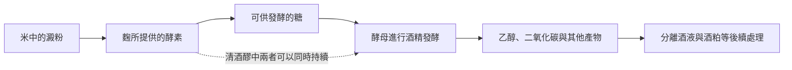

# 06 米與麴的世界：清酒、黃酒與台灣的酒

小林整理家裡廚房，看見料理米酒、紹興酒，旁邊還有朋友帶來的清酒。三瓶都讓他想到米，卻不能因此視為同一種酒。原料相近，只是故事的起點；糖化、發酵、是否蒸餾，以及人們怎麼命名與使用，才把它們帶往不同方向。

!!! info "本章要回答"
    - **核心問題**：米沒有葡萄那樣現成的糖汁，如何變成酒？同樣寫著米或麴，為什麼製法與文化語境仍不同？
    - **讀完能做什麼**：分開清酒的製程名稱與喜好評價，辨認台灣米酒和穀類釀造酒的差異，知道閱讀族群酒文化時要追問什麼。
    - **不處理**：自釀配方、品牌比較與養生功效。糖化原理見[第 02 章](02-fermentation.md)，蒸餾酒見[第 07 章](07-spirits.md)，身體風險見[第 13 章](13-body-health.md)。

## 麴提供酵素，酵母把糖變成酒精

米的主要儲藏養分是澱粉，不能只把米泡進水裡，就當成現成的葡萄汁。必須先讓酵素將澱粉分解為可供發酵的糖，再由酵母利用。這兩項工作在概念上不同；即使在同一容器裡同時進行，也不能把麴菌與酵母當成同一種微生物。

日本酒類總合研究所的教材把麴說明為在蒸過的米、麥等基質上培養麴菌的製品；它能提供分解澱粉與蛋白質的酵素。換句話說，「麴」不只是看不見的菌，也包含承載它的原料。清酒、味噌與醬油可以都用到麴，但製造者需要的酵素與香味不同，不能拿一種食品的製法代表全部。[製造全般問答](https://www.nrib.go.jp/sake/sakefaq01a.html)

清酒常用「並行複發酵」描述糖化與酒精發酵在醪中並行的情形。它不是把同一份酒釀兩遍；「複」指涉及糖化與發酵兩種轉變，「並行」則指兩者在時間上交疊。理解這點，便能避免把清酒與氣泡酒的二次發酵混在一起。後者談的是再一次產生氣體的酒精發酵，問題不同。

這張圖是一張分工圖，不是操作流程。它沒有配方、溫度或時程，也沒有將所有釀造文化納入同一個菌種模型。中文的「酒麴」有時指含多種微生物的發酵起始材料；遇到黃酒或地方穀物酒，仍須查它實際使用什麼麴、原料與製程。

## 清酒標籤：先辨認軸線，再讀名稱

日本國稅廳的《清酒製法品質表示基準》以原料、精米步合及製法等條件規範特定名稱。**精米步合指磨米後剩下的白米重量，占原來玄米重量的百分比**。標示 60%，意思是留下六成，而不是磨掉六成。它是加工比例，不能直接當成濃度、甜度或個人滿意程度。

下面只列便於識讀的主要條件，並不是完整製造許可規格。表中的百分比一律是精米步合，與瓶上酒精濃度無關。

| 日本清酒特定名稱 | 原料是否列釀造酒精 | 精米步合主要條件 |
|---|---|---|
| 純米酒 | 否 | 沒有一律適用的上限 |
| 純米吟釀 | 否 | 60% 以下 |
| 純米大吟釀 | 否 | 50% 以下 |
| 特別純米酒 | 否 | 60% 以下，或需說明的特別製法 |
| 本釀造 | 是 | 70% 以下 |
| 吟釀 | 是 | 60% 以下 |
| 大吟釀 | 是 | 50% 以下 |
| 特別本釀造 | 是 | 60% 以下，或需說明的特別製法 |

這是八項特定名稱；「生酒」「原酒」則回答其他製程問題，並不是再往上加的兩個等級。純米酒的精米步合上限已從表示基準中刪除，不能沿用舊資料說一切純米都必須符合 70% 以下。吟釀也不只是磨米比例，還涉及相應製法等條件。[國稅廳表示基準](https://www.nta.go.jp/taxes/sake/hyoji/seishu/gaiyo/02.htm)

加入釀造酒精也不能直接翻譯成「偷工減料」。日本酒類總合研究所列出的用途包含香氣成分的萃取與酒質調整。它與純米是可辨認的製程差異，至於喜歡哪一種風格，仍要由具體成品及讀者自己判斷。把添加與不添加各寫成一條道德界線，會讓真正可查核的原料與規格反而被遮住。

另一個容易混淆的詞是火入，也就是製程中的加熱處理，目的包括減少再發酵、控制使酒質劣化的微生物，以及讓酵素失去活性。生酒指製成後沒有接受加熱處理；它不是「更活，所以更健康」的科學結論。保存要求應讀容器說明，也別把「生酒」等同「混濁」：是否加熱與留下多少固形物，是兩條不同軸線。[清酒問答](https://www.nrib.go.jp/sake/sakefaq02.html)

## 黃酒與台灣米酒：同一原料不能代替製程

黃酒不是清酒的另一個中文名稱。黃酒研究談到的是不同穀物、麴與微生物組成共同參與的發酵系統；紹興酒是理解這個範圍的案例之一，不能據此把所有黃酒都說成紹興酒，也不能把所有黃酒都說成使用紅麴。

Tian 等人在 2022 年發表的黃酒微生物綜述，整理發酵群落、風味成分與品質控制問題；其典型製程圖包含穀物、麥麴與發酵起始材料，酒液再經分離等處理。這是不同研究的整合，並非對每一種地方黃酒逐一抽樣，也不是飲酒健康效益的臨床試驗。本章只用它說明黃酒製程不能縮成「米加一種酵母」，不沿用文中將營養成分直接連到產品價值的敘述。[論文摘要與圖說](https://pubmed.ncbi.nlm.nih.gov/35198991/)

回到台灣，「米酒」在日常語言和法律中未必採用同一種範圍。台灣《菸酒管理法施行細則》第 3 條的米酒屬蒸餾酒：米類經液化、糖化、發酵，再蒸餾。清酒則屬釀造酒的理解範圍，不能因英文常把它叫 rice wine，就認定與廚房裡的米酒可以逐瓶對應。

| 名稱與本章採用語境 | 要辨認的製程或條件 | 最容易混淆的地方 |
|---|---|---|
| 日本清酒 | 米與麴的糖化、發酵及酒液分離；另讀具體標示 | 特定名稱不是由低到高的個人喜好表 |
| 黃酒 | 穀物與麴等參與發酵，做法依類型而異 | 黃酒、紹興酒、紅麴酒不能全畫上等號 |
| 台灣法規中的米酒 | 發酵後再蒸餾 | 名稱有米，不代表都是釀造酒 |
| 台灣法規中的料理米酒 | 以米製作、經發酵蒸餾，可調和或不調和食用酒精；成品不超過 20%，標示專供烹調 | 「料理」不能自行推成無酒精 |
| 地方或族群的穀物酒 | 需逐案確認原料、名稱、製法與使用情境 | 商品名不能代表整個族群的歷史 |

料理米酒的法定條件與家庭把某種酒拿來煮菜，是不同問題；用途相同不會自動改變原來的分類。法規同時寫「調和或不調和」，所以看見料理米酒四個字，尚不能斷定一定加入額外食用酒精。這種看似細小的閱讀差異，正是把製法資訊從廣告印象中取回來的方法。[施行細則第 3 條](https://laws.gov.taipei/law/LawSearch/LawExport/FL005922?type=0)

## 台灣餐桌背後：制度與具體的人

台灣的酒不只有製法，還有誰能生產、誰能販售的制度背景。檔案管理局的歷史文章記載日治時期酒類專賣與戰後公賣的演變，以及 2002 年開放市場、事業改制的過程。這些制度會影響生產與流通的環境；讀者熟悉的容器、名稱與取得方式，也是在這些變動中形成的。[臺灣菸酒事業：從專賣到自由化經營](https://www.archives.gov.tw/tw/arctw/69-1738.html)

但一份政府事業史，不足以代表每個家庭、每個部落的經驗。要談米酒進入廚房的意義，還需要家庭記憶與飲食資料；要談原住民族酒文化，更必須指明族群、社群、記錄年代與敘事者。本章不採用商店宣稱「傳統小米酒不可能超過某濃度」作為跨族群科學定律，也不根據旅遊介紹列出一套通用祭儀規矩。

以鄒族為例，楊曉珞在 2021 年《原住民族文獻》的文章，將殖民時期紀錄、後來的人類學研究與鄒族作者的書寫放在一起，討論小米祭儀的變遷。其中轉述鄒族研究者浦忠勇的觀點：即使部分宗教性與禁忌轉變，家族共食、長老共飲仍可能強化親屬連結與部落凝聚。這是對特定歷史情境的文化詮釋，不能簡化為「鄒族愛喝酒」。[〈他人的田野，我們的文獻〉](https://ihc.cip.gov.tw/EJournal/EJournalCat/561)

同一篇文獻也提醒，不同社群出身的作者，可能補上過去敘事漏掉的部分。因此看到「古法」二字，可追問：誰記錄了這個方法？記錄的是哪個地方、哪個年代？今天的人是否仍如此實踐？這些問題不是要替文化找一張純正證書，而是讓文化的持有者與變動重新出現在故事裡。更完整的制度與史料閱讀見[第 12 章](12-history.md)。

## 怎麼比較，才不被名稱帶著走？

可以先在紙上畫四欄：原料、糖化與發酵、後續處理、使用情境。純米放到原料和製法欄；生酒放到是否加熱欄；料理用途放到情境欄。若某個詞放不進任何一欄，就查它是不是感官描述或宣傳形容詞，而不是急著替它打分數。

這樣也能處理「日本酒度越高一定越不甜」之類主張。測量值不能單獨決定完整感受；日本酒類總合研究所明確提醒，糖與酸度的平衡、香氣及口感都會影響甘辛印象。讀一個數字時，要先知道它量的是什麼，接著才問它能解釋多少感受。這與葡萄酒顏色不能代替甜度，是同一種閱讀紀律。

本章的證據仍有邊界：清酒標示依日本規範，台灣米酒依台灣法規；黃酒綜述不提供所有地方類型的完整標準；鄒族文獻也不能替其他族群發言。把範圍說清楚，比湊一張看似完整的「亞洲酒排名」更能保留知識的準確度。製程表回答酒怎麼形成，文化資料回答人如何使用它，兩者都不會自動回答一個人應不應該喝。

!!! tip "不喝酒也能做的觀察"
    - 在米、味噌或醬油等家中已有食品的包裝上找原料，將「穀物」「麴或發酵」「用途」分欄抄下；沒有寫到的地方標示「未知」，不要補猜。
    - 如果家裡已有料理酒的空瓶，可只讀標示，把濃度、原料與專供烹調等文字分開記錄，不必開瓶或飲用。
    - 問一位願意分享的家人，哪一道菜會用到酒、這個做法從誰學來。把答案標成個人記憶，不把一家的經驗推成所有台灣家庭的共同傳統。

## 常見說法查證

??? question "說法：純米一定比本釀造好。"
    **可驗證部分**：兩者原料與製法要求不同，釀造酒精的添加也有可說明的用途。**本書判斷**：分類可以核對，偏好沒有因此被法規排好名次。

??? question "說法：精米步合 60% 就是磨掉六成。"
    **可驗證部分**：日本表示基準以剩下的白米重量對玄米重量計算。**本書判斷**：60% 是留下六成；讀反比例會連帶誤解製程。

??? question "說法：有傳統祭儀的酒，喝下去自然有益身體。"
    **可驗證部分**：史料或民族誌可以記錄儀式、關係與文化意義。**本書判斷**：這類證據不能回答醫療效果，也不能成為要求他人飲酒的理由。

## 來源

| 來源 | 類型 | 本章用途 |
|---|---|---|
| [酒類總合研究所：製造全般](https://www.nrib.go.jp/sake/sakefaq01a.html) | 政府機關 | 麴、酵素與原料的分工 |
| [酒類總合研究所：令和 5 年度業務報告](https://www.nrib.go.jp/gui/pdf/r05gyozihou.pdf) | 政府機關 | 並行糖化與發酵的技術背景 |
| [日本國稅廳：清酒製法品質表示基準概要](https://www.nta.go.jp/taxes/sake/hyoji/seishu/gaiyo/02.htm) | 法規／政府機關 | 八種特定名稱、精米步合與生酒 |
| [酒類總合研究所：清酒](https://www.nrib.go.jp/sake/sakefaq02.html) | 政府機關 | 添加酒精、火入、甘辛感受 |
| [Tian 等，2022：黃酒微生物綜述](https://pubmed.ncbi.nlm.nih.gov/35198991/) | 研究論文（綜述；開啟摘要及圖說） | 黃酒製程與微生物多樣性，不作健康依據 |
| [菸酒管理法施行細則](https://laws.gov.taipei/law/LawSearch/LawExport/FL005922?type=0) | 法規 | 台灣米酒與料理米酒的定義 |
| [檔案管理局：臺灣菸酒事業](https://www.archives.gov.tw/tw/arctw/69-1738.html) | 博物館或檔案 | 專賣、公賣與市場制度背景 |
| [楊曉珞：他人的田野，我們的文獻（2021）](https://ihc.cip.gov.tw/EJournal/EJournalCat/561) | 研究論文（文獻整理與文化詮釋） | 鄒族祭儀的變遷與史料限制 |

查閱日：2026-09-20。
