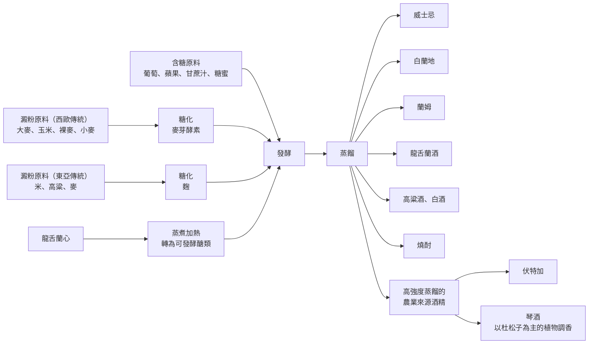

# 07 蒸餾酒：從原料走向風味

公司尾牙的長桌上，同時放著一瓶威士忌、一瓶高粱、一瓶龍舌蘭。小林問旁邊的人：「這三種有什麼不一樣？」得到的答案是「一個外國的、一個我們的、一個調酒用的」。這個回答描述的是場合與習慣，不是酒本身。如果改成問「它們的糖從哪裡來、蒸餾完有沒有進桶、法律上叫什麼名字」，三瓶酒的差別會清楚很多。

!!! info "本章要回答"
    - **核心問題**：不同的蒸餾酒，差別到底在原料、糖化、蒸餾、熟成的哪一段？各地法律又是怎麼定義它們的？
    - **讀完能做什麼**：拿到一瓶沒見過的蒸餾酒，用同一組欄位（原料、糖化、蒸餾、熟成、法定定義）把它放進地圖，並分辨哪些名稱有法律效力、哪些只是日常稱呼。
    - **不處理**：蒸餾的物理原理、木桶熟成與調和的作用（見[第 03 章](03-distill-age-blend.md)）；品牌、酒款選購與收藏。調酒與香味酒見[第 08 章](08-mixed-nonalcoholic.md)。

## 蒸餾之前，先看糖從哪裡來

蒸餾不會創造酒精，它只是把已經發酵好的酒液加熱，分離並濃縮其中的乙醇與部分香氣成分（見[第 03 章](03-distill-age-blend.md)）。所以一瓶蒸餾酒的個性，有很大一部分在蒸餾器開火之前就決定了：**原料是什麼、糖化怎麼做、發酵發生在什麼環境**。

把常見的蒸餾酒攤開來看，原料可先分成三種情況：

- **本身就含糖**：葡萄、蘋果等果實，甘蔗汁或製糖剩下的糖蜜。酵母可以直接利用，不需要糖化這一步。
- **澱粉需要糖化**：大麥、玉米、裸麥、小麥、米、高粱。必須先用酵素把澱粉切成糖。西歐傳統多用**麥芽**自身的酵素，東亞傳統多用**麴**——長在穀物上的絲狀真菌，會分泌澱粉分解酵素（見[第 02 章](02-fermentation.md)）。
- **儲存性醣類需要加熱處理**：龍舌蘭。作法是把龍舌蘭心（piña）蒸煮加熱，使其中的醣類轉成酵母可以利用的形式。

《菸酒稅法》第 2 條對「蒸餾酒類」的定義，正好是這條路線的法律版本：以糧穀類、水果類及其他含澱粉或糖分之農產品為原料，經糖化或不經糖化，發酵後再經蒸餾而得的含酒精飲料。「經糖化或不經糖化」這六個字，就是上面第一種與第二種情況的差別。

注意圖的右半邊：從「蒸餾」出來的每一條線，後面還可以再接熟成、調和或加香。同樣從穀物出發，可能走向威士忌，也可能先製成較中性的農業來源酒精，再以植物調香成琴酒；但進桶三年不會自動取得威士忌名稱，仍須符合適用法規的其他要求。**原料決定了起點，後面的每一個決定都還會改寫終點。**

## 七類蒸餾酒，用同一組欄位看

下表用同一組欄位比較常見的蒸餾酒。請特別看最後一欄：法定定義只在它自己的司法管轄區內有效，換一個地方，同一個詞可能沒有法律定義，或定義不同。

| 類別 | 原料 | 糖化方式 | 蒸餾 | 熟成 | 法定定義與司法管轄區 |
|---|---|---|---|---|---|
| 威士忌 | 穀物：大麥、玉米、裸麥、小麥等 | 麥芽自身的酵素 | 壺式或連續式；歐盟與蘇格蘭規定蒸餾強度低於 94.8% | 木桶；蘇格蘭規定在蘇格蘭境內、容量不超過 700 公升的橡木桶熟成至少 3 年 | 歐盟 2019/787：最低 40%；英國《Scotch Whisky Regulations 2009》另訂蘇格蘭威士忌規格；美國 27 CFR 5.143 另訂波本規格 |
| 白蘭地及果實蒸餾酒 | 葡萄酒或其他果實的發酵液 | 果實通常不需澱粉糖化 | 依類別與製程而異 | 依類別而異 | 中文廣義白蘭地與歐盟法定 brandy 不完全重合；後者以葡萄酒蒸餾酒為基礎，最低 36%，另有木桶熟成要求；其他水果另查 fruit spirit 等分類 |
| 蘭姆 | 甘蔗汁或糖蜜 | 不需要 | 歐盟規定蒸餾強度低於 96% | 有的熟成、有的不熟成 | 歐盟 2019/787：最低 37.5% |
| 龍舌蘭酒 | 龍舌蘭的莖心 | 使儲存醣類轉為可發酵糖 | 發酵後蒸餾 | 依風格而異 | Tequila 是墨西哥特定規格與產地名稱，不能把所有龍舌蘭蒸餾酒都稱為 Tequila；詳細年限本章不列 |
| 高粱酒、白酒 | 高粱、米等；製麴原料可能另含小麥、大麥或豌豆 | 酒麴；常見傳統製程在固態發酵中同時糖化、發酵 | 傳統固態法以含酒精的發酵穀物蒸餾；不是所有白酒製程皆相同 | 蒸餾後貯存，再以不同批次勾調 | 中國有國家標準，「香型」是中國的分類；台灣《菸酒稅法》把它歸在蒸餾酒類，「高粱酒」本身不是國際通用的法定名稱 |
| 燒酎 | 米、麥、甘藷、黑糖、蕎麥等 | 麴 | 單式（批次）或連續式 | 不一定熟成 | 日本《酒稅法》：連續式蒸餾燒酎酒精度 36% 未滿；單式蒸餾燒酎 45% 以下 |
| 伏特加 | 馬鈴薯、穀物或其他農產品 | 依原料而定 | 一般蒸餾到很高的強度，並以過濾或精餾減弱原料特徵 | 通常不做桶陳 | 歐盟 2019/787：以農業來源酒精製造，最低 37.5% |

這張表要讀出三件事。

第一，**「糖化」欄位揭示不同製程的路線**。這些威士忌案例使用麥芽，燒酎與白酒案例使用麴，兩者做的是同一件化學工作，但微生物組成與發酵環境完全不同，風味走向自然不同。

第二，**「熟成」不是蒸餾酒的必要條件**。伏特加通常不進桶，很多蘭姆與龍舌蘭酒也不進桶；蘇格蘭威士忌則把最低熟成年限寫進規格。進不進桶是類別定義的一部分，不是品質階梯。

第三，**最後一欄的每一條規定都綁著一個地方**。蘇格蘭威士忌的規格由英國法規訂定，只能約束想使用這個名稱的產品；龍舌蘭酒的規範來自墨西哥；燒酎的酒精度上限來自日本稅法，而且它首先是稅務分類，其次才是風味描述。

## 名稱有範圍，顏色沒有身分證

威士忌是很適合練習閱讀限定詞的例子。「Scotch」增加了生產地及製法要求；「bourbon」則帶出美國法規對穀物組成與新炙燒橡木桶的規定。美國波本的穀物配方至少有 51% 玉米，蒸餾濃度不得超過 80%，裝瓶至少 40%。這些是辨識產品類別的條件，不是個人喜好的排名表。也不要把美國法規的 proof 看成攝氏溫度：美制 125 proof 指 62.5% 酒精濃度，並不是把酒桶加熱到某個溫度。

再看「白蘭地」。日常可能用它統稱果實蒸餾酒，但歐盟附錄中的 brandy／Weinbrand 有特定葡萄酒來源及熟成條件；蘋果、梨等果實蒸餾酒要查相應分類。這不是哪種中文譯名比較高級，而是日常語言與法條切分世界的方法不同。翻譯若省略原文，便很容易把某一小類的規格錯套在整個家族。

顏色也不能替代這項核對。有木桶接觸的酒可能獲得色澤；部分類別容許特定著色方式，另一些不容許。透明只能描述此刻看見的外觀，不能單憑它斷定沒有熟成、沒有香氣或比較「純」。同理，深色不能直接換算成桶中年數。若酒標沒有交代，可靠的筆記是「顏色深，來源未知」，而不是自行補上老酒故事。

琴酒讓分類再多一個方向。依歐盟規格，杜松風味必須占主導，最低酒精度為 37.5%。它可以採用多種植物香氣，但「聞到柑橘」並不保證添加了某種柑橘皮；香氣相似與成分身分仍是兩件事。讀者可以記下植物增香這個製程角色，再向標示或製造資訊查具體材料，不必憑鼻子替產品開成分證明。

## 風味是路線交會，不是一種原料一種味道

假設有兩份資訊卡：甲寫穀物、麥芽糖化、蒸餾、橡木熟成；乙寫高粱、酒麴、固態發酵及蒸餾、貯存與調和。它們足以讓我們預期製程差異，卻不足以精準指定甲一定有香草、乙一定有某種花香。酵母與其他微生物、發酵環境、蒸餾時保留的成分、容器和調和，都可能改變最後結果。

白酒的例子尤其提醒我們，不要把穀物主料與製麴原料混為一談。製麴所用的穀物是微生物與酵素的載體，也會參與發酵環境；標示提到小麥，不代表小麥必然是主要發酵原料。文獻中的大麴、小麴與麩麴是在談生產技術，清香、濃香等香型則是另一種描述和分類層次，不能彼此替換。

燒酎又展示了酒稅分類的用途。日本法規以蒸餾方式及酒精度等條件區分連續式與單式蒸餾燒酎；數字是類別邊界，並不表示單式一定較強烈、連續式一定沒味道。真正比較成品仍要看原料、製程、稀釋程度與實際描述。台灣高粱酒、日文燒酎和中文白酒也不是可以一對一互換的三個字典詞。

本章的表格刻意沒有「品質」欄。若把蒸餾次數多、桶子稀有、原料單一等資訊加成一個分數，看似客觀，實際上只是把某些偏好藏進公式。較可靠的做法是先確認資訊，再問它是否與你想理解的風味有關。對不飲酒的讀者而言，把製程說清楚，已經完成這項學習。

## 一張酒標能回答多少問題？

可用四個問題閱讀任何蒸餾酒介紹：它的法定名稱是什麼？適用哪個市場？說的是原料、製程還是感官？資料由誰提供？廠商可以是自己產品製法的來源，但「我們採用某種桶」與「因此比別人優秀」之間，仍少了一段需要獨立驗證的論證。

若只有「古法、匠心、珍稀」而沒有材料和製程，先保留空白即可。反過來，詳列化學物質也不保證資訊比較有用：成分存在、濃度足以被察覺，以及整體感覺較受喜愛，是三個不同問題。法律表格解決名稱一致性，化學分析解決組成，感官比較解決人如何感覺，不能讓其中一項冒充另外兩項。

!!! tip "不喝酒也能做的觀察"
    - 找米粒、麥片、玉米粒與水果各一樣，做四張材料卡；只需觀察和查資料，不需發酵。
    - 在卡上分別寫「本身含可發酵糖」或「主要需先把澱粉轉成糖」，再註明這是製程起點，不能預測全部成品香氣。
    - 用柑橘皮與茶葉各自聞香，描述「增香材料」與「基底」的角色。不要把這個無酒精比較當作任何烈酒的完整模擬。

## 常見說法查證

??? question "說法：單一原料或單一酒廠，一定優於調和。"
    - **可驗證部分**：原料與酒廠數量有時可由法定標示或製造資訊確認。
    - **本書判斷**：來源數量不直接決定感官喜好；調和是製程方法，不是低品質的同義詞。

??? question "說法：透明烈酒沒有風味，深色烈酒一定比較老。"
    - **可驗證部分**：可觀察色澤，再查熟成、過濾與容許添加規範。
    - **本書判斷**：外觀不足以證實整套製程。把色澤當年齡計或純度計，都超出了它能提供的資訊。

??? question "說法：寫著植物、穀物與傳統，就比較適合身體。"
    - **可驗證部分**：原料和製法可以查證，健康結果需要另外的醫學證據。
    - **本書判斷**：製程與文化不能消除乙醇相關風險；身體問題見[第 13 章](13-body-health.md)。

## 來源

| 來源 | 類型 | 本章用途 |
|---|---|---|
| [台灣《菸酒稅法》第 2 條](https://law.moj.gov.tw/LawClass/LawAll.aspx?pcode=G0330010) | 法規 | 蒸餾酒稅目與原料分類 |
| [歐盟 2019/787，2024-05-13 整合版附錄 I](https://eur-lex.europa.eu/legal-content/EN/TXT/?uri=CELEX:02019R0787-20240513) | 法規 | 烈酒名稱的邊界；不是品質排名 |
| [Scotch Whisky Regulations 2009](https://www.legislation.gov.uk/uksi/2009/2890/body/data.xht?view=snippet&wrap=true) | 法規 | 蘇格蘭威士忌條件 |
| [美國 27 CFR 5.143](https://www.law.cornell.edu/cfr/text/27/5.143) | 法規（康乃爾法律資料庫轉載） | 波本原料、桶與濃度要求 |
| [墨西哥 NOM-006-SCFI-2012 原始公報](https://dof.gob.mx/nota_detalle_popup.php?codigo=5282165) | 法規 | Tequila 的指定原料、產地與製程範圍 |
| [日本《酒税法》](https://laws.e-gov.go.jp/law/328AC0000000006) | 法規 | 燒酎稅法分類 |
| [酒類總合研究所：燒酎、白蘭地、威士忌](https://www.nrib.go.jp/sake/sakefaq04.html) | 政府機關 | 製程與原料比較 |
| [Chinese Baijiu: The Perfect Works of Microorganisms](https://www.frontiersin.org/journals/microbiology/articles/10.3389/fmicb.2022.919044/full) | 研究論文（綜述；含酒企任職作者） | 麴、固態發酵與蒸餾；不作所有白酒的唯一製法 |

查閱日：2026-09-20。
