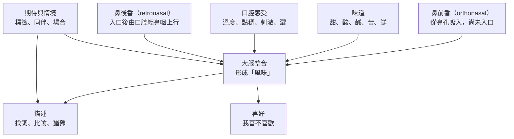

# 09 怎麼描述風味，又不假裝有標準答案？

朋友聚餐，阿哲把杯子舉到鼻子前晃了兩下，說：「有花香，尾韻帶一點蜂蜜。」美玲跟著聞了聞，什麼也想不出來，只好笑著說「嗯，好喝」。小林更直接：「我只喝得出來會辣。」三個人喝的是同一杯，說出來的卻是三種語言——一種很流利、一種空白、一種只講身體感覺。這一章想說的是：這三種其實都在描述真實發生的事，只是描述的層次不同。

!!! info "本章要回答"
    - **核心問題**：我們說「風味」的時候，身體究竟同時在做哪幾件事？怎麼把它們分開說，而不必背誦別人的形容詞？
    - **讀完能做什麼**：分辨鼻前香、鼻後香、味道、口腔感受與喜好這五個層次；知道「我不確定」也是一筆有效的紀錄；用一張觀察表把自己的經驗留下來。
    - **不處理**：價格、酒標與獎章怎麼改變感受（見[第 10 章](10-price-labels-expectation.md)）；溫度、杯型與保存怎麼改變杯中的東西（見[第 11 章](11-storage-temperature-pairing.md)）；香氣分子從哪個製程來（見[第 02](02-fermentation.md)、[03 章](03-distill-age-blend.md)）。

## 「風味」是好幾種感覺被綁在一起

日常說的「味道」，在感官科學裡至少是三套獨立的系統，加上一層判斷：

- **嗅覺**：氣味分子進到鼻腔上方的嗅覺受器。這是風味裡變化最多的部分。
- **味覺**：口腔中的味覺受器偵測溶在液體裡的分子。目前廣被接受的基本味有五種。
- **口腔的觸覺與化學刺激**：溫度、黏稠、刺痛、乾澀，走的是三叉神經與機械感受，與味覺是不同的路線。
- **喜好**：把上面三者整合之後，加上記憶、情境與期待，得出「我喜不喜歡」。

把它們混在一起講，就會出現「我喝不出味道」這種挫折——有時困難在於替**氣味找名字**，不等於完全沒有感覺。

注意圖中喜好與描述是**兩條線**。喜歡一杯酒，不代表說得出它像什麼；說得出一堆形容詞，也不代表比較享受。

## 鼻前香與鼻後香：同一個分子，兩種經驗

氣味進到嗅覺受器有兩條路：從鼻孔吸進去，叫**鼻前嗅覺**（orthonasal）；液體或食物在口中被加溫、攪動之後，氣味分子由口腔後方經鼻咽往上走，叫**鼻後嗅覺**（retronasal）。後者是「入口之後才展開的香氣」的來源，也是人們把氣味誤認成「味道」的主因——因為大腦會把它定位在嘴裡。

美國國立耳聾與其他溝通障礙研究院的衛教資料指出，咀嚼時釋放的香氣能透過連接口腔與鼻部的通道刺激嗅覺。因此，感冒鼻塞時食物顯得平淡，不一定表示基本味覺一併消失。這提供一個清楚的區分：入口之前聞到什麼，和入口後由鼻腔感受到什麼，值得分開記錄。

實作不必用酒。可以先聞一小片熟悉、可食用的水果，再正常咀嚼，留意入口後是否浮現另外的聯想；不必故意憋氣，也不必追求明顯結果。前後描述相同或沒有把握，都可以照實留下，不能為了符合課本而改寫感受。

## 五種基本味，加上一種不是味覺的感覺

味覺方面，目前廣被接受的分類是五種基本味：甜、酸、鹹、苦、鮮（umami）。這是實用的入門分類，不代表科學已把所有口腔感覺歸類完畢，也不代表五種味道各自獨占舌頭的一區。不同味覺細胞散布於舌面，常見的「舌尖只能嚐甜、舌根才能嚐苦」地圖容易誤導。

值得注意的是，酒裡最常被討論的兩種感覺，**都不屬於這五種**：

- **辣或灼熱**：高濃度乙醇會刺激口腔的痛覺與溫度感受，這是化學刺激，不是味覺。
- **澀（astringency）**：這是乾燥、收斂、粗糙等口腔感受的集合。單寧與唾液蛋白的交互作用，是研究的重要機制之一，研究也關注單寧結構與感覺的關係；本書核對的是綜述摘要，不能由此只用一個濃度預測每個人的經驗。

澀感常被說成「苦」或「酸」，但它們的來源不同：苦是味覺受器，酸主要與氫離子有關，澀則是口腔表面被改變的觸感。喝濃茶後嘴裡發乾、吃未熟柿子後舌面緊繃，也能幫助辨認這一類觸感。

| 層次 | 感覺什麼 | 生理路線 | 常見說法 | 容易被誤認成 |
|---|---|---|---|---|
| 鼻前香 | 尚未入口的氣味 | 鼻腔嗅覺受器 | 花香、果香、木質、穀物 | 「味道」 |
| 味道 | 溶在液體裡的分子 | 味覺受器（五種基本味） | 甜、酸、苦、鹹、鮮 | 「香氣」 |
| 口腔感受 | 質地、溫度、刺激 | 三叉神經、觸覺、機械感受 | 厚薄、滑、刺、辣、澀 | 苦味或酸味 |
| 鼻後香 | 入口後上行的氣味 | 鼻咽通道的嗅覺 | 尾韻、回甘時的香 | 「留在舌頭上的味道」 |
| 喜好 | 整體評價 | 整合＋記憶、情境 | 好喝、順、不喜歡 | 客觀品質 |

這張表的用法很簡單：當你覺得「說不出來」，先看看自己卡在哪一欄。如果第一欄與第四欄難填，可以先寫強弱與大類，暫時不命名。

## 從大類到自己的參照物

「有果香」不精確，卻可能是很好的第一筆資料。下一步可以問像新鮮果肉、果皮，還是煮熟果醬；若仍沒把握，就停在這裡。描述的目的是讓另一個人理解你注意到什麼，不是把一段經驗裝滿最多名詞。寫「像削下的橘皮，但不確定」通常比照抄五種不熟悉的外國水果更有交流價值。

參照物要夠具體。「像茶」可以指清香茶葉、焙火茶、冷掉的茶湯，甚至茶杯底的氣味；兩個人都寫茶香，仍可能指完全不同的東西。「像剛剝開的柑橘皮」則交代了材料與狀態。也可以用台灣生活中的米飯、烤地瓜、芭樂皮、乾香菇等作聯想，只要不把聯想說成配料檢驗即可。

例如聞到香草般的氣味，可以寫「香草聯想」；不能立刻寫「添加香草」。同一感覺可能由多種成分組合而來，名稱只是記憶中的近似座標。反過來，即使標示確有某種植物，也不保證每個人都辨認得到。製造資訊和感官觀察可以互相提供問題，不能互相冒充答案。

風味輪和詞彙表能幫人把注意力分到不同方向，但它們通常為特定材料、語言與工作情境設計，不是所有文化共享的標準答案。在多人交流中，先約定「果皮」指哪個實物，比先爭論誰用的術語較正確更有效。如果沒有共同參照物，就保留兩個說法，等有機會再比較，不必急著表決。

「順口」「平衡」「複雜」尤其需要拆開。順口可能表示刺激弱、甜味明顯、酸度不突出，或只是熟悉；平衡可能表示沒有哪個感覺壓過其他，也可能只是「我喜歡」的另一種說法。請補一句理由，例如「我覺得酸味清楚，但沒有蓋住茶香，所以喜歡」，才能讓描述與偏好各自站穩。

## 把觀察與喜好分開，留下可再比較的紀錄

一份有用的筆記不需要總分。先記材料或樣本代號、時間、溫度的大致狀態、容器、是否看過標籤；再記氣味、基本味、口腔感受及變化；最後才記喜好。這樣日後發現同一飲品的感受不同，就有線索可以追，而不必立刻斷定自己失去辨識能力。

以下是一段虛構茶飲紀錄：「甲，溫熱，普通玻璃杯。先聞像烤穀物；入口苦味中等、澀感稍後出現；放涼後果皮聯想更清楚。我喜歡溫熱時，因為澀感較不突出。對果皮的辨識把握低。」這段話沒有證明溫熱永遠較不澀；它保存的是這個人、這次比較與其不確定性。比起「高級、優雅、滿分」，它更容易拿來討論。

若要比較兩杯，應盡量只改一件事。相同茶湯換不同容器，是杯子的比較；不同茶葉、不同濃度又不同溫度一起出場，便無法知道差異來自哪裡。家庭活動做不到實驗室的控制沒有關係，寫明限制即可。不要把朋友一次點頭，當成某項風味規則已被證實。

先各自記錄，再交換答案，能減少第一個發言者替大家決定詞彙。可以加入一杯重複樣本，觀察自己的描述是否近似；不一致時，先檢查溫度、順序、等待時間及注意力，不急著給自己貼上「不會喝」的標籤。這是練習比較方法，不是考試，也不需要為了增加樣本而增加飲酒量。

[附錄 B 的觀察單](appendix-b-tasting-sheet.md)把這些欄位整理在一起。空白格不是失敗；「未觀察」「沒有察覺」「有感覺但無法命名」也要分開。前者代表沒測，第二個是在這次條件下沒發現，第三個保留了尚未找到詞語的經驗。三者都比隨便填上常見形容詞更誠實。

## 感官比較能回答什麼，不能回答什麼

感覺有個人差異，不表示一切說法都同樣準確。若某人說某杯更甜，可以設計遮蔽標籤、控制溫度與重複樣本的比較；若說裡面糖分一定較高，便需要成分測量。感官研究能問人們是否可靠地感到不同，化學檢驗能問樣本實際含有什麼。兩種方法互相補充，但回答的問題不同。

同樣地，描述一致不等於喜好一致。兩個人都認為茶湯很苦，一個喜歡，另一個不喜歡，並沒有誰需要被教育到同意。反過來，兩人都喜歡，也可能分別因為香氣、甜度或聚餐氣氛。若把喜好壓成客觀成績，就會失去最值得理解的差別。

專業描述可以透過共同參照、訓練和重複比較提高交流效率，卻不賦予任何人替別人決定喜好的權力。這章的工具不是讓讀者裝成評審，而是能說出「我注意到什麼、我有多確定、我偏好什麼」。價格與期待如何影響這三件事，留到[第 10 章](10-price-labels-expectation.md)進一步拆解。

!!! tip "不喝酒也能做的觀察"
    - 準備熟悉且可安全食用的柑橘皮、茶葉與烤麵包，各自先聞，再寫一個大類與一個具體聯想；不需入口也能完成。
    - 把同一份茶分入兩個相同杯子，用代號遮住名稱。先各自記錄香氣、苦味與澀感，再交流，不設正確答案。
    - 最後另寫「喜歡哪個、為什麼」，並保留「沒有差別」的選項。材料會引起過敏或不適就換掉，不需勉強完成。

## 常見說法查證

??? question "說法：說不出水果名稱，就是沒有味覺。"
    - **可驗證部分**：察覺、辨認與替感覺命名，是不同任務。
    - **本書判斷**：可以先記強弱、大類與觸感；詞語少不能用來診斷感官功能。

??? question "說法：杯型能把酒送到舌頭正確區域，所以只嚐到甜。"
    - **可驗證部分**：杯型可能影響飲用經驗，但不同味覺細胞並非各自獨占舌頭一區。
    - **本書判斷**：以僵硬舌頭地圖解釋杯型，基礎就有問題。杯型研究見下一章的證據限制。

??? question "說法：懂酒的人最後會喜歡同樣的東西。"
    - **可驗證部分**：共同詞彙可以改善交流，並不等於共同偏好。
    - **本書判斷**：描述要盡量清楚，喜好則應保留個人的位置；不飲酒也能理解這套方法。

## 來源

| 來源 | 類型 | 本章用途 |
|---|---|---|
| [NIDCD：Taste Disorders](https://www.nidcd.nih.gov/health/taste-disorders) | 政府機關 | 味覺、嗅覺、化學刺激與舌頭地圖 |
| [Wine and Grape Tannin Interactions with Salivary Proteins and Their Impact on Astringency](https://pubmed.ncbi.nlm.nih.gov/21399572/) | 研究論文（綜述摘要；作者任職葡萄酒研究機構） | 澀感的多因素機制，不將濃度等同個人感受 |
| [Plassmann 等：Marketing actions can modulate neural representations of experienced pleasantness](https://pmc.ncbi.nlm.nih.gov/articles/PMC2242704/) | 研究論文 | 提醒情境與評價不宜從筆記刪除，研究細節見第 10 章 |

查閱日：2026-09-20。觀察流程與示範紀錄是本書的教學設計，不是經驗證的診斷量表。
